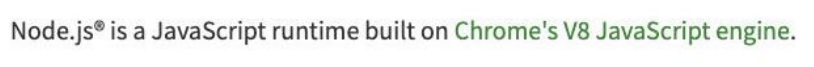
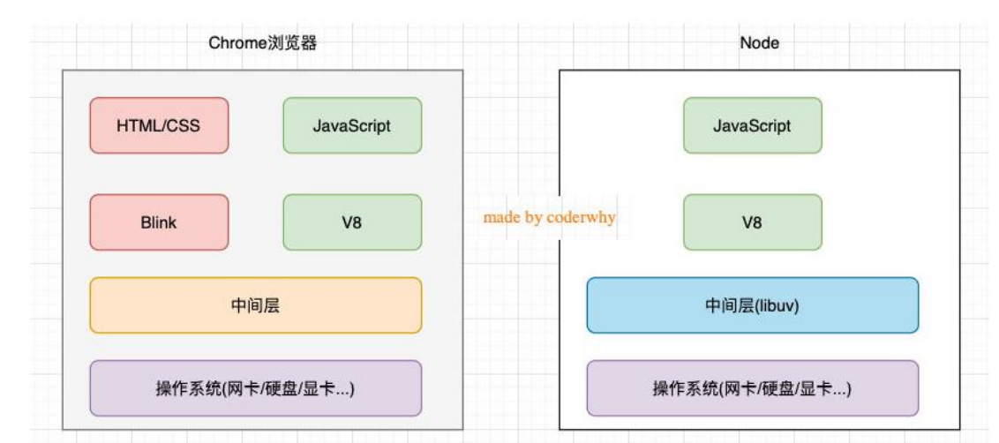
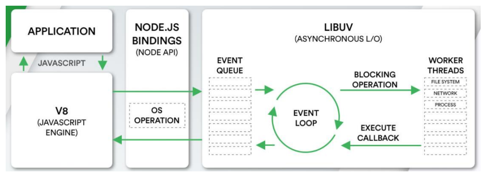
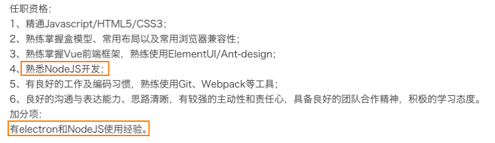
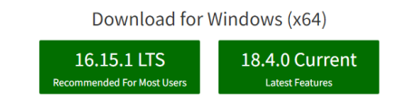
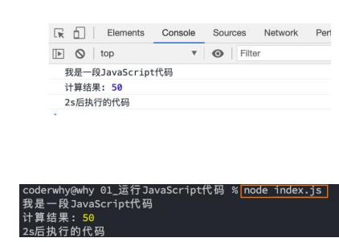
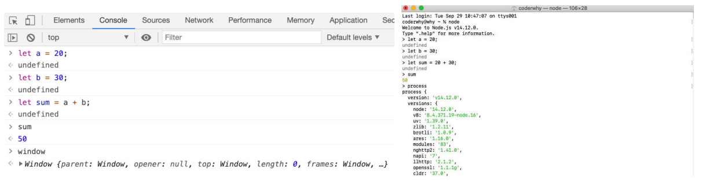
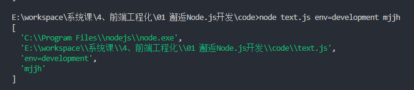
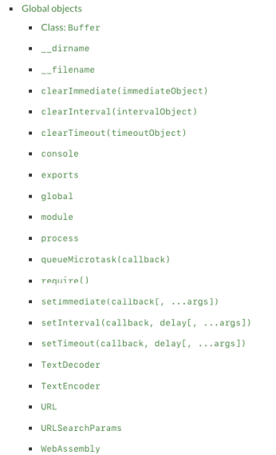
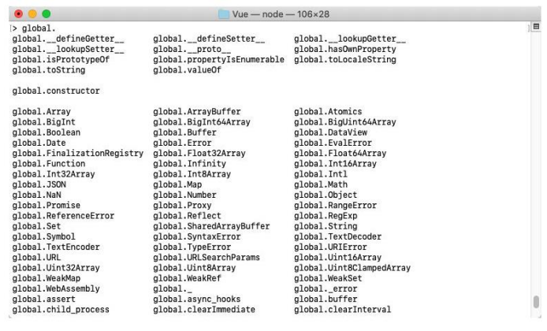

## 	初识别node

### 认识Node.js

- 官方对Node.js的定义：

  - Node.js是一个基于V8 JavaScript引擎的JavaScript运行时环境。

    

- 也就是说Node.js基于V8引擎来执行JavaScript的代码，但是不仅仅只有V8引擎：

  - 前面我们知道V8可以嵌入到任何C ++应用程序中，无论是Chrome还是Node.js，事实上都是嵌入了V8引擎来执行JavaScript代码；
  - 但是在Chrome浏览器中，还需要解析、渲染HTML、CSS等相关渲染引擎，另外还需要提供支持浏览器操作的API、浏览器自己的事件循环等；
  - 另外，在Node.js中我们也需要进行一些额外的操作，比如文件系统读/写、网络IO、加密、压缩解压文件等操作；

### 浏览器和Node.js架构区别

- 我们可以简单理解规划出Node.js和浏览器的差异：
  

### Node.js架构

- 我们来看一个单独的Node.js的架构图：
  - 我们编写的JavaScript代码会经过V8引擎，再通过Node.js的Bindings，将任务放到Libuv的事件循环中；
  - libuv（Unicorn Velociraptor—独角伶盗龙）是使用C语言编写的库；
  - libuv提供了事件循环、文件系统读写、网络IO、线程池等等内容；




### Node.js的应用场景

- Node.js的快速发展也让企业对Node.js技术越来越重视，在前端招聘中通常会对Node.js有一定的要求，特别对于高级前端开发工程师，Node.js更是必不可少的技能：

  

- 应用一：目前前端开发的库都是以node包的形式进行管理；

- 应用二：npm、yarn、pnpm工具成为前端开发使用最多的工具；

- 应用三：越来越多的公司使用Node.js作为web服务器开发、中间件、代理服务器；

- 应用四：大量项目需要借助Node.js完成前后端渲染的同构应用；

- 应用五：资深前端工程师需要为项目编写脚本工具（前端工程师编写脚本通常会使用JavaScript，而不是Python或者shell）；

- 应用六：很多企业在使用Electron来开发桌面应用程序；

## 安装node 版本管理

### Node的安装

- Node.js是在2009年诞生的，目前最新的版本是分别是LTS 16.15.1以及Current 18.4.0：

  - LTS版本：（Long-term support, 长期支持）相对稳定一些，推荐线上环境使用该版本；

  - Current版本：最新的Node版本，包含很多新特性；

    

- 这些我们选择什么版本呢？

  - 如果你是学习使用，可以选择current版本；
  - 如果你是公司开发，建议选择LTS版本（面向工作，选择LTS版本）；

- Node的安装方式有很多：

  - 可以借助于一些操作系统上的软件管理工具，比如Mac上的homebrew，Linux上的yum、dnf等；
  - 也可以直接下载对应的安装包下载安装；

- 我们选择下载安装，下载自己操作系统的安装包直接安装就可以了：

  - window选择.msi安装包，Mac选择.pkg安装包，Linux会在后续部署中讲解；
  - 安装过程中会配置环境变量（让我们可以在命令行使用）；
  - 并且会安装npm（Node Package Manager）工具；


### Node的版本工具

- 在实际开发学习中，我们只需要使用一个Node版本来开发或者学习即可。
- 但是，如果你希望通过可以快速更新或切换多个版本时，可以借助于一些工具：
  - nvm：Node Version Manager；
  - n：Interactively Manage Your Node.js Versions（交互式管理你的Node.js版本）
- 问题：这两个工具都不支持window
  - n：n is not supported natively on Windows.
  - nvm：nvm does not support Windows
- Window的同学怎么办？
  - 针对nvm，在GitHub上有提供对应的window版本：https://github.com/coreybutler/nvm-windows
  - 通过 nvm install latest 安装最新的node版本
  - 通过 nvm list 展示目前安装的所有版本
  - 通过 nvm use 切换版本


### 版本管理工具：n 和 nvm

- 安装n：直接使用npm安装即可

  ```sh
  # 安装工具
  npm install -g n
  # 查看版本
  n --version
  ```

- 安装最新的lts版本：

  - 前面添加的sudo是权限问题；

  - 可以两个版本都安装，之后我们可以通过n快速在两个版本间切换；

    ```sh
    # 安装最新的lts版本
    n lts
    # 安装最新的版本
    n latest
    # 查看所有版本
    n
    ```

- 安装nvm(win)

  - 下载并安装win版本nvm的包https://github.com/coreybutler/nvm-windows

- 使用命令

  ```sh
  # 查看版本号
  nvm version
  # 查看本地所有版本
  nvm list
  # 修改版本 
  nvm user [node version]
  ```

## node环境执行代码

### JavaScript代码执行

- 如果我们编写一个js文件，里面存放JavaScript代码，如何来执行它呢？

- 目前我们知道有两种方式可以执行：

  - 将代码交给浏览器执行；
  - 将代码载入到node环境中执行；

- 如果我们希望把代码交给浏览器执行：

  - 需要通过让浏览器加载、解析html代码，所以我们需要创建一个html文件；
  - 在html中通过script标签，引入js文件；
  - 当浏览器遇到script标签时，就会根据src加载、执行JavaScript代码；

- 如果我们希望把js文件交给node执行：

  - 首先电脑上需要安装Node.js环境，安装过程中会自动配置环境变量；

  - 可以通过终端命令node js文件的方式来载入和执行对应的js文件；

    

### Node的REPL

- 什么是REPL呢？感觉挺高大上

  - REPL是Read-Eval-Print Loop的简称，翻译为“读取-求值-输出”循环；
  - REPL是一个简单的、交互式的编程环境；

- 事实上，我们浏览器的console就可以看成一个REPL。

- Node也给我们提供了一个REPL环境，我们可以在其中演练简单的代码。

  

### Node程序传递参数

- 正常情况下执行一个node程序，直接跟上我们对应的文件即可：

```sh
node index.js
```

- 但是，在某些情况下执行node程序的过程中，我们可能希望给node传递一些参数：

```sh
node index.js env=development mjjh
```

- 如果我们这样来使用程序，就意味着我们需要在程序中获取到传递的参数：

  - 获取参数其实是在process的内置对象中的；
  - 如果我们直接打印这个内置对象，它里面包含特别的信息：
    - 其他的一些信息，比如版本、操作系统等大家可以自行查看，后面用到一些其他的我们还会提到；

- 现在，我们先找到其中的argv属性：

  - 我们发现它是一个数组，里面包含了我们需要的参数；

    ```ts
    // 给程序输入内容
    console.log(process.argv);
    ```

    

### 为什么叫argv呢？

- 你可能有个疑问，为什么叫argv呢？
- 在C/C++程序中的main函数中，实际上可以获取到两个参数：
  - argc：argument counter的缩写，传递参数的个数；
  - argv：argument vector（向量、矢量）的缩写，传入的具体参数。
    - vector翻译过来是矢量的意思，在程序中表示的是一种数据结构。
    - 在C++、Java中都有这种数据结构，是一种数组结构；
    - 在JavaScript中也是一个数组，里面存储一些参数信息；
- 我们可以在代码中，将这些参数信息遍历出来，使用：

### Node的输出

- console.log
  - 最常用的输入内容的方式：console.log
- console.clear
  - 清空控制台：console.clear
  - 情况控制台命令cls
- console.trace
  - 打印函数的调用栈：console.trace
- 还有一些其他的方法，其他的一些console方法，可以自己在下面学习研究一下。
  - https://nodejs.org/dist/latest-v16.x/docs/api/console.html


## node中的全局对象

### 常见的全局对象

- Node中给我们提供了一些全局对象，方便我们进行一些操作：

  - 这些全局对象，我们并不需要从一开始全部一个个学习；

  - 某些全局对象并不常用；

  - 某些全局对象我们会在后续学习中讲到；

    - 比如module、exports、require()会在模块化中讲到；

    - 比如Buffer后续会专门讲到；

      

### 特殊的全局对象

- 为什么我称之为特殊的全局对象呢？
  - 这些全局对象实际上是模块中的变量，只是每个模块都有，看来像是全局变量；
  - 在命令行交互中是不可以使用的；
  - 包括：__dirname、__filename、exports、module、require()
- __dirname：获取当前文件所在的路径：
  - 注意：不包括后面的文件名
- __filename：获取当前文件所在的路径和文件名称：
  - 注意：包括后面的文件名称


```ts
console.log(__dirname);

console.log(__filename);
```

### 常见的全局对象

- process对象：process提供了Node进程中相关的信息：
  - 比如Node的运行环境、参数信息等；
  - 后面在项目中，我也会讲解，如何将一些环境变量读取到 process 的 env 中；
- console对象：提供了简单的调试控制台，在前面讲解输入内容时已经学习过了。
  - 更加详细的查看官网文档：https://nodejs.org/api/console.html
- 定时器函数：在Node中使用定时器有好几种方式：
  - setTimeout(callback, delay[, ...args])：callback在delay毫秒后执行一次；
  - setInterval(callback, delay[, ...args])：callback每delay毫秒重复执行一次；
  - setImmediate(callback[, ...args])：callbackI / O事件后的回调的“立即”执行；
    - 这里先不展开讨论它和setTimeout(callback, 0)之间的区别；
    - 因为它涉及到事件循环的阶段问题，我会在后续详细讲解事件循环相关的知识；
  - process.nextTick(callback[, ...args])：添加到下一次tick队列中；
    - 具体的讲解，也放到事件循环中说明；

### global对象

- global是一个全局对象，事实上前端我们提到的process、console、setTimeout等都有被放到global中：

  - 我们之前讲过：在新的标准中还有一个globalThis，也是指向全局对象的；
  - 类似于浏览器中的window；

  

### global和window的区别

- 在浏览器中，全局变量都是在window上的，比如有document、setInterval、setTimeout、alert、console等等

- 在Node中，我们也有一个global属性，并且看起来它里面有很多其他对象。

- 但是在浏览器中执行的JavaScript代码，如果我们在顶级范围内通过var定义的一个属性，默认会被添加到window对象上：

  ```js
  var name = 'mjjh'
  
  console.log(window.name)
  ```

- 但是在node中，我们通过var定义一个变量，它只是在当前模块中有一个变量，不会放到全局中：

  ```ts
  var name = 'mjjh'
  
  console.log(window.name)
  ```