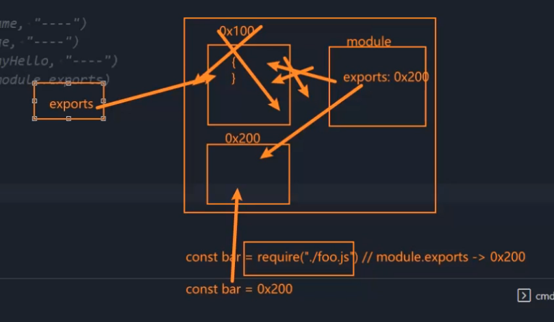
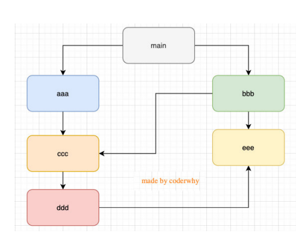
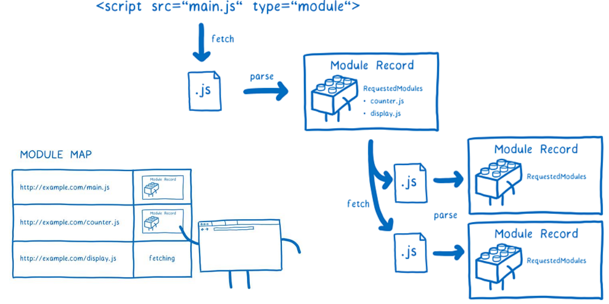
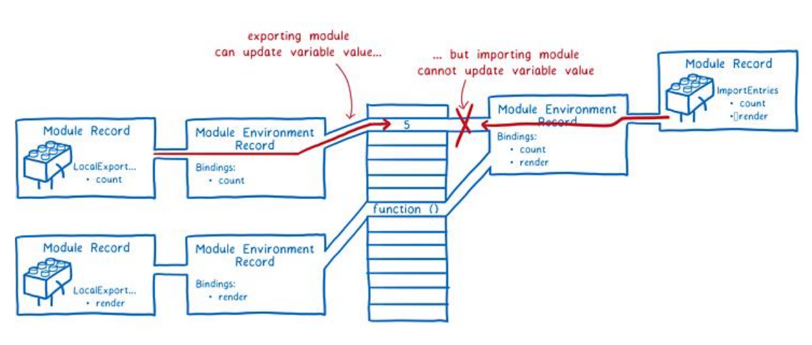

## 认识模块化开发

### 什么是模块化？

- 到底什么是模块化、模块化开发呢？
  - 事实上模块化开发最终的目的是将程序划分成一个个小的结构；
  - 这个结构中编写属于自己的逻辑代码，有自己的作用域，定义变量名词时不会影响到其他的结构；
  - 这个结构可以将自己希望暴露的变量、函数、对象等导出给其结构使用；
  - 也可以通过某种方式，导入另外结构中的变量、函数、对象等；
- 上面说提到的结构，就是模块；按照这种结构划分开发程序的过程，就是模块化开发的过程；
- 无论你多么喜欢 JavaScript，以及它现在发展的有多好，它都有很多的缺陷：
  - 比如 var 定义的变量作用域问题；
  - 比如 JavaScript 的面向对象并不能像常规面向对象语言一样使用 class；
  - 比如 JavaScript 没有模块化的问题；
- 对于早期的 JavaScript 没有模块化来说，确确实实带来了很多的问题；

### 模块化的历史

- 在网页开发的早期，Brendan Eich 开发 JavaScript 仅仅作为一种脚本语言，做一些简单的表单验证或动画实现等，那个时候代码还是很少的：
  - 这个时候我们只需要讲 JavaScript 代码写到 script 标签中即可；
  - 并没有必要放到多个文件中来编写；甚至流行：通常来说 JavaScript 程序的长度只有一行。
- 但是随着前端和 JavaScript 的快速发展，JavaScript 代码变得越来越复杂了：
  - ajax 的出现，前后端开发分离，意味着后端返回数据后，我们需要通过 JavaScript 进行前端页面的渲染；
  - SPA 的出现，前端页面变得更加复杂：包括前端路由、状态管理等等一系列复杂的需求需要通过 JavaScript 来实现；
  - 包括 Node 的实现，JavaScript 编写复杂的后端程序，没有模块化是致命的硬伤；
- 所以，模块化已经是 JavaScript 一个非常迫切的需求：
  - 但是 JavaScript 本身，直到 ES6（2015）才推出了自己的模块化方案；
  - 在此之前，为了让 JavaScript 支持模块化，涌现出了很多不同的模块化规范：AMD、CMD、CommonJS 等；
- 在我们的课程中，我将详细讲解 JavaScript 的模块化，尤其是 CommonJS 和 ES6 的模块化。

### 没有模块化带来的问题

- 早期没有模块化带来了很多的问题：比如命名冲突的问题
- 当然，我们有办法可以解决上面的问题：立即函数调用表达式（IIFE）
  - IIFE (Immediately Invoked Function Expression)
- 但是，我们其实带来了新的问题：
  - 第一，我必须记得每一个模块中返回对象的命名，才能在其他模块使用过程中正确的使用；
  - 第二，代码写起来混乱不堪，每个文件中的代码都需要包裹在一个匿名函数中来编写；
  - 第三，在没有合适的规范情况下，每个人、每个公司都可能会任意命名、甚至出现模块名称相同的情况；
- 所以，我们会发现，虽然实现了模块化，但是我们的实现过于简单，并且是没有规范的。
  - 我们需要制定一定的规范来约束每个人都按照这个规范去编写模块化的代码；
  - 这个规范中应该包括核心功能：模块本身可以导出暴露的属性，模块又可以导入自己需要的属性；
  - JavaScript 社区为了解决上面的问题，涌现出一系列好用的规范，接下来我们就学习具有代表性的一些规范。

## CommonJS 和 Node

### CommonJS 规范和 Node 关系

- 我们需要知道 CommonJS 是一个规范，最初提出来是在浏览器以外的地方使用，并且当时被命名为 ServerJS，后来为了体现它的广泛性，修改为 CommonJS，平时我们也会简称为 CJS。
  - Node 是 CommonJS 在服务器端一个具有代表性的实现；
  - Browserify 是 CommonJS 在浏览器中的一种实现；
  - webpack 打包工具具备对 CommonJS 的支持和转换；
- 所以，Node 中对 CommonJS 进行了支持和实现，让我们在开发 node 的过程中可以方便的进行模块化开发：
  - 在 Node 中每一个 js 文件都是一个单独的模块；
  - 这个模块中包括 CommonJS 规范的核心变量：exports、module.exports、require；
  - 我们可以使用这些变量来方便的进行模块化开发；
- 前面我们提到过模块化的核心是导出和导入，Node 中对其进行了实现：
  - exports 和 module.exports 可以负责对模块中的内容进行导出；
  - require 函数可以帮助我们导入其他模块（自定义模块、系统模块、第三方库模块）中的内容；

### 模块化案例

- 我们来看一下两个文件：

```js
// 导入文件
console.log(name);
console.log(age);

sayHello("mjr");
```

```js
// 导出的文件
const name = "mjjh";
const age = 18;

function sayHello(name) {
  console.log("Hello" + name);
}
```

### exports 导出

- 在内存上实际上是一种引用赋值

- 注意：exports 是一个对象，我们可以在这个对象中添加很多个属性，添加的属性会导出；

  ```js
  exports.name = name;
  exports.age = age;
  exports.sayHello = sayHelo;
  ```

- 另外一个文件中可以导入：

  ```js
  const bar = require("./bar");
  ```

- 上面这行完成了什么操作呢？理解下面这句话，Node 中的模块化一目了然

  - 意味着 main 中的 bar 变量等于 exports 对象；
  - 也就是 require 通过各种查找方式，最终找到了 exports 这个对象；
  - 并且将这个 exports 对象赋值给了 bar 变量；
  - bar 变量就是 exports 对象了；

### module.exports 导出

- 但是 Node 中我们经常导出东西的时候，又是通过 module.exports 导出的：
  - module.exports 和 exports 有什么关系或者区别呢？
- 我们追根溯源，通过维基百科中对 CommonJS 规范的解析：
  - CommonJS 中是没有 module.exports 的概念的；
  - 但是为了实现模块的导出，Node 中使用的是 Module 的类，每一个模块都是 Module 的一个实例，也就是 module；
  - 所以在 Node 中真正用于导出的其实根本不是 exports，而是 module.exports；
  - 因为 module 才是导出的真正实现者；
- 但是，为什么 exports 也可以导出呢？
  - 这是因为 module 对象的 exports 属性是 exports 对象的一个引用；
  - 也就是说 module.exports = exports = main 中的 bar；

### 改变代码发生了什么?

- 我们这里从几个方面来研究修改代码发生了什么？
  1. 在三者项目引用的情况下，修改 exports 中的 name 属性到底发生了什么？
  2. 在三者引用的情况下，修改了 main 中的 bar 的 name 属性，在 bar 模块中会发生什么？
  3. 如果 module.exports 不再引用 exports 对象了，那么修改 export 还有意义吗？
- 先画出在内存中发生了什么，再得出最后的结论。

```js
console.log(exports === module.exports);

module.exports.name = name;
module.exports.age = age;
module.exports.sayHello = sayHello;
// 此处两个都是指向同一个内存地址的exports(0x100)
exports.name = name;
exports.age = age;
exports.sayHello = sayHelo;
```



```js
// 此时相当于将新的地址数据交给了exports(如0x200),与上面的书写方式内存地址不再相同(0x100)
module.exports = {
  name,
  age,
  sayHello,
};
```

### require 细节

- 我们现在已经知道，require 是一个函数，可以帮助我们引入一个文件（模块）中导出的对象。
- 那么，require 的查找规则是怎么样的呢？
  - 这里我总结比较常见的查找规则：
  - 导入格式如下：require(X)

情况一：X 是一个 Node 核心模块，比如 path、http

- 直接返回核心模块，并且停止查找

情况二：X 是以 ./ 或 ../ 或 /（根目录）开头的

- 第一步：将 X 当做一个文件在对应的目录下查找；
  - 如果有后缀名，按照后缀名的格式查找对应的文件
  - 如果没有后缀名，会按照如下顺序：
    1. 直接查找文件 X
    2. 查找 X.js 文件
    3. 查找 X.json 文件
    4. 查找 X.node 文件
- 第二步：没有找到对应的文件，将 X 作为一个目录
  - 查找目录下面的 index 文件
    1. 查找 X/index.js 文件
    2. 查找 X/index.json 文件
    3. 查找 X/index.node 文件
- 如果没有找到，那么报错：not found

情况三：直接是一个 X（没有路径），并且 X 不是一个核心模块

- 例如 reqire('axios')
  - 第一步: 在当前模块的 nodemodules 中查找
  - 然后循环在上层寻找 nodemodules 直到找到为止
- 如果上面的路径中都没有找到，那么报错：not found

### 模块的加载过程



- 结论一：模块在被第一次引入时，模块中的 js 代码会被运行一次
- 结论二：模块被多次引入时，会缓存，最终只加载（运行）一次
  - 为什么只会加载运行一次呢？
  - 这是因为每个模块对象 module 都有一个属性：loaded。
  - 为 false 表示还没有加载，为 true 表示已经加载；
- 结论三：如果有循环引入，那么加载顺序是什么？
- 如果出现右图模块的引用关系，那么加载顺序是什么呢？
  - 这个其实是一种数据结构：图结构；
  - 图结构在遍历的过程中，有深度优先搜索（DFS, depth first search）和广度优先搜索（BFS, breadth first search）；
  - Node 采用的是深度优先算法：main -> aaa -> ccc -> ddd -> eee ->bbb

### CommonJS 规范缺点

- CommonJS 加载模块是同步的：
  - 同步的意味着只有等到对应的模块加载完毕，当前模块中的内容才能被运行；
  - 这个在服务器不会有什么问题，因为服务器加载的 js 文件都是本地文件，加载速度非常快；
- 如果将它应用于浏览器呢？
  - 浏览器加载 js 文件需要先从服务器将文件下载下来，之后再加载运行；
  - 那么采用同步的就意味着后续的 js 代码都无法正常运行，即使是一些简单的 DOM 操作；
- 所以在浏览器中，我们通常不使用 CommonJS 规范：
  - 当然在 webpack 中使用 CommonJS 是另外一回事；
  - 因为它会将我们的代码转成浏览器可以直接执行的代码；
- 在早期为了可以在浏览器中使用模块化，通常会采用 AMD 或 CMD：
  - 但是目前一方面现代的浏览器已经支持 ES Modules，另一方面借助于 webpack 等工具可以实现对 CommonJS 或者 ES Module 代码的转换；
  - AMD 和 CMD 已经使用非常少了；

## AMD 和 CMD(浏览器)

### AMD 规范

- AMD 主要是应用于浏览器的一种模块化规范：
  - AMD 是 Asynchronous Module Definition（异步模块定义）的缩写；
  - 它采用的是异步加载模块；
  - 事实上 AMD 的规范还要早于 CommonJS，但是 CommonJS 目前依然在被使用，而 AMD 使用的较少了；
- 我们提到过，规范只是定义代码的应该如何去编写，只有有了具体的实现才能被应用：
  - AMD 实现的比较常用的库是 require.js 和 curl.js；

#### require.js 的使用

- 第一步：下载 require.js

  - 下载地址：https://github.com/requirejs/requirejs
  - 找到其中的 require.js 文件；

- 第二步：定义 HTML 的 script 标签引入 require.js 和定义入口文件：

  - data-main 属性的作用是在加载完 src 的文件后会加载执行该文件

    ```html
    <script src="./lib/require.js" data-main="./src/main.js"></script>
    ```

`main`

```js
require.config({
  baseUrl: "",
  paths: {
    foo: "./src/foo",
    bar: "./src/bar",
  },
});

require(["foo", "bar"], function (foo) {
  console.log("main:", foo);
});
```

`foo`

```js
define(function () {
  const name = "mjjh";
  const age = 18;
  function sum(num1, num2) {
    return num1 + num2;
  }

  return {
    name,
    age,
    sum,
  };
});
```

`bar`

```js
define(["foo"], function (foo) {
  console.log("--------");
  // require(["foo"], function(foo) {
  //   console.log("bar:", foo)
  // })

  console.log("bar:", foo);
});
```

### CMD 规范

- CMD 规范也是应用于浏览器的一种模块化规范：
  - CMD 是 Common Module Definition（通用模块定义）的缩写；
  - 它也采用的也是异步加载模块，但是它将 CommonJS 的优点吸收了过来；
  - 但是目前 CMD 使用也非常少了；
- CMD 也有自己比较优秀的实现方案：
  - SeaJS

#### SeaJS

- 第一步：下载 SeaJS
  - 下载地址：https://github.com/seajs/seajs
  - 找到 dist 文件夹下的 sea.js
- 第二步：引入 sea.js 和使用主入口文件
  - seajs 是指定主入口文件的

`index.html`

```html
<script src="./lib/sea.js"></script>
<script>
  seajs.use("./src/main.js");
</script>
```

`main`

```js
define(function (require, exports, module) {
  const foo = require("./foo");
  console.log("main:", foo);
});
```

`foo`

```js
define(function (require, exports, module) {
  const name = "mjjh";
  const age = 18;
  function sum(num1, num2) {
    return num1 + num2;
  }

  // exports.name = name
  // exports.age = age

  module.exports = {
    name,
    age,
    sum,
  };
});
```

## ES Module

### 认识 ES Module

- JavaScript 没有模块化一直是它的痛点，所以才会产生我们前面学习的社区规范：CommonJS、AMD、CMD 等，所以在 ECMA 推出自己的模块化系统时，大家也是兴奋异常。
- ES Module 和 CommonJS 的模块化有一些不同之处：
  - 一方面它使用了 import 和 export 关键字；
  - 另一方面它采用编译期的静态分析，并且也加入了动态引用的方式；
- ES Module 模块采用 export 和 import 关键字来实现模块化：
  - export 负责将模块内的内容导出；
  - import 负责从其他模块导入内容；
- 了解：采用 ES Module 将自动采用严格模式：use strict

### 案例代码结构组件

- 这里我在浏览器中演示 ES6 的模块化开发：

  ```html
  <script src="./modules/foo.js" type="module"></script>
  <script src="main.js" type="module"></script>
  ```

- 如果直接在浏览器中运行代码，会报如下错误：

  

- 这个在 MDN 上面有给出解释：

  - https://developer.mozilla.org/zh-CN/docs/Web/JavaScript/Guide/Modules
  - 你需要注意本地测试 — 如果你通过本地加载 Html 文件 (比如一个 file:// 路径的文件), 你将会遇到 CORS 错误，因为
    Javascript 模块安全性需要；
  - 你需要通过一个服务器来测试；

- 我这里使用的 VSCode 插件：Live Server

### exports 关键字

- export 关键字将一个模块中的变量、函数、类等导出；

- 我们希望将其他中内容全部导出，它可以有如下的方式：
- 方式一：在语句声明的前面直接加上 export 关键字
- 方式二：将所有需要导出的标识符，放到 export 后面的 {}中
  - 注意：这里的 {}里面不是 ES6 的对象字面量的增强写法，{}也不是表示一个对象的；
  - 所以： export {name: name}，是错误的写法；
- 方式三：导出时给标识符起一个别名
  - 通过 as 关键字起别名

### import 关键字

- import 关键字负责从另外一个模块中导入内容
- 导入内容的方式也有多种：
- 方式一：import {标识符列表} from '模块'；
  - 注意：这里的{}也不是一个对象，里面只是存放导入的标识符列表内容；
- 方式二：导入时给标识符起别名
  - 通过 as 关键字起别名
- 方式三：通过 \* 将模块功能放到一个模块功能对象（a module object）上

### export 和 import 结合使用

- 补充：export 和 import 可以结合使用

  ```js
  export { sum as barSum } from "./bar.js";
  ```

### default 用法

- 为什么要这样做呢？

  - 在开发和封装一个功能库时，通常我们希望将暴露的所有接口放到一个文件中；
  - 这样方便指定统一的接口规范，也方便阅读；
  - 这个时候，我们就可以使用 export 和 import 结合使用；

- 前面我们学习的导出功能都是有名字的导出（named exports）：
  - 在导出 export 时指定了名字；
  - 在导入 import 时需要知道具体的名字；
- 还有一种导出叫做默认导出（default export）
  - 默认导出 export 时可以不需要指定名字；
  - 在导入时不需要使用 {}，并且可以自己来指定名字；
  - 它也方便我们和现有的 CommonJS 等规范相互操作；
- 注意：在一个模块中，只能有一个默认导出（default export）；

### import 函数

- 通过 import 加载一个模块，是不可以在其放到逻辑代码中的，比如：
- 为什么会出现这个情况呢？
  - 这是因为 ES Module 在被 JS 引擎解析时，就必须知道它的依赖关系；
  - 由于这个时候 js 代码没有任何的运行，所以无法在进行类似于 if 判断中根据代码的执行情况；
  - 甚至拼接路径的写法也是错误的：因为我们必须到运行时能确定 path 的值；
- 但是某些情况下，我们确确实实希望动态的来加载某一个模块：
  - 如果根据不同的条件，动态来选择加载模块的路径；
  - 这个时候我们需要使用 import() 函数来动态加载；
    - import 函数返回一个 Promise，可以通过 then 获取结果；

```js
if (true) {
  import sub from "./modules/foo.js";
}
```

```js
let flag = true;
if (flag) {
  import("./modules/aaa.js").then((aaa) => {
    aaa.aaa();
  });
} else {
  import("./modules/bbb.js").then((aaa) => {
    bbb.bbb();
  });
}
```

### import meta

- import.meta 是一个给 JavaScript 模块暴露特定上下文的元数据属性的对象。
  - 它包含了这个模块的信息，比如说这个模块的 URL；
  - 在 ES11（ES2020）中新增的特性；

### ES Modelue 的解析流程

- ES Module 是如何被浏览器解析并且让模块之间可以相互引用的呢？

  - https://hacks.mozilla.org/2018/03/es-modules-a-cartoon-deep-dive/

- ES Module 的解析过程可以划分为三个阶段：`

  

  - 阶段一：构建（Construction），根据地址查找 js 文件，并且下载，将其解析成模块记录（Module Record）；

    

  - 阶段二：实例化（Instantiation），对模块记录进行实例化，并且分配内存空间，解析模块的导入和导出语句，把模块指向对应的内存地址。

  - 阶段三：运行（Evaluation），运行代码，计算值，并且将值填充到内存地址中；

    
