## 代码共享方案

- 我们已经学习了在 JavaScript 中可以通过模块化的方式将代码划分成一个个小的结构：
  - 在以后的开发中我们就可以通过模块化的方式来封装自己的代码，并且封装成一个工具；
  - 这个工具我们可以让同事通过导入的方式来使用，甚至你可以分享给世界各地的程序员来使用；
- 如果我们分享给世界上所有的程序员使用，有哪些方式呢？
- 方式一：上传到 GitHub 上、其他程序员通过 GitHub 下载我们的代码手动的引用；
  - 缺点是大家必须知道你的代码 GitHub 的地址，并且从 GitHub 上手动下载；
  - 需要在自己的项目中手动的引用，并且管理相关的依赖；
  - 不需要使用的时候，需要手动来删除相关的依赖；
  - 当遇到版本升级或者切换时，需要重复上面的操作；
- 显然，上面的方式是有效的，但是这种传统的方式非常麻烦，并且容易出错；
- 方式二：使用一个专业的工具来管理我们的代码
  - 我们通过工具将代码发布到特定的位置；
  - 其他程序员直接通过工具来安装、升级、删除我们的工具代码；
- 显然，通过第二种方式我们可以更好的管理自己的工具包，其他人也可以更好的使用我们的工具包。

## 包管理工具 npm

### 认识 npm

- 包管理工具 npm：
  - Node Package Manager，也就是 Node 包管理器；
  - 但是目前已经不仅仅是 Node 包管理器了，在前端项目中我们也在使用它来管理依赖的包；
  - 比如 vue、vue-router、vuex、express、koa、react、react-dom、axios、babel、webpack 等等；
- 如何下载和安装 npm 工具呢？
  - npm 属于 node 的一个管理工具，所以我们需要先安装 Node；
  - node 管理工具：https://nodejs.org/en/，安装Node的过程会自动安装npm工具；
- npm 管理的包可以在哪里查看、搜索呢？
  - https://www.npmjs.org/
  - 这是我们安装相关的 npm 包的官网；
- npm 管理的包存放在哪里呢？
  - 我们发布自己的包其实是发布到 registry 上面的；
  - 当我们安装一个包时其实是从 registry 上面下载的包；

### npm 的配置文件

- 那么对于一个项目来说，我们如何使用 npm 来管理这么多包呢？
  - 事实上，我们每一个项目都会有一个对应的配置文件，无论是前端项目（Vue、React）还是后端项目（Node）；
  - 这个配置文件会记录着你项目的名称、版本号、项目描述等；
  - 也会记录着你项目所依赖的其他库的信息和依赖库的版本号；
- 这个配置文件就是 package.json
- 那么这个配置文件如何得到呢？
  - 方式一：手动从零创建项目，npm init –y
  - 方式二：通过脚手架创建项目，脚手架会帮助我们生成 package.json，并且里面有相关的配置

### 常见的配置文件

npm init #创建时填写信息

npm init -y # 所有信息使用默认的

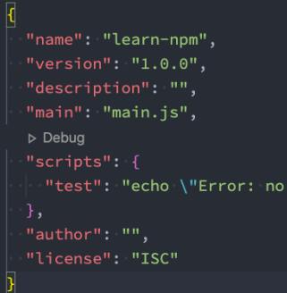

Vue CLI4 创建的 Vue3 项目

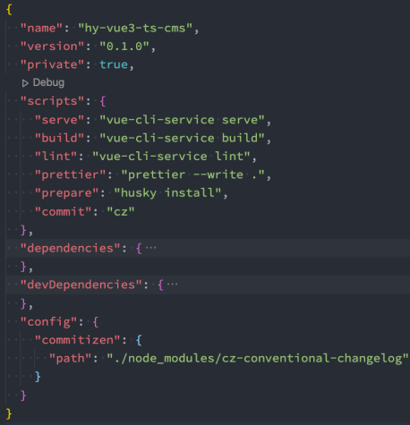

create-react-app 创建的 react17 项目

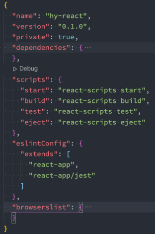

### 常见的属性

- 必须填写的属性：name、version

  - name 是项目的名称；
  - version 是当前项目的版本号；
  - description 是描述信息，很多时候是作为项目的基本描述；
  - author 是作者相关信息（发布时用到）；
  - license 是开源协议（发布时用到）；

- private 属性：

  - private 属性记录当前的项目是否是私有的；
  - 当值为 true 时，npm 是不能发布它的，这是防止私有项目或模块发布出去的方式；
    常见的属性

- main 属性：

  - 设置程序的入口。

    - 比如我们使用 axios 模块 const axios = require('axios');

    - 如果有 main 属性，实际上是找到对应的 main 属性查找文件的；

      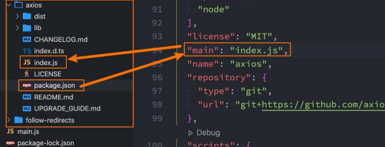

- scripts 属性

  - scripts 属性用于配置一些脚本命令，以键值对的形式存在；
  - 配置后我们可以通过 npm run 命令的 key 来执行这个命令；
  - npm start 和 npm run start 的区别是什么？
    - 它们是等价的；
    - 对于常用的 start、 test、stop、restart 可以省略掉 run 直接通过 npm start 等方式运行；

- dependencies 属性

  - dependencies 属性是指定无论开发环境还是生成环境都需要依赖的包；
  - 通常是我们项目实际开发用到的一些库模块 vue、vuex、vue-router、react、react-dom、axios 等等；
  - 与之对应的是 devDependencies；

- devDependencies 属性

  - 一些包在生成环境是不需要的，比如 webpack、babel 等；
  - 这个时候我们会通过 npm install webpack --save-dev，将它安装到 devDependencies 属性中；

- peerDependencies 属性

  - 还有一种项目依赖关系是对等依赖，也就是你依赖的一个包，它必须是以另外一个宿主包为前提的；
  - 比如 element-plus 是依赖于 vue3 的，ant design 是依赖于 react、react-dom；

### 依赖的版本管理

- 我们会发现安装的依赖版本出现：^2.0.3 或~2.0.3，这是什么意思呢？
- npm 的包通常需要遵从 semver 版本规范：
  - semver：https://semver.org/lang/zh-CN/
  - npm semver：https://docs.npmjs.com/misc/semver
- semver 版本规范是 X.Y.Z：
  - X 主版本号（major）：当你做了不兼容的 API 修改（可能不兼容之前的版本）；
  - Y 次版本号（minor）：当你做了向下兼容的功能性新增（新功能增加，但是兼容之前的版本）；
  - Z 修订号（patch）：当你做了向下兼容的问题修正（没有新功能，修复了之前版本的 bug）；
- 我们这里解释一下 ^和~的区别：
  - x.y.z：表示一个明确的版本号；
  - ^x.y.z：表示 x 是保持不变的，y 和 z 永远安装最新的版本；
  - ~x.y.z：表示 x 和 y 保持不变的，z 永远安装最新的版本；

### 不太常见的属性

- engines 属性
  - engines 属性用于指定 Node 和 NPM 的版本号；
  - 在安装的过程中，会先检查对应的引擎版本，如果不符合就会报错；
  - 事实上也可以指定所在的操作系统 "os" : [ "darwin", "linux" ]，只是很少用到；
- browserslist 属性
  - 用于配置打包后的 JavaScript 浏览器的兼容情况，参考；
  - 否则我们需要手动的添加 polyfills 来让支持某些语法；
  - 也就是说它是为 webpack 等打包工具服务的一个属性（这里不是详细讲解 webpack 等工具的工作原理，所以不再给出详情）；

### npm install 命令

- 安装 npm 包分两种情况：

  - 全局安装（global install）： npm install webpack -g;
  - 项目（局部）安装（local install）： npm install webpack

- 全局安装

  - 全局安装是直接将某个包安装到全局：

  - 比如全局安装 yarn：

    ```js
    npm install yarn -g
    ```

- 但是很多人对全局安装有一些误会：

  - 通常使用 npm 全局安装的包都是一些工具包：yarn、webpack 等；
  - 并不是类似于 axios、express、koa 等库文件；
  - 所以全局安装了之后并不能让我们在所有的项目中使用 axios 等库；

### 项目安装

- 项目安装会在当前目录下生成一个 node_modules 文件夹，我们之前讲解 require 查找顺序时有讲解过这个包在什么情况下被查找；

- 局部安装分为开发时依赖和生产时依赖：

  ```sh
  # 默认安装开发和生产依赖
  npm install axios
  npm i axios

  # 开发依赖
  npm install webpack --save-dev
  npm install webpack -D
  npm i webpack –D

  # 根据package.json中的依赖包
  npm install

  ```

### npm install 原理

- 很多同学之前应该已经会了 npm install package，但是你是否思考过它的内部原理呢？
  - 执行 npm install 它背后帮助我们完成了什么操作？
  - 我们会发现还有一个称之为 package-lock.json 的文件，它的作用是什么？
  - 从 npm5 开始，npm 支持缓存策略（来自 yarn 的压力），缓存有什么作用呢？
- npm install 的原理图：
  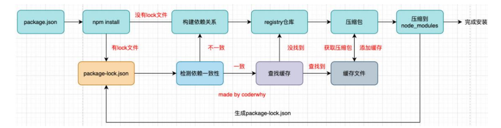

- npm install 会检测是有 package-lock.json 文件：
  - 没有 lock 文件
    - 分析依赖关系，这是因为我们可能包会依赖其他的包，并且多个包之间会产生相同依赖的情况；
    - 从 registry 仓库中下载压缩包（如果我们设置了镜像，那么会从镜像服务器下载压缩包）；
    - 获取到压缩包后会对压缩包进行缓存（从 npm5 开始有的）；
    - 将压缩包解压到项目的 node_modules 文件夹中（前面我们讲过，require 的查找顺序会在该包下面查找）
  - 有 lock 文件
    - 检测 lock 中包的版本是否和 package.json 中一致（会按照 semver 版本规范检测）；
      - 不一致，那么会重新构建依赖关系，直接会走顶层的流程；
    - 一致的情况下，会去优先查找缓存
      - 没有找到，会从 registry 仓库下载，直接走顶层流程；
    - 查找到，会获取缓存中的压缩文件，并且将压缩文件解压到 node_modules 文件夹中；

### package-lock.json

- package-lock.json 文件解析：
- name：项目的名称；
- version：项目的版本；
- lockfileVersion：lock 文件的版本；
- requires：使用 requires 来跟踪模块的依赖关系；
- dependencies：项目的依赖
  - 当前项目依赖 axios，但是 axios 依赖 follow-redireacts；
  - axios 中的属性如下：
    - version 表示实际安装的 axios 的版本；
    - resolved 用来记录下载的地址，registry 仓库中的位置；
    - requires/dependencies 记录当前模块的依赖；
    - integrity 用来从缓存中获取索引，再通过索引去获取压缩包文件；

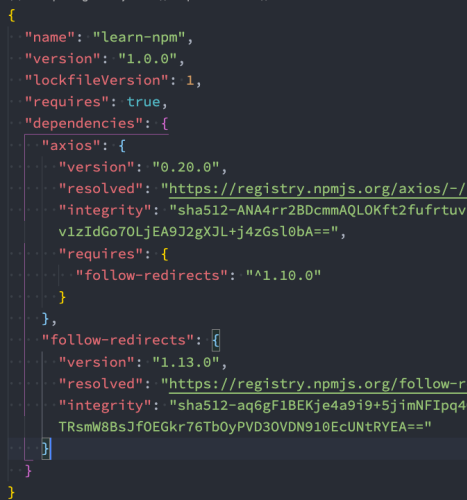

### npm 其他命令

- 我们这里再介绍几个比较常用的：

- 卸载某个依赖包：

  ```sh
  npm uninstall package
  npm uninstall package --save-dev
  npm uninstall package -D
  ```

- 强制重新 build

  ```sh
  npm rebuild
  ```

- 清除缓存

  ```sh
  npm cache clean
  ```

- npm 的命令其实是非常多的：

  - https://docs.npmjs.com/cli-documentation/cli
  - 更多的命令，可以根据需要查阅官方文档

### npx 工具(npm 中自带的命令)

- npx 是 npm5.2 之后自带的一个命令。
  - npx 的作用非常多，但是比较常见的是使用它来调用项目中的某个模块的指令。
- 我们以 webpack 为例：
  - 全局安装的是 webpack5.1.3
  - 项目安装的是 webpack3.6.0
- 如果我在终端执行 webpack --version 使用的是哪一个命令呢？
  - 显示结果会是 webpack 5.1.3，事实上使用的是全局的，为什么呢？
  - 原因非常简单，在当前目录下找不到 webpack 时，就会去全局找，并且执行命令；
- 如何解决这个问题呢？

### 局部命令的执行

- 那么如何使用项目（局部）的 webpack，常见的是两种方式：

  - 方式一：明确查找到 node_module 下面的 webpack
  - 方式二：在 scripts 定义脚本，来执行 webpack；

- 方式一：在终端中使用如下命令（在项目根目录下）

  ```sh
  ./node_modules/.bin/webpack --version
  ```

- 方式二：修改 package.json 中的 scripts

  ```sh
  "scripts": {
    "webpack": "webpack --version"
  }
  ```

- 方式三：使用 npx

  ```sh
  npx webpack --version
  ```

- npx 的原理非常简单，它会到当前目录的 node_modules/.bin 目录下查找对应的命令；

### npm 发布自己的包

- 注册 npm 账号：

  - https://www.npmjs.com/
  - 选择 sign up

- 在命令行登录：

  ```sh
  npm login
  ```

- 修改 package.json

- 发布到 npm registry 上

  ```sh
  npm publish
  ```

- 更新仓库：

  1. 修改版本号(最好符合 semver 规范)
  2. 重新发布

- 删除发布的包：

  ```sh
  npm unpublish
  ```

- 让发布的包过期：

  ```sh
  npm deprecate
  ```

## 其他包管理工具

### yarn 工具(弥补 npm 早期缺陷)

- 另一个 node 包管理工具 yarn：

  - yarn 是由 Facebook、Google、Exponent 和 Tilde 联合推出了一个新的 JS 包管理工具；

  - yarn 是为了弥补 早期 npm 的一些缺陷而出现的；

  - 早期的 npm 存在很多的缺陷，比如安装依赖速度很慢、版本依赖混乱等等一系列的问题；

  - 虽然从 npm5 版本开始，进行了很多的升级和改进，但是依然很多人喜欢使用 yarn；

    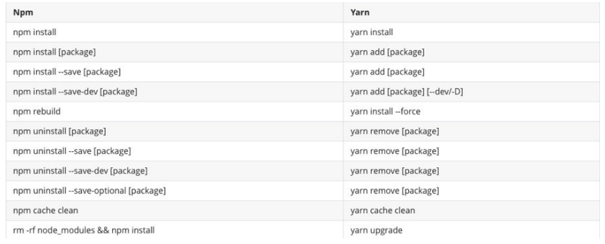

### cnpm 工具(npm 国内镜像)

- 由于一些特殊的原因，某些情况下我们没办法很好的从 https://registry.npmjs.org下载下来一些需要的包。

- 查看 npm 镜像：

  ```sh
  npm config get registry # npm config get registry
  ```

- 我们可以直接设置 npm 的镜像：

  ```sh
  npm config set registry https://registry.npm.taobao.org
  ```

- 但是对于大多数人来说（比如我），并不希望将 npm 镜像修改了：

  - 第一，不太希望随意修改 npm 原本从官方下来包的渠道；
  - 第二，担心某天淘宝的镜像挂了或者不维护了，又要改来改去；

- 这个时候，我们可以使用 cnpm，并且将 cnpm 设置为淘宝的镜像：

  ```sh
  npm install -g cnpm --registry=https://registry.npm.taobao.org
  cnpm config get registry # https://r.npm.taobao.org/
  ```

### pnpm 工具(类 maven)

- 什么是 pnpm 呢？我们来看一下官方的解释：

  - pnpm：我们可以理解成是 performant npm 缩写；

    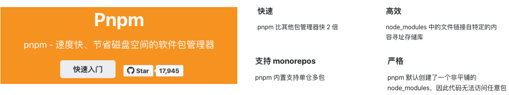

- 哪些公司在用呢？

  - 包括 Vue 在内的很多公司或者开源项目的包管理工具都切换到了 pnpm；
    

#### 硬链接和软连接的概念

- 硬链接（hard link）：
  - 硬链接（英语：hard link）是电脑文件系统中的多个文件平等地共享同一个文件存储单元；
  - 删除一个文件名字后，还可以用其它名字继续访问该文件；
- 符号链接（软链接 soft link、Symbolic link）：
  - 符号链接（软链接、Symbolic link）是一类特殊的文件；
  - 其包含有一条以绝对路径或者相对路径的形式指向其它文件或者目录的引用；
    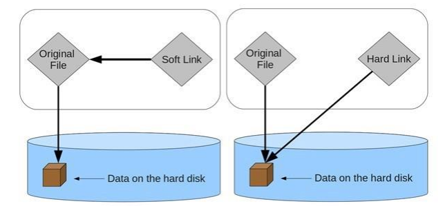

#### 硬链接和软连接的演练

- 文件的拷贝：文件的拷贝每个人都非常熟悉，会在硬盘中复制出来一份新的文件数据；

  ```sh
  window: copy foo.js foo_copy.js
  macos : cp foo.js foo_copy.js
  ```

  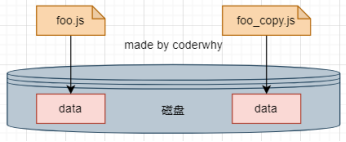

- 文件的硬链接

  ```sh
  window: mklink /H aaa_hard.js aaa.js
  macos : ln foo.js foo_hard.js
  ```

  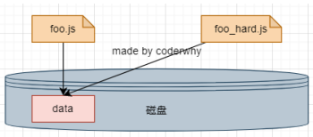

- 文件的软连接：

  ```sh
  window: mklink aaa_soft.js aaa.js
  macos : ln -s foo.js foo_copy.js
  ```

  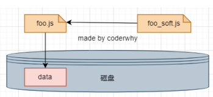

#### pnpm 到底做了什么呢?

- 当使用 npm 或 Yarn 时，如果你有 100 个项目，并且所有项目都有一个相同的依赖包，那么， 你在硬盘上就需要保存 100 份该相同依赖包的副本。
- 如果是使用 pnpm，依赖包将被存放在一个统一的位置，因此：
  - 如果你对同一依赖包使用相同的版本，那么磁盘上只有这个依赖包的一份文件；
  - 如果你对同一依赖包需要使用不同的版本，则仅有版本之间不同的文件会被存储起来；
  - 所有文件都保存在硬盘上的统一的位置：
    - 当安装软件包时， 其包含的所有文件都会硬链接到此位置，而不会占用额外的硬盘空间；
    - 这让你可以在项目之间方便地共享相同版本的依赖包；
- **所有依赖包以及依赖包的依赖包都会使用硬链接的方式, 使用同一个内存地址中的代码文件, 保正在内存中所存储的文件最小**
- 使用时会使用软连接的方式将需要使用的依赖包注入到对应项目的 node_modules 中

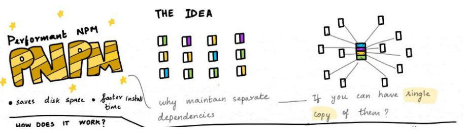

#### pnpm 创建非扁平的 node_modules 目录

- 当使用 npm 或 Yarn Classic 安装依赖包时，所有软件包都将被提升到 node_modules 的 根目录下。

  - 其结果是，源码可以访问本不属于当前项目所设定的依赖包；

    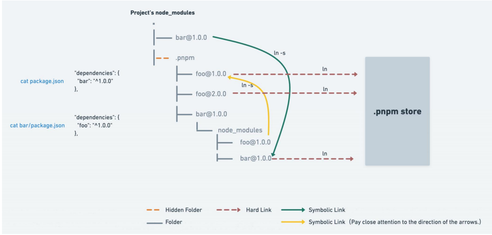

#### pnpm 的安装和使用

- 那么我们应该如何安装 pnpm 呢？

  - 官网提供了很多种方式来安装 pnpm：https://www.pnpm.cn/installation

  - 因为我们每个同学都要求安装过 Node，Node 中有 npm，所以我们通过 npm 安装即可；

    ```sh
    npm install -g pnpm
    ```

- 以下 是一个与 npm 等价命令的对照表，帮助你快速入门：

  | npm 命令           | pnpm 等价命令   |
  | ------------------ | --------------- |
  | npm install        | pnpm install    |
  | npm install pkg    | pnpm add pkg    |
  | npm uninstall pkg> | pnpm remove pkg |
  | npm run cmd        | pnpm cmd        |

- 更多命令和用法可以参考 pnpm 的官网：https://pnpm.io/zh/

#### pnpm 的存储 store

- 在 pnpm7.0 之前，统一的存储位置是 ~/.pnpm-score 中的；

  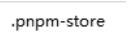

- 在 pnpm7.0 之后，统一的存储位置进行了更改：pnpm home directory /store

  - 在 Linux 上，默认是 ~/.local/share/pnpm/store

  - 在 Windows 上： %LOCALAPPDATA%/pnpm/store

  - 在 macOS 上： ~/Library/pnpm/store

    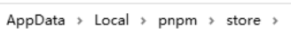

- 我们可以通过一些终端命令获取这个目录：获取当前活跃的 store 目录

  ```sh
  pnpm store path
  ```

- 另外一个非常重要的 store 命令是 prune（修剪）：从 store 中删除当前未被引用的包来释放 store 的空间

  ```sh
  pnpm store prune
  ```
