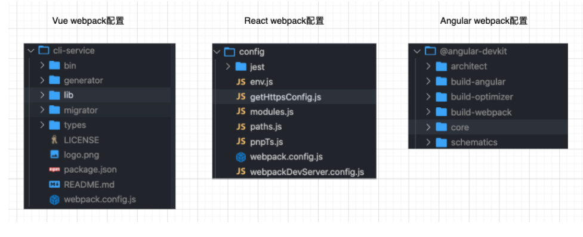
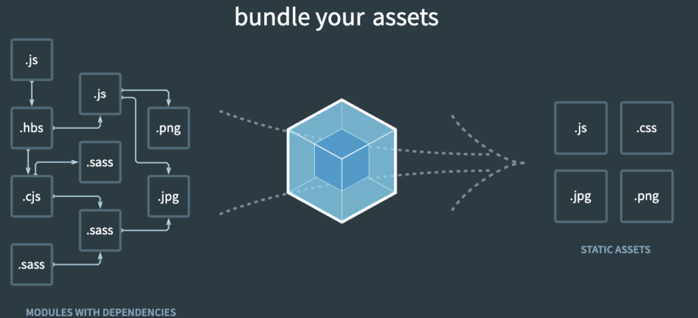
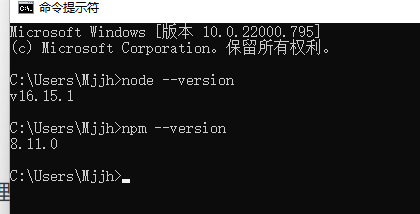
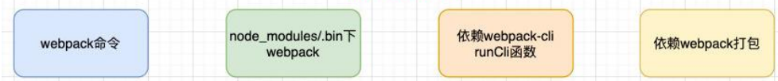
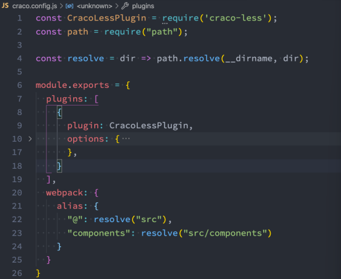
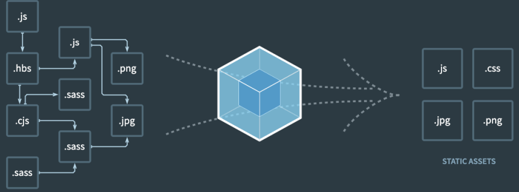

## webpack

### 认识webpack

- 事实上随着前端的快速发展，目前前端的开发已经变的越来越复杂了：
  - 比如开发过程中我们需要通过模块化的方式来开发；
  - 比如也会使用一些高级的特性来加快我们的开发效率或者安全性，比如通过ES6+、TypeScript开发脚本逻辑，通过sass、less等方式来编写css样式代码；
  - 比如开发过程中，我们还希望实时的监听文件的变化来并且反映到浏览器上，提高开发的效率；
  - 比如开发完成后我们还需要将代码进行压缩、合并以及其他相关的优化；
  - 等等….
- 但是对于很多的前端开发者来说，并不需要思考这些问题，日常的开发中根本就没有面临这些问题：
  - 这是因为目前前端开发我们通常都会直接使用三大框架来开发：Vue、React、Angular；
  - 但是事实上，这三大框架的创建过程我们都是借助于脚手架（CLI）的；
  - 事实上Vue-CLI、create-react-app、Angular-CLI都是基于webpack来帮助我们支持模块化、less、TypeScript、打包优化等的；

### 脚手架依赖webpack

- 事实上我们上面提到的所有脚手架都是依赖于webpack的：
  

### Webpack到底是什么呢？

- 我们先来看一下官方的解释：

  `webpack is a static module bundler for modern JavaScript applications.`

- webpack是一个静态的模块化打包工具，为现代的JavaScript应用程序；

- 我们来对上面的解释进行拆解：

  - 打包bundler：webpack可以将帮助我们进行打包，所以它是一个打包工具
  - 静态的static：这样表述的原因是我们最终可以将代码打包成最终的静态资源（部署到静态服务器）；
  - 模块化module：webpack默认支持各种模块化开发，ES Module、CommonJS、AMD等；
  - 现代的modern：我们前端说过，正是因为现代前端开发面临各种各样的问题，才催生了webpack的出现和发展；

###  Webpack官方的图片



### 在vue项目中webpack的作用

- JavaScript的打包：
  - 将ES6转换成ES5的语法；
  - TypeScript的处理，将其转换成JavaScript；
- Css的处理：
  - CSS文件模块的加载、提取；
  - Less、Sass等预处理器的处理；
- 资源文件img、font：
  - 图片img文件的加载；
  - 字体font文件的加载；
- HTML资源的处理：
  - 打包HTML资源文件；
- 处理vue项目的SFC文件.vue文件；

## Webpack的安装

### Webpack的环境配置

- webpack的官方文档是https://webpack.js.org/

  - webpack的中文官方文档是https://webpack.docschina.org/
  - DOCUMENTATION：文档详情，也是我们最关注的

- Webpack的运行是依赖Node环境的，所以我们电脑上必须有Node环境

  - 所以我们需要先安装Node.js，并且同时会安装npm；
  - 我当前电脑上的node版本是v16.15.1，npm版本是8.11.0（你也可以使用nvm或者n来管理Node版本）；
  - Node官方网站：https://nodejs.org/

  

### Webpack的安装

- webpack的安装目前分为两个：webpack、webpack-cli

- 那么它们是什么关系呢？

  - 执行webpack命令，会执行node_modules下的.bin目录下的webpack；

  - webpack在执行时是依赖webpack-cli的，如果没有安装就会报错；

  - 而webpack-cli中代码执行时，才是真正利用webpack进行编译和打包的过程；

  - 所以在安装webpack时，我们需要同时安装webpack-cli（第三方的脚手架事实上是没有使用webpack-cli的，而是类似于自己的vue-service-cli的东西）

    

    ```sh
    # 全局安装
    npm install webpack webpack-cli –g 
    # 局部安装
    npm install webpack webpack-cli –D 
    ```

### Webpack的默认打包

- 我们可以通过webpack进行打包，之后运行打包之后的代码

  - 在目录下直接执行 webpack 命令

    ```sh
    webpack
    ```

- 生成一个dist文件夹，里面存放一个main.js的文件，就是我们打包之后的文件：

  - 这个文件中的代码被压缩和丑化了；
  - 另外我们发现代码中依然存在ES6的语法，比如箭头函数、const等，这是因为默认情况下webpack并不清楚我们打包后的文
    件是否需要转成ES5之前的语法，后续我们需要通过babel来进行转换和设置；

- 我们发现是可以正常进行打包的，但是有一个问题，webpack是如何确定我们的入口的呢？

  - 事实上，当我们运行webpack时，webpack会查找当前目录下的 src/index.js作为入口；
  - 所以，如果当前项目中没有存在src/index.js文件，那么会报错；

- 当然，我们也可以通过配置来指定入口和出口

  ```sh
  npx webpack --entry ./src/main.js --output-path ./build
  ```

### 创建局部的webpack

- 前面我们直接执行webpack命令使用的是全局的webpack，如果希望使用局部的可以按照下面的步骤来操作。

- 第一步：创建package.json文件，用于管理项目的信息、库依赖等

  ```sh
  npm init
  ```

- 第二步：安装局部的webpack

  ```sh
  npm install webpack webpack-cli -D
  ```

- 第三步：使用局部的webpack

  ```sh
  npx webpack
  ```

- 第四步：在package.json中创建scripts脚本，执行脚本打包即可

  ```sh
  "scripts": {
  		"build": "webpack"
  }
  
  npm run build
  ```

## Webpack配置

### Webpack配置文件

- 在通常情况下，webpack需要打包的项目是非常复杂的，并且我们需要一系列的配置来满足要求，默认配置必然是不可以的。

- 我们可以在根目录下创建一个webpack.config.js文件，来作为webpack的配置文件：

  ```js
  const path = require('path')
  
  // 导出配置信息
  module.exports = {
  	entry: "./src/main.js"
  	output: {
  		filename: "bundle.js",
  		path: path.resolve(__dirname,"./dist")
  	}
  }
  ```

- 继续执行webpack命令，依然可以正常打包

  ```sh
  npm run build
  ```

### 指定配置文件

- 但是如果我们的配置文件并不是webpack.config.js的名字，而是其他的名字呢？

  - 比如我们将webpack.config.js修改成了 wk.config.js；

  - 这个时候我们可以通过 --config 来指定对应的配置文件；

    ```sh
    webpack --config wk.config.js
    ```

- 但是每次这样执行命令来对源码进行编译，会非常繁琐，所以我们可以在package.json中增加一个新的脚本：

  ```js
  {
  	"scirpts": {
  		"build": "webpack --config wk.config.js"
  	},
  	"devDependencies": {
  		"webpack": "^5.14.0",
  		"webpack-cli": "^4.3.1"
  	}
  }
  ```

- 之后我们执行 npm run build来打包即可。

### 默认路径的配置

#### 内置模块path

- path模块用于对路径和文件进行处理，提供了很多好用的方法。
- 我们知道在Mac OS、Linux和window上的路径时不一样的
  - window上会使用 \或者 \\ 来作为文件路径的分隔符，当然目前也支持 /；
  - 在Mac OS、Linux的Unix操作系统上使用 / 来作为文件路径的分隔符；
- 那么如果我们在window上使用 \ 来作为分隔符开发了一个应用程序，要部署到Linux上面应该怎么办呢？
  - 显示路径会出现一些问题；
  - 所以为了屏蔽他们之间的差异，在开发中对于路径的操作我们可以使用 path 模块；
- 可移植操作系统接口（英语：Portable Operating System Interface，缩写为POSIX）
  - Linux和Mac OS都实现了POSIX接口；
  - Window部分电脑实现了POSIX接口；

#### path常见的API

- 从路径中获取信息
  - dirname：获取文件的父文件夹；
  - basename：获取文件名；
  - extname：获取文件扩展名；
- 路径的拼接：path.join
  - 如果我们希望将多个路径进行拼接，但是不同的操作系统可能使用的是不同的分隔符；
  - 这个时候我们可以使用path.join函数；
- 拼接绝对路径：path.resolve
  - path.resolve() 方法会把一个路径或路径片段的序列解析为一个绝对路径；
  - 给定的路径的序列是从右往左被处理的，后面每个 path 被依次解析，直到构造完成一个绝对路径；
  - 如果在处理完所有给定path的段之后，还没有生成绝对路径，则使用当前工作目录；
  - 生成的路径被规范化并删除尾部斜杠，零长度path段被忽略；
  - 如果没有path传递段，path.resolve()将返回当前工作目录的绝对路径；

#### 在webpack中的使用

- 在webpack中获取路径或者起别名的地方也可以使用
  

### Webpack的依赖图

- webpack到底是如何对我们的项目进行打包的呢？
  - 事实上webpack在处理应用程序时，它会根据命令或者配置文件找到入口文件；
  - 从入口开始，会生成一个 依赖关系图，这个依赖关系图会包含应用程序中所需的所有模块（比如.js文件、css文件、图片、字体等）；
  - 然后遍历图结构，打包一个个模块（根据文件的不同使用不同的loader来解析）；
    

### Webpack的代码分包

- 为什么需要分包

  - 在项目中有许多供应商提供的支持第三方包
  - 直接打包的话会将自己不同页面中业务代码使用的第三方包打包进去,影响项目整体的加载速度,首屏渲染加载迟缓

- 默认的打包过程：

  - 默认情况下，在构建整个组件树的过程中，因为组件和组件之间是通过模块化直接依赖的，那么webpack在打包时就会将组 件模块打包到一起（比如一个app.js文件中）；
  - 这个时候随着项目的不断庞大，app.js文件的内容过大，会造成首屏的渲染速度变慢；

- 打包时，代码的分包： 

  - 所以，对于一些不需要立即使用的组件，我们可以单独对它们进行拆分，拆分成一些小的代码块chunk.js；
  - 这些chunk.js会在需要时从服务器加载下来，并且运行代码，显示对应的内容；

- 那么webpack中如何可以对代码进行分包呢？

  1. 使用improt函数进行文件导入

     ```vue
     import("./utils/math").then(({sum}) => {
     	console.log(sum(20, 30))
     })
     ```

  2. 使用异步组件的形式加载

  3. 路由懒加载

### resolve模块解析

- resolve用于设置模块如何被解析：
  - 在开发中我们会有各种各样的模块依赖，这些模块可能来自于自己编写的代码，也可能来自第三方库；
  - resolve可以帮助webpack从每个 require/import 语句中，找到需要引入到合适的模块代码；
  - webpack 使用 enhanced-resolve 来解析文件路径；
- webpack能解析三种文件路径：
- 绝对路径
  - 由于已经获得文件的绝对路径，因此不需要再做进一步解析。
- 相对路径
  - 在这种情况下，使用 import 或 require 的资源文件所处的目录，被认为是上下文目录；
  - 在 import/require 中给定的相对路径，会拼接此上下文路径，来生成模块的绝对路径；
- 模块路径
  - 在 resolve.modules中指定的所有目录检索模块；
    - 默认值是 ['node_modules']，所以默认会从node_modules中查找文件；
  - 我们可以通过设置别名的方式来替换初识模块路径，具体后面讲解alias的配置；

#### 文件还是文件夹

- 如果是一个文件：
  - 如果文件具有扩展名，则直接打包文件；
  - 否则，将使用 resolve.extensions选项作为文件扩展名解析；
- 如果是一个文件夹：
  - 会在文件夹中根据 resolve.mainFiles配置选项中指定的文件顺序查找；
    - resolve.mainFiles的默认值是 ['index']；
    - 再根据 resolve.extensions来解析扩展名；

#### extensions和alias配置

- extensions是解析到文件时自动添加扩展名：

  - 默认值是 ['.wasm', '.mjs', '.js', '.json']；
  - 所以如果我们代码中想要添加加载 .vue 或者 jsx 或者 ts 等文件时，我们必须自己写上扩展名；

- 另一个非常好用的功能是配置别名alias：

  - 特别是当我们项目的目录结构比较深的时候，或者一个文件的路径可能需要 ../../../这种路径片段；
  - 我们可以给某些常见的路径起一个别名；

  ```js
  resolve: {
  	extensions: [".wasm", ".mjs", ".js", ".json", ".jsx", ".ts", ".vue"],
  	alias: {
  		"@": resolveApp("./src"),
  		pages: resolveApp("./src/pages")
  	}
  }
  ```

