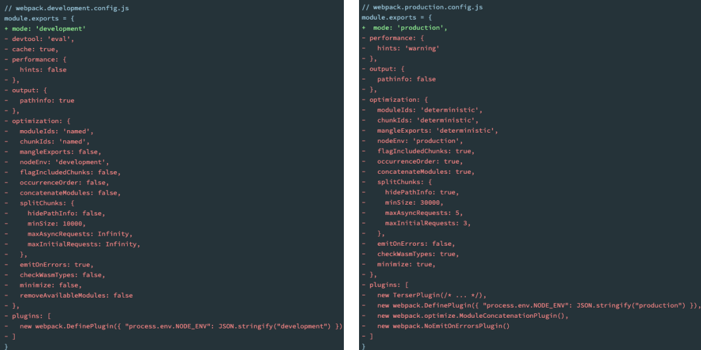

## loader

### loader 使用案例

- 我们创建一个 component.js
  - 通过 JavaScript 创建了一个元素，并且希望给它设置一些样式；

```js
import "../css/style.css";

function component() {
  const element = document.createElement("div");

  element.innerHTML = ["Hello", "Webpack"].join(" ");
  element.className = "content";

  return element;
}

document.body.appendChild(component());
```

```css
.content {
  color: red;
}
```


## css-loader

### css-loader 的使用

- 上面的错误信息告诉我们需要一个 loader 来加载这个 css 文件，但是 loader 是什么呢？

  - loader 可以用于对模块的源代码进行转换；
  - 我们可以将 css 文件也看成是一个模块，我们是通过 import 来加载这个模块的；
  - 在加载这个模块时，webpack 其实并不知道如何对其进行加载，我们必须制定对应的 loader 来完成这个功能；

- 那么我们需要一个什么样的 loader 呢？

  - 对于加载 css 文件来说，我们需要一个可以读取 css 文件的 loader；
  - 这个 loader 最常用的是 css-loader；

- css-loader 的安装：

  ```sh
  npm install css-loader -D
  ```

### css-loader 的引入方案

- 如何使用这个 loader 来加载 css 文件呢？有三种方式：

  - 内联方式；
  - CLI 方式（webpack5 中不再使用）；
  - 配置方式；

- 内联方式：内联方式使用较少，因为不方便管理；

  - 在引入的样式前加上使用的 loader，并且使用!分割；

    ```js
    import "css-loader!../css/style.css";
    ```

- CLI 方式

  - 在 webpack5 的文档中已经没有了--module-bind；
  - 实际应用中也比较少使用，因为不方便管理；

### loader 配置方式

- 配置方式表示的意思是在我们的 webpack.config.js 文件中写明配置信息：
  - module.rules 中允许我们配置多个 loader（因为我们也会继续使用其他的 loader，来完成其他文件的加载）；
  - 这种方式可以更好的表示 loader 的配置，也方便后期的维护，同时也让你对各个 Loader 有一个全局的概览；
- module.rules 的配置如下：
- rules 属性对应的值是一个数组：[Rule]
- 数组中存放的是一个个的 Rule，Rule 是一个对象，对象中可以设置多个属性：
  - test 属性：用于对 resource（资源）进行匹配的，通常会设置成正则表达式；
  - use 属性：对应的值时一个数组：[UseEntry]
    - UseEntry 是一个对象，可以通过对象的属性来设置一些其他属性
      - loader：必须有一个 loader 属性，对应的值是一个字符串；
      - options：可选的属性，值是一个字符串或者对象，值会被传入到 loader 中；
      - query：目前已经使用 options 来替代；
    - 传递字符串（如：use: [ 'style-loader' ]）是 loader 属性的简写方式（如：use: [ { loader: 'style-loader'} ]）；
  - loader 属性： Rule.use: [ { loader } ] 的简写。

### Loader 的配置代码

loader 的加载顺序是从下往上加载的

```js
const path = require('path')

// 导出配置信息
module.exports = {
  mode: "development"
	entry: "./src/main.js"
	output: {
		filename: "bundle.js",
		path: path.resolve(__dirname,"./dist")
	},
  module: {
    rules: [
      {
        test: /\.css$/,
        // loader: "css-loader" // 写法一
        // use: ["css-loader"] //写法二
    		use: [
          { loader: "css-loader" }//写法三
        ]
      }
    ]
  }
}
```

## style-loader

### 认识 style-loader

- 我们已经可以通过 css-loader 来加载 css 文件了

  - 但是你会发现这个 css 在我们的代码中并没有生效（页面没有效果）。

- 这是为什么呢？

  - 因为 css-loader 只是负责将.css 文件进行解析，并不会将解析之后的 css 插入到页面中；
  - 如果我们希望再完成插入 style 的操作，那么我们还需要另外一个 loader，就是 style-loader；

- 安装 style-loader：

  ```sh
  npm install style-loader -D
  ```

### 配置 style-loader

- 那么我们应该如何使用 style-loader：

  - 在配置文件中，添加 style-loader；

  - 注意：因为 loader 的执行顺序是从右向左（或者说从下到上，或者说从后到前的），所以我们需要将 style-loader 写到 css loader 的前面；

    ```js
    use: [{ loader: "style-loader" }, { loader: "css-loader" }];
    ```

- 重新执行编译 npm run build，可以发现打包后的 css 已经生效了：

  - 当前目前我们的 css 是通过页内样式的方式添加进来的；
  - 后续我们也会讲如何将 css 抽取到单独的文件中，并且进行压缩等操作；

## less-loader

### 如何处理 less 文件？

- 在我们开发中，我们可能会使用 less、sass、stylus 的预处理器来编写 css 样式，效率会更高。

- 那么，如何可以让我们的环境支持这些预处理器呢？

  - 首先我们需要确定，less、sass 等编写的 css 需要通过工具转换成普通的 css；

- 比如我们编写如下的 less 样式：

  ```less
  @fontSize: 30px;
  @fontWeight: 700;

  .content {
    font-size: @fontSize;
    font-weight: @fontWeight;
  }
  ```

### Less 工具处理

- 我们可以使用 less 工具来完成它的编译转换：

  ```sh
  npm install less -D
  ```

- 执行如下命令：

  ```sh
  npx lessc ./src/css/title.less title.css
  ```

### less-loader 处理

- 但是在项目中我们会编写大量的 css，它们如何可以自动转换呢？

  - 这个时候我们就可以使用 less-loader，来自动使用 less 工具转换 less 到 css；

    ```sh
    npm install less-loader -D
    ```

- 配置 webpack.config.js

  ```js
  {
    test: /\.less$/,
      use: [
        { loader: "style-loader" },
        { loader: "css-loader" },
        { loader: "less-loader" }
      ]
  }
  ```

  - 执行 npm run build
    - less 就可以自动转换成 css，并且页面也会生效了

## PostCss

### 认识 PostCSS 工具

- 什么是 PostCSS 呢？
  - PostCSS 是一个通过 JavaScript 来转换样式的工具；
  - 这个工具可以帮助我们进行一些 CSS 的转换和适配，比如自动添加浏览器前缀、css 样式的重置；
  - 但是实现这些功能，我们需要借助于 PostCSS 对应的插件；
- 如何使用 PostCSS 呢？主要就是两个步骤：
  - 第一步：查找 PostCSS 在构建工具中的扩展，比如 webpack 中的 postcss-loader；
  - 第二步：选择可以添加你需要的 PostCSS 相关的插件；

### postcss-loader

- 我们可以借助于构建工具：

  - 在 webpack 中使用 postcss 就是使用 postcss-loader 来处理的；

- 我们来安装 postcss-loader：

  ```sh
  npm install postcss-loader -D
  ```

- 我们修改加载 css 的 loader：（配置文件已经过多，给出一部分了）

  - 注意：因为 postcss 需要有对应的插件才会起效果，所以我们需要配置它的 plugin；

    ```js
    {
      loader: "postcss-loader",
      options: {
        postcssOptions: {
          plugins: [
            require('autoprefixer')
          ]
        }
      }
    }
    ```

### 单独的 postcss 配置文件

- 因为我们需要添加前缀，所以要安装 autoprefixer：

  ```sh
  npm install autoprefixer -D
  ```

- 我们可以将这些配置信息放到一个单独的文件中进行管理：

  - 在根目录下创建 postcss.config.js

    ```js
    module.exports = {
      plugins: [requie("autiprefixer")],
    };
    ```

### postcss-preset-env(plugin 插件)

- 事实上，在配置 postcss-loader 时，我们配置插件并不需要使用 autoprefixer。

- 我们可以使用另外一个插件：postcss-preset-env

  - postcss-preset-env 也是一个 postcss 的插件；
  - 它可以帮助我们将一些现代的 CSS 特性，转成大多数浏览器认识的 CSS，并且会根据目标浏览器或者运行时环境添加所需的
    polyfill；
  - 也包括会自动帮助我们添加 autoprefixer（所以相当于已经内置了 autoprefixer）；

- 首先，我们需要安装 postcss-preset-env：

  ```sh
  npm install postcss-preset-env -D
  ```

- 之后，我们直接修改掉之前的 autoprefixer 即可：

  ```js
  plugins: [require("postcss-preset-env")];
  ```

- 注意：我们在使用某些 postcss 插件时，也可以直接传入字符串

  ```js
  module.exports = {
    plugins: ["postcss-preset-env"],
  };
  ```

## 图片加载

- 为了演示我们项目中可以加载图片，我们需要在项目中使用图片，比较常见的使用图片的方式是两种：

  - img 元素，设置 src 属性；

  - 其他元素（比如 div），设置 background-image 的 css 属性；

    ```js
    const zznhImage = new Image();
    zznhImage.scr = zznhImg;
    element.appendChild(zznhImage);

    const bgDiv = document.createElement("div");
    bgDiv.style.width = 200 + "px";
    bgDiv.style.height = 200 + "px";
    bgDiv.style.display = "inline-block";
    bgDiv.className = "bg-image";
    bgDiv.style.backgroundColor = "red";
    element.appendChild(bgDiv);
    ```

    ```css
    .bg-image {
    	background-image: url("../img/bg.jpg")
      background-size: contain;
    }
    ```

  - 这个时候，打包会报错

### 认识 asset module type

- 我们当前使用的 webpack 版本是 webpack5：
  - 在 webpack5 之前，加载这些资源我们需要使用一些 loader，比如 raw-loader 、url-loader、file-loader；
  - 在 webpack5 开始，我们可以直接使用资源模块类型（asset module type），来替代上面的这些 loader；
- 资源模块类型(asset module type)，通过添加 4 种新的模块类型，来替换所有这些 loader：
  - asset/resource 发送一个单独的文件并导出 URL。
    - 之前通过使用 file-loader 实现；
  - asset/inline 导出一个资源的 data URI。
    - 之前通过使用 url-loader 实现；
  - asset/source 导出资源的源代码
    - 之前通过使用 raw-loader 实现；
  - asset 在导出一个 data URI 和发送一个单独的文件之间自动选择。
    - 之前通过使用 url-loader，并且配置资源体积限制实现；

### asset module type 的使用

- 比如加载图片，我们可以使用下面的方式：

  ```js
  {
  	test: /\.(png|svg|jpg|jpeg|gif)$/i,
    type: "asset/resource"
  }
  ```

- 但是，如何可以自定义文件的输出路径和文件名呢？

  - 方式一：修改 output，添加 assetModuleFilename 属性；

    ```js
    output: {
      filename: "js/bundle.js",
      path: path.resolve(__dirname, "./dist"),
      assetModuleFilename: "img/[name].[hash:6][ext]"
    }
    ```

  - 方式二：在 Rule 中，添加一个 generator 属性，并且设置 filename；

    ```js
    {
    	test: /\.(png|svg|jpg|jpeg|gif)$/i,
      type: "asset/resource",
      generator: {
        filename: "img/[name].[hash:6][ext]"
      }
    }
    ```

- 我们这里介绍几个最常用的 placeholder：

  - [ext]： 处理文件的扩展名；
  - [name]：处理文件的名称；
  - [hash]：文件的内容，使用 MD4 的散列函数处理，生成的一个 128 位的 hash 值（32 个十六进制）；

### url-loader 的 limit 效果

- 开发中我们往往是小的图片需要转换，但是大的图片直接使用图片即可

  - 这是因为小的图片转换 base64 之后可以和页面一起被请求，减少不必要的请求过程；
  - 而大的图片也进行转换，反而会影响页面的请求速度；

- 我们需要两个步骤来实现：

  - 步骤一：将 type 修改为 asset；

  - 步骤二：添加一个 parser 属性，并且制定 dataUrl 的条件，添加 maxSize 属性；

    ```js
    rules: [
      {
        test: /\.(png|svg|jpg|jpeg|gif)$/i,
        type: "asset",
        generator: {
          filename: "img/[name].[hash:6][ext]",
        },
        parser: {
          dataUrlCondition: {
            maxSize: 100 * 1024,
          },
        },
      },
    ];
    ```

## babel

### babel 是什么

- 事实上，在开发中我们很少直接去接触 babel，但是 babel 对于前端开发来说，目前是不可缺少的一部分：

  - 开发中，我们想要使用 ES6+的语法，想要使用 TypeScript，开发 React 项目，它们都是离不开 Babel 的；
  - 所以，学习 Babel 对于我们理解代码从编写到线上的转变过程至关重要；

- 那么，Babel 到底是什么呢？

  - Babel 是一个工具链，主要用于旧浏览器或者环境中将 ECMAScript 2015+代码转换为向后兼容版本的 JavaScript；

  - 包括：语法转换、源代码转换等；

    ```js
    [1, 2, 3]
      .map((n) => n + 1)

      [(1, 2, 3)].map(function (n) {
        return n + 1;
      });
    ```

### Babel 命令行使用

- babel 本身可以作为一个独立的工具（和 postcss 一样），不和 webpack 等构建工具配置来单独使用。

- 如果我们希望在命令行尝试使用 babel，需要安装如下库：

  - @babel/core：babel 的核心代码，必须安装；

  - @babel/cli：可以让我们在命令行使用 babel；

    ```sh
    npm install @babel/cli @babel/core -D
    ```

- 使用 babel 来处理我们的源代码：

  - src：是源文件的目录；

  - --out-dir：指定要输出的文件夹 dist；

    ```js
    npx babel src --out-dir dist
    ```

### Babel 插件的使用

- 比如我们需要转换箭头函数，那么我们就可以使用箭头函数转换相关的插件：

  ```sh
  npm install @babel/plugin-transform-arrow-functions -D
  npx babel src --out-dir dist --plugins=@babel/plugin-transform-arrow-functions
  ```

- 查看转换后的结果：我们会发现 const 并没有转成 var

  - 这是因为 plugin-transform-arrow-functions，并没有提供这样的功能；

  - 我们需要使用 plugin-transform-block-scoping 来完成这样的功能；

    ```sh
    npm install @babel/plugin-transform-block-scoping -D
    npx babel src --out-dir dist --plugins=@babel/plugin-transform-block-scoping,@babel/plugin-transform-arrow-functions
    ```

### babel-loader

- 在实际开发中，我们通常会在构建工具中通过配置 babel 来对其进行使用的，比如在 webpack 中。

- 那么我们就需要去安装相关的依赖：

  - 如果之前已经安装了@babel/core，那么这里不需要再次安装；

    ```sh
    npm install babel-loader -D
    ```

- 我们可以设置一个规则，在加载 js 文件时，使用我们的 babel：

  ```sh
  module: {
  	rules: [
  		{
  			test: /\.m?js$/,
  			use" {
  				loader: "babel-loader"
  			}
  		}
  	]
  }
  ```

### Babel 的预设 preset

- 但是如果要转换的内容过多，一个个设置是比较麻烦的，我们可以使用预设（preset）：

  - 后面我们再具体来讲预设代表的含义；

- 安装@babel/preset-env 预设：

  ```sh
  npm install @babel/preset-env -D
  ```

- 执行如下命令：

  ```sh
  npx babel src --out-dir dist --presets=@babel/preset-env
  ```

### babel-preset

- 如果我们一个个去安装使用插件，那么需要手动来管理大量的 babel 插件，我们可以直接给 webpack 提供一个 preset，webpack 会根据我们的预设来加载对应的插件列表，并且将其传递给 babel。

- 比如常见的预设有三个：

  - env
  - react
  - TypeScript

- 安装 preset-env：

  ```sh
  npm install @babel/preset-env
  ```

  ```js
  {
    test: /\.m?js$/,
    use" {
      loader: "babel-loader",
        options: [
          presets: [
          	["@babel/preset-env"]
        	]
        ]
    }
  }
  ```

## Vue-loader

### 编写 App.vue 代码

- 在开发中我们会编写 Vue 相关的代码，webpack 可以对 Vue 代码进行解析：

  - 接下来我们编写自己的 App.vue 代码；

    ```vue
    <template>
      <div>loginPanel</div>
    </template>

    <script setup lang="ts"></script>

    <style scoped></style>
    ```

    ```js
    import { createApp } from "vue";
    import App from "./App.vue";

    const app = createApp(App);
    app.mount("#app");
    ```

### App.vue 的打包过程

- 我们对代码打包会报错：我们需要合适的 Loader 来处理文件。

  

- 这个时候我们需要使用 vue-loader：

  ```sh
  npm install vue-loader -D
  ```

- 在 webpack 的模板规则中进行配置：

  ```js
  {
  	test: /\.vue$/,
  	loader: "vue-loader"
  }
  ```

### @vue/compiler-sfc

- 打包依然会报错，这是因为我们必须添加@vue/compiler-sfc 来对 template 进行解析：

  ```js
  npm install @vue/compiler-sfc -D
  ```

- 另外我们需要配置对应的 Vue 插件：

  

- 重新打包即可支持 App.vue 的写法

- 另外，我们也可以编写其他的.vue 文件来编写自己的组件；

## PLUGIN

### plugin

- Webpack 的另一个核心是 Plugin，官方有这样一段对 Plugin 的描述：
  - While loaders are used to transform certain types of modules, plugins can be leveraged to perform a wider range of tasks like bundle optimization, asset management and injection of environment variables.
- 上面表达的含义翻译过来就是：
  - Loader 是用于特定的模块类型进行转换；
  - Plugin 可以用于执行更加广泛的任务，比如打包优化、资源管理、环境变量注入等；
    

### CleanWebpackPlugin

- 前面我们演示的过程中，每次修改了一些配置，重新打包时，都需要手动删除 dist 文件夹：

  - 我们可以借助于一个插件来帮助我们完成，这个插件就是 CleanWebpackPlugin；

- 首先，我们先安装这个插件：

  ```sh
  npm install clean-webpack-plugin -D
  ```

- 之后在插件中配置：

  ```js
  const { CleanWebpackPlugin } = require("clean-webpack-plugin");

  module.exports = {
    //其他省略
    plugins: [new CleanWebpackPlugin()],
  };
  ```

### HtmlWebpackPlugin

- 另外还有一个不太规范的地方：

  - 我们的 HTML 文件是编写在根目录下的，而最终打包的 dist 文件夹中是没有 index.html 文件的。
  - 在进行项目部署的时，必然也是需要有对应的入口文件 index.html；
  - 所以我们也需要对 index.html 进行打包处理；

- 对 HTML 进行打包处理我们可以使用另外一个插件：HtmlWebpackPlugin；

  ```sh
  npm install html-webpack-plugin -D
  ```

  ```js
  const { HtmlWebpackPlugin } = require("html-webpack-plugin");

  module.exports = {
    //其他省略
    plugins: [
      new HtmlWebpackPlugin({
        title: "webpack案例",
      }),
    ],
  };
  ```

### 生成 index.html 分析

- 我们会发现，现在自动在 dist 文件夹中，生成了一个 index.html 的文件：

  - 该文件中也自动添加了我们打包的 bundle.js 文件；

    

- 这个文件是如何生成的呢？

  - 默认情况下是根据 ejs 的一个模板来生成的；
  - 在 html-webpack-plugin 的源码中，有一个 default_index.ejs 模块；

### 自定义 HTML 模板

- 如果我们想在自己的模块中加入一些比较特别的内容：
  - 比如添加一个 noscript 标签，在用户的 JavaScript 被关闭时，给予响应的提示；
  - 比如在开发 vue 或者 react 项目时，我们需要一个可以挂载后续组件的根标签`<div id="app"></div>`；
- 这个我们需要一个属于自己的 index.html 模块：
  

### 自定义模板数据填充

- 上面的代码中，会有一些类似这样的语法<% 变量 %>，这个是 EJS 模块填充数据的方式。
- 在配置 HtmlWebpackPlugin 时，我们可以添加如下配置：
  - template：指定我们要使用的模块所在的路径；
  - title：在进行 htmlWebpackPlugin.options.title 读取时，就会读到该信息；
    

### DefinePlugin 的介绍

- 但是，这个时候编译还是会报错，因为在我们的模块中还使用到一个 BASE_URL 的常量：

  

- 这是因为在编译 template 模块时，有一个 BASE_URL：

  ```html
  <link rel="icon" href="<%= BASE_URL %>favicon.ico" />
  ```

  - 但是我们并没有设置过这个常量值，所以会出现没有定义的错误；

- 这个时候我们可以使用 DefinePlugin 插件；

### DefinePlugin 的使用

- DefinePlugin 允许在编译时创建配置的全局常量，是一个 webpack 内置的插件（不需要单独安装）：

  ```js
  const { DefinePlugin } = require('webpack');

  module.exports = {
  	new DefinePlugin({
  		BACE_URL: '"./"'
  	})
  }
  ```

- 这个时候，编译 template 就可以正确的编译了，会读取到 BASE_URL 的值；

## mode 配置

### mode 配置

- Mode 配置选项，可以告知 webpack 使用相应模式的内置优化：
  - 默认值是 production（什么都不设置的情况下）；
  - 可选值有：'none' | 'development' | 'production'；
- 这几个选项有什么样的区别呢？

| 选项        | 描述                                                                                                   |
| ----------- | ------------------------------------------------------------------------------------------------------ |
| development | 会将 definePlugin 中 process.env.NODE_ENV 的值设置为 development, 为模块和 chunk 的启用有效的名称      |
| production  | 会将 definePlugin 中 process.env.NODE_ENV 的值设置为 production, 为模块和 chunk 的启用确定性的混淆名称 |
| none        | 不使用任何默认选项                                                                                     |

### 更多 mode 配置


