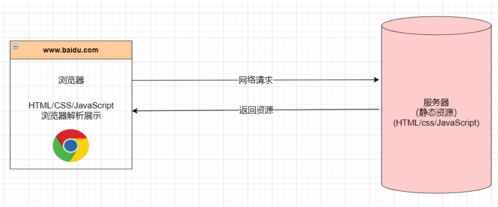

## 网站和网页的关系

### 网页是什么？

- 网页的专业属于叫做Web page
- 打开浏览器查看的页面，是网络中的一‘页’
- 网页的内容可以非常丰富：包括文字、链接、图片、音乐、视频等等

### 网站是什么？

- 网站是由多个网页组成的
- 通常一个网站是由N个网页组成的（N >= 1）

## 网页显示的过程

### 用户

1. 用户在浏览器输入一个网站

2. 浏览器会找到对应的服务器地址，请求静态资源（可以存放在世界任何一个地方）

3. 服务器返回静态资源给浏览器

4. 浏览器对静态资源进行解析和展示

   

### 前端工程师

1. 开发项目（HTML/CSS/JavaScript/Vue/React）

2. 打包、部署项目到服务器里面

   

## 服务器是什么

- 我们日常生活接触到的基本都属于客户端、前端的内容
  - 比如浏览器、微信、qq、小程序
- 我们知道自己的手机并不可能存放那些多的数据和资源
  - 比如你用《网易云听音乐》，音乐数据大部分都是存在“服务器“中的：
- 那么服务到底是什么呢？
  - 服务器本质上也是一台类以于你电脑一样的主机：
  - 但是这个主机有几个特点：
    - 二十四小时不关机的（稳定运行）：
    - 没有显示器的：
    - 一般装的是Linux操作系统（比如centos):
- 那么我一会到公司是不是就看得见服务器了呢？
  - 目前大部分公司用的都是云服务器（阿里云等）

## 世界上第一个网页

- 上世纪90年代，Berners-Lee上线了世界上第一个网站
  - **http://info.cern.ch/hypertext/WWW/TheProject.html**

- 虽然非常简单但是在当时已经是天才之作了

### 网页的组成部分

- 那么网页是由什么开发出来的呢
  - 阶段一：HTML元素
  - 阶段二：HTML元素 + CSS样式
  - 阶段三：HTML元素 + CSS样式 + JavaScript语言
- HTML 网页的内容结构
- CSS 网页的视觉体验
- JavaScript 网页的交互处理