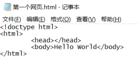
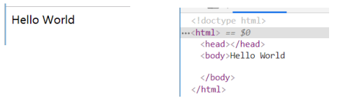

### 第一个网页

#### 开发第一个网页-记事本

- 过程

  1. 新建一个.txt的文件

  1. 在其中添加一些文字，比如Hello World 

  1. 保存文件 

  1. 修改文件的扩展名为.html文件 

  1. 使用浏览器打开页面 

- 这个网页有什么缺点？ 
  - 只能显示一段普通的文本； 
  - 浏览器不知道是否要对这段文本加粗、放大、段落之间的间距；

#### 案例显示一条新闻

- 如果我们现在有一条新闻需要显示，那么可以通过某些“元素”来告知浏览器这部分内容如何显示。
- 而我们编写的<h2></h2> 和<p></p>就是HTML元素

### 认识HTML

- 超文本标记语言（英语：HyperText Markup Language，简称：HTML）是一种用于创建网页的标准标记语言。 
  - HTML元素是构建网站的基石； 
- 什么是标记语言（markup language ）？ 
  - 由无数个标记（标签、tag)组成； 
  - 是对某些内容进行特殊的标记，以供其他解释器识别处理； 
  - 比如使用标记的文本会被识别为“标题”进行加粗、文字放大显示； 
  - 由标签和内容组成的称为元素（element） 
- 什么是超文本（ HyperText ）呢？ 
  - 表示不仅仅可以插入普通的文本（Text），还可以插入图片、音频、视频等内容； 
  - 还可以表示超链接（HyperLink），从一个网页跳转到另一个网页；

### HTML文件的特点-拓展名（后缀名）

- HTML文件的拓展名是.htm\.html 
  - 因历史遗留问题，Win95\Win98系统的文件拓展名不能超过3字符，所以使用.htm 
  - 现在统一使用 .html

### HTML文件的特点 – 结构

```html
<html>
	<head></head>
	<body></body>
</html>
```

### 改进自己的网页

- 修改自己的网页代码，让自己的网页也具备正确的结构： 

  

- 运行效果是一样的，但是我们现在的网站也有正确的结构了
