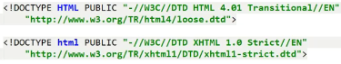
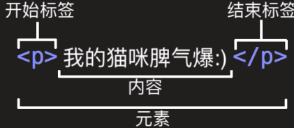
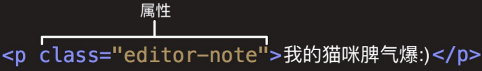
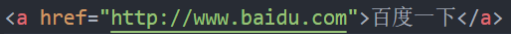
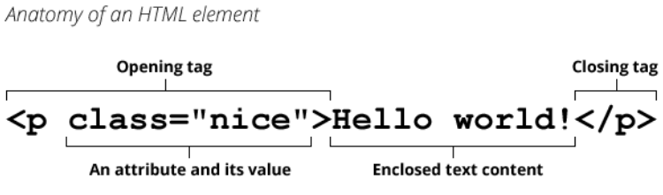
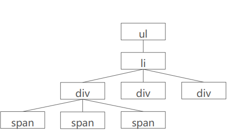
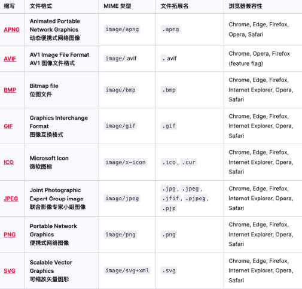

## HTML 的结构

### 完整的 HTML 结构

- 一个完整的 html 结构分为哪几部分呢？
- 文档声明
- html 元素
  - head 元素
  - body 元素

```html
<!DOCTYPE html>
<head>
  <title>Document</title>
</head>
<body>
</body>
</html>
```

### 文档声明

- HTML 最上方的一段文本我们称之为文档类型声明，用于声明文档类型

```html
<!DOCTYPE html>
```

- **<!DOCTYPE html>**

  - HTML 文档声明，告诉浏览器当前页面是 HTML5 页面：
  - 让浏览器用 HTML5 的标准去解析识别内容；
  - 必须放在 HTML 文档的最前面，不能省略，省略了会出现兼容性问题；

- HTML5 的文档声明比 HTML4.01、XHTML1.0 简洁非常多（了解即可）

  

### html 元素( lang )

- **html**元素表示一个 HTML 文档的根（顶级元素），所以它也被称为根元素。

  - 所有其他元素必须是此元素的后代。

    ```html
    <!DOCTYPE html>
    <html lang="en"></html>
    ```

- W3C 标准建议为 html 元素增加一个 lang 属性，作用是

  - 帮助语音合成工具确定要使用的发音
  - 帮助翻译工具确定要使用的翻译规则

- 比如常用的规则：

  - lang="en”表示这个 HTML 文档的语言是英文；
  - lang="z-CN"表示这个 HTML 文档的语言是中文：

### head 元素

- HTML head 元素规定文档相关的配置信息（也称之为元数据），包括文档的标题，引用的文档样式和脚本等。

  - 什么是元数据(meta data)，是描述数据的数据：

  - 这里我们可以理解成对整个页面的配置：

    

- 网页的标题：title 元素

  ```html
  <title>网页的标题</title>
  ```

- 网页的编码：meta 元素

  - 可以用于设置网页的字符编码，让刘览器更精准地显示每一个文字，不设置或者设置错误会导致乱码：

  - 一般都使用 utf-8 编码，涵盖了世界上几乎所有的文字

    ```html
    <metac charset="utf-8"></metac>
    ```

### body 元素

- body 元素里的内容讲是你在浏览器窗口中看到的东西，也就是网页的具体结构

  - 大部分 HTML 元素都是在 body 中编写的

  ```html
  <body>
    <input type="text" />
    <ul>
      <li>苹果</li>
      <li>香蕉</li>
      <li>橘子</li>
    </ul>
  </body>
  ```

### HTML 元素

- HTML 元素本身很多，但是常用的元素就是那么几个。
  - https://developer.mozilla.org/zh-CN/docs/Web/HTML/Element
  - 我们只需要记住常用的，不常用的学会查看文档即可：
- 常用的元素（暂时掌握下面几个就够了，90%时间都在写这几个）：
  - p 元素、h 元素：
  - img 元素、a 元素、iframe 元素：
  - div 元素、span 元素；
- 下阶段学习的元素：
  - ul、ol、i 元素：
  - button:元素、input 元素：
  - table、thead、tbody、thead、th、tr、td;

## HTML 元素（重点）

### 认识元素

- 我们会发现 HTML 本质上是由一系列的元素（Element）构成的；
- 什么是元素（Element）呢？
  - 元素是网页的一部分；
  - 一个元素可以包含一个数据项，或是一块文本，或是一张照片，亦或是什么也不包含；
- 那么 HTML 有哪些元素呢？
  - https://developer.mozilla.org/zh-CN/docs/Web/HTML/Element
- 我们会发现元素非常非常的多，这么多能记得住吗？
  - 常用的，用的多自然就记住了；
  - 不常用的，知道在哪里查找即可；

### 元素的组成

- 剖析一个 HTML 元素的组成：



- 这个元素的主要部分有：
  1. 开始标签（Opening tag）：包含元素的名称（本例为 p），被左、右尖括号所包围。表示元素从这里开始或者开始起作用 —— 在本例中即段落由此开始。
  2. 结束标签（Closing tag）：与开始标签相似，只是其在元素名之前包含了一个斜杠。这表示着元素的结尾 —— 在本例中即段落 在此结束。初学者常常会犯忘记包含结束标签的错误，这可能会产生一些奇怪的结果。
  3. 内容（Content）：元素的内容，本例中就是所输入的文本本身。
  4. 元素（Element）：开始标签、结束标签与内容相结合，便是一个完整的元素。

### 元素的属性

- 元素也可以拥有属性（Attribute）：

  

- 属性包含元素的额外信息，这些信息不会出现在实际的内容中。

- 一个属性必须包含如下内容：

  1. 一个空格，在属性和元素名称之间。(如果已经有一个或多个属性，就与前一个属性之间有一个空格。)
  2. 属性名称，后面跟着一个等于号。
  3. 一个属性值，由一对引号“ ”引起来。

- 创建一个超链接元素 a：



### 属性的分类

- 有些属性是公共的，每一个元素都可以设置
  - 比如 class、id、title 属性
- 有些属性是元素特有的，不是每一个元素都可以设置
  - 比如 meta 元素的 charset 属性、img 元素的 alt 属性等
- 不用去记忆，后续学到的时候自然就知道了

### 单标签元素 – 双标签元素

- 双标签元素：我们会发现前面大部分看到的元素都是双标签的；
  - html、body、head、h2、p、a 元素；
- 单标签元素：也有一些元素是只有一个标签；
  - br、img、hr、meta、input；
- 注意事项：
  - HTML 元素不区分大小写，但是推荐小写

### 元素的结构总结



### 元素的嵌套关系

- 某些元素的内容除了可以是文本之外，还可以去其他元素，这样形成了元素的嵌套

  ```html
  <ul>
    <li>
      <div>
        <span>第一段文字</span>
        <span>第一段文字</span>
        <span>第一段文字</span>
      </div>
      <div></div>
      <div></div>
    </li>
  </ul>
  ```

  

## 常见元素

### 常见元素-h 元素

- 在一个页面中通常会有一些比较重要的文字作为标题，这个时候我们可以使用元素。
  - **h1-h6**标题(Heading)元素呈现了六个不同的级别的标题
  - Heading 是头部的意思，通常会用来做材题
  - **h1.**级别最高，而**h6**级别最低
  - 实际上就是给了不同的 css 进行调整
- 注意：h 元素通常和 SEO 优化有关系（什么是 SEO,后续再介绍）

### 常见元素-p 元素

- 如果我们想表示一个段落，这个时候可以使用 p 元素
- HTML p 元素（或者说 HTML 段落元素）表示文本的一个段落
  - p 元素是 paragraph 单词的缩写，是段落、分段的意思；
  - p 元素多个段落之间会有一定的间距；

### 常见元素-img 元素

- 我们应该如何告诉浏览器来显示一张图片呢？使用 mg 元素
- HTML img 元素将一份图像嵌入文档.
  - img 是 image 单词的所以，是图像、图像的意思；
  - 事实上 img 是一个可替换元素(replaced element);img 有两个常见的属性：
- src 属性：source 单词的缩写，表示源
  - 是必须的，它包含了你想嵌入的图片的文件路径。
- alt 属性：不是强制性的，有两个作用

  - 作用一：当图片加载不成功（错误的地址或者图片资源不存在），那么会显示这段文本：
  - 作用二：屏幕阅读器会将这些描述读给需要使用阅读器的使用者听，让他们知道图像的含义；

- 某些其他属性目前已经不再使用
  - 比如 width、height、border

#### img-元素-图片的路径

- 设置 img 的 src 时，需要给图片设置路径；
  - 网络图片：一个 URL 地址（后续会专门讲 URL）
    - 网络图片的设置非常简单，给一个地址即可
  - 本地图片：本地电脑上的体魄，后续会和 html 一起部署刀服务
- 本地图片的路径又两周方式
  - 方式一：绝对路径（几乎不用）；
    - 电脑的根目录一直找到资源的路径
  - 方式二；相对路径（常用）
    - 相当于文件夹的一个路径
    - **./** 代表当前文件夹（1 个），可以省略
    - **../** 代表上级文件夹（2 个）
- 对于网页来说，不管什么操作系统（Windows，Mac，Linux），路径分隔符都是/，而不是\

#### img 元素-图片的格式



### 常见元素-a 元素

- 在网页中我们经常需要跳转到另外一个链接，这个时候我们使用元素：
- HTML a 元素（或称锚(anchor)元素）：

  - 定义超链接，用于打开新的 URL:

- a 元素有两个常见的属性：
  - href：Hypertext Reference 的简称
    - 指定要打开的 URL 地址：
    - 也可以是一个本地地址：
  - target:该属性指定在何处显示链接的资源，
    - \_self:默认值，在当前窗打开 URL
    - \_blank:在一个新的窗口中打开 URL:
    - 其他不常用，后面 iframe 可以讲一下：

#### a 元素-锚点链接

- 锚点链接可以实现：跳转到网页中的具体位置

- 锚点链接有两个重要步骤：

  - 在要跳到的元素上定义一个 id 属性；
  - 定义 a 元素，并且 a 元素的 href 指向对应的 id；

  ```html
  <a href="#one">段落1</a>

  <p id="one"></p>
  ```

#### a 元素-图片链接

- 在很多网站我们会发现图片也是可以点击进行跳转的

  - img 元素跟 a 元素一起使用，可以实现图片链接；

  

- 实现思路：

  - a 元素中不存放文字，而是存放一个 img 元素；
  - 也就是 img 元素是 a 元素的内容；

  ```html
  <a href="https://www.mi.com/redmik50">
    
  </a>
  ```

#### a 元素-其他 URL 地址

- a 元素一定是用来跳转到新网页的么？

  - https://github.com/coderwhy/HYMiniMall/archive/master.zip 下载
  - mailto:12345@qq.com 邮件

  ```html
  <a href="https://github.com/coderwhy/HYMiniMall/archive/master.zip "
    >网页下载</a
  >
  <a href="mailto:12345@qq.com">邮件</a>
  ```

### iframe 元素

- 利用 iframe 元素可以实现：再一个 HTML 文档中嵌入其他 HTML 文档
- frame border 属性
  - 用于规定师傅线上边框
    - 1：显示
    - 0：不显示
- a 元素 target 其他值
  - \_parent：再父窗口打开 URL
  - \_top：在顶层窗口打开 URL

## div、span 元素

### div、span 元素的历史

- 在 HTML 中有两个特殊的元素 div 元素、span 元素：
  - div 元素：division，分开、分配的意思；
  - span 元素：跨域、涵盖的意思；
- 这两个元素有什么作用呢？无所用、无所不用。
- 产生的历史：
  - 网页的发展早期是没有 css，这个时候我们必须通过语义化元素来告知浏览器一段文字如何显示；
  - 后来出现了 css，结构和样式需要分离，这个时候 html 只需要负责结构即可；
  - 比如 h1 元素可以是一段普通的文本+CSS 修饰样式；
  - 这个时候就出现了 div、span 来编写 HTML 结构所有的结构，样式都交给 css 来处理；
- 所以，理论上来说：
  - 我们的页面可以没有 div、span；
  - 我们的页面也可以全部都是 div、span；
  - **以上两种都比较极端，所以现在引入了语义化的 HTML 标签使用，什么样的标签就做什么样的事情**

### div、span 元素的区别

- 这个时候有一个问题：我出现一个不就可以了吗？
- div 元素和 span 元素都是“纯粹的” 容器，也可以把他们理解成“盒子”，它们都是用来包裹内容的；
  - div 元素：多个 div 元素包裹的内容会在不同的行显示；
    - 一般作为其他元素的父容器，把其他元素包住，代表一个整体
    - 用于把网页分割为多个独立的部分
  - span 元素：多个 span 元素包裹的内容会在同一行显示；
    - 默认情况下，跟普通文本几乎没差别
    - 用于区分特殊文本和普通文本，比如用来显示一些关键字

## 不常用元素

- strong 元素：内容加粗、强调；
  - 通常加粗会使用 css 样式来完成；
  - 开发中很偶尔会使用一下；
- i 元素：内容倾斜；
  - 通常斜体会使用 css 样式来完成；
  - 开发中偶尔会用它来做字体图标（因为看起来像是 icon 的缩写）；
- code 元素：用于显示代码
  - 偶尔会使用用来显示等宽字体；
- br 元素：换行元素
  - 开发中已经不使用；
- 更多元素详解，查看 MDN 文档：
  - https://developer.mozilla.org/zh-CN/docs/Web/HTML/Element

## HTML 的类型

- 在前面我们会经常提到 div 是块级元素会独占一行, span 是行内级元素会在同一行显示.
  - 到底什么是块级元素, 什么是行内级元素呢?
- HTML 定义元素类型的思路:
  - HTML 元素有很多, 比如 h 元素/p 元素/div 元素/span 元素/img 元素/a 元素等等;
  - 当我们把这个元素放到页面上时, 这个元素到底占据页面中一行多大的空间呢?
    - 为什么我们这里只说一行呢? 因为垂直方向的高度通常是内容决定的;
  - 比如一个 h1 元素的标题, 我们必然是希望它独占一行的, 其他的内容不应该和我的标题放在一起;
  - 比如一个 p 元素的段落, 必然也应该独占一行, 其他的内容不应该和我的段落放在一起;
  - 而类似于 img/span/a 元素, 通常是对内容的某一个细节的特殊描述, 没有必要独占一行;
- 所以, 为了区分哪些元素需要独占一行, 哪些元素不需要独占一行, HTML 将元素区分(本质是通过 CSS 的)成了两类:
  - 块级元素（block-level elements）: 独占父元素的一行
  - 行内级元素（inline-level elements）:多个行内级元素可以在父元素的同一行中显示
