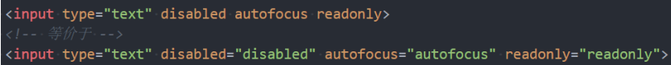

## 列表元素

- 认识列表元素
- 在开发一个网页的过程中, 很多数据都是以列表的形式存在的

### 列表的实现方式

- 事实上现在很多的列表功能采用了不同的方案来实现:
  - 方案一: 使用 div 元素来实现(比如汽车之家, 知乎上的很多列表)
  - 方案二: 使用列表元素, 使用元素语义化的方式实现;
- 事实上现在很多的网站对于列表元素没有很强烈的偏好, 更加不拘一格, 按照自己的风格来布局:
  - 原因我认为是列表元素默认的 CSS 样式, 让它用起来不是非常方便;
  - 比如列表元素往往有很多的限制, ul/ol 中只能存放 li, li 再存放其他元素;
  - 虽然我们可以通过重置来解决, 但是我们更喜欢自由的 div;
- HTML 提供了 3 组常用的用来展示列表的元素
  - 有序列表：ol、li
  - 无序列表：ul、li
  - 定义列表：dl、dt、dd
- 各种符号是存放伪元素创造出来的标记盒子中（MarkerBox）


### 有序列表 – ol – li

- ol（ordered list）
  - 有序列表，直接子元素只能是 li
- li（list item）
  - 列表中的每一项

```html
<h2>开发技能</h2>
<ol>
  <li>HTML</li>
  <li>Css</li>
  <li>JavaScript</li>
  <li>TypeScript</li>
</ol>
```

### 无序列表 – ul - li

- ul（unordered list）
  - 无序列表，直接子元素只能是 li
- li（list item）
  - 列表中的每一项

```html
<h2>开发技能</h2>
<ul>
  <li>HTML</li>
  <li>Css</li>
  <li>JavaScript</li>
  <li>TypeScript</li>
</ul>
```

### 定义列表 – dl – dt - dd

- dl（definition list）
  - 定义列表，直接子元素只能是 dt、dd
- dt（definition term）
  - 列表中每一项的项目名
- dd（definition description）
  - 列表中每一项的具体描述，是对 dt 的描述、解释、补充
  - 一个 dt 后面一般紧跟着 1 个或者多个 dd

```html
<dl>
  <dt>一</dt>
  <dd>1</dd>
  <dd>2</dd>
  <dd>3</dd>
  <dt>二</dt>
  <dd>1</dd>
  <dd>2</dd>
  <dd>3</dd>
</dl>
```

## 表格

### 表格常见的元素

- 编写表格最常见的是下面的元素:

- table
  - 表格
- tr(table row)
  - 表格中的行
- td(table data)
  - 行中的单元格
- 另外表格有很多相关的属性可以设置表格的样式, 但是已经不推荐使用了


### 表格的练习

- 通过表格元素和 CSS 完成下面的表格:


```html
<!DOCTYPE html>
<html lang="en">
  <head>
    <title>Document</title>
    <style>
      table {
        border-collapse: collapse;
      }
      th {
        text-align: center;
        border: 1px solid #999;
        padding: 8px 16px;
      }
      td {
        text-align: center;
        border: 1px solid #999;
        padding: 8px 16px;
      }
    </style>
  </head>

  <body>
    <table>
      <tr>
        <th>排名</th>
        <th>股票名称</th>
        <th>股票代码</th>
        <th>股票价格</th>
        <th>股票涨跌</th>
      </tr>
      <tr>
        <td>1</td>
        <td>贵州茅台</td>
        <td>600519</td>
        <td>1800</td>
        <td>5%</td>
      </tr>
      <tr>
        <td>2</td>
        <td>腾讯控股</td>
        <td>00700</td>
        <td>400</td>
        <td>3%</td>
      </tr>
      <tr>
        <td>3</td>
        <td>五粮液</td>
        <td>00858</td>
        <td>160</td>
        <td>8%</td>
      </tr>
      <tr>
        <td>4</td>
        <td>东方财富</td>
        <td>30059</td>
        <td>25</td>
        <td>4%</td>
      </tr>
    </table>
  </body>
</html>
```

- 这里我们需要用到一个非常重要的属性:
  - border-collapse CSS 属性是用来决定表格的边框是分开的还是合并的。
  - border-collapse: collapse;
  - 合并单元格的边框

### 表格的其他元素

- thead
  - 表格的表头
- tbody
  - 表格的主体
- tfoot
  - 表格的页脚
- caption
  - 表格的标题
- th
  - 表格的表头单元格

### 单元格合并

- 在某些特殊的情况下, 每个单元格占据的大小可能并不是固定的

  - 一个单元格可能会跨多行或者多列来使用;

- 比如下面的表格


- 这个时候我们就要使用单元格合并来完成;

### 如何使用单元格合并呢?

- 单元格合并分成两种情况:
  - 跨列合并: 使用 colspan
    - 在最左边的单元格写上 colspan 属性, 并且省略掉合并的 td;
  - 跨行合并: 使用 rowspan
    - 在最上面的单元格协商 rowspan 属性, 并且省略掉后面 tr 中的 td;


## 表单

### 常见的表单元素

- form
  - 表单, 一般情况下，其他表单相关元素都是它的后代元素
- input
  - 单行文本输入框、单选框、复选框、按钮等元素
- textarea
  - 多行文本框
- select、option
  - 下拉选择框
- button
  - 按钮
- label
  - 表单元素的标题

### input 元素的使用

- 表单元素使用最多的是 input 元素
  - input 元素有如下常见的属性:
- type：input 的类型
  - text：文本输入框（明文输入）
  - password：文本输入框（密文输入）
  - radio：单选框
  - checkbox：复选框
  - button：按钮
  - reset：重置
  - submit：提交表单数据给服务器
  - file：文件上传
  - input 元素的使用
  - readonly：只读
  - disabled：禁用
  - checked：默认被选中
    - 只有当 type 为 radio 或 checkbox 时可用
  - autofocus：当页面加载时，自动聚焦
  - name：名字
    - 在提交数据给服务器时，可用于区分数据类型
  - value：取值
- type 类型的其他取值和 input 的其他属性, 查看文档:
  - https://developer.mozilla.org/zhCN/docs/Web/HTML/Element/Input

### 布尔属性（boolean attributes）

- 常见的布尔属性有 disabled、checked、readonly、multiple、autofocus、selected
- 布尔属性可以没有属性值，写上属性名就代表使用这个属性
  - 如果要给布尔属性设值，值就是属性名本身
  - 

### 表单按钮

- 表单可以实现按钮效果:

  - 普通按钮（type=button）：使用 value 属性设置按钮文字
  - 重置按钮（type=reset）：重置它所属 form 的所有表单元素（包括 input、textarea、select）
  - 提交按钮（type=submit）：提交它所属 form 的表单数据给服务器（包括 input、textarea、select）

  

### input 和 label 的关系

- label 元素一般跟 input 配合使用，用来表示 input 的标题
- labe 可以跟某个 input 绑定，点击 label 就可以激活对应的 input 变成选中

```html
<div>
  <label for="username">用户</label>
  <input type="text" id="username" name="username" />
</div>
<div>
  <label for="password">密码</label>
  <input type="password" id="password" name="password" />
</div>
```

### radio 的使用

- 我们可以将 type 类型设置为 radio 变成单选框:
  - name 值相同的 radio 才具备单选功能

```html
<div>
  <label for="male"> 男<input type="radio" id="male" name="sex" /> </label>
</div>
<div>
  <label for="female"> 女<input type="radio" id="female" name="sex" /> </label>
</div>
```

### checkbox 的使用

- 我们可以将 type 类型设置为 checkbox 变成多选框:
  - 属于同一种类型的 checkbox，name 值要保持一致

```html
<div>
  <label for="basketball">
    篮球<input type="checkbox" id="female" name="sex" value="basketball" />
  </label>
</div>
<div>
  <label for="football">
    足球<input type="checkbox" id="male" name="hobby" value="football" />
  </label>
</div>
<div>
  <label for="run">
    跑步<input type="checkbox" id="female" name="hobby" value="run" />
  </label>
</div>
<div>
  <label for="swing">
    游泳<input type="checkbox" id="male" name="hobby" value="swing" />
  </label>
</div>
```

### textarea 的使用

- textarea 的常用属性:
  - cols：列数
  - rows：行数
- 缩放的 CSS 设置
  - 禁止缩放：resize: none;
  - 水平缩放：resize: horizontal;
  - 垂直缩放：resize: vertical;
  - 水平垂直缩放：resize: both;

### select 和 option 的使用

- option 是 select 的子元素，一个 option 代表一个选项
- select 常用属性
  - multiple：可以多选
  - size：显示多少项
- option 常用属性
  - selected：默认被选中

### form 常见的属性

- form 通常作为表单元素的父元素:
  - form 可以将整个表单作为一个整体来进行操作;
  - 比如对整个表单进行重置;
  - 比如对整个表单的数据进行提交;
- form 常见的属性如下:
- action
  - 用于提交表单数据的请求 URL
- method
  - 请求方法（get 和 post），默认是 get
- target
  - 在什么地方打开 URL（参考 a 元素的 target）

### 请求方式对比


