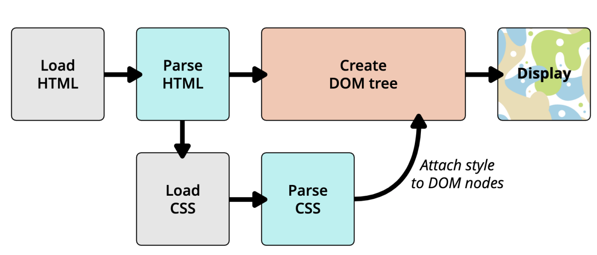
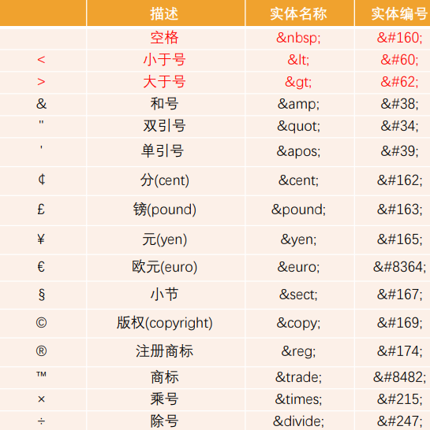
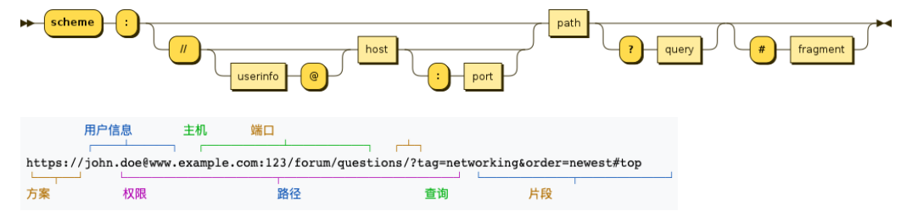
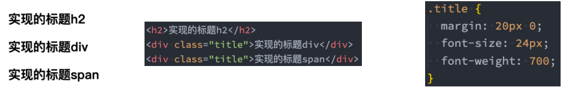
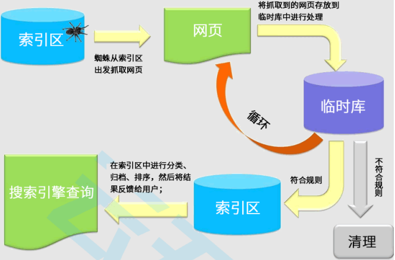
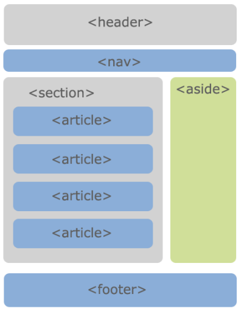
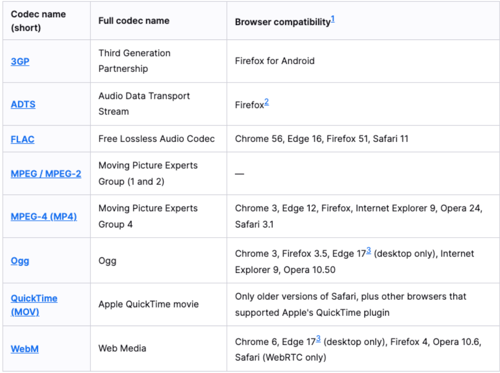
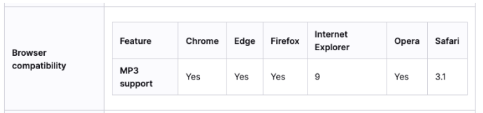

## Chrome 调试工具

- 打开 Chrome 调试工具：
  - 方式一：右键 – 检查
  - 方式二：快捷键 – F12
- 其他技巧：
  - 快捷键：ctrl+ 可以调整页面或者调试工具的字体大小；
  - 可以通过删除某些元素来查看网页结构;
  - 可以通过增删 css 来调试网页样式;

## 浏览器渲染流程



1. 首先获取到浏览器数据加载 HTML，渲染出 DOM 树结构
2. 然后加载 CSS 数据，渲染形成 CSS 树结构
3. 结合 DOM 树和 CSS 树结构，生成 Render 树
4. 最后渲染出界面

## 注释编写

### 为什么需要注释

- 程序员才懂的冷笑话:

  - 在我写这段代码的时候, 只有我和上帝知道这段代码是什么意思.

  - 一段时间之后, 只有上帝知道是什么意思了.

    

- 为什么会出现这样的情况呢?

  - 随着学习的深入, 你的一个程序不再是几行代码就可以搞定的了.
  - 可能我们需要写出有上千行, 甚至上万行的程序.
  - 某些代码完成某个功能后, 你写的时候思路很清晰, 但是过段时间会出现忘记为什 么这样写的情况, 这很正常

- 和同时协同开发

  - 在实际工作中, 一个项目通常是多人协作完成的. 可能是几个或者十几个等等.
  - 这个时候, 你可能需要使用别人写出的代码功能, 别人也可能使用你的代码功能.
  - 如果你的代码自己都看不懂了, 更何况你的同事呢?

### HTML 的注释

- 什么是注释？

  - 简单来说，注释就是一段代码说明

  - ```html
    <!-- 注释内容 -->
    ```

  - 注释是只给开发者看的，浏览器并不会把注释显示给用户看

- 注释的意义:

  - 帮助我们自己理清代码的思路, 方便以后进行查阅
  - 与别人合作开发时, 添加注释, 可以减少沟通成本.(同事之间分模块开发)
  - 开发自己的框架时, 加入适当的注释, 方便别人使用和学习.(开源精神)
  - 可以临时注释掉一段代码, 方便调试

- 注释快捷键：ctrl + /

## HTML 全局属性

- 我们发现某些属性只能设置在特定的元素中：
  - 比如 img 元素的 src、a 元素的 href；
- 也有一些属性是所有 HTML 都可以设置和拥有的，这样的属性我们称之为 “全局属性（Global Attributes）”
  - 全局属性有很多：https://developer.mozilla.org/zh-CN/docs/Web/HTML/Global_attributes
- 常见的全局属性如下：
  - id：定义唯一标识符（ID），该标识符在整个文档中必须是唯一的。其目的是在链接（使用片段标识符），脚本或样式（使用 CSS）时标识元素。
  - class：一个以空格分隔的元素的类名（classes ）列表，它允许 CSS 和 Javascript 通过类选择器或者 DOM 方法来选择和访问特定的元素；
  - style：给元素添加内联样式；
  - title：包含表示与其所属元素相关信息的文本。 这些信息通常可以作为提示呈现给用户，但不是必须的。
  - **在设置 css 时，style > id > class**

## 字符实体

### 什么是字符实体

- 思考：我们编写的 HTML 代码会被浏览器解析。

- 如下代码是如何被解析的呢？

  - 如果你使用小于号（<），浏览器会将其后的文本解析为一个 tag。

  - 但是某些情况下，我们确实需要编写一个小于号（<）；

  - 这个时候我们就可以使用字符实体；

    ```html
    <span>hehehe</span>
    ```

- HTML 实体是一段以连字号（&）开头、以分号（;）结尾的文本（字符串）：

  - 实体常常用于显示保留字符（这些字符会被解析为 HTML 代码）和不可见的字符（如“不换行空格”）；
  - 你也可以用实体来代替其他难以用标准键盘键入的字符；

  ```html
  <span>&lt;hehehe&lt;</span>
  ```

### 常见的字符实体



## URL 地址

### 认识 URL

- URL 代表着是统一资源定位符（Uniform Resource Locator）

- 通俗点说：URL 无非就是一个给定的独特资源在 Web 上的地址。

  - 理论上说，每个有效的 URL 都指向一个唯一的资源；
  - 这个资源可以是一个 HTML 页面，一个 CSS 文档，一幅图像，等等；

  

### url 的格式

- URL 的标准格式如下：

  - ```
    URL的格式 [协议类型]://[服务器地址]:[端口号]/[文件路径][文件名]?[查询]#[片段ID]
    ```



### URL 和 URI 的区别

- 区别：

  - URI = Uniform Resource Identifier 统一资源标志符，用于标识 Web 技术使用的逻辑或物理资源。；

  - URL = Uniform Resource Locator 统一资源定位符，俗称网络地址，相当于网络中的门牌号；

- URI 在某一个规则下能把一个资源独一无二的识别出来。
  - URL 作为一个网络 Web 资源的地址，可以唯一将一个资源识别出来，所以 URL 是一个 URI；
  - 所以 URL 是 URI 的一个子集；
  - 但是 URI 并不一定是 URL
- locators are also identifiers, so every URL is also a URI, but there are URIs which are not URLs.

## 元素语义化

- 元素的语义化：用正确的元素做正确的事情。

- 理论上来说，所有的 HTML 元素，我们都能实现相同的事情： 、

  

- 标签语义化的好处

  - 方便代码维护；
  - 减少让开发者之间的沟通成本；
  - 能让语音合成工具正确识别网页元素的用途，以便作出正确的反应；
  - 有利于 SEO；
  - ......

## SEO 优化

### 什么是 SEO

- 搜索引擎优化（英语：search engine optimization，缩写为 SEO）是通过了解搜索引擎的运作规则来调整网站，以及提高网站 在有关搜索引擎内排名的方式。

  

- 在后续我们还会讲解 SPA 以及 SSR 相关的概念

  - 它们也有 SEO、首屏渲染速度有关；
  - 到时候会具体补充

## 字符编码

- 计算机是干什么的?

  - 计算机一开始发明出来时是用来解决数字计算问题的，后来人们发现，计算机还可以做更多的事，例如文本处理。
  - 但计算机其实挺笨的，它只“认识”010110111000…这样由 0 和 1 两个数字组成的二进制数字；
  - 这是因为计算机的底层硬件实现就是用电路的开和闭两种状态来表示 0 和 1 两个数字的。
  - 因此，计算机只可以直接存储和处理二进制数字。

- 为了在计算机上也能表示、存储和处理像文字、符号等等之类的字符，就必须将这些字符转换成二进制数字。

  - 当然，肯定不是我们想怎么转换就怎么转换，否则就会造成同一段二进制数字在不同计算机上显示出来的字符不一样的情况， 因此必须得定一个统一的、标准的转换规则

  

- 字符编码的发展历史可以阅读我的简书一篇文章：https://www.jianshu.com/p/899e749be47c

## Emmet 语法

### 认识 emmet 语法

- Emmet (前身为 Zen Coding) 是一个能大幅度提高前端开发效率的一个工具.

  - 在前端开发的过程中，一大部分的工作是写 HTML、CSS 代码, 如果手动来编写效果会非常低.
  - VsCode 内置了 Emmet 语法,在后缀为.html/.css 中输入缩写后按 Tab/Enter 键即会自动生成相应代码

- !和 html:5 可以快速生成完整结构的 html5 代码

```html
<!DOCTYPE html>
<html lang="en">
  <head>
    <meta charset="UTF-8" />
    <meta http-equiv="X-UA-Compatible" content="IE=edge" />
    <meta name="viewport" content="width=device-width, initial-scale=1.0" />
    <title>Document</title>
    <link rel="stylesheet" href="./index.css" />
  </head>

  <body></body>
</html>
```

### >（子代）和+（兄弟）

```html
<!-- div>ul>li-->
<div>
  <ul>
    <li></li>
  </ul>
</div>

<!-- div+div>p>span+i-->
<div></div>
<div>
  <p>
    <span></span>
    <i></i>
  </p>
</div>

<!-- div+p+ul>li-->
<div></div>
<p></p>
<ul>
  <li></li>
</ul>
```

### \*(多个)和^（上一级）

```html
<!-- ul>li*5-->
<ul>
  <li></li>
  <li></li>
  <li></li>
  <li></li>
  <li></li>
</ul>

<!-- div+div>p>span^h1-->
<div></div>
<div>
  <p><span></span></p>
  <h1></h1>
</div>

<!-- div+div>p>span^^^^h1-->
<div></div>
<div>
  <p><span></span></p>
</div>
<h1></h1>
```

### ()（分组）

```html
<!-- div>(header>ul>li*2>a)+footer>p-->
<div>
  <header>
    <ul>
      <li><a href=""></a></li>
      <li><a href=""></a></li>
    </ul>
  </header>
  <footer>
    <p></p>
  </footer>
</div>
```

### 属性(id 属性、class 属性、普通属性) {}（内容）

```html
<!-- div#header+div#main>.container>a[href]-->
<div id="header"></div>
<div id="main">
  <div class="container"><a href=""></a></div>
</div>

<!-- a[href="http://www.baidu.com"]{百度一下}-->
<a href="http://www.baidu.com">百度一下</a>
```

### $（数字）

```html
<!-- ul>li.item$*5-->
<ul>
  <li class="item1"></li>
  <li class="item2"></li>
  <li class="item3"></li>
  <li class="item4"></li>
  <li class="item5"></li>
</ul>
```

### 隐式标签

```html
<!-- 
	<div>
		.box+.container
	</div>
-->
<div>
  <div class="box"></div>
  <div class="container"></div>
</div>

<!-- ul>.item*3-->

<ul>
  <li class="item"></li>
  <li class="item"></li>
  <li class="item"></li>
</ul>
```

### CSS Emmet

```css
/* w100 */
width: 100px;

/* w20+h30+m40+p50 */
width: 20px;
height: 30px;
margin: 40px;
padding: 50px;

/* m20-30-40-50 */
margin: 20px 30px 40px 50px;

/* dib */
display: inline-block;

/* bd1#cs */
border: 1px #ccc solid;
```

## HTML 5 语义化元素

- 在 HMTL5 之前，我们的网站分布层级通常包括哪些部分呢？
- header、nav、main、footer
- 但是这样做有一个弊端：
- 我们往往过多的使用 div, 通过 id 或 class 来区分元素；
- 对于浏览器来说这些元素不够语义化；
- 对于搜索引擎来说, 不利于 SEO 的优化；
- HTML5 新增了语义化的元素：
- 头部元素 header
- 导航元素 nav
- 定义文档某个区域的元素 section
- 内容元素 article
- 侧边栏元素 aside
- 尾部元素 footer



## HTML5 其他新增元素

- Web 端事实上一直希望可以更好的嵌入音频和视频, 特别是 21 世纪以来, 用户带宽的不断提高, 浏览器因为和视频变得非常容易.
  - 在 HTML5 之前是通过 flash 或者其他插件实现的, 但是会有很多问题;
  - 比如无法很好的支持 HTML/CSS 特性, 兼容性问题等等;
- HTML5 增加了对媒体类型的支持：
  - 音频：audio
  - 视频：video
- Video 和 Audio 使用方式有两个：
  - 一方面我们可以直接通过元素使用 video 和 autio；
  - 另一方面我们可以通过 JavaScript 的 API 对其进行控制；

## HTML5 新增元素-video

- HTML video 元素 用于在 HTML 或者 XHTML 文档中嵌入媒体播放器，用于支持文档内的视频播放。

  ```html
  <video src="../video/fcrs.mp4" controls></video>
  ```

- video 常见的属性:

  | 常见属性 | 值的方式           | 属性的作用                                                     |
  | -------- | ------------------ | -------------------------------------------------------------- |
  | src      | URL 地址           | 视频播放的 URL 地址                                            |
  | width    | pixels(像素)       | 设置 Video 的宽度                                              |
  | height   | pixels(像素)       | 设置 Video 的高度                                              |
  | controls | Boolean 类型       | 是否显示控制栏，包含音量、跨帧、暂停、播放                     |
  | autoplay | Boolean 类型       | 视频是否自动播放（默写浏览器需要添加 muted、比如 Chrome）      |
  | muted    | Boolean 类型       | 是否静音播放                                                   |
  | preload  | none/metadata/auto | 是否需要预加载视频.metadata 表示预加载元数据（比如视频时长等） |
  | poster   | URL 地址           | 预览图的 URL                                                   |

### video 支持的视频格式

- 每个视频都会有自己的格式, 浏览器的 video 并非支持所有的视频格式



### video 的兼容性写法

- 在 video 元素中间的内容，是针对浏览器不支持此元素时候的降级处理。

  - 内容一：通过 source 元素指定更多视频格式的源;
  - 内容二：通过 p/div 等元素指定在浏览器不支持 video 元素的情况, 显示的内容;

  ```html
  <video src="../vodeo/fcrs.mp4" controls width="500" autoplay muted>
    <source src="./vodeo/fcrs.webm" />
    <p>你的浏览器不支持HTML5的video元素，请更换浏览器观看</p>
  </video>
  ```

## HTML5 新增元素 - audio

- HTML audio 元素用于在文档中嵌入音频内容, 和 video 的用法非常类似
- 常见属性:

| 常见属性 | 值得方式           | 属性作用                                                |
| -------- | ------------------ | ------------------------------------------------------- |
| src      | URL 地址           | 音频播放的 URL 地址                                     |
| controls | Boolean 类型       | 是否显示控制栏,包括音量，进度，暂停/恢复播放。          |
| autoplay | Boolean 类型       | 是否视频自动播放(某些浏览器需要添加 muted, 比如 Chrome) |
| muted    | Boolean 类型       | 是否静音播放                                            |
| preload  | none/metadata/auto | 是否需要预加载视频. metadata 表示预加载元数据比如视频   |

### audio 支持的音频格式

- 每个音频都会有自己的格式, 浏览器的 audio 并非支持所有的视频格式

- 具体的支持的格式可以通过下面的链接查看:

  - https://developer.mozilla.org/en-US/docs/Web/Media/Formats/Audio_codecs

    

- 在 audio 元素中间的内容，是针对浏览器不支持此元素时候的降级处理。

  ```html
  <audio src="../media/yhbk.mp4" controls autoplay muted>
    <source src="./media/yhbk.ogg" />
    <p>你的浏览器不支持HTML5的video元素，请更换浏览器观看</p>
  </audio>
  ```

## input 元素的扩展内容

- HTML5 对 input 元素也进行了扩展，在之前我们已经学习过的其中几个属性也是 HTML5 的特性：
  - placeholder：输入框的占位文字
  - multiple：多个值
  - autofocus：最多输入的内容
- 另外对于 input 的 type 值也有很多扩展：
  - date
  - time
  - number
  - tel
  - color
  - email
  - 等等…
- 查看 MDN 文档:
  - https://developer.mozilla.org/zh-CN/docs/Web/HTML/Element/Input

## 新增全局属性 data-\*

- 在 HTML5 中, 新增一种全局属性的格式 data-\*, 用于自定义数据属性:

  - data 设置的属性可以在 JavaScript 的 DOM 操作中通过 dataset 轻松获取到；
  - 通常用于 HTML 和 JavaScript 数据之间的传递；

  ```html
  <div class="box" title="abc" data-name="mjjh" data-age="18">box</div>

  <script>
    const bpxEl = document.querySelsctor(".box");
    console.log(boxEl.dataset);
  </script>
  ```

- 在小程序中, 就是通过 data-来传递数据的, 所以该全局属性必须要掌握.

## 浏览器前缀

- 有时候可能会看到有些 CSS 属性名前面带有：-o-、-xv-、-ms-、mso-、-moz-、-webkit-

  ```css
  -o-transform: translate(100px);
  -ms-transform: translate(100px);
  -webkit-transform: translate(100px);
  -moz-transform: translate(100px);
  ```

- 官方文档专业术语叫做：vendor-specific extensions（供应商特定扩展）

- 为什么需要浏览器前缀了？

  - CSS 属性刚开始并没有成为标准，浏览器为了防止后续会修改名字给新的属性添加了浏览器前缀；

- 上述前缀叫做浏览器私有前缀，只有对应的浏览器才能解析使用

  - -o-、-xv-：Opera 等
  - -ms-、mso-：IE 等
  - -moz-：Firefox 等
  - -webkit-：Safari、Chrome 等

- 注意：不需要手动添加，后面学习了模块化打包工具会自动添加浏览器前缀

## 媒体查询

- 媒体查询是一种提供给开发者针对不同设备需求进行定制化开发的一个接口。

- 你可以根据设备的类型（比如屏幕设备、打印机设备）或者特定的特性（比如屏幕的宽度）来修改你的页面。

- 媒体查询的使用方式主要有三种：

  - 方式一：通过@media 和@import 使用不同的 CSS 规则（常用）；

    ```html
    <style>
      @import url(./css/minScreen.css) (max-width: 600px);
    </style>
    ```

  - 方式二：使用 media 属性为 style , link , source 和其他 HTML 元素指定特定的媒体类型；

    ```html
    <link
      rel="stylesheet"
      media="(max-width: 600px)"
      href="./css/miniScreen.css"
    />
    ```

  - 方式三：使用 Window.matchMedia() 和 MediaQueryList.addListener() 方法来测试和监控媒体状态；

- 比较常用的是通过@media 来使用不同的 CSS 规则，目前掌握这个即可；

### 媒体查询 - 媒体类型（Media types）

- 在使用媒体查询时，你必须指定要使用的媒体类型。
  - 媒体类型是可选的，并且会（隐式地）应用 all 类型。
- 常见的媒体类型值如下：
  - all：适用于所有设备。
  - print：适用于在打印预览模式下在屏幕上查看的分页材料和文档。
  - screen（掌握）：主要用于屏幕。
  - speech：主要用于语音合成器。
- 被废弃的媒体类型：
  - CSS2.1 和 Media Queries 3 定义了一些额外的媒体类型(tty, tv, projection, handheld, braille, embossed, 以及 aural)；
  - 但是他们在 Media Queries 4 中已经被废弃，并且不应该被使用；
  - aural 类型被替换为具有相似效果的 speech。

### 媒体查询 – 媒体特性（Media features）

- 媒体特性（Media features）描述了 浏览器、输出设备，或是预览环境的具体特征；
  - 通常会将媒体特性描述为一个表达式；
  - 每条媒体特性表达式都必须用括号括起来；

| 特征                         | 价值                    | 最大/最小 | 描述               |
| ---------------------------- | ----------------------- | --------- | ------------------ |
| 宽度 width                   | 长度                    | 是        | 渲染表面的宽度     |
| 高度 height                  | 长度                    | 是        | 渲染表面的高度     |
| 颜色 color                   | 整数                    | 是        | 每个颜色分量的位数 |
| 设备比例 device-aspect-ratio | 整数/整数               | 是        | 长宽比             |
| 设备高度 device-width        | 长度                    | 是        | 输出设备的高度     |
| 设备宽度 device-height       | 长度                    | 是        | 输出设备的高度     |
| 方向 orientation             | “portrait”或“landscape” | 否        | 屏幕方向           |
| 分辨率 resolution            | 分辨率                  | 是        | 屏幕方向           |

### 媒体查询 – 逻辑操作符（logical operators）

- 媒体查询的表达式最终会获得一个 Boolean 值，也就是真（true）或者假（false）。

  - 如果结果为真（true），那么就会生效；
  - 如果结果为假（false），那么就不会生效；

- 如果有多个条件，我们可以通过逻辑操作符联合复杂的媒体查询：

  - and：and 操作符用于将多个媒体查询规则组合成单条媒体查询
  - not：not 运算符用于否定媒体查询，如果不满足这个条件则返回 true，否则返回 false。
  - only：only 运算符仅在整个查询匹配时才用于应用样式。
  - , (逗号)：逗号用于将多个媒体查询合并为一个规则。

- 比如下面的媒体查询，表示：屏幕宽度大于 500，小于 700 的时候，body 背景颜色为红色；

  ```css
  @media screen and (min-width: 500px) and (max-width: 700px) {
    body {
      background-color: #f00;
    }
  }
  ```
