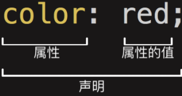
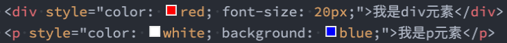
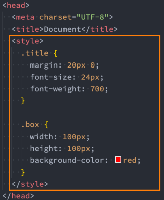
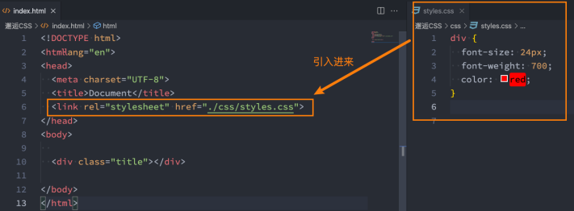
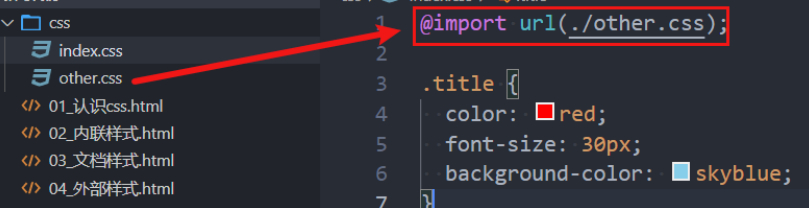

## 编写 css 样式

- CSS 这么重要，那么它的语法规则是怎么样的呢？

  

- 声明（Declaration）一个单独的 CSS 规则，如 color: red; 用来指定添加的 CSS 样式。

  - 属性名（Property name）：要添加的 css 规则的名称；
  - 属性值（Property value）：要添加的 css 规则的值；

### 如何将 CSS 样式应用到元素上？

- CSS 提供了 3 种方法，可以将 CSS 样式应用到元素上：
  - 内联样式（inline style）
  - 内部样式表（internal style sheet）、文档样式表（document style sheet）、内嵌样式表（embed style sheet）
  - 外部样式表（external style sheet）
- 三种方式，学好哪一个呢？ 每一个都很重要，目前开发中不同的场景都会用到

### 内联样式（inline style）

- 内联样式（inline style），也有人翻译成行内样式。

  - 内联样式表存在于 HTML 元素的 style 属性之中。

    

- CSS 样式之间用分号;隔开，建议每条 CSS 样式后面都加上分号;

- 很多资料不推荐这种写法：

  - 在原生的 HTML 编写过程中确实这种写法是不推荐的
  - 在 Vue 的 template 中某些动态的样式是会使用内联样式的；

- 所以，内联样式的写法依然需要掌握。

### 内部样式表（internal style sheet）

- 内部样式表（internal style sheet） 将 CSS 放再 HTML 文件 **head** 元素里的 **style**元素之中

  

- 在 Vue 的开发过程中，每个组件也会有一个 style 元素，和内部样式表非常的相似（原理并不相同）；

### 外部样式表（external style sheet）

- 外部样式表（external style sheet） 是将 css 编写一个独立的文件中，并且通过元素引入进来；

- 使用外部样式表主要分成两个步骤：

  - 第一步：将 css 样式在一个独立的 css 文件中编写（后缀名为.css）；

  - 第二步：通过元素引入进来；

    

- link 元素的作用，后续单独讲解。

### @import

- 可以在 style 元素或者 CSS 文件中使用@import 导入其他的 CSS 文件

  
