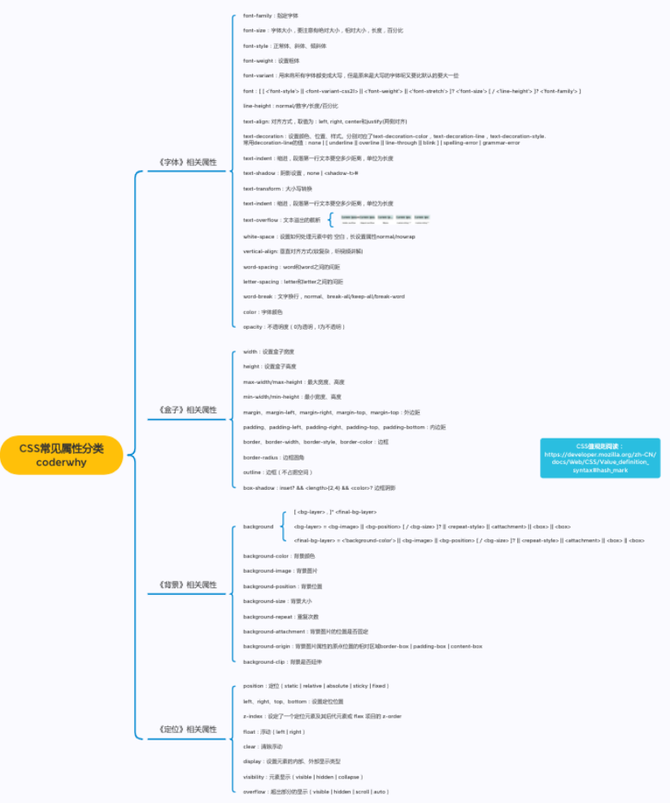
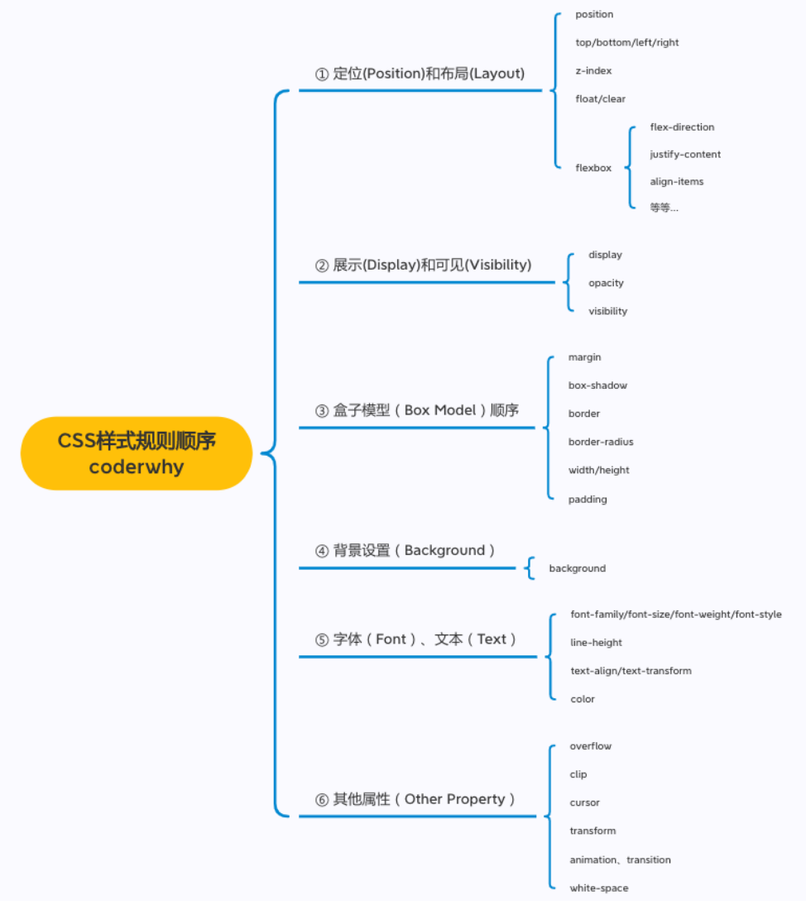

## css 属性

### 常见的 CSS 属性

### 必须掌握的 CSS 属性

- 在开发中 90+%的时间写的都是这些属性；

- 不要小看这几个 CSS 属性，里面涉及到的概念是非常多的；

- 你必须了解 CSS 的很多特性，才能真正理解里面的每个属 性；

- 并且在遇到一些问题的时候知道如何去调试

  

### CSS 官方文档地址

- CSS 官方文档地址 https://www.w3.org/TR/?tag=css
- CSS 推荐文档地址： https://developer.mozilla.org/zhCN/docs/Web/CSS/Reference#%E5%85%B3%E9%94%AE%E5%AD%97%E7%B4%A2%E5%BC%95
- 由于浏览器版本、CSS 版本等问题，查询某些 CSS 是否可用：
- 可以到https://caniuse.com/查询CSS属性的可用性；
- 这个网站在后续的 browserlist 工具中我们再详细说明；

### 目前需要掌握的 CSS 属性

- font-size：文字大小
- color：前景色（文字颜色）
- background-color：背景色
- width ：宽度
- height：高度

### CSS 属性-background-color

- background-color 决定背景色

### CSS 属性-color

- color 属性用来设置文本内容的前景色
- 包括文字、装饰线、边框、外轮廓等的颜色
