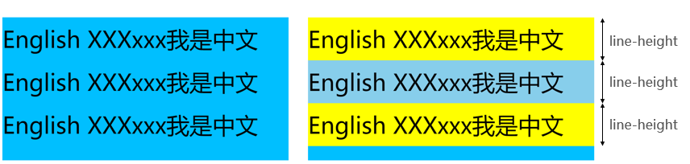
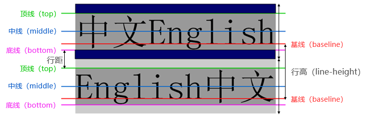
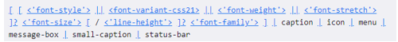

## font-size

- **font-size\*\***决定文字的大小\*\*
- 常用的设置
  - 具体数值+单位
  - 比如 100px
  - 也可以使用 em 单位(不推荐)：1em 代表 100%，2em 代表 200%，0.5em 代表 50%
- 百分比
  - 基于父元素的 font-size 计算，比如 50%表示等于父元素 font-size 的一半

## font-family

- font-family 用于设置**文字的字体名称**
  - 可以设置 1 个或者多个字体名称。
  - 浏览器会选择列表中第一个该计算机上有安装的字体。
  - 或者是通过 @font-face 指定的可以直接下载的字体。
- 热知识：微软雅黑是商用字体

## font-weight

- **font-weight**用于设置文字的粗细（重量）
- **常见的取值**
  - 100 | 200 | 300 | 400 | 500 | 600 | 700 | 800 | 900 ：每一个数字表示一个重量
  - 0 和 1000 也可以取到，但是 0=400 大小，1000=900 大小
  - normal：等于 400
  - bold：等于 700
- strong、b、h1~h6 等标签的 font-weight 默认就是 bold

## font-style

- **font-style**用于设置文字的常规、斜体显示
  - normal：常规显示
  - italic(斜体)：用字体的斜体显示(通常会有专门的字体)
  - oblique(倾斜)：文本倾斜显示(仅仅是让文字倾斜)
- em、i、cite、address、var、dfn 等元素的 font-style 默认就是 italic

## font-variant

- **font-variant**可以影响小写字母的显示形式
  - variant 是变形的意思;
- **可以设置的值如下**
  - normal：常规显示 height 的基本理解
  - small-caps：将小写字母替换为缩小过的大写字母

## line-height

### line-height 的基本理解

- line-height 用于设置文本的行高

  - 行高可以先简单理解为一行文字所占据的高度 ；

    

### line-height 详解

- 行高的严格定义是：**两行文字基线（baseline）之间的间距**

- 基线（baseline）：与小写字母**x**最底部对齐的线

  

### line-height 和 height

- 注意区分**height**和**line-height**的区别

  - height：元素的整体高度
  - line-height：元素中每一行文字所占据的高度

- 应用实例：假设 div 中只有一行文字，如何让这行文字在 div 内部垂直居中

  - 让 line-height 等同于 height

    

## font 缩写属性

- **font**是一个缩写属性

  - font 属性可以用来作为 font-style, font-variant, font-weight, font-size, line-height 和 font-family 属性的简写;
  - font-style font-variant font-weight font-size/line-height font-family

- 规则

  - font-style、font-variant、font-weight 可以随意调换顺序，也可以省略

  - line-height 可以省略，如果不省略，必须跟在 font-size 后面

  - font-size、font-family 不可以调换顺序，不可以省略

    
