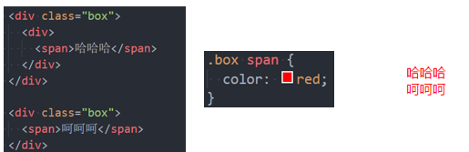
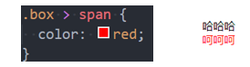
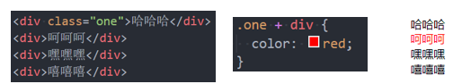
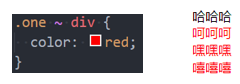
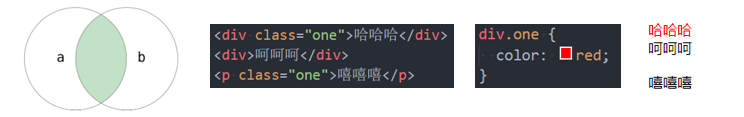
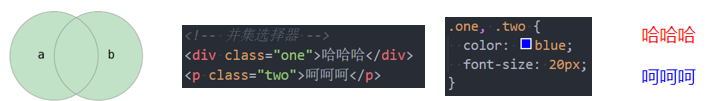
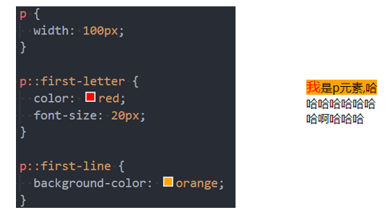
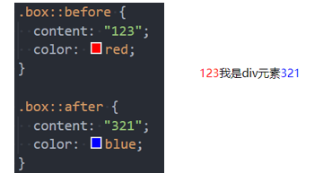
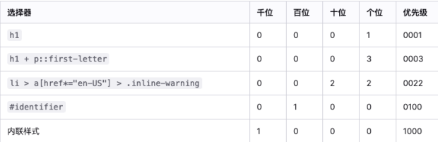

## css选择器（selector）

- 开发中经常需要找到**特定的网页元素进行设置样式**
  - 思考：如何找到特定的那个元素？
- 什么是**CSS**选择器
  - 按照一定的规则选出符合条件的元素，为之添加CSS样式
- 选择器的种类繁多，大概可以这么归类
  - 通用选择器（universal selector）
  - 元素选择器（type selectors）
  - 类选择器（class selectors）
  - id选择器（id selectors）
  - 属性选择器（attribute selectors）
  - 组合（combinators）
  - 伪类（pseudo-classes）
  - 伪元素（pseudo-elements）

## 通用选择器（universal selector）

```
* {

}
```

- 所有的元素都会被选中
- 一般来给所有元素做一些通用性的设置
  - 比如内边距，外边距
  - 重置浏览器生成的默认属性
- 效率比较低，尽量不要使用

## 简单选择器

### 元素选择器（type selectors）

使用元素的名称

```
h2 {

}
div ...
```

### 类选择器（class selectors）

使用元素的类名

```
.类名 {

}
```

### id选择器（id selectors）

使用元素的id

```
#id {

}
```

- 一个HTML文档里面的id值**是唯一的，不能重复**
  - id值如果由多个单词组成，单词之间可以用中划线-、下划线_连接，也可以使用驼峰标识
  - 最好不要用标签名作为id值
- 中划线又叫连字符（hyphen）

## 属性选择器（attribute selectors）(了解)

- 拥有某一个属性 [att]

- 属性等于某个值[att=val]

  - [attr*=val] 属性值包含某一个值val;
  - [attr^=val] 属性值以val开头;
  - [attr$=val] 属性值以val结尾;
  - [attr|=val] 属性值等于val或者以val开头后面紧跟连接符-;
  - [attr~=val] 属性值包含val, 如果有其他值必须以空格和val分割;

## 后代选择器（descendant combinator）

- 后代选择器一:所有的后代(直接/间接的后代)

  - 选择器之间以空格分割

    

- 后代选择器二: 直接子代选择器(必须是直接自带)

  - 选择器之间以 > 分割;

    

## 兄弟选择器（sibling combinator）

- 兄弟选择器一:相邻兄弟选择器 

  - 使用符号 + 连接

    

- 兄弟选择器二: 普遍兄弟选择器 ~

  - 使用符号 ~ 连接

    

- 兄弟选择器只能向下选择

## 选择器组-组合（combinators）

- 交集选择器: 需要同时符合两个选择器条件(两个选择器紧密连接)

  - 在开发中通常为了精准的选择某一个元素;

  

- 并集选择器: 符合一个选择器条件即可(两个选择器以,号分割)

  - 在开发中通常为了给多个元素设置相同的样式;

    

## 伪类（pseudo-classes）

### 初识伪类

- 什么是伪类呢?

  - Pseudo-classes: 翻译过来是伪类;
  - 伪类是选择器的一种，它用于选择处于特定状态的元素;
  - 伪类没有构造出新的元素

- 比如我们经常会实现的: 当手指放在一个元素上时, 显示另外一个颜色;

  ```
  div :hover  {
  	color: red
  }
  ```

### 常见的伪类

- 常见的伪类有
  1. 动态伪类（dynamic pseudo-classes）
     - :link、:visited、:hover、:active、:focus
  2. 目标伪类（target pseudo-classes）
     - :target
  3. 语言伪类（language pseudo-classes）
     - :lang( )
  4. 元素状态伪类（UI element states pseudo-classes）
     - :enabled、:disabled、:checked
  5. 5.结构伪类（structural pseudo-classes）(后续学习)
     - :nth-child( )、:nth-last-child( )、:nth-of-type( )、:nth-last-of-type( )
     - :first-child、:last-child、:first-of-type、:last-of-type
     - :root、:only-child、:only-of-type、:empty
  6. 否定伪类（negation pseudo-classes）(后续学习)
     - :not()
- 所有的伪类: https://developer.mozilla.org/zh-CN/docs/Web/CSS/Pseudo-classes

### 动态伪类（dynamic pseudo-classes）

- 使用举例
  - a:link 未访问的链接
  - a:visited 已访问的链接
  - a:hover 鼠标挪动到链接上(重要)
  - a:active 激活的链接（鼠标在链接上长按住未松开）
  - :focus指当前拥有输入焦点的元素（能接收键盘输入 tab选中）文本输入框一聚焦后，背景就会变红色
- 使用注意
  - :hover必须放在:link和:visited后面才能完全生效
  - :active必须放在:hover后面才能完全生效
  - 所以建议的编写顺序是 :link、:visited、:focus、:hover、:active
- 除了a元素，:hover、:active也能用在其他元素上
- 直接给a元素设置样式，相当于给a元素的所有动态伪类都设置了
  - 相当于a:link、a:visited、a:hover、a:active、a:focus的color都是red

### 结构伪类 - :nth-child

- :nth-child(1)
  - 是父元素中的第1个子元素
- :nth-child(2n)
  - n代表任意正整数和0
  - 是父元素中的第偶数个子元素（第2、4、6、8......个）
  - 跟:nth-child(even)同义
- :nth-child(2n + 1)
  - n代表任意正整数和0
  - 是父元素中的第奇数个子元素（第1、3、5、7......个）
  - 跟:nth-child(odd)同义
- nth-child(-n + 2)
  - 代表前2个子元素

### 结构伪类 - :nth-last-child( )

- :nth-last-child()的语法跟:nth-child()类似，不同点是:nth-last-child()从最后一个子元素开始往前计数
  - :nth-last-child(1)，代表倒数第一个子元素
  - :nth-last-child(-n + 2)，代表最后2个子元素
- :nth-of-type()用法跟:nth-child()类似
  - 不同点是:nth-of-type()计数时只计算同种类型的元素
- :nth-last-of-type()用法跟:nth-of-type()类似
  - 不同点是:nth-last-of-type()从最后一个这种类型的子元素开始往前计数

### 结构伪类 - :nth-of-type( )、:nth-last-of-type( )

- 其他常见的伪类(了解): 

  - :first-child，等同于:nth-child(1)
  - :last-child，等同于:nth-last-child(1)
  - :first-of-type，等同于:nth-of-type(1)
  - :last-of-type，等同于:nth-last-of-type(1)
  - :only-child，是父元素中唯一的子元素
  - :only-of-type，是父元素中唯一的这种类型的子元素
- 下面的伪类偶尔会使用:
  - :root，根元素，就是HTML元素
  - :empty代表里面完全空白的元素

### 否定伪类（negation pseudo-class)

- :not()的格式是:not(x)
  - x是一个简单选择器
  - 元素选择器、通用选择器、属性选择器、类选择器、id选择器、伪类（除否定伪类）
- :not(x)表示除x以外的元素

## 伪元素（pseudo-elements）

- 常用的伪元素有
  - :first-line、::first-line
  - :first-letter、::first-letter 
  - :before、::before
  - :after、::after
- 为了区分伪元素和伪类，建议伪元素使用2个冒号，比如::first-line

### 伪元素 - ::first-line - ::first-letter(了解)

- ::first-line可以针对首行文本设置属性
- ::first-letter可以针对首字母设置属性



### 伪元素 - ::before和::after(常用)

- ::before和::after用来在一个元素的内容之前或之后插入其他内容（可以是文字、图片)

  - 常通过 content 属性来为一个元素添加修饰性的内容。
  - 常用于绘制一些边框，图像等属性

  

## 选择器的权重

- 按照经验，为了方便比较CSS属性的优先级，可以给CSS属性所处的环境定义一个权值（权重）

  - !important：10000
  - 内联样式：1000
  - id选择器：100
  - 类选择器、属性选择器、伪类：10
  - 元素选择器、伪元素：1
  - 通配符：0

- 多层选择器的情况下，选择器权重是相加的关系

  


