## 认识盒子模型

### 生活中得盒子模型

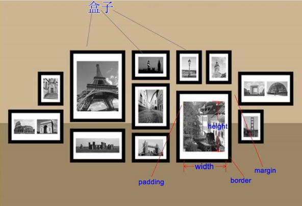

### HTML 中每个元素都是盒子模型

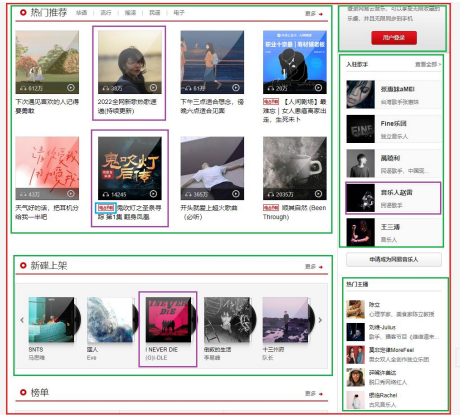

### 盒子模型（Box Model）

- HTML 中的每一个元素都可以看做是一个盒子，如右下图所示，可以具备这 4 个属性

- 内容（content）

  - 元素的内容 width/height

- 内边距（padding）

  - 元素和内容之间的间距

- 边框（border）

  - 元素自己的边框

- 外边距（margin）

  - 元素和其他元素之间的间距

  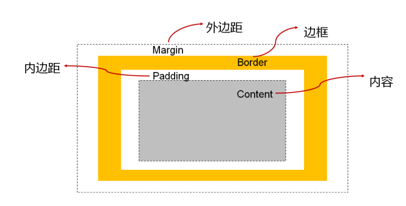

### 盒子模型的四边

- 因为盒子有四边, 所以 margin/padding/border 都包括 top/right/bottom/left 四个边

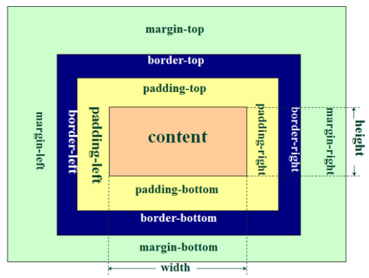

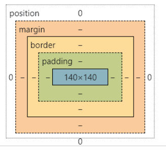

## 内容 width/height

- 设置内容是通过宽度和高度设置的:
  - 宽度设置: width
  - 高度设置: height
- 注意: 对于行内级非替换元素来说, 设置宽高是无效的!
- 另外我们还可以设置如下属性:
  - min-width：最小宽度，无论内容多少，宽度都大于或等于 min-width
  - max-width：最大宽度，无论内容多少，宽度都小于或等于 max-width
  - **移动端适配时, 可以设置最大宽度和最小宽度;**
- 下面两个属性不常用:
  - min-height：最小高度，无论内容多少，高度都大于或等于 min-height
  - max-height：最大高度，无论内容多少，高度都小于或等于 max-height

## 内边距 padding

- padding 属性用于设置盒子的内边距, 通常用于设置边框和内容之间的间距;
- padding 包括四个方向, 所以有如下的取值:
  - padding-top：上内边距
  - padding-right：右内边距
  - padding-bottom：下内边距
  - padding-left：左内边距
- padding 单独编写是一个缩写属性：
  - padding-top、padding-right、padding-bottom、padding-left 的简写属性
  - padding 缩写属性是从零点钟方向开始, 沿着顺时针转动的, 也就是上右下左;
- padding 并非必须是四个值, 也可以有其他值;

| padding 的个数 | padding 的例子                | 代表的含义                                              |
| -------------- | ----------------------------- | ------------------------------------------------------- |
| 4              | padding: 10px 20px 30px 40px; | top: 10px, right: 20px, bottom: 30px, left: 40px;       |
| 3              | padding: 10px 20px 30px;      | 缺少 left, left 使用 right 的值;                        |
| 2              | padding: 10px 20px;           | 缺少 left, 使用 right 的值; 缺少 bottom, 使用 top 的值; |
| 1              | padding: 10px;                | top/right/bottom/left 都使用 10                         |

## 边框

### 边框 border

- border 用于设置盒子的边框:

- 边框相对于 content/padding/margin 来说特殊一些:
  - 边框具备宽度 width;
  - 边框具备样式 style;
  - 边框具备颜色 color;

### 设置边框的方式

- 边框宽度
  - border-top-width、border-right-width、border-bottom-width、border-left-width
  - border-width 是上面 4 个属性的简写属性
- 边框颜色
  - border-top-color、border-right-color、border-bottom-color、border-left-color
  - border-color 是上面 4 个属性的简写属性
- 边框样式
  - border-top-style、border-right-style、border-bottom-style、border-left-style
  - border-style 是上面 4 个属性的简写属性

### 边框的样式设置值

- 边框的样式有很多, 我们可以了解如下的几个:
  - groove：凹槽, 沟槽, 边框看上去好象是雕刻在画布之内
  - ridge：山脊, 和 grove 相反，边框看上去好象是从画布中凸出来

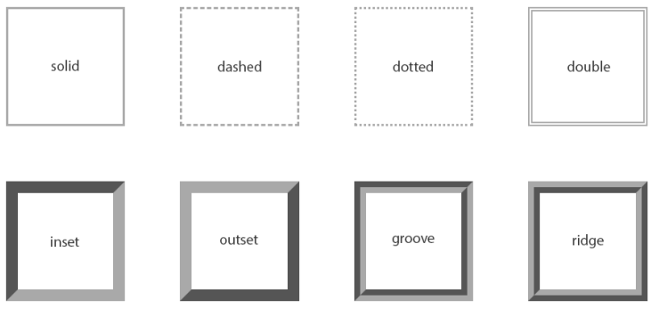

### 设置的方式

- 如果我们相对某一边同时设置 宽度 样式 颜色, 可以进行如下设置:
  - border-top
  - border-right
  - border-bottom
  - border-left
  - border：统一设置 4 个方向的边框
- 边框颜色、宽度、样式的编写顺序任意

## 圆角 border

### 圆角 border-radius

- border-radius 用于设置盒子的圆角

- border-radius 常见的值:
  - 数值: 通常用来设置小的圆角, 比如 6px;
  - 百分比: 通常用来设置一定的弧度或者圆形;

### border-radius 补充

- border-radius 事实上是一个缩写属性:
  - 将这四个属性 border-top-left-radius、border-top-right-radius、border-bottom-right-radius，和 border-bottom left-radius 简写为一个属性。
  - 开发中比较少见一个个圆角设置;
- 如果一个元素是正方形, 设置 border-radius 大于或等于 50%时，就会变成一个圆

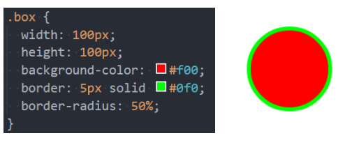

## 外边距 margin

### 初识 margin

- margin 属性用于设置盒子的外边距, 通常用于元素和元素之间的间距;
- margin 包括四个方向, 所以有如下的取值:
  - margin-top：上内边距
  - margin-right：右内边距
  - margin-bottom：下内边距
  - margin-left：左内边距
- margin 单独编写是一个缩写属性：
  - margin-top、margin-right、margin-bottom、margin-left 的简写属性
  - margin 缩写属性是从零点钟方向开始, 沿着顺时针转动的, 也就是上右下左;
- margin 也并非必须是四个值, 也可以有其他值;

| margin 的个数 | margin 的例子                | 代表的含义                                              |
| ------------- | ---------------------------- | ------------------------------------------------------- |
| 4             | margin: 10px 20px 30px 40px; | top: 10px, right: 20px, bottom: 30px, left: 40px;       |
| 3             | margin: 10px 20px 30px;      | 缺少 left, left 使用 right 的值;                        |
| 2             | margin: 10px 20px;           | 缺少 left, 使用 right 的值; 缺少 bottom, 使用 top 的值; |
| 1             | margin: 10px;                | top/right/bottom/left 都使用 10                         |

### 上下 margin 的传递

- margin-top 传递
  - 如果块级元素的顶部线和父元素的顶部线重叠，那么这个块级元素的 margin-top 值会传递给父元素
- margin-bottom 传递
  - 如果块级元素的底部线和父元素的底部线重写，并且父元素的高度是 auto，那么这个块级元素的 margin-bottom 值会传递给父元素
- 如何防止出现传递问题？
  - 给父元素设置 padding-top\padding-bottom
  - 给父元素设置 border
  - 触发 BFC: 设置 overflow 为 auto
- 建议
  - margin 一般是用来设置兄弟元素之间的间距
  - padding 一般是用来设置父子元素之间的间距

### 上下 margin 的折叠

- 垂直方向上相邻的 2 个 margin（margin-top、margin-bottom）有可能会合并为 1 个 margin，这种现象叫做 collapse（折叠）
- 水平方向上的 margin（margin-left、margin-right）永远不会 collapse
- 折叠后最终值的计算规则
  - 两个值进行比较，取较大的值
- 如何防止 margin collapse？
  - 只设置其中一个元素的 margin

### 上下 margin 的折叠的情况

- 两个兄弟块级元素之间上下 margin 的折叠
- 父子块级元素之间 margin 的折叠

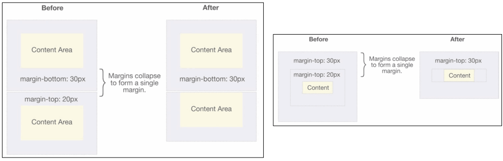

## 外轮廓-outline

- outline 表示元素的外轮廓
  - 不占用空间
  - 默认显示在 border 的外面
- outline 相关属性有
  - outline-width: 外轮廓的宽度
  - outline-style：取值跟 border 的样式一样，比如 solid、dotted 等
  - outline-color: 外轮廓的颜色
  - outline：outline-width、outline-style、outline-color 的简写属性，跟 border 用法类似
- 应用实例
  - 去除 a 元素、input 元素的 focus 轮廓效果

## 盒子和文字阴影

### 盒子阴影-box-shadow

- box-shadow 属性可以设置一个或者多个阴影
  - 每个阴影用 shadow 表示
  - 多个阴影之间用逗号,隔开，从前到后叠加
- shadow 的常见格式如下
- 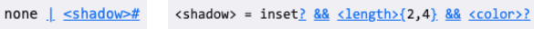
  - 第 1 个 length：offset-x, 水平方向的偏移，正数往右偏移
  - 第 2 个 length：offset-y, 垂直方向的偏移，正数往下偏移
  - 第 3 个 length：blur-radius, 模糊半径
  - 第 4 个 length：spread-radius, 延伸半径
  - color：阴影的颜色，如果没有设置，就跟随 color 属性的颜色
  - inset：外框阴影变成内框阴影

### 盒子阴影-在线调试

- 可以通过一个网站测试盒子的阴影:
  - https://html-css-js.com/css/generator/box-shadow/

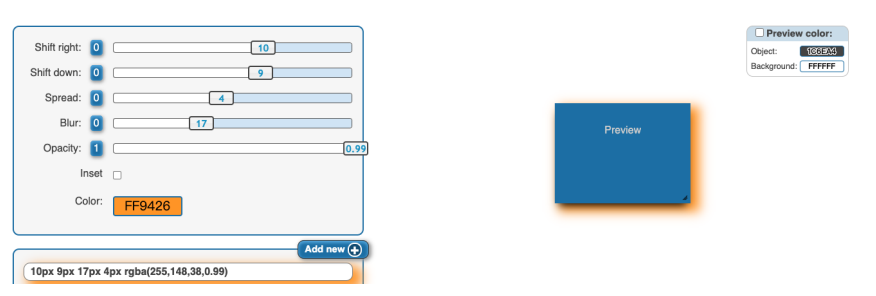

### 文字阴影-text-shadow

- text-shadow 用法类似于 box-shadow，用于给文字添加阴影效果
- shadow 的常见格式如下
- 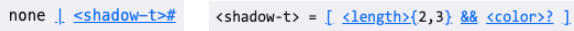
  - 相当于 box-shadow, 它没有 spread-radius 的值;
- 我们可以通过一个网站测试文字的阴影:
  - https://html-css-js.com/css/generator/box-shadow/

## 行内非替换元素的注意事项

- 以下属性对行内级非替换元素不起作用
  - width、height、margin-top、margin-bottom
- 以下属性对行内级非替换元素的效果比较特殊
  - padding-top、padding-bottom、上下方向的 border

## box-sizing

- box-sizing 用来设置盒子模型中宽高的行为
- content-box
  - padding、border 都布置在 width、height 外边
- border-box
  - padding、border 都布置在 width、height 里边

### box-sizing: content-box

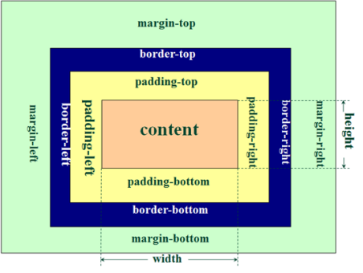

- 元素的实际占用宽度 = width
- 元素的实际占用高度 = height

### box-sizing: border-box

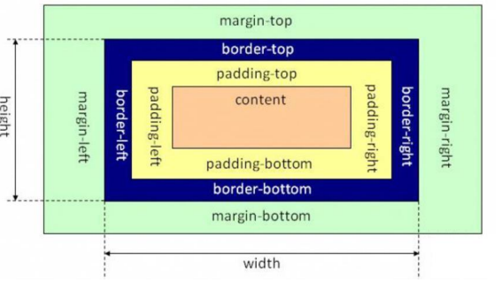

- 元素的实际占用宽度 = border + padding + width
- 元素的实际占用高度 = border + padding + height

## 块级元素的居中问题

- 在一些需求中，需要元素在父元素中水平居中显示（父元素一般都是块级元素、inline-block）
- 行内级元素(包括 inline-block 元素)
  - 水平居中：在父元素中设置 text-align: center
- 块级元素
  - 水平居中：margin: 0 auto

## display 属性

### 使用 css 修改元素类型

- 前面我们说过, 事实上元素没有本质的区别:

  - div 是块级元素, span 是行内级元素;
  - div 之所以是块级元素仅仅是因为浏览器默认设置了 display 属性而已;

  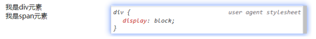

- 那么我们是否可以通过 display 来改变元素的特性呢? 可以使用 display 修改

### css 属性 display

- CSS 中有个 display 属性，能修改元素的显示类型，有 4 个常用值
  - block：让元素显示为块级元素
  - inline：让元素显示为行内级元素
  - inline-block：让元素同时具备行内级、块级元素的特征
  - none：隐藏元素
- 事实上 display 还有其他的值, 比如 flex, 后续会专门学习;

### display 值得特性（非常重要）

- block 元素:
  - 独占父元素的一行
  - 可以随意设置宽高
  - 高度默认由内容决定
- inline-block 元素:
  - 跟其他行内级元素在同一行显示
  - 可以随意设置宽高
  - 可以这样理解
    - 对外来说，它是一个行内级元素
    - 对内来说，它是一个块级元素
- inline:
  - 跟其他行内级元素在同一行显示;
  - 不可以随意设置宽高;
  - 宽高都由内容决定;

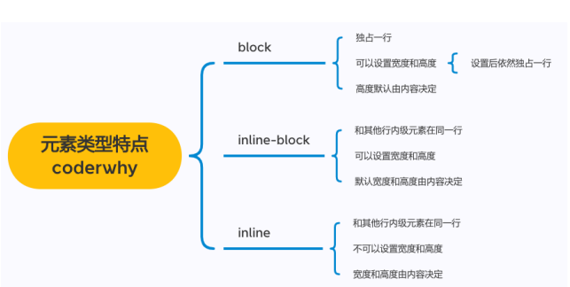

### 编写 HTML 时得注意事项

- 块级元素、inline-block 元素
  - 一般情况下，可以包含其他任何元素（比如块级元素、行内级元素、inline-block 元素）
  - 特殊情况，p 元素不能包含其他块级元素
- 行内级元素（比如 a、span、strong 等）
  - 一般情况下，只能包含行内级元素
