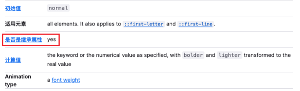
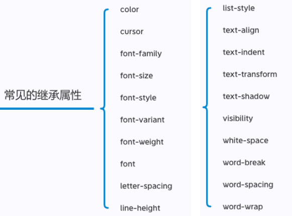

## CSS属性的继承

- CSS的某些属性具有继承性(Inherited):
  - **继承过来的是计算值, 而不是设置值**
  - 如果一个属性具备继承性, 那么在该元素上设置后, 它的后代元素都可以继承这个属性;
  - 当然, 如果后代元素自己有设置该属性, 那么优先使用后代元素自己的属性(不管继承过来的属性权重多高);
- 如何知道一个属性是否具有继承性呢?
  - 常见的font-size/font-family/font-weight/line-height/color/text-align都具有继承性;
  - 这些不用刻意去记, 用的多自然就记住了;
- 另外要多学会查阅文档，如MDN等， 文档中每个属性都有标明其继承性的:

### 常见的继承属性

## CSS属性的层叠

- CSS的翻译是层叠样式表, 什么是层叠呢?
  - 对于一个元素来说, 相同一个属性我们可以通过不同的选择器给它进行多次设置;
  - 那么属性会被一层层覆盖上去;
  - 但是最终只有一个会生效;
- 那么多个样式属性覆盖上去, 哪一个会生效呢?
  - 判断一: 选择器的权重, 权重大的生效, 根据权重可以判断出优先级;
  - 判断二: 先后顺序, 权重相同时, 后面设置的生效;