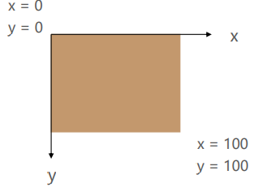
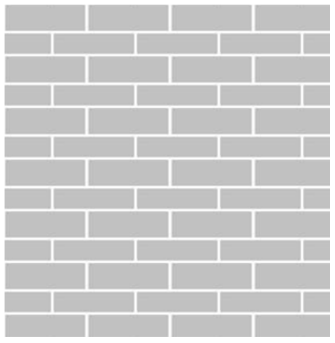
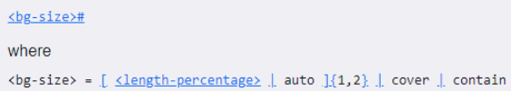
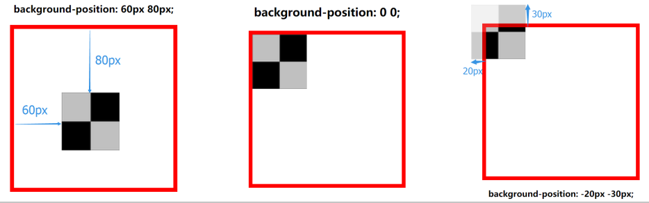
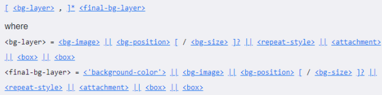

## background-image

- background-image 用于设置元素的背景图片
  - 会盖在(不是覆盖)background-color 的上面
- 如果设置了多张图片
  - 设置的第一张图片将显示在最上面，其他图片按顺序层叠在下面
- 注意：如果设置了背景图片后，元素没有具体的宽高，背景图片是不会显示出来的

## background-repeat

- background-repeat 用于设置背景图片是否要平铺
- 常见的设值有
  - repeat：平铺
  - no-repeat：不平铺
  - repeat-x：只在水平方向平铺
  - repeat-y：只在垂直平方向平铺

## background-size

- background-size 用于设置背景图片的大小
  - auto：默认值, 以背景图本身大小显示
  - cover：缩放背景图，以完全覆盖铺满元素,可能背景图片部分看不见
  - contain：缩放背景图，宽度或者高度铺满元素，但是图片保持宽高比
  - percentage：百分比，相对于背景区（background positioning area）
  - length：具体的大小，比如 100px

## background-position

- background-position 用于设置背景图片在水平、垂直方向上的具体位置
  - 可以设置具体的数值 比如 20px 30px;
  - 水平方向还可以设值：left、center、right
  - 垂直方向还可以设值：top、center、bottom
  - 如果只设置了 1 个方向，另一个方向默认是 center

## background-attachment

- background-attachment 决定背景图像的位置是在视口内固定，或者随着包含它的区块滚动。可以设置以下 3 个值
  - scroll：此关键属性值表示背景相对于元素本身固定， 而不是随着它的内容滚动
  - local：此关键属性值表示背景相对于元素的内容固定。如果一个元素拥有滚动机制，背景将会随着元素的内容滚动.
  - fixed：此关键属性值表示背景相对于视口固定。即使一个元素拥有滚动机制，背景也不会随着元素的内容滚动。

## background

- background 是一系列背景相关属性的简写属性
- 常用格式是
- 
- background-size 可以省略，如果不省略，/background-size 必须紧跟在 background-position 的后面
- 其他属性也都可以省略，而且顺序任意

## background-image 和 img 对比

- 利用 background-image 和 img 都能够实现显示图片的需求，在开发中该如何选择？

| 性质                   | img                | background-image |
| ---------------------- | ------------------ | ---------------- |
| 性质                   | HTML 元素          | CSS 样式         |
| 图片是否占据空间       | √                  | ×                |
| 浏览器右键查看地址     | √                  | ×                |
| 支持 CSS Sprite        | ×                  | √                |
| 更有可能被搜索引擎收录 | √（结合 alt 属性） | ×                |

- 总结
  - img，作为网页内容的重要组成部分，比如广告图片、LOGO 图片、文章配图、产品图片
  - background-image，可有可无。有，能让网页更加美观。无，也不影响用户获取完整的网页内容信息
