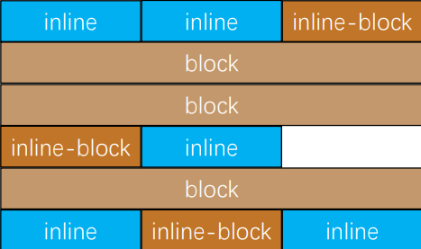
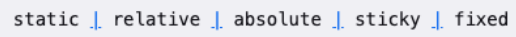
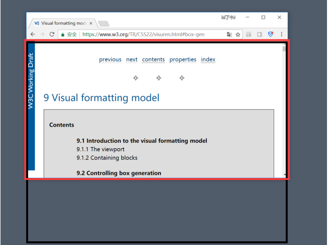
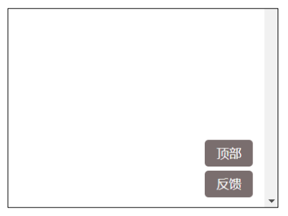
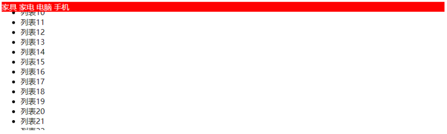
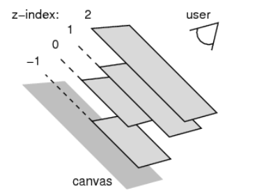

## 标准流

### 标准流（Normal Flow）

- 默认情况下，元素都是按照normal flow（标准流、常规流、正常流、文档流【document flow】）进行排布

  - 从左到右、从上到下按顺序摆放好

  - 默认情况下，互相之间不存在层叠现象

    

### margin-padding位置调整

- 在标准流中，可以使用margin、padding对元素进行定位
  - 其中margin还可以设置负数
- 比较明显的缺点是
  - 设置一个元素的margin或者padding，通常会影响到标准流中其他元素的定位效果
  - 不便于实现元素层叠的效果
- 如果我们希望一个元素可以跳出标准量,单独的对某个元素进行定位呢?
  - 我们可以通过position属性来进行设置;

### 认识元素的定位

- 定位允许您从正常的文档流布局中取出元素，并使它们具有不同的行为:
  - 例如放在另一个元素的上面;
  - 或者始终保持在浏览器视窗内的同一位置;
- 定位在开发中非常常见:


## 认识position属性

- 利用position可以对元素进行定位，常用取值有5个:

  

- 默认值: 

  - static：默认值, 静态定位

- 使用下面的值, 可以让元素变成 定位元素(positioned element)

  - relative：相对定位
  - absolute：绝对定位
  - fixed：固定定位
  - sticky：粘性定位

## 定位 - static

- position属性的默认值
  - 元素按照normal flow布局
  - left 、right、top、bottom没有任何作用（相当于没有开启这些功能）

## 相对定位 - relative

- 元素按照normal flow布局
- 可以通过left、right、top、bottom进行定位
  - **定位参照对象是元素自己原来的位置**
- left、right、top、bottom用来设置元素的具体位置，对元素的作用如下图所示
- 相对定位的应用场景
- 在不影响其他元素位置的前提下，对当前元素位置进行微调


### 相对定位练习


## 固定定位 - fixed

- 元素脱离normal flow（脱离标准流、脱标）
- 可以通过left、right、top、bottom进行定位
- 定位参照对象是视口（viewport）
- 当画布滚动时，固定不动

### 画布 和 视口

- 视口（Viewport）

  - 文档的可视区域
  - 如图红框所示
- 画布（Canvas）
  - 用于渲染文档的区域
  - 文档内容超出视口范围，可以通过滚动查看
  - 如图黑框所示
- 宽高对比
  - 画布 >= 视口



### 定位元素的特点

- 可以随意设置宽高
- 宽高默认由内容决定
- 不再受标准流的约束
  - 不再严格按照从上到下、从左到右排布
  - 不再严格区分块级、行内级，块级、行内级的很多特性都会消失
- 不再给父元素汇报宽高数据
- 脱标元素内部默认还是按照标准流布局

### 固定定位练习



## 绝对定位 - absolute

- 元素脱离normal flow（脱离标准流、脱标）
- 可以通过left、right、top、bottom进行定位
  - 定位参照对象是最邻近的定位祖先元素
  - 如果找不到这样的祖先元素，参照对象是视口
- 定位元素（positioned element）
  - position值不为static的元素
  - 也就是position值为relative、absolute、fixed的元素

### 子绝父相

- 在绝大数情况下，子元素的绝对定位都是相对于父元素进行定位
- 如果希望子元素相对于父元素进行定位，又不希望父元素脱标，常用解决方案是：
  - 父元素设置position: relative（让父元素成为定位元素，而且父元素不脱离标准流）
  - 子元素设置position: absolute
  - 简称为“子绝父相”

### 将position设置为absolute/fixed元素的特点

- 元素可以随意设置宽高
- 宽高默认由内容决定
- 不再受标准流的约束
  - 不再严格按照从上到下、从左到右排布
  - 不再严格区分块级(block)、行内级(inline)，行内块级(inline-block)的很多特性都会消失
- 不再给父元素汇报宽高数据
- 脱标元素内部默认还是按照标准流布局

```html
<!DOCTYPE html>
<html lang="en">

<head>
  <meta charset="UTF-8">
  <meta http-equiv="X-UA-Compatible" content="IE=edge">
  <meta name="viewport" content="width=device-width, initial-scale=1.0">
  <title>Document</title>
  <style>
    .box {
      background-color: red;
    }
    
    .box strong {
      position: absolute;
      background-color: bisque;
      height: 200px;
    }
    
    .box strong div {
      background-color: aqua;
    }
    
    .box strong i {
      background-color: chartreuse;
    }
    
    .box strong span {
      background-color: coral;
    }
  </style>
</head>

<body>
  <div class="box">
    <strong>
    我是storng元素
      <div>我是div</div>
      <i>我是i</i>
      <span>我是span</span>
    </strong>
  </div>
</body>

</html>
```

- 绝对定位元素（absolutely positioned element）
  - position值为absolute或者fixed的元素
- 对于绝对定位元素来说
  - 定位参照对象的宽度 = left + right + margin-left + margin-right + 绝对定位元素的实际占用宽度
  - 定位参照对象的高度 = top + bottom + margin-top + margin-bottom + 绝对定位元素的实际占用高度
- 如果希望绝对定位元素的宽高和定位参照对象一样，可以给绝对定位元素设置以下属性
  - left: 0、right: 0、top: 0、bottom: 0、margin:0
- 如果希望绝对定位元素在定位参照对象中居中显示，可以给绝对定位元素设置以下属性
  - left: 0、right: 0、top: 0、bottom: 0、margin: auto
  - 另外，还得设置具体的宽高值（宽高小于定位参照对象的宽高）

```html
<!DOCTYPE html>
<html lang="en">

<head>
  <meta charset="UTF-8">
  <meta http-equiv="X-UA-Compatible" content="IE=edge">
  <meta name="viewport" content="width=device-width, initial-scale=1.0">
  <title>Document</title>
  <style>
    .box {
      width: 800px;
      height: 300px;
      background-color: red;
      position: relative;
    }
    
    .container {
      height: 100px;
      width: 200px;
      background-color: aquamarine;
      /* margin: 0 auto; */
      position: absolute;
      right: 0;
      left: 0;
      bottom: 0;
      top: 0;
      margin: auto;
    }
  </style>
</head>

<body>
  <div class="box">
    <div class="container"></div>
  </div>
</body>

</html>
```

### auto到底是什么

- 800 = 200 + ml0 + mr0 + 0 + 0
- auto -> 交给浏览器你来出来
- width: auto;
  1. 行内非替换元素 -> width: 包裹内容
  2. 块级元素 ->width: 包含块的宽度
  3. 绝对定位元素 -> width: 包裹内容

## 粘性定位 - sticky

- 另外还有一个定位的值是position: sticky，比起其他定位值要新一些.

  - sticky是一个大家期待已久的属性;

  - 可以看做是相对定位和固定定位的结合体;

  - 它允许被定位的元素表现得像相对定位一样，直到它滚动到某个阈值点;

  - 当达到这个阈值点时, 就会变成固定定位;

    

- sticky是相对于最近的滚动祖先包含视口的(the nearest ancestor scroll container’s scrollport )

## position值对比

|                     | 脱离标准流 | 定位怨怒是 | 绝对定位元素 | 定位参照对象                                                 |
| ------------------- | ---------- | ---------- | ------------ | ------------------------------------------------------------ |
| static – 静态定位   | ×          | ×          | ×            | ×                                                            |
| relative – 相对定位 | ×          | √          | ×            | 元素自己原来的位置                                           |
| absolute – 绝对定位 | √          | √          | √            | 最临近的祖先元素是（如果找不到这样的祖先元素，参照对象是视口） |
| fixed – 固定定位    | √          | √          | √            | 视口                                                         |

## CSS属性 - z-index

- z-index属性用来设置定位元素的层叠顺序（仅对定位元素有效）
  - 取值可以是正整数、负整数、0
- 比较原则
  - 如果是兄弟关系
    - z-index越大，层叠在越上面
    - z-index相等，写在后面的那个元素层叠在上面
  - 如果不是兄弟关系
    - 各自从元素自己以及祖先元素中，找出最邻近的2个定位元素进行比较
    - 而且这2个定位元素必须有设置z-index的具体数值




