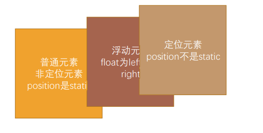
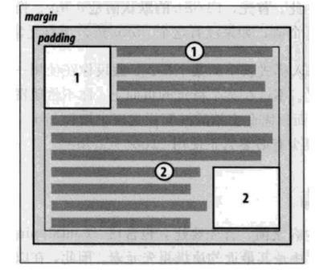
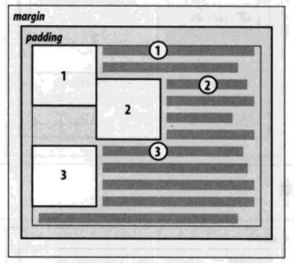
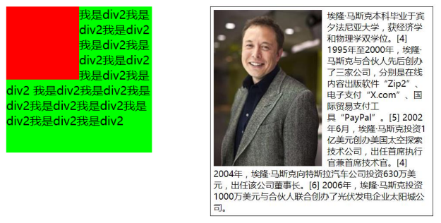
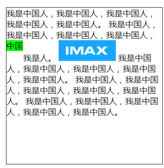

## 认识浮动

- float 属性可以指定一个元素应沿其容器的左侧或右侧放置，允许文本和内联元素环绕它。
  - float 属性最初只用于在一段文本内浮动图像, 实现文字环绕的效果;
  - 但是早期的CSS标准中并没有提供好的左右布局方案, 因此在一段时间里面它成为网页多列布局的最常用工具;
- 绝对定位、浮动都会让元素脱离标准流，以达到灵活布局的效果
- 可以通过float属性让元素产生浮动效果，float的常用取值
  - none：不浮动，默认值
  - left：向左浮动
  - right：向右浮动

## 浮动规则

### 浮动规则一

- 元素一旦浮动后, 脱离标准流

  - 朝着向左或向右方向移动，直到自己的边界紧贴着包含块（一般是父元素）或者其他浮动元素的边界为止
  - 定位元素会层叠在浮动元素上面

### 浮动规则二

- 如果元素是向左（右）浮动，浮动元素的左（右）边界不能超出包含块的左（右）边界

- 带圆圈的数字，标记着浮动元素浮动之前的位置

### 浮动规则三

- 浮动元素之间不能层叠
  - 如果一个元素浮动，另一个浮动元素已经在那个位置了，后浮动的元素将紧贴着前一个浮动元素（左浮找左浮，右浮找右浮）
  - 如果水平方向剩余的空间不够显示浮动元素，浮动元素将向下移动，直到有充足的空间为止

### 浮动规则四

- 浮动元素不能与行内级内容层叠，行内级内容将会被浮动元素推出
  - 比如行内级元素、inline-block元素、块级元素的文字内容

### 浮动规则五

行内级元素、inline-block元素浮动后，其顶部将与所在行的顶部对齐

## 浮动练习

### 浮动练习一

- 浮动常用的场景
  - 解决行内级元素、inline-block元素的水平间隙问题

### 浮动练习二

- 浮动布局方案:
  - 实现京东页面下面的布局

### 浮动练习三

- 浮动布局方案:
  - 实现京东页面下面的布局

### 浮动练习四

- 浮动布局方案:
  - 实现考拉页面下面的布局

## 浮动的问题 – 高度塌陷

- 由于浮动元素脱离了标准流，变成了脱标元素，所以不再向父元素汇报高度
  - 父元素计算总高度时，就不会计算浮动子元素的高度，导致了高度坍塌的问题
- 解决父元素高度坍塌问题的过程，一般叫做清浮动（清理浮动、清除浮动）
- 清浮动的目的是
  - 让父元素计算总高度的时候，把浮动子元素的高度算进去
- 如何清除浮动呢? 使用clear属性

## CSS属性 - clear

- clear属性是做什么的呢?
  - clear 属性可以指定一个元素是否必须移动(清除浮动后)到在它之前的浮动元素下面;
- clear的常用取值
  - left：要求元素的顶部低于之前生成的所有左浮动元素的底部
  - right：要求元素的顶部低于之前生成的所有右浮动元素的底部
  - both：要求元素的顶部低于之前生成的所有浮动元素的底部
  - none：默认值，无特殊要求
- 那么我们可以利用这个特性来清除浮动.

### 清除浮动的方法

- 事实上我们有很多方法可以清除浮动
- 方法一: 给父元素设置固定高度
  - 扩展性不好（不推荐）
- 方法二: 在父元素最后增加一个空的块级子元素，并且让它设置clear: both
  - 会增加很多无意义的空标签，维护麻烦
  - 违反了结构与样式分离的原则（不推荐）
- 方法三: 给父元素添加一个伪元素
  - 编写好后可以轻松实现清除浮动;

## 方法三 – 伪元素清除浮动

- 给父元素增加::after伪元素

  - 纯CSS样式解决，结构与样式分离（推荐）

## 布局方案总结

| 定位方案                        | 应用场景 |
| ------------------------------- | -------- |
| normal flow (标准流)            | 垂直布局 |
| absolute positioning (绝对定位) | 层叠布局 |
| float (浮动)                    | 水平布局 |

