## 认识 flexbox

- Flexbox 翻译为弹性盒子:
  - 弹性盒子是一种用于按行或按列布局元素的一维布局方法 ;
  - 元素可以膨胀以填充额外的空间, 收缩以适应更小的空间;
  - 通常我们使用 Flexbox 来进行布局的方案称之为 flex 布局(flex layout);
- flex 布局是目前 web 开发中使用最多的布局方案：
  - flex 布局（Flexible 布局，弹性布局）;
  - 目前特别在移动端可以说已经完全普及;
  - 在 PC 端也几乎已经完全普及和使用, 只有非常少数的网站依然在用浮动来布局;
- 为什么需要 flex 布局呢?
  - 长久以来，CSS 布局中唯一可靠且跨浏览器兼容的布局工具只有 floats 和 positioning。
  - 但是这两种方法本身存在很大的局限性, 并且他们用于布局实在是无奈之举;

### 原先的布局存在的痛点

- 原来的布局存在哪些痛点呢? 举例说明:

  - 比如在父内容里面垂直居中一个块内容。

  - 44 年前人类类已经登上月亮，但是在 css 中还不能让布局居中

    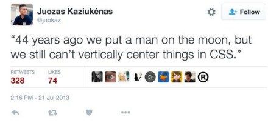

  - 比如使容器的所有子项等分可用宽度/高度，而不管有多少宽度/高度可用。

  - 比如使多列布局中的所有列采用相同的高度，即使它们包含的内容量不同。

### flex 布局的出现

- 所以长久以来, 大家非常期待一种真正可以用于对元素布局的方案: 于是 flex 布局出现了;
  - Nature and nature's laws lay hid in night; God said "Let Newton be" and all was light.
  - 自然与自然的法则在黑夜隐藏，于是上帝说，让牛顿出现吧！于是世界就明亮了起来.
- flexbox 在使用时, 我们最担心的是它的兼容性问题:
  - 我们可以在 caniuse 上查询到具体的兼容性

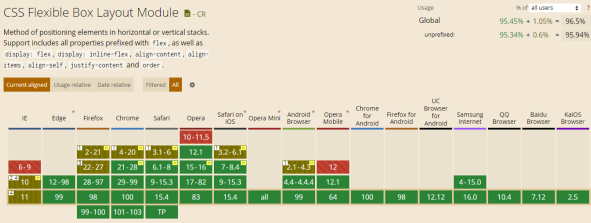

### flex 布局的重要概念

- 两个重要的概念：

  - 开启了 flex 布局的元素叫 flex container
  - flex container 里面的直接子元素叫做 flex item

  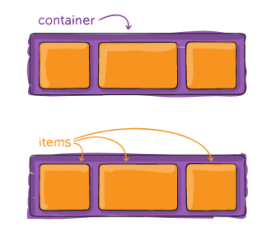

- 当 flex container 中的子元素变成了 flex item 时, 具备一下特点:

  - flex item 的布局将受 flex container 属性的设置来进行控制和布局;
  - flex item 不再严格区分块级元素和行内级元素;
  - flex item 默认情况下是包裹内容的, 但是可以设置宽度和高度;

- 设置 display 属性为 flex 或者 inline-flex 可以成为 flex container

  - flex： flex container 以 block-level 形式存在
  - inline-flex： flex container 以 inline-level 形式存在

### flex 布局的模型

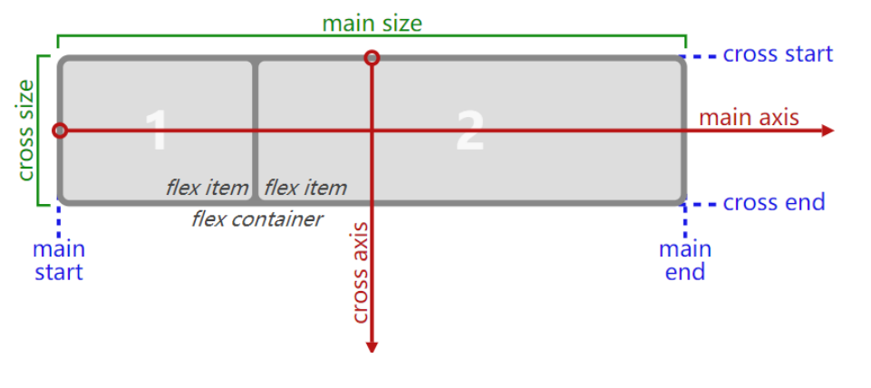

## flex 相关的属性

- 应用在 flex container 上的 CSS 属性
  - flex-flow
  - flex-direction
  - flex-wrap
  - flex-flow
  - justify-content
  - align-items
  - align-content
- 应用在 flex items 上的 CSS 属性
  - flex-grow
  - flex-basis
  - flex-shrink
  - order
  - align-self
  - flex

### flex-direction

- flex items 默认都是沿着 main axis（主轴）从 main start 开始往 main end 方向排布
  - flex-direction 决定了 main axis 的方向，有 4 个取值
  - row（默认值）、row-reverse、column、column-reverse

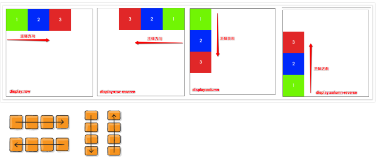

### flex-wrap

- flex-wrap 决定了 flex container 是单行还是多行
  - nowrap（默认）：单行
  - wrap：多行
  - wrap-reverse：多行（对比 wrap，cross start 与 cross end 相反）

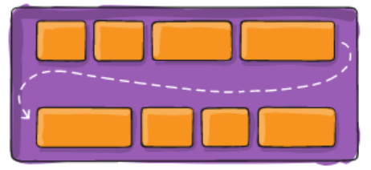

### flex-flow

- flex-flow 属性是 flex-direction 和 flex-wrap 的简写。
  - 顺序任何, 并且都可以省略;

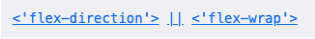

### justify-content

- justify-content 决定了 flex items 在 main axis 上的对齐方式
  - flex-start（默认值）：与 main start 对齐
  - flex-end：与 main end 对齐
  - center：居中对齐
  - space-between：
    - flex items 之间的距离相等
    - 与 main start、main end 两端对齐
  - space-around：
    - flex items 之间的距离相等
    - flex items 与 main start、main end 之间的距离是 flex items 之间距离的一半
  - space-evenly：
    - flex items 之间的距离相等
    - flex items 与 main start、main end 之间的距离 等于 flex items 之间的距离

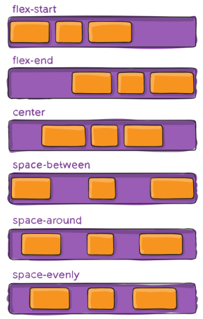

### align-item

- align-items 决定了 flex items 在 cross axis 上的对齐方式
  - normal：在弹性布局中，效果和 stretch 一样
  - stretch：当 flex items 在 cross axis 方向的 size 为 auto 时，会
  - 自动拉伸至填充 flex container
  - flex-start：与 cross start 对齐
  - flex-end：与 cross end 对齐
  - center：居中对齐
  - baseline：与基准线对齐

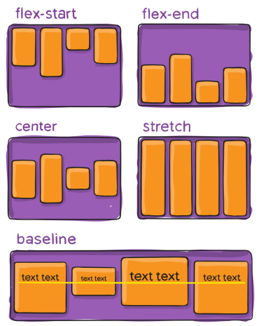

### align-content

- align-content 决定了多行 flex items 在 cross axis 上的对齐方式，用法与 justify-content 类似
  - stretch（默认值）：与 align-items 的 stretch 类似
  - flex-start：与 cross start 对齐
  - flex-end：与 cross end 对齐
  - center：居中对齐
  - space-between：
    - flex items 之间的距离相等
    - 与 cross start、cross end 两端对齐
  - space-around：
    - flex items 之间的距离相等
    - flex items 与 cross start、cross end 之间的距离是 flex items 之间距离的一半
  - space-evenly：
    - flex items 之间的距离相等
    - flex items 与 cross start、cross end 之间的距离 等于 flex items 之间的距离

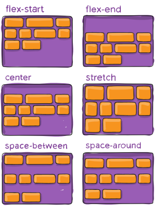

## flex-item 属性

### order

- order 决定了 flex items 的排布顺序
  - 可以设置任意整数（正整数、负整数、0），值越小就越排在前面
  - 默认值是 0

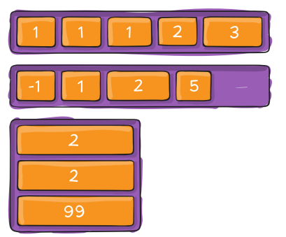

### flex items

- flex items 可以通过 align-self 覆盖 flex container 设置的 align-items
  - auto（默认值）：遵从 flex container 的 align-items 设置
  - stretch、flex-start、flex-end、center、baseline，效果跟 align-items 一致

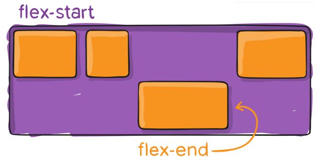

### flex-grow

- flex-grow 决定了 flex items 如何扩展(拉伸/成长)

  - 可以设置任意非负数字（正小数、正整数、0），默认值是 0
  - 当 flex container 在 main axis 方向上有剩余 size 时，flex-grow 属性才会有效

- 如果所有 flex items 的 flex-grow 总和 sum 超过 1，每个 flex item 扩展的 size 为

  - flex container 的剩余 size \* flex-grow / sum

  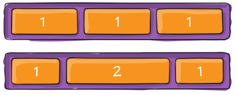

- flex items 扩展后的最终 size 不能超过 max-width\max-height

### flex-shrink

- flex-shrink 决定了 flex items 如何收缩(缩小)
  - 可以设置任意非负数字（正小数、正整数、0），默认值是 1
  - 当 flex items 在 main axis 方向上超过了 flex container 的 size，flex-shrink 属性才会有效
- 如果所有 flex items 的 flex-shrink 总和超过 1，每个 flex item 收缩的 size 为
  - flex items 超出 flex container 的 size \* 收缩比例 / 所有 flex items 的收缩比例之和
- flex items 收缩后的最终 size 不能小于 min-width\min-height

### flex-basis

- flex-basis 用来设置 flex items 在 main axis 方向上的 base size
  - auto（默认值）、具体的宽度数值（100px）
- 决定 flex items 最终 base size 的因素，从优先级高到低
  - max-width\max-height\min-width\min-height
  - flex-basis
  - width\height
  - 内容本身的 size

### flex 属性

- flex 是 flex-grow || flex-shrink || flex-basis 的简写,flex 属性可以指定 1 个，2 个或 3 个值。

  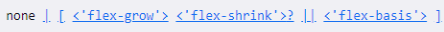

- 单值语法: 值必须为以下其中之一:

  - 一个无单位数( number): 它会被当作 flex-grow 的值。
  - 一个有效的宽度(width)值: 它会被当作 flex-basis 的值。
  - 关键字 none，auto 或 initial.

- 双值语法: 第一个值必须为一个无单位数，并且它会被当作 flex-grow 的值。

  - 第二个值必须为以下之一：
    - 一个无单位数：它会被当作 flex-shrink 的值。
    - 一个有效的宽度值: 它会被当作 flex-basis 的值。

- 三值语法:

  - 第一个值必须为一个无单位数，并且它会被当作 flex-grow 的值。
  - 第二个值必须为一个无单位数，并且它会被当作 flex-shrink 的值。
  - 第三个值必须为一个有效的宽度值， 并且它会被当作 flex-basis 的值。

## 思考: 如下布局如何解决对其问题

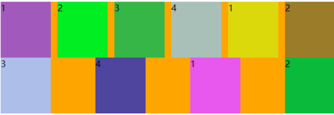

- 在后方再加 n-2 个 span 元素或者 i 元素
