## CSS 属性 - transform

- CSS transform 属性允许你旋转，缩放，倾斜或平移给定元素。
- Transform 是形变的意思，transformer 就是变形金刚

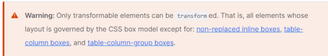

- 所以，transform 对于行内级非替换元素是无效的

### transform 的用法

- transform 的属性语法如下：

  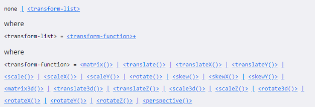

  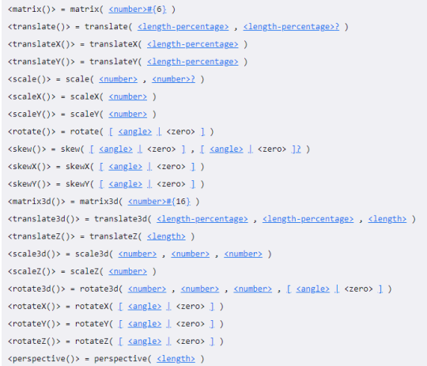

- 常见的函数 transform function 有：

  - 平移：translate(x, y)
  - 缩放：scale(x, y)
  - 旋转：rotate(deg)
  - 倾斜：skew(deg, deg)

- 通过上面的几个函数，我们可以改边某个元素的形变

### 位移 - translate

- 平移：translate(x, y)

- 值个数

  - 一个值时，设置 x 轴上的位移
  - 二个值时，设置 x 轴和 y 轴上的位移

- 值类型：

  - 数字：100px
  - 百分比：参照元素本身（ refer to the size of bounding box ）

  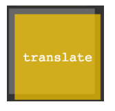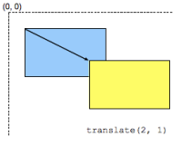

### translate 的补充

- 补充一：translate 是 translateX 和 translateY 函数的简写。
  - translate3d 后续了解；
- 补充二：translate 的百分比可以完成一个元素的水平和垂直居中：

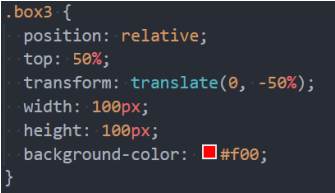

- translate 函数相对于 flex 布局的兼容性会好一点点
  - 不过目前 flex 布局已经非常普及，直接使用 flex 布局即可；

### 缩放 - scale

- 缩放：scale(x, y)

- 值个数

  - 一个值时，设置 x 轴上的缩放
  - 二个值时，设置 x 轴和 y 轴上的缩放

- 值类型：

  - 数字：

    - 保持不变
    - 放大一倍
    - 0.5：缩小一半

  - 百分比：不支持百分比

    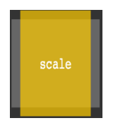

### transform-origin(变形的原点)

- transform-origin：变形的原点

- 一个值：

  - 设置 x 轴的原点

- 两个值：

  - 设置 x 轴和 y 轴的原点

- 必须是 length ， percentage ，或 left, center, right, top, bottom 关键字中的一个

  - left, center, right, top, bottom 关键字
  - length：从左上角开始计算
  - 百分比：参考元素本身大小

  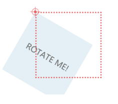

### 缩放 - rotate

- 旋转：rotate(deg)

- 值个数

  - 一个值时，表示旋转的角度

- 值类型：

  - deg：旋转的角度
  - 正数为顺时针
  - 负数为逆时针

- 注意：旋转的原点受 transform-origin 的影响

  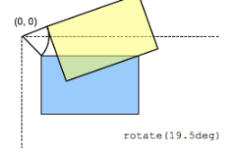

### 倾斜 - skew

- 旋转：skew(x, y)

- 值个数

  - 一个值时，表示 x 轴上的倾斜
  - 二个值时，表示 x 轴和 y 轴上的倾斜

- 值类型：

  - deg：倾斜的角度
  - 正数为顺时针
  - 负数为逆时针

- 注意：旋转的原点受 transform-origin 的影响

  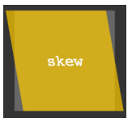

### transform 设置多个值

- 前面我们看到了 transform 的语法，它是可以设置多个 transform-function 的：

  - 那么就意味着，我们可以给 transform 设置多个形变的函数；

    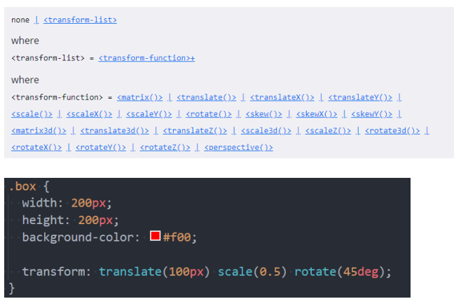

### 认识 transotion 动画

- 什么是 transition 动画呢？
  - CSS transitions 提供了一种在更改 CSS 属性时控制动画速度的方法。
  - 可以让 CSS 属性变化成为一个持续一段时间的过程，而不是立即生效的；
  - 比如将一个元素从一个位置移动到另外一个位置，默认在修改完 CSS 属性后会立即生效；
  - 但是我们可以通过 CSS transition，让这个过程加上一定的动画效果，包括一定的曲线速率变化；
- 通常将两个状态之间的过渡称为隐式过渡（implicit transitions），因为开始与结束之间的状态由浏览器决定。

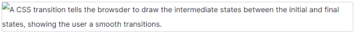

- CSS transitions 可以决定
  - 哪些属性发生动画效果 (明确地列出这些属性)
  - 何时开始 (设置 delay）
  - 持续多久 (设置 duration)
  - 如何动画 (定义 timing function，比如匀速地或先快后慢)。

### 哪些 CSS 属性可以做动画呢？

- 并非所有的 CSS 属性都可以执行动画的，那么我们如何知道哪些属性支持动画呢？

- 方法一：在 MDN 可执行动画的 CSS 属性中查询

  - https://developer.mozilla.org/zh-CN/docs/Web/CSS/CSS_animated_properties

- 方法二：阅读 CSS 属性的文档说明

  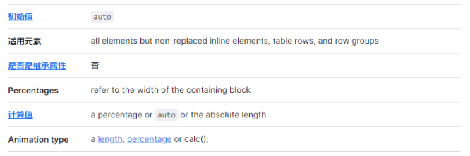

### 过渡动画 - transition

- transition CSS 属性是 transition-property，transition-duration，transition-timing-function 和 transition-delay 的

- 一个简写属性。

- transition-property：指定应用过渡属性的名称

  - 可以写 all 表示所有可动画的属性
  - 属性是否支持动画查看文档

- transition-duration：指定过渡动画所需的时间

  - 单位可以是秒（s）或毫秒（ms）

- transition-timing-function：指定动画的变化曲线

  - https://developer.mozilla.org/zh-CN/docs/Web/CSS/transition-timing-function

- transition-delay：指定过渡动画执行之前的等待时间

  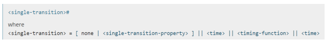

### 几个英语词汇的区分

- transform 是形变：
  - 一个 CSS 属性，该 CSS 属性用于设置形变；
  - 后面的值是形变的函数，比如 scale、rotate、translate；
- translate 是其中一个 transform-function
  - 用于对元素进行平移；
- transition 是过渡的意思
  - 它本身也有转变的含义，但是更多表示的是过渡的过程；

## animation 属性

### 认识 CSS Animation

- 之前我们学习了 transition 来进行过渡动画，但是过渡动画有如下的缺点：
  - transition 只能定义开始状态和结束状态，不能定义中间状态，也就是说只有两个状态；
  - transition 不能重复执行，除非一再触发动画；
  - transition 需要在特定状态下会触发才能执行，比如某个属性被修改了；
- 如果我们希望可以有更多状态的变化，我们可以使用 CSS Animation。
- CSS Animation 的使用分成两个步骤：
- 步骤一：使用 keyframes 定义动画序列（每一帧动画如何执行）
- 步骤二：配置动画执行的名称、持续时间、动画曲线、延迟、执行次数、方向等等

### @keyframes 规则

- 可以使用@keyframes 来定义多个变化状态，并且使用 animation-name 来声明匹配：
  - 关键帧使用 percentage 来指定动画发生的时间点；
  - 0%表示动画的第一时刻，100%表示动画的最终时刻；
  - 因为这两个时间点十分重要，所以还有特殊的别名：from 和 to；
- 也就是说可以使用 from 和 to 关键字：
  - from 相当于 0%
  - to 相当于 100%

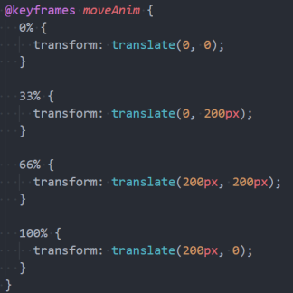

## animation 属性

- CSS animation 属性是 animation-name，animation-duration, animation-timing-function，animation-delay，animationiteration-count，animation-direction，animation-fill-mode 和 animation-play-state 属性的一个简写属性形式。

- animation-name：指定执行哪一个关键帧动画

- animation-duration：指定动画的持续时间

- animation-timing-function：指定动画的变化曲线

- animation-delay：指定延迟执行的时间

- animation-iteration-count：指定动画执行的次数，执行 infinite 表示无限动画

- animation-direction：指定方向，常用值 normal 和 reverse

- animation-fill-mode：执行动画最后保留哪一个值

  - none：回到没有执行动画的位置
  - forwards：动画最后一帧的位置
  - backwards：动画第一帧的位置

- animation-play-state：指定动画运行或者暂停（在 JavaScript 中使用，用于暂停动画）
