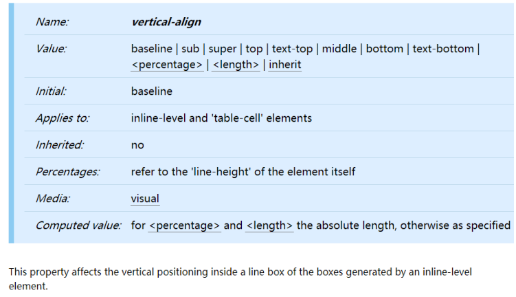
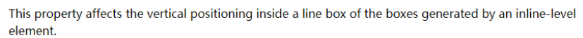
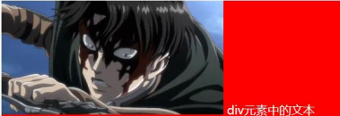
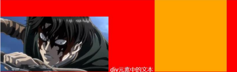
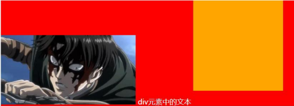
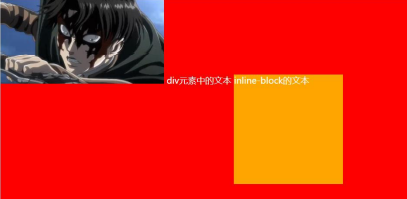
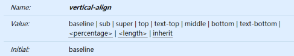

## CSS 属性 - vertical-align

### 深入理解 vertical-align – line boxes

- 官方文档的翻译：vertical-align 会影响 行内块级元素 在一个 行盒中垂直方向的位置
- 思考：一个 div 没有设置高度的时候，会不会有高度？
  - 没有内容，没有高度
  - 有内容，内容撑起来高度
- 但是内容撑起来高度的本质是什么呢？
  - 内容有行高（line-height），撑起来了 div 的高度
- 行高为什么可以撑起 div 的高度？
  - 这是因为 line boxes 的存在，并且 line-boxes 有一个特性，包裹每行的 inline level
  - 而其中的文字是有行高的，必须将整个行高包裹进去，才算包裹这个 line-level
- 那么，进一步思考：
  - 如果这个 div 中有图片，文字，inline-block，甚至他们设置了 margin 这些属性呢？

### 深入理解 vertical-align – 不同情况分析

- 情况一：只有文字时，line boxes 如何包裹内容？（注意：红色是包裹的 div，下面也都一样）

  

- 情况二：有图片，有文字时，line-boxes 如何包裹内容？

  

- 情况三：有图片，有文字，有 inline-block（比图片要大）如何包裹内容？

  

- 情况四：有图片，有文字，有 inline-block（比图片要大）而且设置了 margin-bottom，如何包裹内容？

  

- 情况五：有图片、文字、inline-block（比图片要大）而且设置了 margin-bottom 并且有文字，如何包裹内容？

  

### vertical-align 的 baseline

- 结论：line-boxes 一定会想办法包裹住当前行中所有的内容。

- 但是，但是为什么对齐方式千奇百怪呢？

  - 你认为的千奇百怪，其实有它的内在规律
  - 答案就是 baseline 对齐

- 我们来看官方 vertical-align 的默认值：没错，就是 baseline

  

- 但是 baseline 都是谁呢？

  - 文本的 baseline 是字母 x 的下方
  - Inline-block 默认的 baseline 是 margin-bottom 的底部（没有，就是盒子的底部）
  - Inline-block 有文本时，baseline 是最后一行文本的 x 的下方

- 一切都解释通了

### vertical-align 的其他值

- 现在，对于不同的取值就非常容易理解了
  - baseline(默认值)：基线对齐（你得先明白什么是基线）
  - top：把行内级盒子的顶部跟 line boxes 顶部对齐
  - middle：行内级盒子的中心点与父盒基线加上 x-height 一半的线对齐
    - **并不是绝对居中，middle 是相对于 x 高度的一半来对齐的但是相对于中线会偏差一点点**
  - bottom：把行内级盒子的底部跟 line box 底部对齐
  - percentage ：把行内级盒子提升或者下降一段距离（距离相对于 line-height 计算\元素高度）， 0%意味着同 baseline 一样
  - length ：把行内级盒子提升或者下降一段距离，0cm 意味着同 baseline 一样
- 解决图片下边缘的间隙方法:
  - 方法一: 设置成 top/middle/bottom
  - 方法二: 将图片设置为 block 元素
