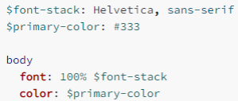

## CSS 预处理器

### CSS 编写的痛点

- CSS 作为一种样式语言, 本身用来给 HTML 元素添加样式是没有问题的.
- 但是目前前端项目已经越来越复杂, 不再是简简单单的几行 CSS 就可以搞定的, 我们需要几千行甚至上万行的 CSS 来完成页面的美化工作.
- 随着代码量的增加, 必然会造成很多的编写不便：
  - 比如大量的重复代码, 虽然可以用类来勉强管理和抽取, 但是使用起来依然不方便；
  - 比如无法定义变量（当然目前已经支持）, 如果一个值被修改, 那么需要修改大量代码, 可维护性很差; (比如主题颜色)
  - 比如没有专门的作用域和嵌套, 需要定义大量的 id/class 来保证选择器的准确性, 避免样式混淆;
  - 等等一系列的问题；
- 所以有一种对 CSS 称呼是 “面向命名编程”;
- 社区为了解决 CSS 面临的大量问题, 出现了一系列的 CSS 预处理器(CSS_preprocessor)
  - CSS 预处理器是一个能让你通过预处理器自己独有的语法来生成 CSS 的程序;
  - 市面上有很多 CSS 预处理器可供选择，且绝大多数 CSS 预处理器会增加一些原生 CSS 不具备的特性;
  - 代码最终会转化为 CSS 来运行, 因为对于浏览器来说只识别 CSS;

### 常见的 CSS 预处理器

- 常见的预处理器有哪些呢? 目前使用较多的是三种预处理器:
- Sass/Scss：
  - 2007 年诞生，最早也是最成熟的 CSS 预处理器，拥有 ruby 社区的支持，是属于 Haml（一种模板系统）的一部分;
  - 目前受 LESS 影响，已经进化到了全面兼容 CSS 的 SCSS;
- Less:
  - 2009 年出现，受 SASS 的影响较大，但又使用 CSS 的语法，让大部分开发者更容易上手;
  - 比起 SASS 来，可编程功能不够，不过优点是使用方式简单、便捷，兼容 CSS，并且已经足够使用；
  - 另外反过来也影响了 SASS 演变到了 SCSS 的时代；
  - 著名的 Twitter Bootstrap 就是采用 LESS 做底层语言的，也包括 React 的 UI 框架 AntDesign。
- Stylus:
  - 2010 年产生，来自 Node.js 社区，主要用来给 Node 项目进行 CSS 预处理支持;
  - 语法偏向于 Python, 使用率相对于 Sass/Less 少很多

## Less

### 认识 Less

- 什么是 Less 呢? 我们来看一下官方的介绍:
  - It's CSS, with just a little more.
- Less （Leaner Style Sheets 的缩写） 是一门 CSS 扩展语言, 并且兼容 CSS。
  - Less 增加了很多相比于 CSS 更好用的特性;
  - 比如定义变量、混入、嵌套、计算等等；
  - Less 最终需要被编译成 CSS 运行于浏览器中（包括部署到服务器中）；

### 编写 Less 代码

```less
@mainColor: #fa0112;

.box {
  color: @mainColor
    
    .desc {
    font-size: 18px;
  }
  .info {
    font-size: 18px;
  }
  &:hover {
    background-color: #0f0;
  }
}
```

### less 代码的编译

- 这段代码如何被编译成 CSS 代码运行呢？

- 方式一：下载 Node 环境，通过 npm 包管理下载 less 工具，使用 less 工具对代码进行编译；

  - 因为目前我们还没有学习过 Node，更没有学习过 npm 工具；
  - 所以先阶段不推荐大家使用 less 本地工具来管理；
  - 后续我们学习了 webpack 其实可以自动完成这些操作的；

- 方法二：通过 VSCode 插件来编译成 CSS 或者在线编译

  - https://lesscss.org/less-preview/

- 方式三：引入 CDN 的 less 编译代码，对 less 进行实时的处理；

  ```html
  <link rel="sty;esheet/less" href="./less/text.less" />
  <script src="https://cdn.jsdelivr.net/npm/less@4"></script>
  ```

- 方式四：将 less 编译的 js 代码下载到本地，执行 js 代码对 less 进行编译；

  - 和 cdn 方法类似，但是是本地引入

### Less 语法一：Less 兼容 CSS

- Less 语法一：Less 是兼容 CSS 的
  - 所以我们可以在 Less 文件中编写所有的 CSS 代码；
  - 只是将 css 的扩展名改成了.less 结尾而已；

### Less 语法二 – 变量（Variables）

- 在一个大型的网页项目中，我们 CSS 使用到的某几种属性值往往是特定的

  - 比如我们使用到的主题颜色值，那么每次编写类似于#f3c258 格式的语法；
  - 一方面是记忆不太方便，需要重新编写或者拷贝样式；
  - 另一方面如果有一天主题颜色改变，我们需要修改大量的代码；
  - 所以，我们可以将常见的颜色或者字体等定义为变量来使用；

- 在 Less 中使用如下的格式来定义变量；

  - @变量名: 变量值;

  ```less
  @themeColor: #f3c258;
  @mainFontSize: 12px;

  .box p .link {
  	color: @themeColor；
  	font-size: @mainFontSize
  }
  ```

### Less 语法三 – 嵌套（Nesting）

- 在之前的项目中，当我们需要找到一个内层的元素时，往往需要嵌套很多层的选择器

  ```less
  #main .section-01 .news-list-info .date {
  	font-size：12px;
  	color:#999
  }
  ```

- Less 提供了选择器的嵌套

  ```html
  <div class="box">
    <h1 class="title">我是标题</h1>
    <p class="conten">
      我是段落内容
      <a class="link" href="#">我是超级英雄</a>
      <span class="keyword">keyword</span>
    </p>
  </div>
  ```

  ```less
  .box {
    .title {
      color: red;
    }
    .content {
      .link {
        font-size: 20px;
        color: yellow;
      }
      .keyword {
        font-size: 30px;
        color: blue;
      }
    }
  }
  ```

- 特殊符号：& 表示当前选择器的父级

### Less 语法四 – 运算（Operations）

- 在 Less 中，算术运算符 +、-、\*、/ 可以对任何数字、颜色或变量进行运算。

  - 算术运算符在加、减或比较之前会进行单位换算，计算的结果以最左侧操作数的单位类型为准；

  - 如果单位换算无效或失去意义，则忽略单位；

    ```css
    .box {
      height: 100px + 10px;
      background-color: #ff0000 + #00ff00;
    }
    ```

### Less 语法五 – 混合（Mixins）

- 在原来的 CSS 编写过程中，多个选择器中可能会有大量相同的代码

  - 我们希望可以将这些代码进行抽取到一个独立的地方，任何选择器都可以进行复用；
  - 在 less 中提供了混入（Mixins）来帮助我们完成这样的操作；

- 混合（Mixin）是一种将一组属性从一个规则集（或混入）到另一个规则集的方法。

  ```less
  .bordered {
    border-top: 2px solid #f00;
    border-bottom: 2px dotted #0f0;
  }
  ```

  ```less
  .box {
  	height: 100px;
  	background-color； orange;
  	.bordered()
  }
  .container {
  	height: 200px;
  	background-color； red;
  	.bordered()
  }
  ```

- 注意：混入在没有参数的情况下，小括号可以省略，但是不建议这样使用；

### Less 语法五 、六– 混入（Mixins）、映射（Maps）

- 混入也可以传入变量（暂时了解）

  ```less
  .bordered(@borderWidth: 2px) {
    border-top: @borderWidth solid #f00;
    border-bottom: @borderWidth dotted #0f0;
  }
  ```

- Less 语法六：映射（Maps）

  ```less
  .colors {
    primarycolor: #f00;
    secondcolor: #0f0;
  }

  .box {
    width: 100px;
    height: 100px;
    color: .colors[primaryColor];
    background-color: .colors() [secondColor];
  }
  ```

- 混入和映射结合：混入也可以当做一个自定义函数来使用（暂时了解）

  ```less
  pxToRem(@px) {
    result: (@px / @htmlFontSize) * 1rem;
  }

  .box {
    width: .pxToRem(100) [result];
    font-size: .pxToRem(18) [result];
  }
  ```

### less 其他语法

- Less 语法七：extend 继承

  - 和 mixins 作用类似，用于复用代码；

  - 和 mixins 相比，继承代码最终会转化成并集选择器；

    ```less
    .bordered {
      border-bottom: 10px solid #000;
    }

    .box {
      &:extend(.bordered);
    }
    ```

    ```less
    .bordered,
    .box {
      border-bottom: 10px solid #000;
    }
    ```

- Less 语法八：Less 内置函数

  - Less 内置了多种函数用于转换颜色、处理字符串、算术运算等。

  - 内置函数手册：https://less.bootcss.com/functions/

    ```less
    .box {
      color: color(red); // 将red转成RGB的值
      width: convert(100px, "in"); // 单位的转换
      font-size: cell(18.5px); // 数学函数
    }
    ```

- Less 语法九：作用域（Scope）

  - 在查找一个变量时，首先在本地查找变量和混合（mixins）；

  - 如果找不到，则从“父”级作用域继承；

    ```less
    .box {
      .inner {
        font-size: @fontSize; // 使用15px
      }
      @fontSize: 15px;
    }
    ```

- Less 语法十：注释（Comments）

  - 在 Less 中，块注释和行注释都可以使用；

- Less 语法十一：导入（Importing）

  - 导入的方式和 CSS 的用法是一致的；
  - 导入一个 .less 文件，此文件中的所有变量就可以全部使用了；
  - 如果导入的文件是 .less 扩展名，则可以将扩展名省略掉；

## Sass

### 认识 Sass 和 Scss

- 事实上，最初 Sass 是 Haml 的一部分，Haml 是一种模板系统，由 Ruby 开发者设计和开发。

- 所以，Sass 的语法使用的是类似于 Ruby 的语法，没有花括号，没有分号，具有严格的缩进；

  

- 我们会发现它的语法和 CSS 区别很大，后来官方推出了全新的语法 SCSS，意思是 Sassy CSS，他是完全兼容 CSS 的。

- 目前在前端学习 SCSS 直接学习 SCSS 即可：

  - SCSS 的语法也包括变量、嵌套、混入、函数、操作符、作用域等；
  - 通常也包括更为强大的控制语句、更灵活的函数、插值语法等；
  - 大家可以根据之前学习的 less 语法来学习一些 SCS 语法；
  - https://sass-lang.com/guide

- 目前大家掌握 Less 的使用即可；
