##  常见得移动设备

- 以iPhone为例

  | 手机机型 (iPhone)  | 屏幕尺寸 (inch) | 逻辑分辨率 (pt) | 设备分辨率 (px) | 缩放因子 (Scale Factor) |
  | ------------------ | --------------- | --------------- | --------------- | ----------------------- |
  | 3G(s)              | 3.5             | 320x480         | 320x480         | @1x                     |
  | 4(s)               | 3.5             | 320x480         | 640x960         | @2x                     |
  | 5(s/se)            | 4               | 320x568         | 640x1136        | @2x                     |
  | 6(s)/7/8           | 4.7             | 375x667         | 750x1334        | @2x                     |
  | X/Xs /11 Pro       | 5.8             | 375x812         | 1125x2436       | @3x                     |
  | 6(s)/7/8 Plus      | 5.5             | 414x736         | 1242x2208       | @3x                     |
  | Xr /11             | 6.1             | 414x896         | 828×1792        | @2x                     |
  | Xs Max /11 Pro Max | 6.5             | 414x896         | 1242×2688       | @3x                     |

## CSS中的单位

- 前面编写的CSS中，我们经常会使用px来表示一个长度（大小），比如font-size设置为18px，width设置为100px。
- px是一个长度（length）单位，事实上CSS中还有非常多的长度单位。
- 整体可以分成两类：
  - 绝对长度单位（Absolute length units）；
  - 相对长度单位（Relative length units）；

### CSS中的绝对单位（ Absolute length units ）

- 绝对单位：
  - 它们与其他任何东西都没有关系，通常被认为总是相同的大小。
  - 这些值中的大多数在用于打印时比用于屏幕输出时更有用，例如，我们通常不会在屏幕上使用cm。
  - 惟一一个您经常使用的值，就是px(像素)。

| 绝对单位 | 名称         | 等价换算                               |
| -------- | ------------ | -------------------------------------- |
| cm       | 厘米         | 1cm = 96px/2.54                        |
| mm       | 毫米         | 1mm = 1/10th of 1cm                    |
| Q        | 四分之一毫米 | 1Q = 1/40th of 1cm                     |
| in       | 英寸         | 1in = 2.54cm = 96px                    |
| pc       | 十二点活字   | 1pc = 1/16th of 1in                    |
| pt       | 点           | 1pt = 1/72th of 1in                    |
| px       | 像素         | 1px = 1/96th of 1in1pt = 1/72th of 1in |

### CSS中的相对单位（ Relative length units ）

- 相对长度单位

  - 相对长度单位相对于其他一些东西；
  - 比如父元素的字体大小，或者视图端口的大小；
  - 使用相对单位的好处是，经过一些仔细的规划，您可以使文本或其他元素的大小与页面上的其他内容相对应；

- em：

  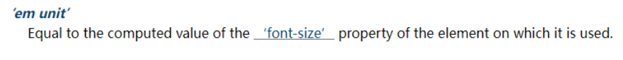

- rem：

  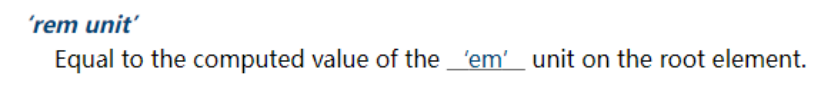

- vw/wh

  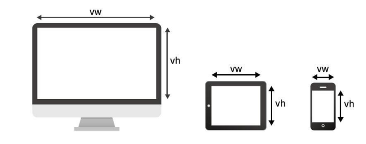

| 相对单位 | 相对于                                                       |
| -------- | ------------------------------------------------------------ |
| em       | 在 font-size 中使用是相对于父元素的字体大小，在其他属性中使用是相对于自身的字体大小，如 width |
| ex       | 字符“x”的高度                                                |
| ch       | 数字“0”的宽度                                                |
| rem      | 根元素(HTML元素)的字体大小                                   |
| lh       | 元素的line-height                                            |
| vw       | 视窗宽度的1%                                                 |
| vh       | 视窗高度的1%                                                 |

### 当我们聊pixel时，到底在聊些什么？

- 前面我们已经一直在使用px单位了，px是pixel单词的缩写，翻译为像素。
- 那么像素到底是什么呢？
  - 像素是影响显示的基本单位。（比如屏幕上看到的画面、一幅图片）；
  - pix是英语单词picture的常用简写，加上英语单词“元素”element，就得到pixel；
  - “像素”表示“画像元素”之意，有时亦被称为pel（picture element）；

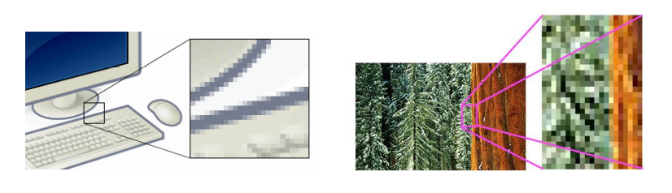

###  像素的不同分类

- 但是这个100个pixel到底是多少呢？

  - 我们确实可以在屏幕上看到一个大小，但是这个大小代表的真实含义是什么呢？

  - 我们经常说一个电脑的分辨率、手机的分辨率，这个CSS当中的像素又是什么关系呢？

    ```css
    .box {
    	width:100px;
    	height:100px;
    }
    ```

- 这里我们要深入到不同的像素概念中，来理解CSS中的pixel到底代表什么含义。

- 像素单位常见的有三种像素名称：

  - 设备像素（也称之为物理像素）；
  - 设备独立像素（也称之为逻辑像素）；
  - CSS像素；

### 物理像素和逻辑像素

- 设备像素，也叫物理像素。
  - 设备像素指的是显示器上的真实像素，每个像素的大小是屏幕固有的属性，屏幕出厂以后就不会改变了；
  - 我们在购买显示器或者手机的时候，提到的设备分辨率就是设备像素的大小；
  - 比如iPhone X的分辨率 1125x2436，指的就是设备像素；
- 设备独立像素，也叫逻辑像素。
  - 如果面向开发者我们使用设备像素显示一个100px的宽度，那么在不同屏幕上显示效果会是不同的；
  - 开发者针对不同的屏幕很难进行较好的适配，编写程序必须了解用户的分辨率来进行开发；
  - 所以在设备像素之上，操作系统为开发者进行抽象，提供了逻辑像素的概念；
  - 比如你购买了一台显示器，在操作系统上是以1920x1080设置的显示分辨率，那么无论你购买的是2k、4k的显示器，对于开发者来说，都是1920x1080的大小。
- CSS像素
  - CSS中我们经常使用的单位也是pixel，它在默认情况下等同于设备独立像素（也就是逻辑像素）
  - 毕竟逻辑像素才是面向我们开发者的。
  - 我们可以通过JavaScript中的screen.width和screen.height获取到电脑的逻辑分辨率：

### DPR、PPI、DPI

- DPR：device pixel ratio

  - 2010年，iPhone4问世，不仅仅带来了移动互联网，还带来了Retina屏幕；

  - Retina屏幕翻译为视网膜显示屏，可以为用户带来更好的显示；

  - 在Retina屏幕中，一个逻辑像素在长度上对应两个物理像素，这个比例称之为设备像素比（device pixel ratio）；

  - 我们可以通过window.devicePixelRatio获取到当前屏幕上的DPR值；

    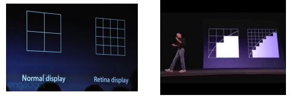

    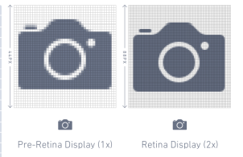

- PPI（了解）：每英寸像素（英语：Pixels Per Inch，缩写：PPI）

  - 通常用来表示一个打印图像或者显示器上像素的密度；
  - 前面我们提过1英寸=2.54厘米，在工业领域被广泛应用；

## 什么是移动端适配？ 

- 移动互联网的快速发展，让人们已经越来越习惯于使用手机来完成大部分日常的事务。

  - 前端我们已经学习了大量HTML、CSS的前端开发知识，并且也进行了项目实战；
  - 这些知识也同样适用于移动端开发，但是如果想让一个页面真正适配于移动端，我们最好多了解一些移动端的知识；

- 移动端开发目前主要包括三类：

  - 原生App开发（iOS、Android、RN、uniapp、Flutter等）
  - 小程序开发（原生小程序、uniapp、Taro等）
  - Web页面（移动端的Web页面，可以使用浏览器或者webview浏览）

- 因为目前移动端设备较多，所以我们需要对其进行一些适配。

  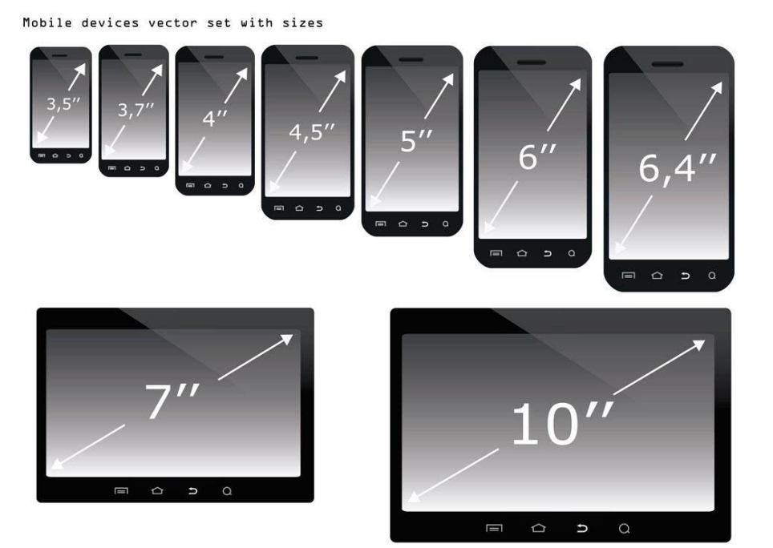

- 这里有两个概念：

  - 自适应：根据不同的设备屏幕大小来自动调整尺寸、大小；
  - 响应式：会随着屏幕的实时变动而自动调整，是一种自适应；

## 认识视口viewport

- 在前面我们已经简单了解过视口的概念了：

  - 在一个浏览器中，我们可以看到的区域就是视口（viewport）；
  - 我们说过fixed就是相对于视口来进行定位的；
  - 在PC端的页面中，我们是不需要对视口进行区分，因为我们的布局视口和视觉视口是同一个；

- 但是在移动端，不太一样，你布局的视口和你可见的视口是不太一样的。

  - 这是因为移动端的网页窗口往往比较小，我们可能会希望一个大的网页在移动端可以完整的显示；
  - 所以在默认情况下，移动端的布局视口是大于视觉视口的；

- 所以在移动端，我们可以将视口划分为三种情况：

  - 布局视口（layout viewport）
  - 视觉视口（visual layout）
  - 理想视口（ideal layout）

- 这些概念的区分，事实上来自ppk，他也是对前端贡献比较大的一个人（特别是在移动端浏览器）

  - https://www.quirksmode.org/mobile/viewports2.html

    

### 布局视口和视觉视口

- 布局视口（layout viewport）

- 默认情况下，一个在PC端的网页在移动端会如何显示呢？

  - 第一，它会按照宽度为980px来布局一个页面的盒子和内容；
  - 第二，为了显示可以完整的显示在页面中，对整个页面进行缩小；

- 我们相对于980px布局的这个视口，称之为布局视口（layout 

- viewport）；

  - 布局视口的默认宽度是980px；

- 视觉视口（visual viewport）

  - 如果默认情况下，我们按照980px显示内容，那么右侧有一部分区域就会无法显示，所以手机端浏览器会默认对页面进行缩放以显示到用户的可见区域中；
  - 那么显示在可见区域的这个视口，就是视觉视口（visual viewport）

- 在Chrome上按shift+鼠标左键可以进行缩放。

  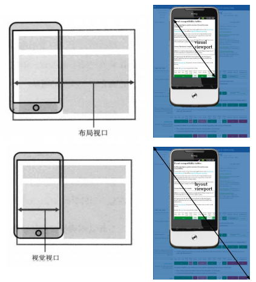


### 理想视口（ideal viewport）

- 如果所有的网页都按照980px在移动端布局，那么最终页面都会被缩放显示。
  - 事实上这种方式是不利于我们进行移动的开发的，我们希望的是设置100px，那么显示的就是100px；
  - 如何做到这一点呢？通过设置理想视口（ideal viewport）；

- 理想视口（ideal viewport）：
  - 默认情况下的layout viewport并不适合我们进行布局；
  - 我们可以对layout viewport进行宽度和缩放的设置，以满足正常在一个移动端窗口的布局；
  - 这个时候可以设置meta中的viewport；

| 值            | 可能的附加值                         | 描述                                                         |
| ------------- | ------------------------------------ | ------------------------------------------------------------ |
| width         | 一个正整数，或者字符串 device-width  | 定义 viewport 的宽度。                                       |
| height        | 一个正整数，或者字符串 device-height | 定义 viewport 的高度。未被任何浏览器使用。                   |
| initial-scale | 一个 0.0 和 10.0 之间的正数          | 定义设备宽度与 viewport 大小之间的缩放比例。                 |
| maximum-scale | 一个 0.0 和 10.0 之间的正数          | 定义缩放的最大值，必须大于等于 minimum-scale，否则表现将不可预测。 |
| minimum-scale | 一个 0.0 和 10.0 之间的正数          | 定义缩放的最小值，必须小于等于 maximum-scale，否则表现将不可预测。 |
| user-scalable | yes 或者 no                          | 默认为 yes，如果设置为 no，将无法缩放当前页面。浏览器可以忽略此规则 |

## 移动端适配方案

- 移动端的屏幕尺寸通常是非常繁多的，很多时候我们希望在不同的屏幕尺寸上显示不同的大小；
  - 比如我们设置一个100x100的盒子
    - 在375px的屏幕上显示是100x100;
    - 在320px的屏幕上显示是90+x90+;
    - 在414px的屏幕上显示是100+x100+;
  - 其他尺寸也是类似，比如padding、margin、border、left，甚至是font-size等等；
- 这个时候，我们可能可以想到一些方案来处理尺寸：
  - 方案一：百分比设置；
    - 因为不同属性的百分比值，相对的可能是不同参照物，所以百分比往往很难统一；
    - 所以百分比在移动端适配中使用是非常少的；
  - 方案二：rem单位+动态html的font-size；
  - 方案三：vw单位；
  - 方案四：flex的弹性布局；

### 适配方案 – rem+动态html的font-size

- rem单位是相对于html元素的font-size来设置的，那么如果我们需要在不同的屏幕下有不同的尺寸，可以动态的修改html的

- font-size尺寸。

- 比如如下案例：

  - 设置一个盒子的宽度是2rem；

  - 设置不同的屏幕上html的font-size不同；

    | 屏幕尺寸 | html的font-size | 盒子的设置宽度 | 盒子的最终宽度 |
    | -------- | --------------- | -------------- | -------------- |
    | 375px    | 37.5px          | 1rem           | 37.5px         |
    | 320px    | 32px            | 1rem           | 32px           |
    | 414px    | 41.4px          | 1rem           | 41.4px         |

- 这样在开发中，我们只需要考虑两个问题：

  - 问题一：针对不同的屏幕，设置html不同的font-size；
  - 问题二：将原来要设置的尺寸，转化成rem单位；

### rem的font-size尺寸

- 方案一：媒体查询

  - 可以通过媒体查询来设置不同尺寸范围内的屏幕html的font-size尺寸；

  - 缺点：

    - 我们需要针对不同的屏幕编写大量的媒体查询；

    - 如果动态改变尺寸，不会实时的进行更新；

- 方案二：编写js代码

  - 如果希望实时改变屏幕尺寸时，font-size也可以实时更改，可以通过js代码；

  - 方法：

    - 根据html的宽度计算出font-size的大小，并且设置到html上；

    - 监听页面的实时改变，并且重新设置font-size的大小到html上；

- 方案三：lib-flexible库

  - 事实上，lib-flexible库做的事情是相同的，你也可以直接引入它；

  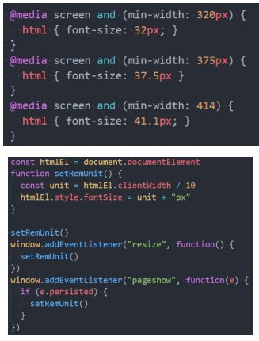

### rem的单位换算

- 方案一：手动换算

  - 比如有一个在375px屏幕上，100px宽度和高度的盒子；

  - 我们需要将100px转成对应的rem值；

  - 100/37.5=2.6667，其他也是相同的方法计算即可；

- 方案二：less/scss函数

  ​	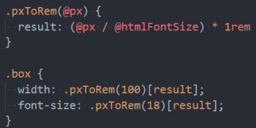

- 方案三：postcss-pxtorem（后续学习）

  - 目前在前端的工程化开发中，我们可以借助于webpack的工具来完成自动的转化；

- 方案四：VSCode插件

  - px to rem 的插件，在编写时自动转化；

    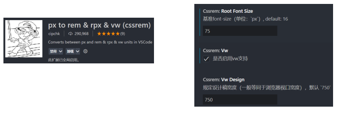

## 考拉海购设计稿

## 适配方案 - vw

- 在flexible GitHub上已经有写过这样的一句话：

  

- 所以它更推荐使用viewport的两个单位vw、wh。

- vw的兼容性如何呢？

  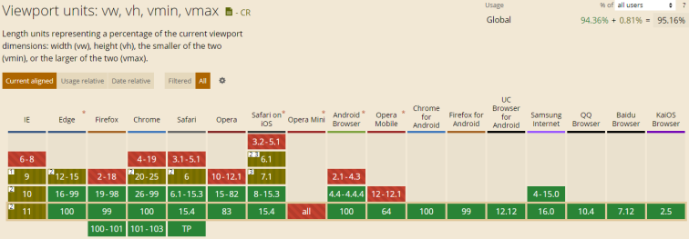

### vw和rem的对比

- rem事实上是作为一种过渡的方案，它利用的也是vw的思想。

  - 前面不管是我们自己编写的js，还是flexible的源码；

  - 都是将1rem等同于设计稿的1/10，在利用1rem计算相对于整个屏幕的尺寸大小；

  - 那么我们来思考，1vw不是刚好等于屏幕的1/100吗？

  - 而且相对于rem还更加有优势；

- vw相比于rem的优势：

  - 优势一：不需要去计算html的font-size大小，也不需要给html设置这样一个font-size；

  - 优势二：不会因为设置html的font-size大小，而必须给body再设置一个font-size，防止继承；

  - 优势三：因为不依赖font-size的尺寸，所以不用担心某些原因html的font-size尺寸被篡改，页面尺寸混乱；

  - 优势四：vw相比于rem更加语义化，1vw刚才是1/100的viewport的大小;

  - 优势五：可以具备rem之前所有的优点；

- vw我们只面临一个问题，将尺寸换算成vw的单位即可；

- 所以，目前相比于rem，更加推荐大家使用vw（但是理解rem依然很重要）

### vw的单位换算 

- 方案一：手动换算

  - 比如有一个在375px屏幕上，100px宽度和高度的盒子；

  - 我们需要将100px转成对应的vw值；

  - 100/3.75=26.667，其他也是相同的方法计算即可；

- 方案二：less/scss函数

  ```less
  @vwUnit: 3.75;
  .pxToVw(@px){
  	result: (@px / @vwUnit) * 1vw
  }
  .box {
  	width: .pxToVw(100)[result];
  	height: .pxToVw(100)[result]p;
  } 
  ```

- 方案三：postcss-px-to-viewport-8-plugin（后续学习）

  - 和rem一样，在前端的工程化开发中，我们可以借助于webpack的工具来完成自动的转化；

- 方案四：VSCode插件

  - px to vw 的插件，在编写时自动转化；

    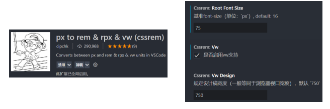