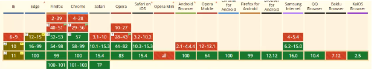
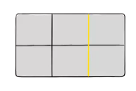
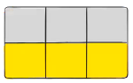
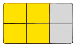

## 认识grid布局

- 目前对于界面布局我们已经学习了很多种方式：定位、浮动、flex布局

- flex布局相对于前面的布局来说更加强大，并且目前对于我们的需求都是可以很好的完成

  - 但是flex布局是有个以为的布局方案（one-dimensional layout）
  - 它主要的布局是再主轴（main axis） 上进行操作，当然也提供了一些交叉轴（cross axis）属性

- CSS为了更进一步增强自己的布局能力，提供了grid布局：

  - CSS Grid Layout （又名 “Grid” 或者 “CSS Grid”） 是一种基于二维布局系统（two-dimensional layout）
  - 它更强大，同时也更复杂

- 目前公司的生产环境的项目都是使用flex布局为主，因为它兼容性比flex布局差一些，所以grid布局暂时作为了解即可

  

### grid布局重要的概念

- Grid Container

  - 元素设置display为grid的盒子

- Grid Item，单元格称之为Grid cell

  - grid container的直接子项（碧血是直接子代）

- Grid Line

  - 构成网格结构的分割线

  - 它们可以是垂直的（"列网格线"）或水平的（”行网格线"）

    

- Grid Track

  - 两条相邻网格线之间的空间

  - 你可以看成是网格的行或者列

    

- Grid Area

  - 由四条网格线包裹的总空间

  - 一个网格区域可以由任意数列的网格单元组成

    

### grid布局常见属性

| grid container常见属性 | grid item常见属性 |
| ---------------------- | ----------------- |
| display                | grid-column-start |
| grid-template-columns  | grid-column-end   |
| grid-template-rows     | grid-row-start    |
| grid-template-areas    | grid-row-end      |
| grid-tempalte          | grid-column       |
| grid-column-gap        | grid-row          |
| grid-row-gap           | grid-area         |
| gird-gap               | justify-self      |
| justify-items          | align-self        |
| align-items            | place-self        |
| place-items            |                   |
| justify-content        |                   |
| align-content          |                   |
| place-content          |                   |
| grid-auto-columns      |                   |
| grid-auto -row         |                   |
| grid-auto-flow         |                   |
| gird                   |                   |

- https://css-tricks.com/snippets/css/complete-guide-grid/

