## CSS 的注释

- CSS 代码也可以添加注释来方便阅读：

- CSS 的注释和 HTML 的注释是不一样的；

- /_ 注释内容 _/

  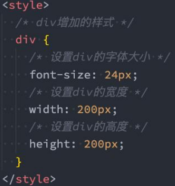

## link 元素

- link 元素是外部资源链接元素，规范了文档与外部资源的关系
  - link 元素通常是在 head 元素中
- 最常用的链接是样式表（CSS）；
  - 此外也可以被用来创建站点图标（比如 “favicon” 图标）；
- link 元素常见的属性：
- href：此属性指定被链接资源的 URL。 URL 可以是绝对的，也可以是相对的。
- rel：指定链接类型，常见的链接类型：https://developer.mozilla.org/zh-CN/docs/Web/HTML/Link_types
  - icon：站点图标；
  - stylesheet：CSS 样式；

### link 元素性能优化

在 link 中的 rel 设置 preload 优化前端加载 速度，会尽快加载浏览器所需资源计算机进制

script 会阻塞浏览器的解析，所以 import 会阻塞解析，而 link 会单独加载，不会阻塞解析

### 认识进制

- 进制的概念

  - 维基百科：进位制是一种记数方式，亦称进位计数法或位值计数法。
  - 通俗理解：当数字达到某个值时，进一位(比如从 1 位变成 2 位)。

- 按照进制的概念，来理解一下十进制：
  - 当数字到 9 的时候，用一位已经表示不了了，那么就进一位变成 2 位。
  - 在东北没有什么是一顿烧烤不能解决的，如果有，那就两顿。
- 按照上面的来理解，二进制、八进制、十六进制：
  - 二进制：当数字到 1 的时候，用一位已经表示不了了，那么就进一位。
  - 八进制：当数字到 7 的时候，用一位已经表示不了了，那么就进一位。
  - 十六进制：等等，用一位如何表示十六个数字呢？a(10)、b(11)、c(12) 、 d(13) 、 e(14) 、 f(15) ◼

### 人类的十进制

- 我们平时使用的数字都是十进制的，当我写下一个数字的时候，你会默认当做十进制来使用。
- 从发明数字的开始，人类就使用十进制，原因可能是人类正好十根手指。
- 如果人类有八根手指，现在用的可能是八进制。

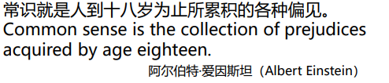

### 计算机中的进制

- 为什么计算机更喜欢二进制呢?
  - 前面我们已经介绍过了为什么计算机更喜欢二进制了；
  - 和其底层的原理有关系；
- 如何表示二进制、八进制、十六进制?
  - 二进制（0b 开头, binary）：其中的数字由 0、1 组成，可以回顾之前学习过的机器语言。
  - 八进制（0o 开头, Octonary）：其中的数字由 0~7 组成。
  - 十六进制（0x 开头, hexadecimal）：其中的数字由 0~9 和字母 a-f 组成（大小写都可以）
- 十进制 or 二进制:
  - 虽然计算机更喜欢二进制, 但是编程中我们还是以十进制为主.
  - 因为高级编程语言的目的就是更加接近自然语言, 让我们人类更容易理解.

### 进制之间的转换

- 十进制转其他进制：
  - 整除, 取余数.
- 其他进制转十进制：
  - 比如二进制的 1001 转成十进制: 1 _ 2³ + 0 _ 2² + 0 \* 2 + 1 = 9
  - 比如八进制的 1234 转成十进制: 1 _ 8³ + 2 _ 8² + 3 \* 8 + 4 = 668
  - 比如十六进制的 522 转成十进制: 5 _ 16² + 2 _ 16 + 2 = 1314
- 二进制转八进制：
  - 三位转成一位八进制
- 二进制转十六进制：
  - 四位转成一位十六进制
- 如果 520 情人节忘记了，给大家一个建议，在 522 那天过，因为十六进制的 522，对应的十进制是 1314。

## css 颜色

### CSS 表示颜色

- 在 CSS 中，颜色，有以下几种表示方法：
- 颜色关键字（color keywords）：
  - 是不区分大小写的标识符，它表示一个具体的颜色；
  - 可以表示哪些颜色呢？
  - https://developer.mozilla.org/zh-CN/docs/Web/CSS/color_value#%E8%AF%AD%E6%B3%95
- RGB 颜色：
  - RGB 是一种色彩空间，通过 R（red，红色）、G（green，绿色）、B（blue，蓝色）三原色来组成了不同的颜色；
    - 也就是通过调整这三个颜色不同的比例，可以组合成其他的颜色；
  - RGB 各个原色的取值范围是 0~255；

### RGB 的表示方式

- RGB 颜色可以通过以#为前缀的十六进制字符和函数（rgb()、rgba()）标记表示。
- 方式一：十六进制符号：#RRGGBB[AA]
  - R（红）、G（绿）、B （蓝）和 A （alpha）是十六进制字符（0–9、A–F）；A 是可选的。
    - 比如，#ff0000 等价于#ff0000ff；
- 方式二：十六进制符号：#RGB[A]
  - R（红）、G（绿）、B （蓝）和 A （alpha）是十六进制字符（0–9、A–F）；
  - 三位数符号（#RGB）是六位数形式（#RRGGBB）的减缩版。
    - 比如，#f09 和#ff0099 表示同一颜色。
  - 四位数符号（#RGBA）是八位数形式（#RRGGBBAA）的减缩版。
    - 比如，#0f38 和#00ff3388 表示相同颜色。
- 方式三：函数符： rgb[a](R, G, B[, A])
  - R（红）、G（绿）、B （蓝）可以是（数字），或者（百分比），255 相当于 100%。
  - A（alpha）可以是 0 到 1 之间的数字，或者百分比，数字 1 相当于 100%（完全不透明）。

## 边框的形状

- border 主要是用来给盒子增加边框的, 但是在开发中我们也可以利用边框的特性来实现一些形状:

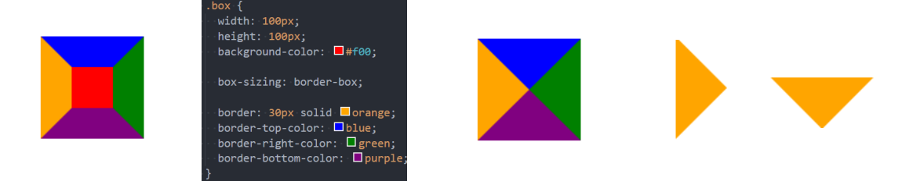

- 假如我们将 border 宽度设置成 50 会是什么效果呢?
  - 如果我们进一步, 将另外三边的颜色去除呢?
  - 如果我们将这个盒子旋转呢?
- 所以利用 border 或者 CSS 的特性我们可以做出很多图形:
  - https://css-tricks.com/the-shapes-of-css/#top-of-site

## Web 字体

### 认识 Web 字体

- 在之前我们有设置过页面使用的字体: font-family
  - 我们需要提供一个或多个字体种类名称，浏览器会在列表中搜寻，直到找到它所运行的系统上可用的字体。
  - 这样的方式完全没有问题，但是对于传统的 web 开发人员来说，字体选择是有限的;
  - 这就是所谓的 Web-safe 字体;
  - 并且这种默认可选的字体并不能进行一些定制化的需求;
- 比如下面的字体样式, 系统的字体肯定是不能实现的


- 那么我们是否依然可以在网页中使用这些字体呢? 使用 Web Fonts 即可.

### Web fonts 的工作原理

- 首先, 我们需要通过一些渠道获取到希望使用的字体(不是开发来做的事情):
  - 对于某些收费的字体, 我们需要获取到对应的授权;
  - 对于某些公司定制的字体, 需要设计人员来设计;
  - 对于某些免费的字体, 我们需要获取到对应的字体文件;
- 其次, 在我们的 CSS 代码当中使用该字体(重要):
  - 具体的过程看后面的操作流程;
- 最后, 在部署静态资源时, 将 HTML/CSS/JavaScript/Font 一起部署在静态服务器中;
- 用户的角度:
  - 浏览器一个网页时, 因为代码中有引入字体文件, 字体文件会被一起下载下来;
  - 浏览器会根据使用的字体在下载的字体文件中查找、解析、使用对应的字体；
  - 在浏览器中使用对应的字体显示内容；

### 使用 Web Fonts

- 课堂上为了给大家演示，通过如下的方式获取到了字体文件：

- 第一步：在字体天下网站下载一个字体
  - https://www.fonts.net.cn/fonts-zh-1.html
  - 默认下载下来的是 ttf 文件；
- 第二步：使用字体；
- 使用过程如下：
  1. 将字体放到对应的目录中
  2. 通过@font-face 来引入字体, 并且设置格式
  3. 使用字体
- 注意: @font-face 用于加载一个自定义的字体;

### web-fonts 的兼容性

- 我们刚才使用的字体文件是 .ttf, 它是 TrueType 字体.
  - 在开发中某些浏览器可能不支持该字体, 所以为了浏览器的兼容性问题, 我们需要有对应其他格式的字体;
- TrueType 字体：拓展名是 .ttf
  - OpenType/TrueType 字体：拓展名是 .ttf、.otf，建立在 TrueType 字体之上
  - Embedded OpenType 字体：拓展名是 .eot，OpenType 字体的压缩版
  - SVG 字体：拓展名是 .svg、 .svgz
  - WOFF 表示 Web Open Font Format web 开放字体：拓展名是 .woff，建立在 TrueType 字体之上
- 这里我们提供一个网站来生产对应的字体文件:
  - https://font.qqe2.com/# 暂时可用

### web fonts 兼容性写法

- 如果我们具备很强的兼容性, 那么可以如下格式编写:

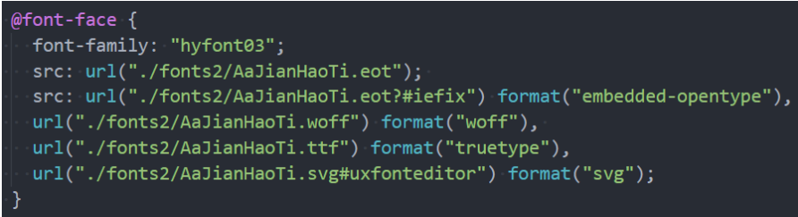

- 这被称为"bulletproof @font-face syntax（刀枪不入的@font-face 语法）“:
  - 这是 Paul Irish 早期的一篇文章提及后@font-face 开始流行起来 (Bulletproof @font-face Syntax)。
- src 用于指定字体资源
  - url 指定资源的路径
  - format 用于帮助浏览器快速识别字体的格式;

## 字体图标

### 认识字体图标

- 思考：字体可以设计成各式各样的形状，那么能不能把字体直接设计成图标的样子呢？
  - 当然可以，这个就叫做字体图标。
- 字体图标的好处：
  - 放大不会失真
  - 可以任意切换颜色
  - 用到很多个图标时，文件相对图片较小
- 字体图标的使用：
  - 登录阿里 icons（https://www.iconfont.cn/）
  - 下载代码，并且拷贝到项目中
- 将字体文件和默认的 css 文件导入到项目中

## 字体图标的使用

- 字体图标的使用步骤:
  - 第一步: 通过 link 引入 iconfont.css 文件
  - 第二步: 使用字体图标
- 使用字体图标常见的有两种方式:
  - 方式一: 通过对应字体图标的 Unicode 来显示代码;
  - 方式二: 利用已经编写好的 class, 直接使用即可;

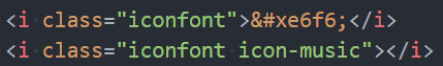

## 精灵图

### 认识精灵图 CSS Sprite

- 什么是 CSS Sprite
  - 是一种 CSS 图像合成技术，将各种小图片合并到一张图片上，然后利用 CSS 的背景定位来显示对应的图片部分
  - 有人翻译为：CSS 雪碧、CSS 精灵
- 使用 CSS Sprite 的好处
  - 减少网页的 http 请求数量，加快网页响应速度，减轻服务器压力
  - 减小图片总大小
  - 解决了图片命名的困扰，只需要针对一张集合的图片命名
- Sprite 图片制作（雪碧图、精灵图）
  - 方法 1：Photoshop, 设计人员提供
  - 方法 2：https://www.toptal.com/developers/css/sprite-generator

### 精灵图的使用

- 精灵图如何使用呢?
  - 精灵图的原理是通过只显示图片的很小一部分来展示的;
  - 通常使用背景:
    1. 设置对应元素的宽度和高度
    2. 设置精灵图作为背景图片
    3. 调整背景图片的位置来展示
- 如何获取精灵图的位置
  - http://www.spritecow.com/

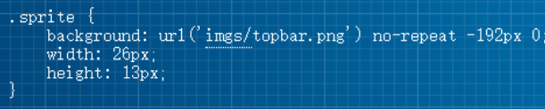

## cusor 鼠标指针

- cursor 可以设置鼠标指针（光标)在元素上面时的显示样式
- cursor 常见的设值有
  - auto：浏览器根据上下文决定指针的显示样式，比如根据文本和非文本切换指针样式
  - default：由操作系统决定，一般就是一个小箭头
  - pointer：一只小手，鼠标指针挪动到链接上面默认就是这个样式
  - text：一条竖线，鼠标指针挪动到文本输入框上面默认就是这个样式
  - none：没有任何指针显示在元素上面

## CSS 属性 - white-space

- white-space 用于设置空白处理和换行规则
  - normal：合并所有连续的空白，允许单词超屏时自动换行
  - nowrap：合并所有连续的空白，不允许单词超屏时自动换行
  - pre：阻止合并所有连续的空白，不允许单词超屏时自动换行
  - pre-wrap：阻止合并所有连续的空白，允许单词超屏时自动换行
  - pre-line：合并所有连续的空白（但保留换行），允许单词超屏时自动换行

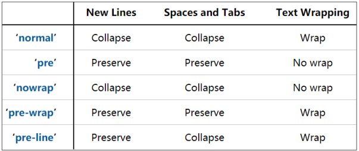

## CSS 属性 - text-overflow

- text-overflow 通常用来设置文字溢出时的行为

  - clip：溢出的内容直接裁剪掉（字符可能会显示不完整）
  - ellipsis：溢出那行的结尾处用省略号表示

- text-overflow 生效的前提是 overflow 不为 visible

- 常见的是将 white-space、text-overflow、overflow 一起使用：

  ```css
  white-space: nowrap;
  text-overflow: ellipsis;
  overflow: hidden;
  ```

## CSS 中的函数

- 在前面我们有使用过很多个 CSS 函数:
  - 比如 rgb/rgba/translate/rotate/scale 等;
  - CSS 函数通常可以帮助我们更加灵活的来编写样式的值；
- 下面我们再学习几个非常好用的 CSS 函数:
  - var: 使用 CSS 定义的变量;
  - calc: 计算 CSS 值, 通常用于计算元素的大小或位置;
  - blur: 毛玻璃(高斯模糊)效果;
  - gradient：颜色渐变函数；

### CSS 函数 - var

- CSS 中可以自定义属性

  - 属性名需要以两个减号（--）开始;

  - 属性值则可以是任何有效的 CSS 值;

    ```css
    div {
      --why-color: red;
    }
    ```

- 可以通过 var 函数来使用:

  ```css
  span {
    color: var(--why-color);
  }
  ```

- 规则集定义的选择器, 是自定义属性的可见作用域(只在选择器内部有效)

  - 所以推荐将自定义属性定义在 html 中，也可以使用 :root 选择器;

### CSS 函数 -calc

- calc() 函数允许在声明 CSS 属性值时执行一些计算。

  - 计算支持加减乘除的运算；
    - 和 - 运算符的两边必须要有空白字符。
  - 通常用来设置一些元素的尺寸或者位置；

  ```css
  .box .container2 {
    display: inline-block;
    width: calc(100% - 60px);
    height: 100%;
    background-color: #0ff;
  }
  ```

### CSS 函数 - blur

- blur() 函数将高斯模糊应用于输出图片或者元素;

  - blur(radius)
  - radius, 模糊的半径, 用于定义高斯函数的偏差值, 偏差值越大, 图片越模糊;

- 通常会和两个属性一起使用：

  - filter: 将模糊或颜色偏移等图形效果应用于元素;

  - backdrop-filter: 为元素后面的区域添加模糊或者其他效果;

    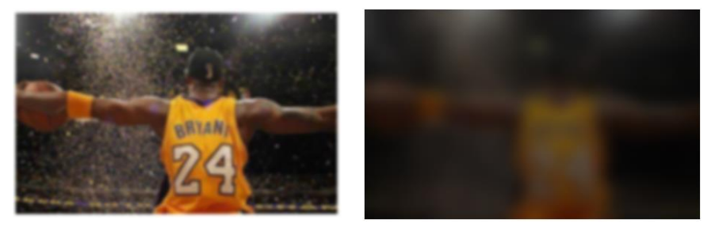

### CSS 函数 – gradient

- gradient 是一种 image CSS 数据类型的子类型，用于表现两种或多种颜色的过渡转变。

- CSS 的 image 数据类型描述的是 2D 图形；

- 比如 background-image、list-style-image、border-image、content 等；

- image 常见的方式是通过 url 来引入一个图片资源；

- 它也可以通过 CSS 的 gradient 函数来设置颜色的渐变；

- gradient 常见的函数实现有下面几种：
- linear-gradient()：创建一个表示两种或多种颜色线性渐变的图片；
- radial-gradient()：创建了一个图像，该图像是由从原点发出的两种或者多种颜色之间的逐步过渡组成；
- repeating-linear-gradient()：创建一个由重复线性渐变组成的 image ；
- repeating-radial-gradient()：创建一个重复的原点触发渐变组成的 image ；
- 等等；

### linear-gradient 的使用

- linear-gradient：创建一个表示两种或多种颜色线性渐变的图片；

  ```css
  background-image: linear-gradient(blue, red);
  background-image: linear-gradient(to right, blue, red);
  background-image: linear-gradient(to right bottom, blue, red);
  background-image: linear-gradient(45deg, blue, red);
  background-image: linear-gradient(
    to right,
    blue,
    red 10%,
    purple 40px,
    orange
  );
  ```

- radial-gradient：创建了一个图像，该图像是由从原点发出的两种或者多种颜色之间的逐步过渡组成；

  ```css
  background-image: redial-gradient(blue, red);
  background-image: redial-gradient(at 0% 50%, red, tellow);
  ```

**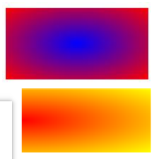**

## FC – Formatting Context （格式化上下文）

- 什么是 FC 呢？

  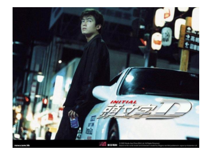

- FC 的全称是 Formatting Context，元素在标准流里面都是属于一个 FC 的；

  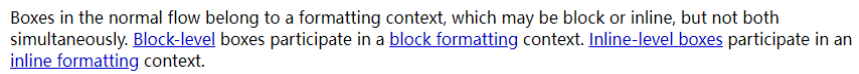

  - 所有盒子在标准流中是属于一个 fc（格式化上下文），可能使用块级（block）或者行内（inline），但是不会同时属于这两个。块级元素，div、p、h1、h2 等都属于一个 BFC（块级格式化上下文）。行内元素 a、span、i、img 等都属于一个 IFC（行内格式化上下文）。

- 块级元素的布局属于 Block Formatting Context（BFC）

  - 也就是 block level box 都是在 BFC 中布局的；

- 行内级元素的布局属于 Inline Formatting Context（IFC）

  - 而 inline level box 都是在 IFC 中布局的；

## BFC – Block Formatting Context

- block level box 都是在 BFC 中布局的，那么这个 BFC 在哪里呢？拿出来给我看看。

  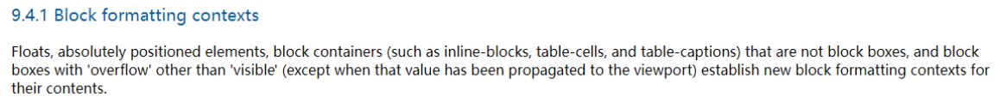

- MDN 上有整理出在哪些具体的情况下会创建 BFC：

  - 根元素（ html ）
  - 浮动元素（元素的 float 不是 none）
  - 绝对定位元素（元素的 position 为 absolute 或 fixed）
  - 行内块元素（元素的 display 为 inline-block）
  - 表格单元格（元素的 display 为 table-cell，HTML 表格单元格默认为该值），表格标题（元素的 display 为 table-caption，HTML 表格标题默认为该值）
  - 匿名表格单元格元素（元素的 display 为 table、table-row、 table-row-group、table-header-group、table-footer-group（分别是 HTML table、
  - row、tbody、thead、tfoot 的默认属性）或 inline-table）
  - overflow 计算值(Computed)不为 visible 的块元素
  - 弹性元素（display 为 flex 或 inline-flex 元素的直接子元素）
  - 网格元素（display 为 grid 或 inline-grid 元素的直接子元素）
  - display 值为 flow-root 的元素

### BFC 有什么作用呢？

- 我们来看一下官方文档对 BFC 作用的描述：

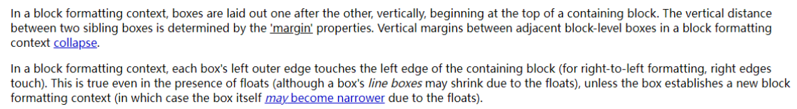

- 简单概况如下：
  - 在 BFC 中，box 会在垂直方向上一个挨着一个的排布；
  - 垂直方向的间距由 margin 属性决定；
  - 在同一个 BFC 中，相邻两个 box 之间的 margin 会折叠（collapse）；
  - 在 BFC 中，每个元素的左边缘是紧挨着包含块的左边缘的；
- 那么这个东西有什么用呢？
  - 解决 margin 的折叠问题；
  - 解决浮动高度塌陷问题；

### BFC 的作用一：解决折叠问题（权威）

- 在同一个 BFC 中，相邻两个 box 之间的 margin 会折叠（collapse）

  - 官方文档明确的有说

  - The vertical distance between two sibling boxes is determined by the 'margin' properties. Vertical margins between adjacent block-level boxes in a block formatting context collapse.

  - 那么如果我们让两个 box 是不同的 BFC 呢？那么就可以解决折叠问题。

    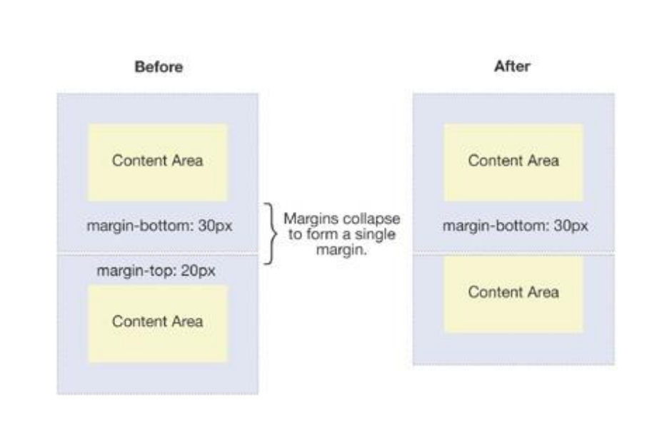

### BFC 的作用二：解决浮动高度塌陷（权威）

- 网上有很多说法，BFC 可以解决浮动高度塌陷，可以实现清除浮动的效果。

  - 但是从来没有给出过 BFC 可以解决高度塌陷的原理或者权威的文档说明；
  - 他们也压根没有办法解释，为什么可以解决浮动高度的塌陷问题，但是不能解决绝对定位元素的高度塌陷问题呢？

- 事实上，BFC 解决高度塌陷需要满足两个条件：

  - 浮动元素的父元素触发 BFC，形成独立的块级格式化上下文（Block Formatting Context）；
  - 浮动元素的父元素的高度是 auto 的；

- BFC 的高度是 auto 的情况下，是如下方法计算高度的

  1. 如果只有 inline-level，是行高的顶部和底部的距离；

  2. 如果有 block-level，是由最底层的块上边缘和最底层,块盒子的下边缘之间的距离

  3. 如果有绝对定位元素，将被忽略；

  4. **如果有浮动元素，那么会增加高度以包括这些浮动元素的下边缘**

     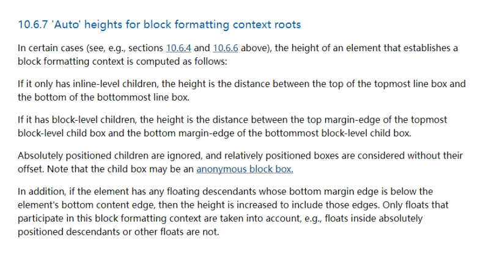

## overflow 属性

- overflow 用于控制内容溢出时的行为
  - visible：溢出的内容照样可见
  - hidden：溢出的内容直接裁剪
  - scroll：溢出的内容被裁剪，但可以通过滚动机制查看
  - 会一直显示滚动条区域，滚动条区域占用的空间属于 width、height
  - auto：自动根据内容是否溢出来决定是否提供滚动机制

### css 样式不生效问题总结

- 为何有时候编写的 CSS 属性不好使，有可能是因为
  - 选择器的优先级太低
  - 选择器没选中对应的元素
  - CSS 属性的使用形式不对
    - 元素不支持此 CSS 属性，比如 span 默认是不支持 width 和 height 的
    - 浏览器不支持此 CSS 属性，比如旧版本的浏览器不支持一些 css module3 的某些属性
    - 被同类型的 CSS 属性覆盖，比如 font 覆盖 font-size
  - 建议
    - 充分利用浏览器的开发者工具进行调试（增加、修改样式）、查错
