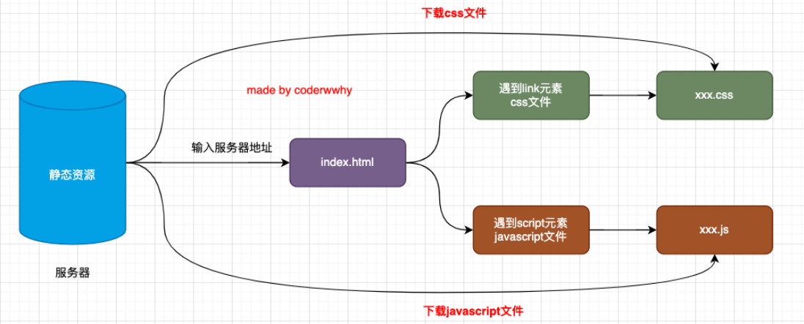
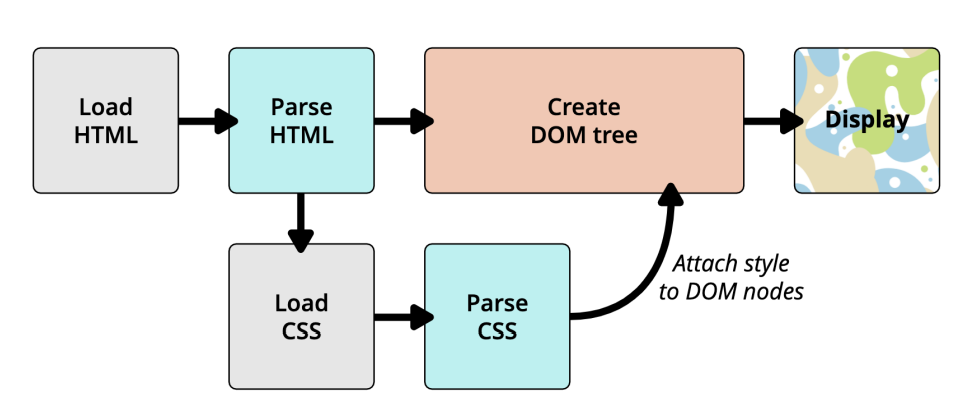
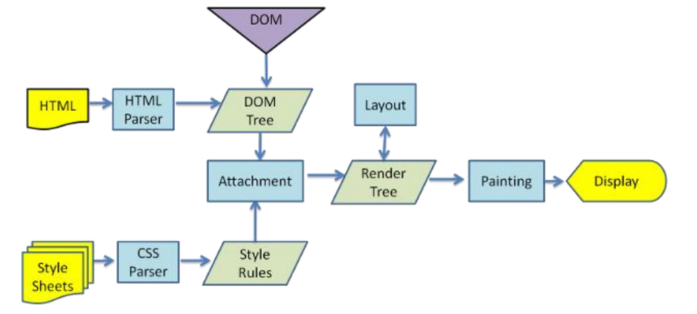
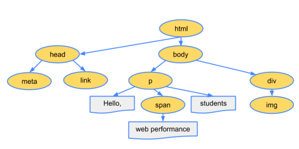
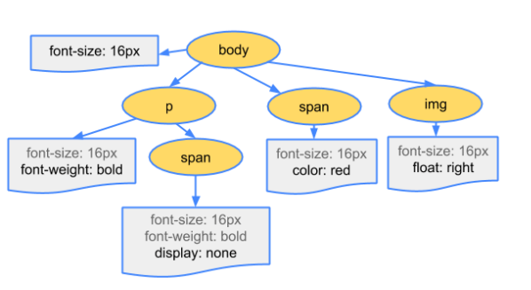
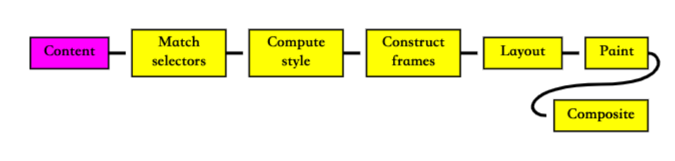
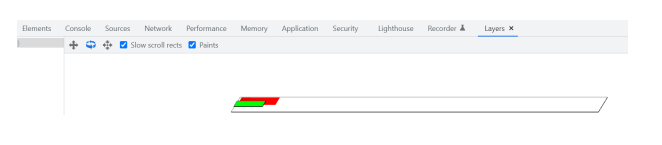

## 网页被解析的过程


- 大家有没有深入思考过：一个网页URL从输入到浏览器中，到显示经历过怎么样的解析过程呢？

  

- 要想深入理解下载的过程，我们还要先理解，一个index.html被下载下来后是如何被解析和显示在浏览器上的.

- 步骤

  1. 浏览器输入框判断输入内容
  2. 如果是ip或者是域名则开始dns解析
  3. dns解析完成获取到网站ip然后开始进行三次握手
  4. 握手完毕开始交流数据
  5. 浏览器开始下载html css js等文件
     1. 先加载Dom,然后再渲染上css
     2. 中途遇到js会停止渲染先加载js
     3. 如果遇到defer属性则会先下载然后等待Dom加载完毕再运行js
     4. 如果遇到async属性则会直接下载同时加载Dom,下载完毕即指向(不推荐)
  6. 数据下载完毕,四次挥手
  7. 心跳包(即时通讯)

## 浏览器内核


- 常见的浏览器内核有


  - Trident （ 三叉戟）：IE、360安全浏览器、搜狗高速浏览器、百度浏览器、UC浏览器；

  - Gecko（ 壁虎） ：Mozilla Firefox；

  - Presto（急板乐曲）-> Blink （眨眼）：Opera

  - Webkit ：Safari、360极速浏览器、搜狗高速浏览器、移动端浏览器（Android、iOS）

  - Webkit -> Blink ：Google Chrome，Edge

    

- 我们经常说的浏览器内核指的是浏览器的排版引擎：


  - 排版引擎（layout engine），也称为浏览器引擎（browser engine）、页面渲染引擎（rendering engine）或样版引擎。

- 也就是一个网页下载下来后，就是由我们的渲染引擎来帮助我们解析的。

## 渲染引擎如何解析页面

### 渲染页面的简洁流程


- 渲染引擎在拿到一个页面后，如何解析整个页面并且最终呈现出我们的网页呢？



### 渲染页面的详细流程


- 更详细的解析过程如下：

  

- https://www.html5rocks.com/en/tutorials/internals/howbrowserswork

#### 解析一：HTML解析过程


- 因为默认情况下服务器会给浏览器返回index.html文件，所以解析HTML是所有步骤的开始：

- 解析HTML，会构建DOM Tree：

  

#### 解析二 – 生成CSS规则


- 在解析的过程中，如果遇到CSS的link元素，那么会由浏览器负责下载对应的CSS文件：


  - 注意：下载CSS文件是不会影响DOM的解析的；

- 浏览器下载完CSS文件后，就会对CSS文件进行解析，解析出对应的规则树：


  - 我们可以称之为 CSSOM（CSS Object Model，CSS对象模型）；

    

#### 解析三 – 构建Render Tree (渲染树)


- 当有了DOM Tree和 CSSOM Tree后，就可以两个结合来构建Render Tree了
- 注意一：link元素不会阻塞DOM Tree的构建过程，但是会阻塞Render Tree的构建过程

  - 这是因为Render Tree在构建时，需要对应的CSSOM Tree；
- 注意二：Render Tree和DOM Tree并不是一一对应的关系，比如对于display为none的元素，压根不会出现在render tree中；

#### 解析四 – 布局（layout）和绘制（Paint）


- 第四步是在渲染树（Render Tree）上运行布局（Layout）以计算每个节点的几何体。


  - 渲染树会表示显示哪些节点以及其他样式，但是不表示每个节点的尺寸、位置等信息；
  - 布局是确定呈现树中所有节点的宽度、高度和位置信息；

- 第五步是将每个节点绘制（Paint）到屏幕上


  - 在绘制阶段，浏览器将布局阶段计算的每个frame转为屏幕上实际的像素点；

  - 包括将元素的可见部分进行绘制，比如文本、颜色、边框、阴影、替换元素（比如img） 

    

## 回流和重绘


- 理解回流reflow：（也可以称之为重排）

  - 第一次确定节点的大小和位置，称之为布局（layout）。
  - 之后对节点的大小、位置修改重新计算称之为回流。

- 什么情况下引起回流呢？

  - 比如DOM结构发生改变（添加新的节点或者移除节点）；
  - 比如改变了布局（修改了width、height、padding、font-size等值）
  - 比如窗口resize（修改了窗口的尺寸等）
  - 比如调用getComputedStyle方法获取尺寸、位置信息；

- 理解重绘repaint：

  - 第一次渲染内容称之为绘制（paint）。
  - 之后重新渲染称之为重绘。

- 什么情况下会引起重绘呢？

  - 比如修改背景色、文字颜色、边框颜色、样式等；

- 回流一定会引起重绘，所以回流是一件很消耗性能的事情。

- 所以在开发中要尽量避免发生回流：

  1. 修改样式时尽量一次性修改

    - 比如通过cssText修改，比如通过添加class修改

  2. 尽量避免频繁的操作DOM

    - 我们可以在一个DocumentFragment或者父元素中将要操作的DOM操作完成，再一次性的操作；

  3. 尽量避免通过getComputedStyle获取尺寸、位置等信息；
  4. 对某些元素使用position的absolute或者fixed

    - 并不是不会引起回流，而是开销相对较小，不会对其他元素造成影响。

### 特殊解析 – composite合成(合成层)


- 绘制的过程，可以将布局后的元素绘制到多个合成图层中。


  - 这是浏览器的一种优化手段；

- 默认情况下，标准流中的内容都是被绘制在同一个图层（Layer）中的；

- 而一些特殊的属性，会创建一个新的合成层（ CompositingLayer ），并且新的图层可以利用GPU来加速绘制；


  - 因为每个合成层都是单独渲染的；

- 那么哪些属性可以形成新的合成层呢？常见的一些属性：


  - 3D transforms

  - video、canvas、iframe

  - opacity 动画转换时；

  - position: fixed

  - will-change：一个实验性的属性，提前告诉浏览器元素可能发生哪些变化；

  - animation 或 transition 设置了opacity、transform；

    

- 分层确实可以提高性能，但是它以内存管理为代价，因此不应作为 web 性能优化策略的一部分过度使用。

## script元素和页面解析的关系


- 我们现在已经知道了页面的渲染过程，但是JavaScript在哪里呢？

  - 事实上，浏览器在解析HTML的过程中，遇到了script元素是不能继续构建DOM树的；
  - 它会停止继续构建，首先下载JavaScript代码，并且执行JavaScript的脚本；
  - 只有等到JavaScript脚本执行结束后，才会继续解析HTML，构建DOM树；
- 为什么要这样做呢？

  - 这是因为JavaScript的作用之一就是操作DOM，并且可以修改DOM；
  - 如果我们等到DOM树构建完成并且渲染再执行JavaScript，会造成严重的回流和重绘，影响页面的性能；
  - 所以会在遇到script元素时，优先下载和执行JavaScript代码，再继续构建DOM树；
- 但是这个也往往会带来新的问题，特别是现代页面开发中：

  - 在目前的开发模式中（比如Vue、React），脚本往往比HTML页面更“重”，处理时间需要更长；
  - 所以会造成页面的解析阻塞，在脚本下载、执行完成之前，用户在界面上什么都看不到；
- 为了解决这个问题，script元素给我们提供了两个属性（attribute）：defer和async。

### defer属性


- defer 属性告诉浏览器不要等待脚本下载，而继续解析HTML，构建DOM Tree。


  - 脚本会由浏览器来进行下载，但是不会阻塞DOM Tree的构建过程；

  - 如果脚本提前下载好了，它会等待DOM Tree构建完成，在DOMContentLoaded事件之前先执行defer中的代码；

- 所以DOMContentLoaded总是会等待defer中的代码先执行完成。

  ```html
  <script defer src="./js/defer-demo.js"></script>
  <script>
  	window.addEventListerner("DOMContentLoaded", () => {
      console.log("DOMContentLoaded")
    })
  </script>
  ```

- 另外多个带defer的脚本是可以保持正确的顺序执行的。

- 从某种角度来说，defer可以提高页面的性能，并且推荐放到head元素中；

- 注意：defer仅适用于外部脚本，对于script默认内容会被忽略。

### async属性


- async 特性与 defer 有些类似，它也能够让脚本不阻塞页面。

- async是让一个脚本完全独立的：


  - 浏览器不会因 async 脚本而阻塞（与 defer 类似）；

  - async脚本不能保证顺序，它是独立下载、独立运行，不会等待其他脚本；

  - async不会能保证在DOMContentLoaded之前或者之后执行；

    ```html
    <script>
    	window.addEventListerner("DOMContentLoaded", () => {
        console.log("DOMContentLoaded")
      })
    </script>
    <script async src="./js/async-demo.js"></script>
    ```

- defer通常用于需要在文档解析后操作DOM的JavaScript代码，并且对多个script文件有顺序要求的；

- async通常用于独立的脚本，对其他脚本，甚至DOM没有依赖的；