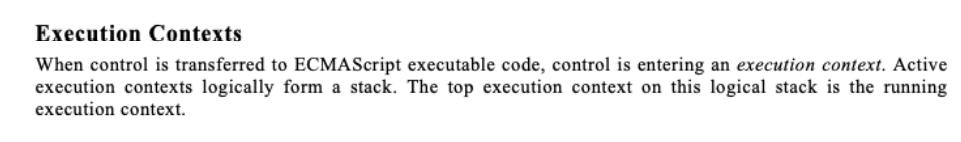

## JavaScrit引擎

### 认识JavaScrit引擎

- 为什么需要JavaScrit引擎呢？
  - 我们前面说过，高级的编程语言都是需要转成最终的机器指令来执行的；
  - 事实上我们编写的JavaScrit无论你交给浏览器或者Node执行，最后都是需要被CU执行的；
  - 但是CU只认识自己的指令集，实际上是机器语言，才能被CU所执行；
  - 所以我们需要JavaScrit引擎帮助我们将JavaScrit代码翻译成CU指令来执行；
- 比较常见的JavaScrit引擎有哪些呢？
  - SiderMonkey：第一款JavaScrit引擎，由BrendaEich开发（也就是JavaScrit作者）；
  - Chakra：微软开发，用于IT浏览器；
  - JavaScritCore：WebKit中的JavaScrit引擎，Ale公司开发；
  - V8：Google开发的强大JavaScrit引擎，也帮助Chrome从众多浏览器中脱颖而出；
  - 等等…

### 浏览器内核和JS引擎的关系

- 这里我们先以WebKit为例，WebKit事实上由两部分组成的：

  - WebCore：负责HTML解析、布局、渲染等等相关的工作；
  - JavaScritCore：解析、执行JavaScrit代码；

- 看到这里，学过小程序的同学有没有感觉非常的熟悉呢？

  - 在小程序中编写的JavaScrit代码就是被JSCore执行的；

  

- 另外一个强大的JavaScrit引擎就是V8引擎。

## V8引擎

### V8引擎的执行原理

- 我们来看一下官方对V8引擎的定义：

  - V8是用C ++编写的Google开源高性能JavaScrit和WebAssembly引擎，它用于Chrome和Node.js等。

  - 它实现ECMAScrit和WebAssembly，并在Windows 7或更高版本，macOS 10.12+和使用x64，IA-32，ARM或MIS处理器的Linux系统上运行。

  - V8可以独立运行，也可以嵌入到任何C ++应用程序中。

    

- 拓展知识

  - TurboFan可以收集函数的一些执行信息，当一个函数执行频率非常高的时候，会将这个函数标记为hot，当一个函数称为热函数的时候，就被转换成为机器码再保存下来，重复执行，减少字节码—>机器码的转换的过程
  - 当函数中类型发生变化的时候，进行Deoptimization的过程，机器码再转换回字节码

### V8引擎的架构

- V8引擎本身的源码非常复杂，大概有超过100w行C++代码，通过了解它的架构，我们可以知道它是如何对JavaScrit执行的：
- Parse模块会将JavaScrit代码转换成AST（抽象语法树），这是因为解释器并不直接认识JavaScrit代码；
  - 如果函数没有被调用，那么是不会被转换成AST的；
  - Parse的V8官方文档：https://v8.dev/blog/scanner
- Ignition是一个解释器，会将AST转换成ByteCode（字节码）
  - 同时会收集TurboFan优化所需要的信息（比如函数参数的类型信息，有了类型才能进行真实的运算）；
  - 如果函数只调用一次，Ignition会执行解释执行ByteCode；
  - Ignition的V8官方文档：https://v8.dev/blog/ignition-interreter
- TurboFan是一个编译器，可以将字节码编译为CU可以直接执行的机器码；
  - 如果一个函数被多次调用，那么就会被标记为热点函数，那么就会经过TurboFan转换成优化的机器码，提高代码的执行性能；
  - 但是，机器码实际上也会被还原为ByteCode，这是因为如果后续执行函数的过程中，类型发生了变化（比如sum函数原来执行的是number类型，后来执行变成了string类型），之前优化的机器码并不能正确的处理运算，就会逆向的转换成字节码；
  - TurboFan的V8官方文档：https://v8.dev/blog/turbofan-jit

### V8引擎的解析图1（官方）


### V8引擎解析图2


### V8执行的细节

1. 那么我们的JavaScrit源码是如何被解析（Parse过程）的呢？
2. Blink将源码交给V8引擎，Stream获取到源码并且进行编码转换；
3. Scanner会进行词法分析（lexical analysis），词法分析会将代码转换成tokens；
4. 接下来tokens会被转换成AST树，经过Parser和Prearser：
   - Parser就是直接将tokens转成AST树架构；
   - Prearser称之为预解析，为什么需要预解析呢？
     - 这是因为并不是所有的JavaScrit代码，在一开始时就会被执行。那么对所有的JavaScrit代码进行解析，必然会影响网页的运行效率；
       - 比如说某些还没有调用的函数，会先进行预解析，然后再代码后续执行到了这个位置后再进行全解析
     - 所以V8引擎就实现了Lazy arsing（延迟解析）的方案，它的作用是将不必要的函数进行预解析，也就是只解析暂时需要的内容，而对函数的全量解析是在函数被调用时才会进行；
     - 比如我们在一个函数outer内部定义了另外一个函数inner，那么inner函数就会进行预解析；
5. 生成AST树后，会被Ignition转成字节码（bytecode），之后的过程就是代码的执行过程（后续会详细分析）。

## JavaScript执行过程

### JavaScript的执行过程

假如我们有下面一段代码，它在JavaScrit中是如何被执行的呢？

```js
var name = "mjjh"
function foo() {
  var name = 'foo'
  console.log(name)
}
var num1 = 20
var num2 = 30
var result = num1 + num2
console.log(result)

foo()
```

1. 首先在全局作用域初始化变量 GO 
   1. 如果是引用类型则以 对象类型 对象名 堆内存地址(未赋值)
   2. 如果不是引用类型则以 对象类型 对象名 值(未赋值)
2. 然后开始执行,例如执行到 var name = "mjjh",就是将对应的值存放或者是将堆内存地址存入变量
3. 执行到函数时会创建一个FEC(函数执行上下文),并且将其压栈到执行上下文中,同时在堆内存中初始化AO对象(activation)
4. 等待函数执行完成后,FEC将会弹出,此时由于没有执行上下文指向AO对象,js引擎会触发垃圾回收机制将其回收

### 概念补充

1. 执行环境栈（Execution Context Stack）

   - 浏览器会从计算机内存中分配一块内存，专门用来供代码执行
   - javascript是单线程的，这意味着他只有一个调用栈
   - 基础数据类型存储在栈中

2. 堆内存（Heap）

   - 存放属性方法
   - 任何开辟的堆内存都有一个16进制的内存地址，存储在栈中，供变量调用
   - 引用数据类型存储会开辟一个堆内存，把内容存进去，然后把地址放到栈中供变量关联使用

3. 全局对象（Global Object）

   - 是一个堆内存，存储的是浏览器内置的属性和方法
   - 浏览器中window指向全局对象

4. VO（Varibale Object）

   - 变量对象，在当前的上下文中，用来存放创建的变量和值的地方

   - 每一个执行上下文会关联一个VO（Variable Object，变量对象），变量和函数声明会被添加到这个VO对象中。

     

   - 函数私有上下文中叫做AO（Activation Object）活动对象

   - 当全局代码被执行的时候, VO也就是GO(Global Object)全局对象

     

5. 执行上下文（Execution Context）

   - 全局执行上下文：当JavaScript 引擎第一次执行你的脚本时，它会创建一个全局的执行上下文并且压入当前执行栈
   - 函数执行上下文：函数调用时会创建一个私有上下文，并压入栈的顶部，javascript引擎会执行那些执行上下文位于栈顶的函数。当该函数执行结束时，执行上下文从栈中弹出，控制流程到达当前栈中的下一个上下文。

### 变量环境和记录

- 其实我们上面的讲解都是基于早期ECMA的版本规范：
  - 
- 在最新的ECMA的版本规范中，对于一些词汇进行了修改：
  - 
- 通过上面的变化我们可以知道，在最新的ECMA标准中，我们前面的变量对象VO已经有另外一个称呼了变量环境VE。

### 执行过程

#### 1 初始化全局对象

- js引擎会在执行代码之前，会在堆内存中创建一个全局对象：Global Object（GO）

  - 该对象 所有的作用域（scoe）都可以访问；

  - 里面会包含Date、Array、String、Number、setTimeout、setInterval等等；

  - 其中还有一个window属性指向自己；

    

    

#### 执行上下文栈（调用栈）

- js引擎内部有一个执行上下文栈（ExecutioContext Stack，简称ECS），它是用于执行代码的调用栈。那么现在它要执行谁呢？执行的是全局的代码块：

  - 全局的代码块为了执行会构建一个全局执行上下文 Global ExecutioContext（GEC）；
  - GEC会 被放入到ECS中 执行；

- GEC被放入到ECS中里面包含两部分内容：

  - 第一部分：在代码执行前，在arser转成AST的过程中，会将全局定义的变量、函数等加入到GlobalObject中，但是并不会赋值；

    - 这个过程也称之为变量的作用域提升（hoisting）

  - 第二部分：在代码执行中，对变量赋值，或者执行其他的函数；

    

#### 2 全局代码被执行前(全局执行上下文GEC被放入到执行上下文栈ECS中)


#### 3 全局代码执行过程后(GEC开始执行代码)


#### 遇到函数如何执行？

- 在执行的过程中执行到一个函数时，就会根据函数体创建一个函数执行上下文（Functional ExecutioContext，简称FEC），并且压入到EC Stack中。

- FEC中包含三部分内容：

  - 当进入一个函数执行上下文时，会创建一个AO对象（Activation Object）； 

  - 这个AO对象会使用arguments作为初始化，并且初始值是传入的参数； 

  - 这个AO对象会作为执行上下文的VO来存放变量的初始化；

    

    

#### 4 函数被执行前(FEC被放入到ECS中)


#### 5 函数执行过程后(FEC开始执行代码)


## 作用域和作用域链（Scope Chain）

- 当进入到一个执行上下文时，执行上下文也会关联一个作用域链（Scope Chain） 

  - 作用域链是一个对象列表，用于变量标识符的求值； 

  - 当进入一个执行上下文时，这个作用域链被创建，并且根据代码类型，添加一系列的对象；

    

### 作用域提升面试

1. ```js
   var n = 100
   function foo() {
     n = 200
   }
   foo()
   console.log(n)
   
   // 200
   ```

2. ```js
   function foo() {
   	console.log(n)
     n = 200
     console.log(n)
   }
   var n = 100
   foo()
   
   // undefined
   // 200
   ```

3. ```js
   var n = 100
   
   function foo1() {
     console.log(n);
   }
   
   function foo2() {
     var n = 200
     console.log(n)
     foo1()
   }
   
   foo2()
   console.log(n);
   
   // 200
   // 100
   // 100
   ```

4. ```js
   var a = 100
   
   function foo(){
     console.log(a)
     return
     var a = 100
   }
   foo()
   
   // undefined
   ```

5. ```js
   function foo() {
   var a = b = 100
   }
   
   foo()
   
   console.log(a)
   console.log(b)
   
   // a未定义
   // b = 100 特殊情况
   ```
