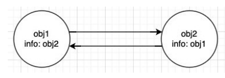
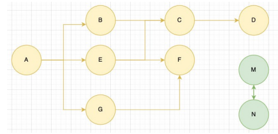
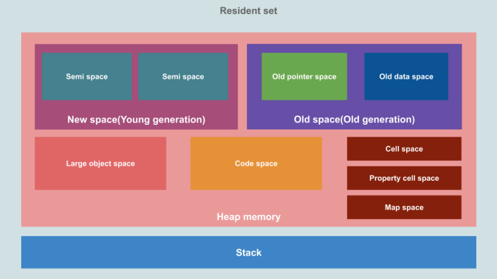
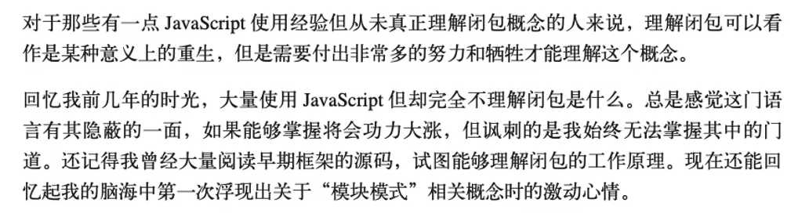
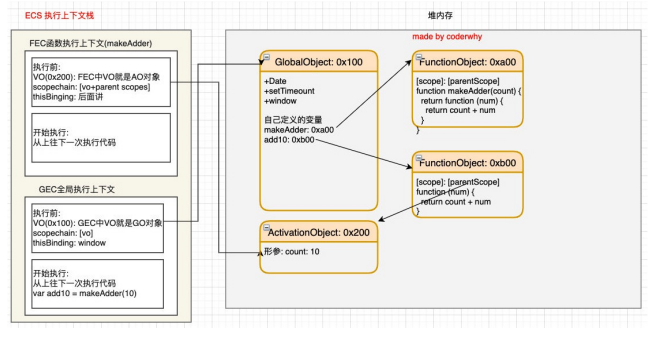
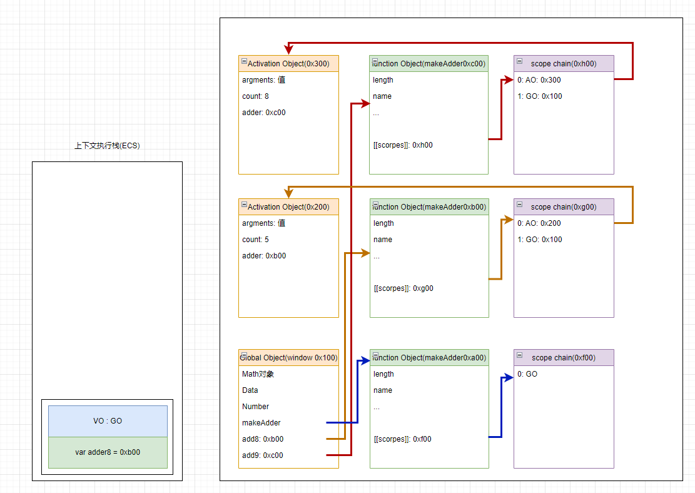
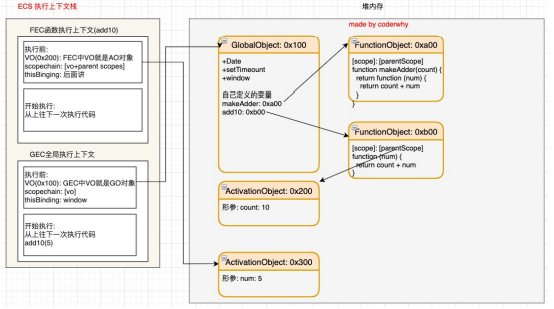
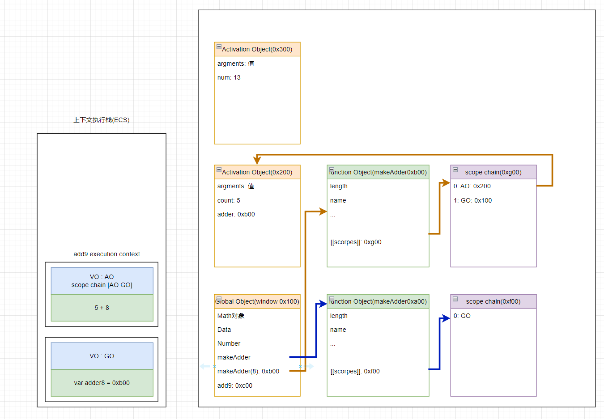
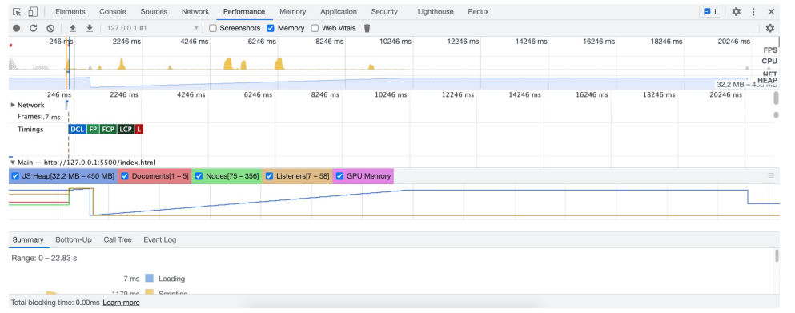
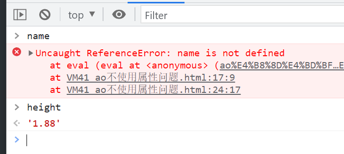

## 内存管理

###  认识内存管理 

- 不管什么样的编程语言，在代码的执行过程中都是需要给它分配内存的，不同的是某些编程语言需要我们自己手动 的管理内存，某些编程语言会可以自动帮助我们管理内存： 
- 不管以什么样的方式来管理内存，内存的管理都会有如下的生命周期：
  - 第一步：分配申请你需要的内存（申请）；
  - 第二步：使用分配的内存（存放一些东西，比如对象等）；
  - 第三步：不需要使用时，对其进行释放； 
- 不同的编程语言对于第一步和第三步会有不同的实现：
- 手动管理内存：比如C、C++，包括早期的OC，都是需要手动来管理内存的申请和释放的（malloc和free函 数）；
- 自动管理内存：比如Java、JavaScript、Python、Swift、Dart等，它们有自动帮助我们管理内存；
- 我们可以知道JavaScript通常情况下是不需要手动来管理的。

### JS的内存管理

- JavaScript会在定义变量时为我们分配内存。 

- 但是内存分配方式是一样的吗？ 

  - JS对于基本数据类型内存的分配会在执行时， 直接在栈空间进行分配；
  - JS对于复杂数据类型内存的分配会在堆内存 中开辟一块空间，并且将这块空间的指针返 回值变量引用；

  

## 垃圾回收

### JS的垃圾回收

- 因为内存的大小是有限的，所以当内存不再需要的时候，我们需要对其进行释放，以便腾出更多的内存空间。 
- 在手动管理内存的语言中，我们需要通过一些方式自己来释放不再需要的内存，比如free函数：
  - 但是这种管理的方式其实非常的低效，影响我们编写逻辑的代码的效率； 
  - 并且这种方式对开发者的要求也很高，并且一不小心就会产生内存泄露； 
- 所以大部分现代的编程语言都是有自己的垃圾回收机制： 
  - 垃圾回收的英文是Garbage Collection，简称GC； 
  - 对于那些不再使用的对象，我们都称之为是垃圾，它需要被回收，以释放更多的内存空间； 
  - 而我们的语言运行环境，比如Java的运行环境JVM，JavaScript的运行环境js引擎都支持内存垃圾回收器； 
  - 垃圾回收器我们也会简称为GC，所以在很多地方你看到GC其实指的是垃圾回收器； 
- 但是这里又出现了另外一个很关键的问题：GC怎么知道哪些对象是不再使用的呢？ 
  - 这里就要用到GC的算法了

### 常见CG算法 - 引用计数

-  引用计数： 
-  当一个对象有一个引用指向它时，那么这个对象的引用就+1，当一个对象的引用为0时，这个对象就可以被销毁掉； 
-  这个算法有一个很大的弊端就是会产生循环引用； 



### 常见CG算法 - 标记清除

- 标记清除： 

  - 这个算法是设置一个根对象（root object），垃圾回收器会定期从这个根开始，找所有从根开始有引用到的对象，对 于哪些没有引用到的对象，就认为是不可用的对象； 

  - 这个算法可以很好的解决循环引用的问题； 

    

- JS引擎比较广泛的采用的就是标记清除算法，当然类似于V8引擎为了进行更好的优化，它在算法的实现细节上也会结合 一些其他的算法。 

### 常见的GC算法 - 其他算法优化补充

- JS引擎比较广泛的采用的就是可达性中的标记清除算法，当然类似于V8引擎为了进行更好的优化，它在算法的实现细节上也会 结合一些其他的算法。 
- 标记整理（Mark-Compact） 和“标记－清除”相似； 
  - 不同的是，回收期间同时会将保留的存储对象搬运汇集到连续的内存空间，从而整合空闲空间，避免内存碎片化； 
- 分代收集（Generational collection）—— 对象被分成两组：“新的”和“旧的”。 
  - 许多对象出现，完成它们的工作并很快死去，它们可以很快被清理； 
  - 那些长期存活的对象会变得“老旧”，而且被检查的频次也会减少； 
- 增量收集（Incremental collection） 
  - 如果有许多对象，并且我们试图一次遍历并标记整个对象集，则可能需要一些时间，并在执行过程中带来明显的延迟。 
  - 所以引擎试图将垃圾收集工作分成几部分来做，然后将这几部分会逐一进行处理，这样会有许多微小的延迟而不是一个大的 延迟； 
- 闲时收集（Idle-time collection） 
  - 垃圾收集器只会在 CPU 空闲时尝试运行，以减少可能对代码执行的影响。

### V8引擎详细内存图

- 事实上，V8引擎为了提供内存的管理效率，对内存进行非常详细的划分：

  

## 闭包

### 让人迷惑的闭包

- 闭包是JavaScript中一个非常容易让人迷惑的知识点：

  - 这几天看到有同学在深入JS高级的交流群中发了这么一张图片； 

  - 并且闭包也是群里面大家讨论最多的一个话题； 

    

    - 《你不知道的JavaScript》

- 闭包确实是JavaScript中一个很难理解的知识点，接下来我们就对其一步步来进行剖析，看看它到底有什么神奇之 处。

###  JS中函数是一等公民 

- 在JavaScript中，函数是非常重要的，并且是一等公民：
- 那么就意味着函数的使用是非常灵活的； 
- 函数可以作为另外一个函数的参数，也可以作为另外一个函数的返回值来使用； 
- 自己编写高阶函数 
- 使用内置的高阶函数
- 高阶函数: 
  - 把一个函数如果接受另外一个函数作为参数,或者该函数会返回另外一个函数作为返回值的函数, 那么这个函数就称之为是一个高阶函数

### 闭包的定义

- 这里先来看一下闭包的定义，分成两个：在计算机科学中和在JavaScript中。 
- 在计算机科学中对闭包的定义（维基百科）： 
  - 闭包（英语：Closure），又称词法闭包（Lexical Closure）或函数闭包（function closures）； 
  - 是在支持 **头等函数** 的编程语言中，实现词法绑定的一种技术； (函数是第一公民的语言)
  - 闭包在实现上是一个结构体，它存储了一个函数和一个关联的环境（相当于一个符号查找表）；
  - 闭包跟函数最大的区别在于，当捕捉闭包的时候，它的 自由变量 会在捕捉时被确定，这样即使脱离了捕捉时的上下文，它也能照常运行； 
- 闭包的概念出现于60年代，最早实现闭包的程序是 Scheme，那么我们就可以理解为什么JavaScript中有闭包： 
  - 因为JavaScript中有大量的设计是来源于Scheme的； 
- 我们再来看一下MDN对JavaScript闭包的解释： 
  - 一个函数和对其周围状态（lexical environment，词法环境）的引用捆绑在一起（或者说函数被引用包围），这样的组合就是闭包（closure）； 
  - 也就是说，闭包让你可以在一个内层函数中访问到其外层函数的作用域； 
  - 在 JavaScript 中，每当创建一个函数，闭包就会在函数创建的同时被创建出来； 
- 那么我的理解和总结： 
  -  一个普通的函数function，如果它可以访问外层作用于的自由变量，那么这个函数就是一个闭包； 
  -  从广义的角度来说：JavaScript中的函数都是闭包； 
  -  从狭义的角度来说：JavaScript中一个函数，如果访问了外层作用域的变量，那么它是一个闭包； 

### 闭包的访问过程

- 如果我们编写了如下的代码，它一定是形成了闭包的：

```js
  function makeAdder(count){
  	return function (num){
  		return count + num
  	}
  }
  
  var add9 = makeAdder(8)
  console.log(add9(5))
```

  



### 闭包的执行过程

- 那么函数继续执行呢？ 

  - 这个时候makeAdder函数执行完毕，正常情况下我们的AO对象会被释放； 

  - 但是因为在0xb00的函数中有作用域引用指向了这个AO对象，所以它不会被释放掉； 

    



###  闭包的内存泄露

- 那么我们为什么经常会说闭包是有内存泄露的呢？ 

  - 在上面的案例中，如果后续我们不再使用add9函数了，那么该函数对象应该要被销毁掉，并且其引用着的父作用域AO也应该被销毁掉； 
  - 但是目前因为在全局作用域下add9变量对0xb00的函数对象有引用，而0xb00的作用域中AO（0x200）有引用，所以最终会造成这些内存都是无法被释放的； 
  - 所以我们经常说的闭包会造成内存泄露，其实就是刚才的引用链中的所有对象都是无法释放的； 

- 那么，怎么解决这个问题呢？ 

  - 因为当将add9设置为null时，就不再对函数对象0xb00有引用，那么对应的AO对象0x200也就不可达了； 

  - 在GC的下一次检测中，它们就会被销毁掉；

    ```
    add9 = null
    ```

    

### 闭包的内存泄漏测试 

```js
function createFnArray() {
  // var arr = [1, 1, 1, 1, 1, 1, 1, 1,1, 1,1, 1,1 ]
  // 占据的空间是4M x 100 + 其他的内存 = 400M+
  // 1 -> number -> 8byte -> 8M
  // js: 10 3.14 -> number -> 8byte ? js引擎
  // 8byte => 2的64次方 => 4byte
  // 小的数字类型, 在v8中成为Sim, 小数字 2的32次方
  var arr = new Array(1024 * 1024).fill(1)
  return function() {
    console.log(arr.length)
  }
}

// var arrayFn = createFnArray()
// arrayFn = null

// 100 * 100 = 10000 = 10s
var arrayFns = []
for (var i = 0; i < 100; i++) {
  setTimeout(() => {
    arrayFns.push(createFnArray())
  }, i * 100);
}

// arrayFns = null
setTimeout(() => {
  for (var i = 0; i < 50; i++) {
    setTimeout(() => {
      arrayFns.pop()
    }, 100 * i);
  }
}, 10000);
```



## AO不使用的属性（闭包中有些不使用的变量会不会销毁）

- 我们来研究一个问题：AO对象不会被销毁时，是否里面的所有属性都不会被释放？

  - 下面这段代码中name属于闭包的父作用域里面的变量； 

  - 我们知道形成闭包之后count一定不会被销毁掉，那么name是否会被销毁掉呢？ 

  - 这里我打上了断点，我们可以在浏览器上看看结果；

  - name会被销毁因为没有东西引用它了

    ```js
    function markAdder(count) {
      let name = "mjjh"
      let height = "1.88"
      return function(num) {
        debugger
        console.log("height", height);
        return count + num
      }
    }
    
    const add9 = markAdder(9)
    console.log(add9(5))
    console.log(add9(8))
    ```

    