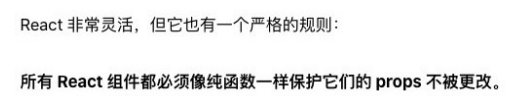

## 函数属性和arguments

### 函数对象的属性

- 我们知道JavaScript中函数也是一个对象，那么对象中就可以有属性和方法。

- 属性name：一个函数的名词我们可以通过name来访问；

  ```js
  function foo() {
    
  }
  console.log(foo.name) //foo
  
  var bar = function() {
    
  }
  console.log(bar.name) //bar
  ```

- 属性length：属性length用于返回函数参数的个数；

  - 注意：rest参数是不参与参数的个数的；

    ```js
    var baz = (name, age, ...args) => {
    
    }
    
    console.log(baz.length)
    ```

### 认识arguments

- arguments 是一个 对应于 传递给函数的参数 的 类数组(array-like)对象。

  ```js
  function foo (x, y, z) {
    // [Arguments] {'0': 10, '1': 20, '2': 30 }
    console.log(arguments)
  }
  foo(10,20,30)
  ```

- array-like意味着它不是一个数组类型，而是一个对象类型：

  - 但是它却拥有数组的一些特性，比如说length，比如可以通过index索引来访问；

  - 但是它却没有数组的一些方法，比如filter、map等；

    ```js
    console.log(arguments.length)
    console.log(arguments[0])
    console.log(arguments[1])
    console.log(arguments[2])
    ```

### arguments转Array

- 在开发中，我们经常需要将arguments转成Array，以便使用数组的一些特性。

  - 常见的转化方式如下

- 转化方式一：

  - 遍历arguments，添加到一个新数组中；

- 转化方式二：较难理解（有点绕），了解即可

  - 调用数组slice函数的call方法；

- 转化方式三：ES6中的两个方法

  - Array.from
  - […arguments]

  ```js
  // 1.转化方式一
  var length = arguments.length
  var arr = []
  for (var i = 0; i < length; i++) {
    arr.push(arguments[i])
  }
  console.log(arr)
  
  // 2.转化方式二
   var arr1 = Array.prototype.slice.call(arguments)
   var arr2 = [].slice.call(arguments)
   console.log(arr1)
   console.log(arr2)
  
  // 3.转化方式三: ES6之后
  const arr3 = Array.from(arguments)
  const arr4 = [...arguments]
  console.log(arr3)
  console.log(arr4)
  ```

### 箭头函数不绑定arguments

◼ 箭头函数是不绑定arguments的，所以我们在箭头函数中使用arguments会去上层作用域查找：

```js
console.log(arguments)

var foo = (x, y, z) => {
  console.log(arguments)
} 

foo(10, 20, 30)
```

```js
function bar(m ,n){
  return (x, y, z) => {
    console.log(arguments)
  }
}
var fn = bar(20, 30)
fn(10, 20, 30)
```

### 函数的剩余参数 (rest) 参数

- 5ES6中引用了rest parameter，可以将不定数量的参数放入到一个数组中：

  - 如果最后一个参数是 ... 为前缀的，那么它会将剩余的参数放到该参数中，并且作为一个数组；

    ```js
    function foo(m, n, ...args) {
    	console.log(m, n)
    	console.log(args)
    }
    ```

- 那么剩余参数和arguments有什么区别呢？

  - 剩余参数只包含那些没有对应形参的实参，而 arguments 对象包含了传给函数的所有实参；
  - arguments对象不是一个真正的数组，而rest参数是一个真正的数组，可以进行数组的所有操作；
  - arguments是早期的ECMAScript中为了方便去获取所有的参数提供的一个数据结构，而rest参数是ES6中提供并且希望以此来替代arguments的；

- 剩余参数必须放到最后一个位置，否则会报错。

## 纯函数

### 理解JavaScript纯函数

- 函数式编程中有一个非常重要的概念叫纯函数，JavaScript符合函数式编程的范式，所以也有纯函数的概念； 
  - 在react开发中纯函数是被多次提及的； 
  - 比如react中组件就被要求像是一个纯函数（为什么是像，因为还有class组件），redux中有一个reducer的概念，也是要求必须是一个纯函数； 
  - 所以掌握纯函数对于理解很多框架的设计是非常有帮助的； 
- 纯函数的维基百科定义： 
  - 在程序设计中，若一个函数符合以下条件，那么这个函数被称为纯函数： 
  - 此函数在相同的输入值时，需产生相同的输出。 
  - 函数的输出和输入值以外的其他隐藏信息或状态无关，也和由I/O设备产生的外部输出无关。 
  - 该函数不能有语义上可观察的函数副作用，诸如“触发事件”，使输出设备输出，或更改输出值以外物件的内容等。 
- 当然上面的定义会过于的晦涩，所以我简单总结一下： 
  - 确定的输入，一定会产生确定的输出； 
  - 函数在执行过程中，不能产生副作用； 

### 副作用的理解

- 那么这里又有一个概念，叫做副作用，什么又是副作用呢？ 

  - 副作用（side effect）其实本身是医学的一个概念，比如我们经常说吃什么药本来是为了治病，可能会产生一 些其他的副作用；

- 在计算机科学中，也引用了副作用的概念，表示在执行一个函数时，除了返回函数值之外，还对调用函数产生了附加的影响，比如修改了全局变量，修改参数或者改变外部的存储； 

- 纯函数在执行的过程中就是不能产生这样的副作用： 

  - 副作用往往是产生bug的 “温床”。


### 纯函数的案例

- 我们来看一个对数组操作的两个函数： 
  - slice：slice截取数组时不会对原数组进行任何操作,而是生成一个新的数组； 
  - splice：splice截取数组, 会返回一个新的数组, 也会对原数组进行修改； 
  - slice就是一个纯函数，不会修改传入的参数；  

```js
var names = ["abc", "cba", "nba", "dna"]

// slice只要给它传入一个start/end, 那么对于同一个数组来说, 它会给我们返回确定的值
// slice函数本身它是不会修改原来的数组
// slice -> this
// slice函数本身就是一个纯函数
// var newNames1 = names.slice(0, 3)
// console.log(newNames1)
// console.log(names)

// ["abc", "cba", "nba", "dna"]
// splice在执行时, 有修改掉调用的数组对象本身, 修改的这个操作就是产生的副作用
// splice不是一个纯函数
var newNames2 = names.splice(2)
console.log(newNames2)
console.log(names)

```

```js
// foo函数是否是一个纯函数?
// 1.相同的输入一定产生相同的输出
// 2.在执行的过程中不会产生任何的副作用
function foo(num1, num2) {
  return num1 * 2 + num2 * num2
}

// bar不是一个纯函数, 因为它修改了外界的变量
var name = "abc" 
function bar() {
  console.log("bar其他的代码执行")
  name = "cba"
}

bar()

console.log(name)

// baz也不是一个纯函数, 因为我们修改了传入的参数
function baz(info) {
  info.age = 100
}

var obj = {name: "mjjh", age: 18}
baz(obj)
console.log(obj)

// test是否是一个纯函数? 是一个纯函数
// function test(info) {
//   return {
//     ...info,
//     age: 100
//   }
// }

// test(obj)
// test(obj)
// test(obj)
// test(obj)

// React的函数组件(类组件)
function HelloWorld(props) {
  props.info = {}
  props.info.name = "mjjh"
}

```

### 纯函数的作用和优势

- 为什么纯函数在函数式编程中非常重要呢？ 

  - 因为你可以安心的编写和安心的使用； 
  - 你在写的时候保证了函数的纯度，只是单纯实现自己的业务逻辑即可，不需要关心传入的内容是如何获得的或者依赖其他的外部变量是否已经发生了修改； 
  - 你在用的时候，你确定你的输入内容不会被任意篡改，并且自己确定的输入，一定会有确定的输出； 

- React中就要求我们无论是函数还是class声明一个组件，这个组件都必须像纯函数一样，保护它们的props不被修改：

  

## 柯里化 

### 柯里化概念的理解

- 柯里化也是属于函数式编程里面一个非常重要的概念。 
- 我们先来看一下维基百科的解释： 
  - 在计算机科学中，柯里化（英语：Currying），又译为卡瑞化或加里化； 
  - 是把接收多个参数的函数，变成接受一个单一参数（最初函数的第一个参数）的函数，并且返回接受余下的参数，而且返回结果的新函数的技术； 
  - 柯里化声称 “如果你固定某些参数，你将得到接受余下参数的一个函数”； 
- 维基百科的结束非常的抽象，我们这里做一个总结：
  - 只传递给函数一部分参数来调用它，让它返回一个函数去处理剩余的参数；
  - 这个过程就称之为柯里化； 

### 柯里化的结构

- 那么柯里化到底是怎么样的表现呢？


```js
function add(x, y, z) {
  return x + y + z
}

var result = add(10, 20, 30)
console.log(result)

function sum1(x) {
  return function(y) {
    return function(z) {
      return x + y + z
    }
  }
}

var result1 = sum1(10)(20)(30)
var reslut2 = sum1(10)(20)
console.log(result1)

// 简化柯里化的代码
var sum2 = x => y => z => {
  return x + y + z
}

console.log(sum2(10)(20)(30))

var sum3 = x => y => z => x + y + z
console.log(sum3(10)(20)(30))


```

### 柯里化的优势

#### 让函数的职责单一 

- 那么为什么需要有柯里化呢？ 

  - 在函数式编程中，我们其实往往希望一个函数处理的问题尽可能的单一，而不是将一大堆的处理过程交给一个 函数来处理； 
  - 那么我们是否就可以将每次传入的参数在单一的函数中进行处理，处理完后在下一个函数中再使用处理后的结 果； 

- 比如上面的案例我们进行一个修改：传入的函数需要分别被进行如下处理 

  - 第一个参数 + 2 
  - 第二个参数 * 2 
  - 第三个参数 ** 2 

  ```js
  function add(x, y, z) {
    x = x + 2
    y = y * 2
    z = z * z
    return x + y + z
  }
  
  console.log(add(10, 20, 30))
  
  
  function sum(x) {
    x = x + 2
    return function(y) {
      y = y * 2
      return function(z) {
        z = z * z
        return x + y + z
      }
    }
  }
  
  console.log(sum(10)(20)(30))
  
  
  ```

#### 函数的参数复用

- 另外一个使用柯里化的场景是可以帮助我们可以复用参数逻辑： 

  - makeAdder函数要求我们传入一个num（并且如果我们需要的话，可以在这里对num进行一些修改）； 
  - 在之后使用返回的函数时，我们不需要再继续传入num了； 

  ```js
  // function sum(m, n) {
  //   return m + n
  // }
  
  // // 假如在程序中,我们经常需要把5和另外一个数字进行相加
  // console.log(sum(5, 10))
  // console.log(sum(5, 14))
  // console.log(sum(5, 1100))
  // console.log(sum(5, 555))
  
  function makeAdder(count) {
    count = count * count
  
    return function(num) {
      return count + num
    }
  }
  
  // var result = makeAdder(5)(10)
  // console.log(result)
  var adder5 = makeAdder(5)
  adder5(10)
  adder5(14)
  adder5(1100)
  adder5(555)
  
  ```

### 柯里化案例练习

- 这里我们在演示一个案例，需求是打印一些日志：
  - 日志包括时间、类型、信息； 

```js
function log(date, type, message) {
  console.log(`[${date.getHours()}:${date.getMinutes()}][${type}]: [${message}]`)
}

// log(new Date(), "DEBUG", "查找到轮播图的bug")
// log(new Date(), "DEBUG", "查询菜单的bug")
// log(new Date(), "DEBUG", "查询数据的bug")

// 柯里化的优化
var log = date => type => message => {
  console.log(`[${date.getHours()}:${date.getMinutes()}][${type}]: [${message}]`)
}

// 如果我现在打印的都是当前时间
var nowLog = log(new Date())
nowLog("DEBUG")("查找到轮播图的bug")
nowLog("FETURE")("新增了添加用户的功能")

var nowAndDebugLog = log(new Date())("DEBUG")
nowAndDebugLog("查找到轮播图的bug")
nowAndDebugLog("查找到轮播图的bug")
nowAndDebugLog("查找到轮播图的bug")
nowAndDebugLog("查找到轮播图的bug")


var nowAndFetureLog = log(new Date())("FETURE")
nowAndFetureLog("添加新功能~")

```

### 自动柯里化函数

目前我们有将多个普通的函数，转成柯里化函数： 

```js
function add1(x, y, z) {
  return x + y + z
}

function add2(x, y, z) {
  x = x + 2
  y = y * 2
  z = z * z
  return x + y + z
}

function makeAdder(count) {
  count = count * count

  return function(num) {
    return count + num
  }
}

function log(date, type, message) {
  console.log(`[${date.getHours()}:${date.getMinutes()}][${type}]: [${message}]`)
}

// 柯里化函数的实现mjCurrying
function mjCurrying(fn) {
  function curried(...args) {
    // 判断当前已经接收的参数的个数, 可以参数本身需要接受的参数是否已经一致了
    // 1.当已经传入的参数 大于等于 需要的参数时, 就执行函数
    if (args.length >= fn.length) {
      // fn(...args)
      // fn.call(this, ...args)
      return fn.apply(this, args)
    } else {
      // 没有达到个数时, 需要返回一个新的函数, 继续来接收的参数
      function curried2(...args2) {
        // 接收到参数后, 需要递归调用curried来检查函数的个数是否达到
        return curried.apply(this, args.concat(args2))
      }
      return curried2
    }
  }
  return curried
}

var curryAdd = mjCurrying(add1)


console.log(curryAdd(10, 20, 30))
console.log(curryAdd(10, 20)(30))
console.log(curryAdd(10)(20)(30))

// function foo(x, y, z, m, n, a, b) {

// }
// console.log(foo.length)


function foo(x, y, z) {
  return x + y + z
}

foo.call({}, 1, 2, 3)

var curryFoo = mjCurrying(foo)
curryFoo.call({}, 1)


```

## 组合函数

### 理解组合函数

- 组合（Compose）函数是在JavaScript开发过程中一种对函数的使用技巧、模式： 

  - 比如我们现在需要对某一个数据进行函数的调用，执行两个函数fn1和fn2，这两个函数是依次执行的；
  - 那么如果每次我们都需要进行两个函数的调用，操作上就会显得重复； 
  - 那么是否可以将这两个函数组合起来，自动依次调用呢？
  - 这个过程就是对函数的组合，我们称之为 组合函数（Compose Function）； 

  ```js
  function double(num) {
    return num * 2
  }
  
  function square(num) {
    return num ** 2
  }
  
  var count = 10
  var result = square(double(count))
  console.log(result)
  
  // 实现最简单的组合函数
  function composeFn(m, n) {
    return function(count) {
      return n(m(count))
    }
  }
  
  var newFn = composeFn(double, square)
  console.log(newFn(10))
  ```

### 实现组合函数

- 刚才我们实现的compose函数比较简单，我们需要考虑更加复杂的情况：比如传入了更多的函数，在调用 compose函数时，传入了更多的参数： 

```js
function hyCompose(...fns) {
  var length = fns.length
  for (var i = 0; i < length; i++) {
    if (typeof fns[i] !== 'function') {
      throw new TypeError("Expected arguments are functions")
    }
  }

  function compose(...args) {
    var index = 0
    var result = length ? fns[index].apply(this, args): args
    while(++index < length) {
      result = fns[index].call(this, result)
    }
    return result
  }
  return compose
}

function double(m) {
  return m * 2
}

function square(n) {
  return n ** 2
}

var newFn = hyCompose(double, square)
console.log(newFn(10))
```

## with

### with语句

- 扩展一个语句的作用域链。 

- 不建议使用with语句，因为它可能是混淆错误和兼容性问题的根源。 

  ```js
  "use strict";// 严格模式下不能使用with
  
  var message = "Hello World"
  // console.log(message)
  
  // with语句: 可以形成自己的作用域
  var obj = {name: "mjjh", age: 18, message: "obj message"}
  
  function foo() {
    function bar() {
      with(obj) {
        console.log(message)
        console.log("------")
      }
    }
    bar()
  }
  
  foo()
  
  var info = {name: "kobe"}
  with(info) {
    console.log(name)
  }
  
  ```

## eval

### eval函数

-  eval是一个特殊的函数，它可以将传入的字符串当做JavaScript代码来运行。 
-  不建议在开发中使用eval： 
   - eval代码的可读性非常的差（代码的可读性是高质量代码的重要原则）； 
   - eval是一个字符串，那么有可能在执行的过程中被刻意篡改，那么可能会造成被攻击的风险； 
   - eval的执行必须经过JS解释器，不能被JS引擎优化； 

```js
var jsString = 'var message = "Hello World"; console.log(message);'

var message = "Hello World"
console.log(message)

eval(jsString)

```

## strict

### 认识严格模式

- 在ECMAScript5标准中，JavaScript提出了严格模式的概念（Strict Mode）： 
  - 严格模式很好理解，是一种具有限制性的JavaScript模式，从而使代码隐式的脱离了 ”懒散（sloppy）模式“； 
  - 支持严格模式的浏览器在检测到代码中有严格模式时，会以更加严格的方式对代码进行检测和执行； 
- 严格模式对正常的JavaScript语义进行了一些限制： 
  - 严格模式通过 抛出错误 来消除一些原有的 静默（silent）错误； 
  - 严格模式让JS引擎在执行代码时可以进行更多的优化（不需要对一些特殊的语法进行处理）； 
  - 严格模式禁用了在ECMAScript未来版本中可能会定义的一些语法；

### 开启严格模式

- 那么如何开启严格模式呢？严格模式支持粒度话的迁移： 
  - 可以支持在js文件中开启严格模式； 
  - 也支持对某一个函数开启严格模式；
- 严格模式通过在文件或者函数开头使用 use strict 来开启。

```js
// "use strict"

var message = "Hello World"
console.log(message)

// 静默错误
// true.foo = "abc"


function foo() {
  "use strict";

  true.foo = "abc"
}

foo()
```

- 没有类似于" no use strict "这样的指令可以使程序返回默认模式.
  - 现代的JavaScript 支持 "class" 和 "module", 它们会自动启用use strict

### 严格模式限制

- 这里我们来说几个严格模式下的严格语法限制： 
  - JavaScript被设计为新手开发者更容易上手，所以有时候本来错误语法，被认为也是可以正常被解析的； 
  - 但是这种方式可能给带来留下来安全隐患； 
  - 在严格模式下，这种失误就会被当做错误，以便可以快速的发现和修正； 

1. 无法意外的创建全局变量 
2. 严格模式会使引起静默失败(silently fail,注:不报错也没有任何效果)的赋值操作抛出异常 
3. 严格模式下试图删除不可删除的属性 
4. 严格模式不允许函数参数有相同的名称 
5. 不允许0的八进制语法 
6. 在严格模式下，不允许使用with
7. 在严格模式下，eval不再为上层引用变量 
8. 严格模式下，this绑定不会默认转成对象 严格模式限制

```js
// "use strict"

// 1. 禁止意外创建全局变量
// message = "Hello World"
// console.log(message)

// function foo() {
//   age = 20
// }

// foo()
// console.log(age)

// 2.不允许函数有相同的参数名称
// function foo(x, y, x) {
//   console.log(x, y, x)
// }

// foo(10, 20, 30)


// 3.静默错误
// true.name = "abc"
// NaN = 123
// var obj = {}
// Object.defineProperty(obj, "name", {
//   configurable: false,
//   writable: false,
//   value: "mjjh"
// })
// console.log(obj.name)
// // obj.name = "kobe"

// delete obj.name

// 4.不允许使用原先的八进制格式 0123
// var num = 0o123 // 八进制
// var num2 = 0x123 // 十六进制
// var num3 = 0b100 // 二进制
// console.log(num, num2, num3)

// 5.with语句不允许使用

// 6.eval函数不会向上引用变量了
var jsString = '"use strict"; var message = "Hello World"; console.log(message);'
eval(jsString)

console.log(message)
```

### 严格模式下的this

- 在严格模式下, 自执行函数(默认绑定)会指向undefined

- 自执行函数我们是没有使用过this直接去引用window
- 在浏览器setTimeout中会引用到window

```js
"use strict"

// 在严格模式下, 自执行函数(默认绑定)会指向undefined
// 之前编写的代码中, 自执行函数我们是没有使用过this直接去引用window
function foo() {
  console.log(this)
}

var obj = {
  name: "m",
  foo: foo
}

foo()

obj.foo()
var bar = obj.foo
bar()


// setTimeout的this
// fn.apply(this = window)
setTimeout(function() {
  console.log(this)
}, 1000);
```
