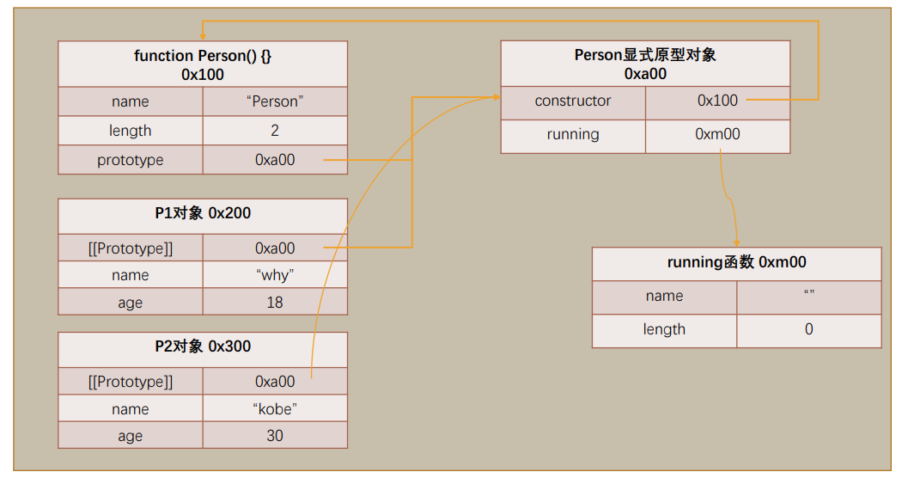
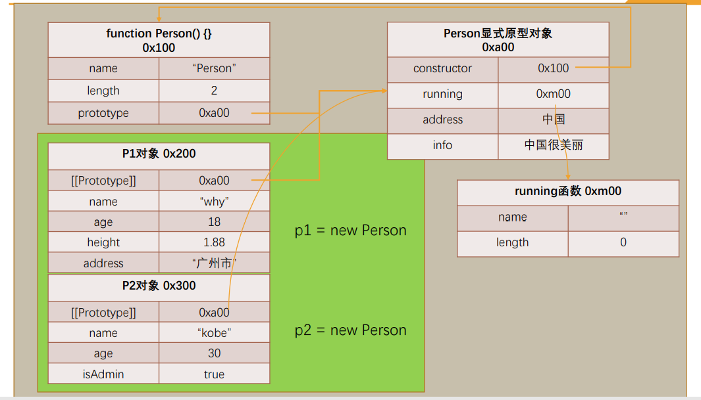
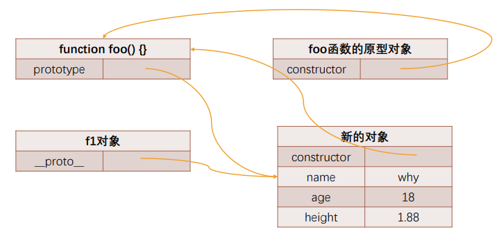

## JS面向对象

### 面向对象是现实的抽象方式

- 对象是JavaScript中一个非常重要的概念，这是因为对象可以将多个相关联的数据封装到一起，更好的描述一个事物： 

  - 比如我们可以描述一辆车：Car，具有颜色（color）、速度（speed）、品牌（brand）、价格（price），行驶（travel）等 等； 
  - 比如我们可以描述一个人：Person，具有姓名（name）、年龄（age）、身高（height），吃东西（eat）、跑步（run） 等等； 

- 用对象来描述事物，更有利于我们将现实的事物，抽离成代码中某个数据结构： 

  - 所以有一些编程语言就是纯面向对象的编程语言，比Java； 

  - 你在实现任何现实抽象时都需要先创建一个类，根据类再去创建对象； 

    

### JavaScript的面向对象

- JavaScript其实支持多种编程范式的，包括函数式编程和面向对象编程： 
  - JavaScript中的对象被设计成一组属性的无序集合，像是一个哈希表，有key和value组成； 
  - key是一个标识符名称，value可以是任意类型，也可以是其他对象或者函数类型； 
  - 如果值是一个函数，那么我们可以称之为是对象的方法； 
- 如何创建一个对象呢？ 
- 早期使用创建对象的方式最多的是使用Object类，并且使用new关键字来创建一个对象：
  - 这是因为早期很多JavaScript开发者是从Java过来的，它们也更习惯于Java中通过new的方式创建一个对象； 
- 后来很多开发者为了方便起见，都是直接通过字面量的形式来创建对象：
  - 这种形式看起来更加的简洁，并且对象和属性之间的内聚性也更强，所以这种方式后来就流行了起来；


### 创建对象的两种方式

```js
// 创建一个对象, 对某一个人进行抽象(描述)
// 1.创建方式一: 通过new Object()创建
var obj = new Object()
obj.name = "mj"
obj.age = 18
obj.height = 1.88
obj.running = function() {
  console.log(this.name + "在跑步~")
}

// 2.创建方式二: 字面量形式
var info = {
  name: "kobe",
  age: 40,
  height: 1.98,
  eating: function() {
    console.log(this.name + "在吃东西~")
  }
}

```

## 属性描述符

### 对属性操作的控制 

- 在前面我们的属性都是直接定义在对象内部，或者直接添加到对象内部的： 

  - 但是这样来做的时候我们就不能对这个属性进行一些限制：比如这个属性是否是可以通过delete删除的？这个 属性是否在for-in遍历的时候被遍历出来呢？ 

    ```js
    var obj = {
      name: "mjjh",
      age: 18
    }
    ```

- 如果我们想要对一个属性进行比较精准的操作控制，那么我们就可以使用属性描述符。 

  - 通过属性描述符可以精准的添加或修改对象的属性； 
  - 属性描述符需要使用 Object.defineProperty 来对属性进行添加或者修改； 

### Object.defineProperty


- Object.defineProperty() 方法会直接在一个对象上定义一个新属性，或者修改一个对象的现有属性，并返回此 对象。 

  

- 可接收三个参数： 

  - obj要定义属性的对象； 
  - prop要定义或修改的属性的名称或 Symbol； 
  - descriptor要定义或修改的属性描述符； 

- 返回值： 

  - 被传递给函数的对象。 

### 属性描述符分类

- 属性描述符的类型有两种： 
  - 数据属性（Data Properties）描述符（Descriptor）； 
  - 存取属性（Accessor访问器 Properties）描述符（Descriptor）； 

|            | configurable | enumerable | value  | writable | get    | set    |
| ---------- | ------------ | ---------- | ------ | -------- | ------ | ------ |
| 数据描述符 | 可以         | 可以       | 可以   | 可以     | 不可以 | 不可以 |
| 存储描述符 | 可以         | 可以       | 不可以 | 不可以   | 可以   | 可以   |

### 数据属性描述符

- 数据数据描述符有如下四个特性： 
- [[Configurable]]：表示属性是否可以通过delete删除属性，是否可以修改它的特性，或者是否可以将它修改为存取属性 描述符； 
  - 当我们直接在一个对象上定义某个属性时，这个属性的[[Configurable]]为true； 
  - 当我们通过属性描述符定义一个属性时，这个属性的[[Configurable]]默认为false； 
- [[Enumerable]]：表示属性是否可以通过for-in或者Object.keys()返回该属性； 
  - 当我们直接在一个对象上定义某个属性时，这个属性的[[Enumerable]]为true； 
  - 当我们通过属性描述符定义一个属性时，这个属性的[[Enumerable]]默认为false； 
- [[Writable]]：表示是否可以修改属性的值； 
  - 当我们直接在一个对象上定义某个属性时，这个属性的[[Writable]]为true； 
  - 当我们通过属性描述符定义一个属性时，这个属性的[[Writable]]默认为false；
- [[value]]：属性的value值，读取属性时会返回该值，修改属性时，会对其进行修改； 
  - 默认情况下这个值是undefined； 


### 数据属性描述符测试代码 

```js
// name和age虽然没有使用属性描述符来定义, 但是它们也是具备对应的特性的
// value: 赋值的value
// configurable: true
// enumerable: true
// writable: true
var obj = {
  name: "mjjh",
  age: 18
}

// 数据属性描述符
// 用了属性描述符, 那么会有默认的特性
Object.defineProperty(obj, "address", {
  // 很多配置
  // value: "北京市", // 默认值undefined
  // 该特殊不可删除/也不可以重新定义属性描述符
  // configurable: false, // 默认值false
  // // 该特殊是配置对应的属性(address)是否是可以枚举
  // enumerable: true, // 默认值false
  // // 该特性是属性是否是可以赋值(写入值) 
  // writable: false // 默认值false
})

// 测试configurable的作用
// delete obj.name
// console.log(obj.name)
// delete obj.address
// console.log(obj.address)

// Object.defineProperty(obj, "address", {
//   value: "广州市",
//   configurable: true
// })

// 测试enumerable的作用
console.log(obj)
for (var key in obj) {
  console.log(key)
}
console.log(Object.keys(obj))

// 测试Writable的作用
// obj.address = "上海市"
// console.log(obj.address)

```

### 存取属性描述符

- 数据数据描述符有如下四个特性： 
- [[Configurable]]：表示属性是否可以通过delete删除属性，是否可以修改它的特性，或者是否可以将它修改为存取属性 描述符； 
  - 和数据属性描述符是一致的； 
  - 当我们直接在一个对象上定义某个属性时，这个属性的[[Configurable]]为true； 
  - 当我们通过属性描述符定义一个属性时，这个属性的[[Configurable]]默认为false； 
- [[Enumerable]]：表示属性是否可以通过for-in或者Object.keys()返回该属性； 
  - 和数据属性描述符是一致的； 
  - 当我们直接在一个对象上定义某个属性时，这个属性的[[Enumerable]]为true； 
  - 当我们通过属性描述符定义一个属性时，这个属性的[[Enumerable]]默认为false； 

- [[get]]：获取属性时会执行的函数。默认为undefined 
- [[set]]：设置属性时会执行的函数。默认为undefined 

### 存储属性描述符测试代码 

```js
var obj = {
  name: "mjjh",
  age: 18,
  _address: "北京市"
}

// 存取属性描述符
// 1.隐藏某一个私有属性被希望直接被外界使用和赋值
// 2.如果我们希望截获某一个属性它访问和设置值的过程时, 也会使用存储属性描述符
Object.defineProperty(obj, "address", {
  enumerable: true,
  configurable: true,
  get: function() {
    foo()
    return this._address
  },
  set: function(value) {
    bar()
    this._address = value
  }
})

console.log(obj.address)

obj.address = "上海市"
console.log(obj.address)

function foo() {
  console.log("获取了一次address的值")
}

function bar() {
  console.log("设置了addres的值")
}


```

### 同时定义多个属性

- Object.defineProperties() 方法直接在一个对象上定义 多个 新的属性或修改现有属性，并且返回该对象。 

```js
var obj = {
  // 私有属性(js里面是没有严格意义的私有属性)
  _age: 18,
  _eating: function() {},
  set age(value) {
    this._age = value
  },
  get age() {
    return this._age
  }
}

Object.defineProperties(obj, {
  name: {
    configurable: true,
    enumerable: true,
    writable: true,
    value: "mjjh"
  },
  age: {
    configurable: true,
    enumerable: true,
    get: function() {
      return this._age
    },
    set: function(value) {
      this._age = value
    }
  }
})

obj.age = 19
console.log(obj.age)

console.log(obj)

```

## 对象方法补充

- 获取对象的属性描述符： 
  - getOwnPropertyDescriptor 
  - getOwnPropertyDescriptors 
- 禁止对象扩展新属性：preventExtensions 
  - 给一个对象添加新的属性会失败（在严格模式下会报错）； 
- 密封对象，不允许配置和删除属性：seal 
  - 实际是调用preventExtensions 
  - 并且将现有属性的configurable:false 
- 冻结对象，不允许修改现有属性： freeze 
  - 实际上是调用seal 
  - 并且将现有属性的writable: false 

## 创建对象

### 创建多个对象的方案

- 如果我们现在希望创建一系列的对象：比如Person对象 

  - 包括张三、李四、王五、李雷等等，他们的信息各不相同；
  - 那么采用什么方式来创建比较好呢？ 

- 目前我们已经学习了两种方式： 

  - new Object方式； 

  - 字面量创建的方式； 

    ```js
    var p1 = {
      name: "张三",
      age: 18,
      height: 1.88,
      address: "广州市",
      eating: function() {
        console.log(this.name + "在吃东西~")
      },
      running: function() {
        console.log(this.name + "在跑步~")
      }
    }
    
    var p2 = {
      name: "李四",
      age: 20,
      height: 1.98,
      address: "北京市",
      eating: function() {
        console.log(this.name + "在吃东西~")
      },
      running: function() {
        console.log(this.name + "在跑步~")
      }
    }
    
    var p3 = {
      name: "王五",
      age: 30,
      height: 1.78,
      address: "上海市",
      eating: function() {
        console.log(this.name + "在吃东西~")
      },
      running: function() {
        console.log(this.name + "在跑步~")
      }
    }
    
    
    ```

- 这种方式有一个很大的弊端：创建同样的对象时，需要编写重复的代码；

### 创建对象的方案 – 工厂模式

- 我们可以想到的一种创建对象的方式：工厂模式 

  - 工厂模式其实是一种常见的设计模式； 
  - 通常我们会有一个工厂方法，通过该工厂方法我们可以产生想要的对象； 

  ```js
  // 工厂模式: 工厂函数
  function createPerson(name, age, height, address) {
    var p = {}
    p.name = name
    p.age = age
    p.height = height;
    p.address = address
  
    p.eating = function() {
      console.log(this.name + "在吃东西~")
    }
  
    p.running = function() {
      console.log(this.name + "在跑步~")
    }
  
    return p
  }
  
  var p1 = createPerson("张三", 18, 1.88, "广州市")
  var p2 = createPerson("李四", 20, 1.98, "上海市")
  var p3 = createPerson("王五", 30, 1.78, "北京市")
  
  // 工厂模式的缺点(获取不到对象最真实的类型)
  console.log(p1, p2, p3)
  
  
  ```

### 认识构造函数

- 工厂方法创建对象有一个比较大的问题：我们在打印对象时，对象的类型都是Object类型 
  - 但是从某些角度来说，这些对象应该有一个他们共同的类型；
  - 下面我们来看一下另外一种模式：构造函数的方式；

- 我们先理解什么是构造函数？ 
  - 构造函数也称之为构造器（constructor），通常是我们在创建对象时会调用的函数； 
  - 在其他面向的编程语言里面，构造函数是存在于类中的一个方法，称之为构造方法；
  - 但是JavaScript中的构造函数有点不太一样；

- JavaScript中的构造函数是怎么样的？ 
  - 构造函数也是一个普通的函数，从表现形式来说，和千千万万个普通的函数没有任何区别； 
  - 那么如果这么一个普通的函数被使用new操作符来调用了，那么这个函数就称之为是一个构造函数；

- 那么被new调用有什么特殊的呢？

### new操作符调用的作用 

如果一个函数被使用new操作符调用了，那么它会执行如下操作： 

1. 在内存中创建一个新的对象（空对象）； 
2. 这个对象内部的[[prototype]]属性会被赋值为该构造函数的prototype属性；（后面详细讲）； 
3. 构造函数内部的this，会指向创建出来的新对象； 
4. 执行函数的内部代码（函数体代码）； 
5. 如果构造函数没有返回非空对象，不然则返回创建出来的新对象； 

```js
function Person() {

}

var p1 = new Person()
var p2 = new Person()

//Penson()
console.log(p1)
```

### 创建对象的方法-构造函数

- 我们来通过构造函数实现一下： 

  ```js
  // 规范: 构造函数的首字母一般是大写
  function Person(name, age, height, address) {
    this.name = name
    this.age = age
    this.height = height
    this.address = address
  
    this.eating = function() {
      console.log(this.name + "在吃东西~")
    }
  
    this.running = function() {
      console.log(this.name + "在跑步")
    }
  }
  
  
  var p1 = new Person("张三", 18, 1.88, "广州市")
  var p2 = new Person("李四", 20, 1.98, "北京市")
  
  console.log(p1)
  console.log(p2)
  p1.eating()
  p2.eating()
  
  ```

- 这个构造函数可以确保我们的对象是有Person的类型的（实际是constructor的属性，这个我们后续再探讨）； 

- 但是构造函数就没有缺点了吗？ 

  - 构造函数也是有缺点的，它在于我们需要为每个对象的函数去创建一个函数对象实例；

    ```js
    function foo() {
      function bar() {
    
      }
      return bar
    }
    
    var fn1 = foo()
    var fn2 = foo()
    
    console.log(fn1 === fn2)//f
    ```

## 对象的原型

### 认识对象的原型（隐式原型[[prototype]]/_ _ proto _ _）

- JavaScript当中每个对象都有一个特殊的内置属性 [[prototype]]，这个特殊的对象可以指向另外一个对象。 

- 那么这个对象有什么用呢？ 
  - 当我们通过引用对象的属性key来获取一个value时，它会触发 [[Get]]的操作； 
  - 这个操作会首先检查该属性是否有对应的属性，如果有的话就使用它； 
  - 如果对象中没有改属性，那么会访问对象[[prototype]]内置属性指向的对象上的属性； 
- 那么如果通过字面量直接创建一个对象，这个对象也会有这样的属性吗？如果有，应该如何获取这个属性呢？ 
  - 答案是有的，只要是对象都会有这样的一个内置属性； 
- 获取的方式有两种： 
  - 方式一：通过对象的 __proto__ 属性可以获取到（但是这个是早期浏览器自己添加的，存在一定的兼容性问 题）； 
  - 方式二：通过 Object.getPrototypeOf 方法可以获取到； 

```js
// 我们每个对象中都有一个 [[prototype]], 这个属性可以称之为对象的原型(隐式原型)

var obj = { name: "mjjh" } // [[prototype]]
var info = {} // [[prototype]]

// 1.解释原型的概念和看一下原型
// 早期的ECMA是没有规范如何去查看 [[prototype]]

// 给对象中提供了一个属性, 可以让我们查看一下这个原型对象(浏览器提供)
// __proto__
// console.log(obj.__proto__) // {}
// console.log(info.__proto__) // {}

// var obj = {name: "mjjh", __proto__: {} }

// // ES5之后提供的Object.getPrototypeOf
// console.log(Object.getPrototypeOf(obj))


// 2.原型有什么用呢?
// 当我们从一个对象中获取某一个属性时, 它会触发 [[get]] 操作
// 1. 在当前对象中去查找对应的属性, 如果找到就直接使用
// 2. 如果没有找到, 那么会沿着它的原型去查找 [[prototype]]
// obj.age = 18
obj.__proto__.age = 18

console.log(obj.age)
```

### 函数的原型 prototype (显式原型)

- 只有函数具有的属性，显式原型

- 那么我们知道上面的东西对于我们的构造函数创建对象来说有什么用呢？ 

  - 它的意义是非常重大的，接下来我们继续来探讨； 

- 这里我们又要引入一个新的概念：所有的函数都有一个prototype的属性： 

  ```js
  function foo() {
  }
  
  // 函数也是一个对象
  // console.log(foo.__proto__) // 函数作为对象来说, 它也是有[[prototype]] 隐式原型
  
  // 函数它因为是一个函数, 所以它还会多出来一个显示原型属性: prototype
  console.log(foo.prototype)
  ```

- 你可能会问题，老师是不是因为函数是一个对象，所以它有prototype的属性呢？ 

  - 不是的，因为它是一个函数，才有了这个特殊的属性； 
  - 而不是它是一个对象，所以有这个特殊的属性； 

```js
function foo() {
}

var f1 = new foo()
var obj = {}

console.log(f1.__proto__ === foo.prototype) // true
console.log(obj.prototype)
```

### 再看new操作符

- 我们前面讲过new关键字的步骤如下： 

  1. 在内存中创建一个新的对象（空对象）； 
  2. 这个对象内部的[[prototype]]属性会被赋值为该构造函数的prototype属性；
  3. 构造函数内部的this，会指向创建出来的新对象； 
  4. 执行函数的内部代码（函数体代码）； 
  5. 如果构造函数没有返回非空对象，不然则返回创建出来的新对象； 
- 那么也就意味着我们通过Person构造函数创建出来的所有对象的[[prototype]]属性都指向Person.prototype： 


```js
function Person() {

}

var p1 = new Person()
var p2 = new Person()
//上面的操作相当于如下操作
// p = {}
// p.__proto__ = Person.prototype


console.log(p1.__proto__ === p2.__proto__) // true
console.log(p1.__proto__ === Person.prototype) // true
```

#### 创建对象的内存表现 



- 将对象的隐式原型指向函数原型

#### 新增属性的内存表现



- 将添加的属性添加到Person的原型对象上

#### 赋值为新的对象的内存表现



### constructor 属性

- 事实上原型对象上面是有一个属性的：constructor 
- 默认情况下原型上都会添加一个属性叫做constructor，这个constructor指向当前的函数对象；
- constructor 返回对象的构造函数。


```js
function foo() {

}
// foo.prototype这个对象中有一个constructor属性
console.log(foo.prototype)
console.log(Object.getOwnPropertyDescriptors(foo.prototype))

Object.defineProperty(foo.prototype, "constructor", {
  enumerable: true,
  configurable: true,
  writable: true,
  value: "哈哈哈哈"
})

console.log(foo.prototype)

// prototype.constructor = 构造函数本身
console.log(foo.prototype.constructor) // [Function: foo]
console.log(foo.prototype.constructor.name)

console.log(foo.prototype.constructor.prototype.constructor.prototype.constructor)

```

### 重写原型对象

- 如果我们需要在原型上添加过多的属性，通常我们会重新整个原型对象： 


```js
function Person() {

}

Person.prototype = {
 name: "mjjh"
 age: 18
 eating: function() {
 	console.log(this.name + "在吃东西~")
 }
}

// 我们也可以添加自己的属性
// foo.prototype.name = "mjr"
// foo.prototype.age = 18
// foo.prototype.height = 18
// foo.prototype.eating = function() {}
```

- 前面我们说过, 每创建一个函数, 就会同时创建它的prototype对象, 这个对象也会自动获取constructor属性； 

  - 而我们这里相当于给prototype重新赋值了一个对象, 那么这个新对象的constructor属性, 会指向Object构造函数, 而不是Person构造函数了 


### 原型对象constructor

- 如果希望constructor指向Person，那么可以手动添加： 

- 上面的方式虽然可以, 但是也会造成constructor的 [[Enumerable]] 特性被设置了true. 

  - 默认情况下, 原生的constructor属性是不可枚举的. 

  - 如果希望解决这个问题, 就可以使用我们前面介绍的Object.defineProperty()函数了. 


```js
function foo() {

}
var f1 = new foo()
console.log(f1.name, f1.age)

foo.prototype = {
  // constructor: foo,
  name: "mjjh",
  age: 18,
  height: 1.88
}

var f1 = new foo()

console.log(f1.name, f1.age, f1.height)

// 真实开发中我们可以通过Object.defineProperty方式添加constructor
Object.defineProperty(foo.prototype, "constructor", {
  enumerable: false, // 可枚举
  configurable: true, // 可配置
  writable: true, // k
  value: foo
})
```

### 创建对象 – 构造函数和原型组合

- 我们在上一个构造函数的方式创建对象时，有一个弊端：会创建出重复的函数，比如running、eating这些函数 

- 那么有没有办法让所有的对象去共享这些函数呢? 

- 可以，将这些函数放到Person.prototype的对象上即可；


```js
function Person(name, age, height, address) {
  this.name = name
  this.age = age
  this.height = height
  this.address = address
}

Person.prototype.eating = function() {
  console.log(this.name + "在吃东西~")
}

Person.prototype.running = function() {
  console.log(this.name + "在跑步~")
}

var p1 = new Person("mjjh", 18, 1.88, "北京市")
var p2 = new Person("kobe", 20, 1.98, "洛杉矶市")

p1.eating()
p2.eating()
```