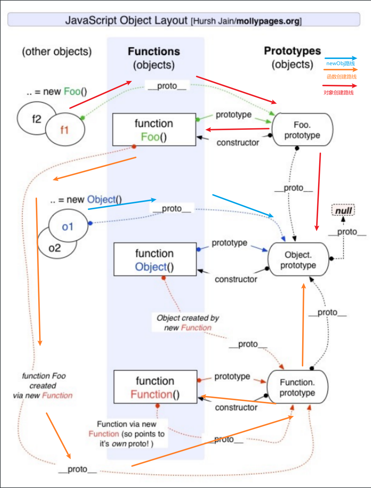

## JavaScript中的类和对象

- 当我们编写如下代码的时候，我们会如何来称呼这个Person呢20220114155930780？ 

  - 在JS中Person应该被称之为是一个构造函数； 
  - 从很多面向对象语言过来的开发者，也习惯称之为类，因为类可以帮助我们创建出来对象p1、p2； 
  - 如果从面向对象的编程范式角度来看，Person确实是可以称之为类的；

  ```js
  function Person() {
  
  }
  
  var p1 = new Person()
  var p2 = new Person()
  ```

## JS面向对象的继承

### 面向对象的特性 – 继承

- 面向对象有三大特性：封装、继承、多态 
  - 封装：我们前面将属性和方法封装到一个类中，可以称之为封装的过程； 
  - 继承：继承是面向对象中非常重要的，不仅仅可以减少重复代码的数量，也是多态前提（纯面向对象中）； 
  - 多态：不同的对象在执行时表现出不同的形态； 
- 那么这里我们核心讲继承。 

- 那么继承是做什么呢？ 
  - 继承可以帮助我们将重复的代码和逻辑抽取到父类中，子类只需要直接继承过来使用即可。 
- 那么JavaScript当中如何实现继承呢？ 
  - 不着急，我们先来看一下JavaScript原型链的机制； 
  - 再利用原型链的机制实现一下继承； 

### JavaScript原型链

- 在真正实现继承之前，我们先来理解一个非常重要的概念：原型链。 

  - 我们知道，从一个对象上获取属性，如果在当前对象中没有获取到就会去它的原型上面获取：

  ```js
  var obj = {
    name: "mjjh",
    age: 18
  }
  
  // [[get]]操作
  // 1.在当前的对象中查找属性
  // 2.如果没有找到, 这个时候会去原型链(__proto__)对象上查找
  
  obj.__proto__ = {}
  
  // 原型链
  obj.__proto__.__proto__ = {
  
  }
  
  obj.__proto__.__proto__.__proto__ = {
    address: "上海市"
  }
  
  console.log(obj.address)
  ```

  

### Object的原型(原型链的尽头)

- 那么什么地方是原型链的尽头呢？比如第三个对象是否也是有原型__ proto __ 属性呢？

  ```js
  console.log(obj.__proto__.__proto__.__proto__.__proto__)
  ```

- 我们会发现它打印的是 [Object: null prototype] {} 

  - 事实上这个原型就是我们最顶层的原型了 
  - 从Object直接创建出来的对象的原型都是 [Object: null prototype] {}。 

- 那么我们可能会问题： [Object: null prototype] {} 原型有什么特殊吗？ 

  - 特殊一：该对象有原型属性，但是它的原型属性已经指向的是null，也就是已经是顶层原型了； 
  - 特殊二：该对象上有很多默认的属性和方法； 

#### 创建Object对象的内存图


#### 原型链关系的内存图


### Object是所有类的父类

- 从我们上面的Object原型我们可以得出一个结论：原型链最顶层的原型对象就是Object的原型对象 

  ```js
  function Person(name, age) {
  	this.name = name
  	this.age = age
  }
  
  Person.prototype.runing = function() {
    console.log(this.name + " runing~")
  }
  
  var p1 = new Person("mjjh", 18)
  console.log(p1)
  console.log(p1.valueOf())
  console.log(p1.toString())
  ```

  

## a 通过原型链实现继承

- 如果我们现在需要实现继承，那么就可以利用原型链来实现了： 
  - 目前stu的原型是p对象，而p对象的原型是Person默认的原型，里面包含running等函数； 
  - 注意：步骤4和步骤5不可以调整顺序，否则会有问题 
- 思路, 创建一个中间对象来获取父类对象的属性和方法,
  - 子类新增对象和方法会添加到中间对象上,不再影响父类对象


```js
// 1.定义父级构造函数
function Person() {
	this.name = "mjjh"
}

// 2.父级原型上个添加内容
Person.prototype.runing = function() {
  console.log(this.name + " runing~")
}

// 3.定义子类构造函数
function Student() {
	this.sno = 111
}

// 4.创建父类对象，并作为子类的原型对象
var p = new Person()
Student.prototype = p

// 5.在子类上添加内容
Student.prototype.studying = function() {
  console.log(this.name + " studying~")
}
var p = new Person()
var s = new Student()
```


### 原型链继承创建对象的内存图


### 原型链继承的弊端

- **但是目前有一个很大的弊端：某些属性其实是保存在p对象上的；** 
  - **第一，我们通过直接打印对象是看不到这个属性的；** 
  - **第二，这个属性会被多个对象共享，如果这个对象是一个引用类型，那么就会造成问题；** 
  - **第三，不能给Person传递参数，因为这个对象是一次性创建的（没办法定制化）；** 

## b 借用构造函数继承

- 为了解决原型链继承中存在的问题，开发人员提供了一种新的技术: constructor stealing(有很多名称: 借用构造函数或者称之为经典继承或者称之为伪造对象)： 

  - steal是偷窃、剽窃的意思，但是这里可以翻译成借用； 

- 借用继承的做法非常简单：在子类型构造函数的内部调用父类型构造函数. 

  - 因为函数可以在任意的时刻被调用； 
  - 因此通过apply()和call()方法也可以在新创建的对象上执行构造函数；  

- 思路: 在子类被创建的时候调用父类函数并将函数的this绑定为子类即可创建对应的属性

  ```js
  // 1.定义父级构造函数
  function Person(name, age, friends) {
    // this = stu
    this.name = name
    this.age = age
    this.friends = friends
  }
  
  // 2.父级原型上个添加内容
  Person.prototype.eating = function() {
    console.log(this.name + " eating~")
  }
  
  // 3.定义子类构造函数
  // 子类: 特有属性和方法
  function Student(name, age, friends, sno) {
    // 6. 在Student被创建的时候调用Person对象并将this绑定位Student
    Person.call(this, name, age, friends)
      // 相当执行了以下操作
      // this.name = name
      // this.age = age
      // this.friends = friends
      // function eating
    this.sno = 111
  }
  
  // 4.创建父类对象，并作为子类的原型对象
  var p = new Person()
  Student.prototype = p
  
  // 5.在子类上添加内容
  Student.prototype.studying = function() {
    console.log(this.name + this.sno + " studying~")
  }
  
  
  // name/sno
  var stu = new Student("mjjh", 18, ["kobe"], 111)
  stu.studying()
  stu.eating()
  ```

  

## c = a+b 组合借用继承

- 组合借用继承：相当于借用构造函数继承和原型链继承的组合体.

  ```js
  // 1.定义父级构造函数
  function Person(name) {
    // this = stu
    this.name = name
    this.sleep = function() {
      console.log(this.name + '正在睡觉！')
    }
  }
  
  // 2.定义子类构造函数
  function Student(name) {
    // 绑定this为子类
    Person.call(this); //第二次调用父函数 (借用构造函数继承)
    this.name = name || 'Tom';
  }
  Student.prototype = new Person(); //第一次调用父函数 (原型链继承)
  // Test Code
  var student = new Student();
  console.log(student.name);
  console.log(student.sleep());
  ```

- 组合继承是JavaScript最常用的继承模式之一： 

  - 如果你理解到这里, 点到为止, 那么组合来实现继承只能说问题不大； 
  - 但是它依然不是很完美，但是基本已经没有问题了；(不成问题的问题, 基本一词基本可用, 但基本不用) 

- 组合继承存在什么问题呢? 

  - **组合继承最大的问题就是无论在什么情况下，都会调用两次父类构造函数**。 
    - 一次在创建子类原型的时候； 
    - 另一次在子类构造函数内部(也就是每次创建子类实例的时候)； 
  - **另外，如果你仔细按照我的流程走了上面的每一个步骤，你会发现：所有的子类实例事实上会拥有两份父类的属性** 
    - 一份在当前的实例自己里面(也就是person本身的)，另一份在子类对应的原型对象中(也就是 person.__ proto __里面)； 
    - 当然，这两份属性我们无需担心访问出现问题，因为默认一定是访问实例本身这一部分的； 

## d 原型式继承函数

- 原型式继承的渊源 

  - 这种模式要从道格拉斯·克罗克福德（Douglas Crockford，著名的前端大师，JSON的创立者）在2006年写的 一篇文章说起: Prototypal Inheritance in JavaScript(在JS中使用原型式继承) 
  - 在这篇文章中，它介绍了一种继承方法，而且这种继承方法不是通过构造函数来实现的. 
  - 为了理解这种方式，我们先再次回顾一下JavaScript想实现继承的目的：重复利用另外一个对象的属性和方法.

- 最终的目的：student对象的原型指向了person对象；

- 思路:  创建一个中间函数存放原型对象

  ```js
  var Person = {
    name: "mjjh",
    age: 18
  }
  
  // 原型式继承函数
  // 方式1 借用function
  function createObject1(o) {
    function Fn() {}
    Fn.prototype = o
    return new Fn()
  }
  var stu1 = createObject1(Person)
  console.log("stu1");
  console.log(stu1);
  console.log(stu1.__proto__)
  
  
    // 方式2 使用setPrototypeOf
  function createObject2(o) {
    var newObj = {}
    Object.setPrototypeOf(newObj, o)
    return newObj
  }
  var stu2 = createObject2(Person)
  console.log("stu2");
  console.log(stu2);
  console.log(stu2.__proto__)
  
  
    // 方式3 使用Object. create
  var stu3 = Object.create(Person)
    // var info = createObject2(obj)
  console.log(stu3)
  console.log(stu3.__proto__)
  ```

## e = d+1 寄生式继承函数

- 寄生式(Parasitic)继承 

  - 寄生式(Parasitic)继承是与原型式继承紧密相关的一种思想, 并且同样由道格拉斯·克罗克福德(Douglas  Crockford)提出和推广的； 
  - 寄生式继承的思路是结合原型类继承和工厂模式的一种方式； 
  - 即创建一个封装继承过程的函数, 该函数在内部以某种方式来增强对象，最后再将这个对象返回； 
  - **解决了原型式继承不能添加子类公有属性的问题**
  - 思路: 在原型式继承的基础上加上工厂函数自定义子类对象

  ```js
  var personObj = {
    running: function() {
      console.log("running")
    }
  }
  
  function createStudent(name) {
    var stu = Object.create(personObj)
    stu.name = name
    stu.studying = function() {
      console.log("studying~")
    }
    return stu
  }
  
  var stuObj = createStudent("mjjh")
  var stuObj1 = createStudent("kobe")
  var stuObj2 = createStudent("james")
  ```

## f = e+c 寄生组合式继承

- 现在我们来回顾一下之前提出的比较理想的组合继承 

  - 组合继承是比较理想的继承方式, 但是存在两个问题: 
  - 问题一: 构造函数会被调用两次: 一次在创建子类型原型对象的时候, 一次在创建子类型实例的时候. 
  - 问题二: 父类型中的属性会有两份: 一份在原型对象中, 一份在子类型实例中. 

- 事实上, 我们现在可以利用寄生式继承将这两个问题给解决掉. 

  - 你需要先明确一点: 当我们在子类型的构造函数中调用父类型.call(this, 参数)这个函数的时候, 就会将父类型中的属性和方法复制一份到了子类型中. 所以父类型本身里面的内容, 我们不再需要. 
  - 这个时候, 我们还需要获取到一份父类型的原型对象中的属性和方法. 
  - 能不能直接让子类型的原型对象 = 父类型的原型对象呢? 
    - 不要这么做, 因为这么做意味着以后修改了子类型原型对象的某个引用类型的时候, 父类型原生对象的引用类型也会被修改. 

  - 我们使用前面的寄生式思想就可以了. 

  ```js
  // 定义object函数
  function createObject(o) {
    function Fn() {}
    Fn.prototype = o
    return new Fn()
  }
  
  // 定义寄生式继承核心函数
  // SubType 子类
  // SuperType 父类(超类)
  function inheritPrototype(SubType, SuperType) {
    SubType.prototype = Object.create(SuperType.prototype)
      // SubType.prototype = createObject(SuperType.prototype) // 同上
    Object.defineProperty(SubType.prototype, "constructor", {
      enumerable: false,
      configurable: true,
      writable: true,
      value: SubType
    })
  }
  
  // 1.定义父级构造函数
  function Person(name, age, friends) {
    this.name = name
    this.age = age
    this.friends = friends
  }
  // 2.父级原型上添加内容
  Person.prototype.running = function() {
    console.log("running~")
  }
  
  Person.prototype.eating = function() {
    console.log("eating~")
  }
  
  // 3.创建子类对象,并且调用父函数,获取父函数属性
  function Student(name, age, friends, sno, score) {
    Person.call(this, name, age, friends) // 调用了一次构造函数
    this.sno = sno
    this.score = score
  }
  
  // 子类对象的原型指向了指向对象；
  inheritPrototype(Student, Person)
  
  Student.prototype.studying = function() {
    console.log("studying~")
  }
  
  var stu = new Student("mjjh", 18, ["kobe"], 111, 100)
  console.log(stu)
  stu.studying()
  stu.running()
  stu.eating()
  
  console.log(stu.constructor.name)
  ```

## 对象的方法补充

- hasOwnProperty 
  - 对象是否有某一个属于自己的属性（不是在原型上的属性） 
- in/for in 操作符 
  - 判断某个属性是否在某个对象或者对象的原型上 
- instanceof 
  - 用于检测构造函数的pototype，是否出现在某个实例对象的原型链上 
- isPrototypeOf 
  - 用于检测某个对象，是否出现在某个实例对象的原型链上

```js
var obj = {
  name: "mjjh",
  age: 18
}

var info = Object.create(obj, {
  address: {
    value: "北京市",
    enumerable: true
  }
})

// hasOwnProperty方法判断
// console.log(info.hasOwnProperty("address"))
// console.log(info.hasOwnProperty("name"))

// in 操作符: 不管在当前对象还是原型中返回的都是true
// console.log("address" in info)
// console.log("name" in info)

// // for in
// for (var key in info) {
//   console.log(key)
// }
```

```js
function createObject(o) {
  function Fn() {}
  Fn.prototype = o
  return new Fn()
}

function inheritPrototype(SubType, SuperType) {
  SubType.prototype = createObject(SuperType.prototype)
  Object.defineProperty(SubType.prototype, "constructor", {
    enumerable: false,
    configurable: true,
    writable: true,
    value: SubType
  })
}


function Person() {

}

function Student() {

}

inheritPrototype(Student, Person)

console.log(Person.prototype.__proto__)

var stu = new Student()
console.log(stu instanceof Student) // true
console.log(stu instanceof Person) // true
console.log(stu instanceof Object) // true
```

```js
function Person() {

}

var p = new Person()

console.log(p instanceof Person)
console.log(Person.prototype.isPrototypeOf(p))

var obj = {
  name: "mjjh",
  age: 18
}

var info = Object.create(obj)

// console.log(info instanceof obj)
console.log(obj.isPrototypeOf(info))
```

## 原型之间的继承关系




```js
var obj = {
  name: "mjjh" 
}

console.log(obj.__proto__)

// 对象里面是有一个__proto__对象: 隐式原型对象

// Foo是一个函数, 那么它会有一个显示原型对象: Foo.prototype
// Foo.prototype来自哪里?
// 答案: 创建了一个函数, Foo.prototype = { constructor: Foo }

// Foo是一个对象, 那么它会有一个隐式原型对象: Foo.__proto__
// Foo.__proto__来自哪里?
// 答案: new Function()  Foo.__proto__ = Function.prototype
// Function.prototype = { constructor: Function }

// var Foo = new Function()
function Foo() {

}

console.log(Foo.prototype === Foo.__proto__)
console.log(Foo.prototype.constructor)
console.log(Foo.__proto__.constructor)


var foo1 = new Foo()
var obj1 = new Object()

console.log(Object.getOwnPropertyDescriptors(Function.__proto__))
```