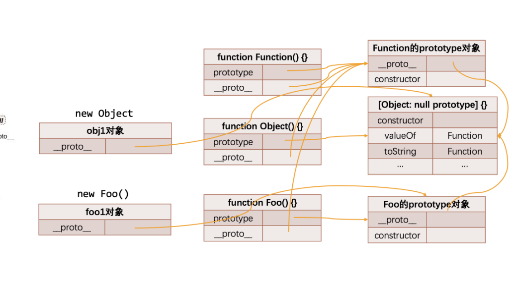

## 原型关系继承图

### 原型继承关系


- 其实父节点都为 Object
- function（函数）的父节点还包含函数的显示原型对象，创建函数对象的时候会将父 function 的显示对象指向创建函数的隐式对象



### 创建对象的内存表现


- p1 是 Person 的实例对象
- obj 是 Object 的实例对象
- Function/Object/Foo 都是 Function 的实例对象
- 原型对象默认创建时, 隐式原型都是指向 Object 的显式原型的(Object 指向 null)
- 推导另外一个结论: Object 是 Person/Function 的父类

## ES6 中的继承

### 认识 class 类

- 我们会发现，按照前面的构造函数形式创建 类，不仅仅和编写普通的函数过于相似，而且代码并不容易理解。

  - 在 ES6（ECMAScript2015）新的标准中使用了 class 关键字来直接定义类；
  - 但是类本质上依然是前面所讲的构造函数、原型链的语法糖而已；
  - 所以学好了前面的构造函数、原型链更有利于我们理解类的概念和继承关系；

- 那么，如何使用 class 来定义一个类呢？

  - 可以使用两种方式来声明类：类声明和类表达式；

    ```js
    class Person {}
    var Student = class {};
    ```

- 注意：类中定义的多个内容不需要使用，进行分割；

### 类和构造函数的异同

- 我们来研究一下类的一些特性：你会发现它和我们的构造函数的特性其实是一致的；

```js
var p = new Person();
console.log(Person); // [class Person]
console.log(Person.prototype); // {}
console.log(Person.prototype.constructor); // [class Person]
console.log(Person.prototype === p.__proto__); // true
console.log(typeof Person); // function
```

### 类的构造函数

- 如果我们希望在创建对象的时候给类传递一些参数，这个时候应该如何做呢？
  - 每个类都可以有一个自己的构造函数（方法），这个方法的名称是固定的 constructor；
  - 当我们通过 new 操作符，操作一个类的时候会调用这个类的构造函数 constructor；
  - 每个类只能有一个构造函数，如果包含多个构造函数，那么会抛出异常；
- 当我们通过 new 关键字操作类的时候，会调用这个 constructor 函数，并且执行如下操作：
  1. 在内存中创建一个新的对象（空对象）；
  2. 这个对象内部的[[prototype]]属性会被赋值为该类的 prototype 属性；
  3. 构造函数内部的 this，会指向创建出来的新对象；
  4. 执行构造函数的内部代码（函数体代码）；
  5. 如果构造函数没有返回非空对象，则返回创建出来的新对象；

### 类的实例方法

- 在上面我们定义的属性都是直接放到了 this 上，也就意味着它是放到了创建出来的新对象中：

  - 在前面我们说过对于实例的方法，我们是希望放到原型上的，这样可以被多个实例来共享；

  - 这个时候我们可以直接在类中定义；

    ```js
    class Person {
      contructor(name, age, height) {
        this.name = name;
        this.age = age;
        this.height = height;
      }

      running() {
        console.log(this.name + " running-");
      }

      eating() {
        console.log(this.name + " eating-");
      }
    }
    ```

### 类的访问器方法

- 我们之前讲对象的属性描述符时有讲过对象可以添加 setter 和 getter 函数的，那么类也是可以的：

  ```js
  class Person {
    constructor(name) {
      this._name = name;
    }

    set name(newName) {
      console.log("调用了name的set方法");
      this._name = newName;
    }
    get name() {
      console.log("调用了name的get方法");
      return this._name;
    }
  }
  ```

### 类的静态方法

- 静态方法通常用于定义直接使用类来执行的方法，不需要有类的实例，使用 static 关键字来定义：

  ```js
  class Person {
    constructor(age) {
      this.age = age;
    }

    static create() {
      return new Person(Math.floor(Math.random() * 100));
    }
  }
  ```

### ES6 类的继承 - extends

- 前面我们花了很大的篇幅讨论了在 ES5 中实现继承的方案，虽然最终实现了相对满意的继承机制，但是过程却依然是非常繁琐的。

- 在 ES6 中新增了使用 extends 关键字，可以方便的帮助我们实现继承：

  ```js
  class Person {}

  class Student extends Person {}
  ```

### super 关键字()

- Class 为我们的方法中还提供了 super 关键字：

  - 执行 super.method(...) 来调用一个父类方法。
    - 重写父类的方法
  - 执行 super(...) 来调用一个父类 constructor（只能在我们的 constructor 中）
    - 简化代码

- 注意：在子（派生）类的构造函数中使用 this 或者返回默认对象之前，必须先通过 super 调用父类的构造函数！

- super 的使用位置有三个：子类的构造函数、实例方法、静态方法；

  ```js
  // 调用 父对象/父类 的构造函数
  super([arguments])

  constructor(name, age, sno, score) {
    // this.name = name
    // this.age = age
    // 简化代码
    super(name, age)
    this.sno = sno
    this.score = score
  }

  // 调用 父对象/父类 上的方法
  super.functionOnParent([argument])

  // 重新实现称之为重写(父类方法的重写)
  running() {
    console.log("dog四条腿")
    // 调用父类的方法
    super.running()
    // console.log("running~")
    // console.log("dog四条腿running~")
  }
  ```

### 继承内置类

- 我们也可以让我们的类继承自内置类，比如 Array：

  ```js
  class MjArray extends Array {
    laseTtem() {
      return this[this.length - 1];
    }
  }

  var array = new MjArray(10, 20, 30);
  console.log(array.lastItem());
  ```

## ES6class | 继承 源码

- 创建 class 源码

```js
// 目标代码
// class Person {
//   constructor(name, age) {
//     this.name = name
//     this.age = age
//   }

//   running() {
//     console.log(this.name + " running~")
//   }

//   static randomPerson() {

//   }
// }

// 转换后代码
// 严格模式
"use strict";

// 2 检测函数调用方式
// 不允许直接以Person()的形式调用
// 传入两个值,instance式当前的this,constructor实例
// 判断当前this是不是Person的实例对象,如果不是则返回错误
function _classCallCheck(instance, Constructor) {
  if (!(instance instanceof Constructor)) {
    throw new TypeError("Cannot call a class as a function");
  }
}

// 4 创建方法
// 传入两个对象 target为对应的原型,props为传入的属性
// 配置函数的默认属性
// enumerable可枚举
// configyrable 可配置
// writable 可写
// 使用Object.defineProperty定义方法
function _defineProperties(target, props) {
  for (var i = 0; i < props.length; i++) {
    var descriptor = props[i];
    descriptor.enumerable = descriptor.enumerable || false;
    descriptor.configurable = true;
    if ("value" in descriptor) descriptor.writable = true;
    Object.defineProperty(target, descriptor.key, descriptor);
  }
}
// 3 检测是否有函数方法或者是静态方法
// 传入三个对象,第一个是对应的constructor实例,第二个是对应的函数方法,第三个是对应的静态方法

function _createClass(Constructor, protoProps, staticProps) {
  if (protoProps) _defineProperties(Constructor.prototype, protoProps);
  if (staticProps) _defineProperties(Constructor, staticProps);
  Object.defineProperty(Constructor, "prototype", { writable: false });
  return Constructor;
}

// 1 立即执行函数,创建Person对象
// 需要将构造函数作为纯函数使用,防止副作用
// 纯函数: 相同的输入一定产生相同的输出,并不会产生副作用
// tree shaking ()在摇树的过程中不会受到其他变量影响
var Person = /*#__PURE__*/ (function () {
  function Person(name, age) {
    _classCallCheck(this, Person);

    this.name = name;
    this.age = age;
  }

  _createClass(
    Person,
    [
      {
        key: "running",
        value: function running() {
          console.log(this.name + " running~");
        },
      },
    ],
    [
      {
        key: "randomPerson",
        value: function randomPerson() {},
      },
    ]
  );

  return Person;
})();

// Person()
// var p1 = new Person()
```

- ES6 中实现继承的方式仍然还是寄生组合式继承，但是对代码的边界条件做了许多约束

```js
// 目标代码
// class Person {
//   constructor(name, age) {
//     this.name = name
//     this.age = age
//   }

//   running() {
//     console.log(this.name + " running~")
//   }

//   static randomPerson() {

//   }
// }

// class Student extends Person {
//   constructor(name, age, sno, score) {
//     super(name, age)
//     this.sno = sno
//     this.score = score
//   }

//   studying() {
//     console.log(this.name + " studying~")
//   }
// }

// 转换后代码
// 严格模式
"use strict";

// 继承代码部分
// ******************************************************************
function _typeof(obj) {
  "@babel/helpers - typeof";
  return (
    (_typeof =
      "function" == typeof Symbol && "symbol" == typeof Symbol.iterator
        ? function (obj) {
            return typeof obj;
          }
        : function (obj) {
            return obj &&
              "function" == typeof Symbol &&
              obj.constructor === Symbol &&
              obj !== Symbol.prototype
              ? "symbol"
              : typeof obj;
          }),
    _typeof(obj)
  );
}
// 2 实现继承
function _inherits(subClass, superClass) {
  // 对传入的两个参数进行判断,否则抛出异常
  if (typeof superClass !== "function" && superClass !== null) {
    throw new TypeError("Super expression must either be null or a function");
  }
  // 将子类的隐式原型创建一个新的对象
  subClass.prototype = Object.create(superClass && superClass.prototype, {
    constructor: { value: subClass, writable: true, configurable: true },
  });
  // 将子类设置为不可写入
  Object.defineProperty(subClass, "prototype", { writable: false });
  // 001 让子类的__proto__指向父类
  if (superClass) _setPrototypeOf(subClass, superClass);
}

function _setPrototypeOf(o, p) {
  _setPrototypeOf = Object.setPrototypeOf
    ? Object.setPrototypeOf.bind()
    : function _setPrototypeOf(o, p) {
        o.__proto__ = p;
        return o;
      };
  return _setPrototypeOf(o, p);
}

// 3 super
function _createSuper(Derived) {
  // 4 判断当前浏览器是否支持Reflect
  var hasNativeReflectConstruct = _isNativeReflectConstruct();
  // 返回继承super函数
  return function _createSuperInternal() {
    // 002 通过_setPrototypeOf的操作,获取到在子类隐式原型中的父类对象
    var Super = _getPrototypeOf(Derived),
      result;
    if (hasNativeReflectConstruct) {
      var NewTarget = _getPrototypeOf(this).constructor;
      result = Reflect.construct(Super, arguments, NewTarget);
    } else {
      // apply绑定对象
      result = Super.apply(this, arguments);
    }
    return _possibleConstructorReturn(this, result);
  };
}

function _possibleConstructorReturn(self, call) {
  if (call && (_typeof(call) === "object" || typeof call === "function")) {
    return call;
  } else if (call !== void 0) {
    throw new TypeError(
      "Derived constructors may only return object or undefined"
    );
  }
  return _assertThisInitialized(self);
}

function _assertThisInitialized(self) {
  if (self === void 0) {
    throw new ReferenceError(
      "this hasn't been initialised - super() hasn't been called"
    );
  }
  return self;
}
// 判断当前浏览器是否支持Reflect
function _isNativeReflectConstruct() {
  if (typeof Reflect === "undefined" || !Reflect.construct) return false;
  if (Reflect.construct.sham) return false;
  if (typeof Proxy === "function") return true;
  try {
    Boolean.prototype.valueOf.call(
      Reflect.construct(Boolean, [], function () {})
    );
    return true;
  } catch (e) {
    return false;
  }
}

// 判断子类是否支持__proto__
function _getPrototypeOf(o) {
  _getPrototypeOf = Object.setPrototypeOf
    ? Object.getPrototypeOf.bind()
    : function _getPrototypeOf(o) {
        return o.__proto__ || Object.getPrototypeOf(o);
      };
  return _getPrototypeOf(o);
}
// ******************************************************************
// 创建对象代码部分
// ******************************************************************
function _classCallCheck(instance, Constructor) {
  if (!(instance instanceof Constructor)) {
    throw new TypeError("Cannot call a class as a function");
  }
}

function _defineProperties(target, props) {
  for (var i = 0; i < props.length; i++) {
    var descriptor = props[i];
    descriptor.enumerable = descriptor.enumerable || false;
    descriptor.configurable = true;
    if ("value" in descriptor) descriptor.writable = true;
    Object.defineProperty(target, descriptor.key, descriptor);
  }
}

function _createClass(Constructor, protoProps, staticProps) {
  if (protoProps) _defineProperties(Constructor.prototype, protoProps);
  if (staticProps) _defineProperties(Constructor, staticProps);
  Object.defineProperty(Constructor, "prototype", { writable: false });
  return Constructor;
}
// ******************************************************************

// 父类
var Person = /*#__PURE__*/ (function () {
  function Person(name, age) {
    _classCallCheck(this, Person);

    this.name = name;
    this.age = age;
  }

  _createClass(
    Person,
    [
      {
        key: "running",
        value: function running() {
          console.log(this.name + " running~");
        },
      },
    ],
    [
      {
        key: "randomPerson",
        value: function randomPerson() {},
      },
    ]
  );

  return Person;
})();

// 子类
// 1 在立即执行函数中传入父类对象,在函数内部获取到父类对象
var Student = /*#__PURE__*/ (function (_Person) {
  _inherits(Student, _Person);

  var _super = _createSuper(Student);

  function Student(name, age, sno, score) {
    var _this;

    _classCallCheck(this, Student);
    // 借用构造函数
    _this = _super.call(this, name, age);
    _this.sno = sno;
    _this.score = score;
    return _this;
  }

  _createClass(Student, [
    {
      key: "studying",
      value: function studying() {
        console.log(this.name + " studying~");
      },
    },
  ]);

  return Student;
})(Person);

var stu = new Student();
```

## 混入 MIXIN

### 类的混入 mixin

- JavaScript 的类只支持单继承：也就是只能有一个父类

  - 那么在开发中我们我们需要在一个类中添加更多相似的功能时，应该如何来做呢？

  - 这个时候我们可以使用混入（mixin）；

    ```js
    function mixinRunner(BaseClass) {
      return class extends BaseClass {
        running() {
          console.log("running-");
        }
      };
    }

    function mixinEater(BaseClass) {
      return class extends BaseClass {
        running() {
          eating.log("eating-");
        }
      };
    }

    class Person {}

    class NewPerson extends mixinEater(mixinRunner(Person)) {}
    var p1 = new NewPerson();
    p1.eating;
    p1.runing;
    ```

### 在 react 中的高阶组件


## 多态

### JavaScript 中的多态

- 面向对象的三大特性：封装、继承、多态。

  - 前面两个我们都已经详细解析过了，接下来我们讨论一下 JavaScript 的多态。

- JavaScript 有多态吗？

  - 维基百科对多态的定义：多态（英语：polymorphism）指为不同数据类型的实体提供统一的接口，或使用一个单一的符号
    来表示多个不同的类型。
  - 非常的抽象，个人的总结：不同的数据类型进行同一个操作，表现出不同的行为，就是多态的体现。

- 那么从上面的定义来看，JavaScript 是一定存在多态的。

  ```js
  function sum(a, b) {
    console.log(a + b);
  }
  sum(10, 20);
  sum("abc", "cba");
  ```
