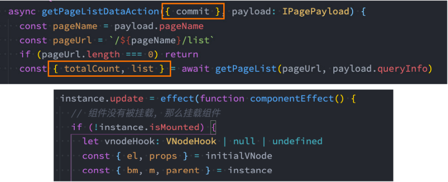

## 字面量的增强

* ES6中对 对象字面量 进行了增强，称之为 Enhanced object literals（增强对象字面量）。

* 字面量的增强主要包括下面几部分：

  * 属性的简写：Property Shorthand
  * 方法的简写：Method Shorthand
  * 计算属性名：Computed Property Names

  ```js
  var name = "mjjh"
  var age = 18
  var key = "address" + " city"
  
  var obj = {
    // 1.属性的增强
    name,
    age,
  
    // 2.方法的增强
    running: function() {
      console.log(this)
    },
    swimming() {
      console.log(this)
    },
    eating: () => {
      console.log(this)
    },
  
    // 3.计算属性名
    [key]: "丽水"
  }
  ```

## 解构Destructuring

* ES6中新增了一个从数组或对象中方便获取数据的方法，称之为解构Destructuring。

  * 解构赋值 是一种特殊的语法，它使我们可以将数组或对象“拆包”至一系列变量中。

* 我们可以划分为：数组的解构和对象的解构。

* 数组的解构：

  * 基本解构过程

  * 顺序解构

  * 解构出数组：…语法

  * 默认值

    ```js
    // 1.数组的解构
    // var name1 = names[0]
    // var name2 = names[1]
    // var name3 = names[2]
    // 1.1. 基本使用
    // var [name1, name2, name3] = names
    // console.log(name1, name2, name3)
    
    // 1.2. 顺序问题: 严格的顺序
    // var [name1, , name3] = names
    // console.log(name1, name3)
    
    // 1.3. 解构出数组
    // var [name1, name2, ...newNames] = names
    // console.log(name1, name2, newNames)
    
    // 1.4. 解构的默认值
    var [name1, name2, name3 = "default"] = names
    console.log(name1, name2, name3)
    ```

* 对象的解构：

  * 基本解构过程

  * 任意顺序

  * 重命名

  * 默认值

    ```js
     // 2.对象的解构
    var obj = { name: "mjjh", age: 18, height: 1.88 }
    // var name = obj.name
    // var age = obj.age
    // var height = obj.height
    // 2.1. 基本使用
    // var { name, age, height } = obj
    // console.log(name, age, height)
    
    // 2.2. 顺序问题: 对象的解构是没有顺序, 根据key解构
    // var { height, name, age } = obj
    // console.log(name, age, height)
    
    
    // 2.3. 对变量进行重命名
    // var { height: wHeight, name: wName, age: wAge } = obj
    // console.log(wName, wAge, wHeight)
    
    // 2.4. 默认值
    var { 
      height: wHeight, 
      name: wName, 
      age: wAge, 
      address: wAddress = "中国"
    } = obj
    console.log(wName, wAge, wHeight, wAddress)
    ```

### 解构的应用场景

* 解构目前在开发中使用是非常多的：

  * 比如在开发中拿到一个变量时，自动对其进行解构使用；

  * 比如对函数的参数进行解构；

    

##  新的ECMA代码执行描述


- 在执行学习JavaScript代码执行过程中，我们学习了很多ECMA文档的术语：
  - 执行上下文栈：Execution Context Stack，用于执行上下文的栈结构；
  - 执行上下文：Execution Context，代码在执行之前会先创建对应的执行上下文；
  - 变量对象：Variable Object，上下文关联的VO对象，用于记录函数和变量声明；
  - 全局对象：Global Object，全局执行上下文关联的VO对象；
  - 激活对象：Activation Object，函数执行上下文关联的VO对象；
  - 作用域链：scope chain，作用域链，用于关联指向上下文的变量查找；
- 在新的ECMA代码执行描述中（ES5以及之上），对于代码的执行流程描述改成了另外的一些词汇：
  - 基本思路是相同的，只是对于一些词汇的描述发生了改变；
  - 执行上下文站和执行上下文也是相同的；

## 词法环境（Lexical Environments）


- 词法环境是一种规范类型，用于在词法嵌套结构中定义关联的变量、函数等标识符；

  - 一个词法环境是由环境记录（Environment Record）和一个外部词法环境（oute;r Lexical Environment）组成；

  - 一个词法环境经常用于关联一个函数声明、代码块语句、try-catch语句，当它们的代码被执行时，词法环境被创建出来；

    

- 也就是在ES5之后，执行一个代码，通常会关联对应的词法环境；

  - 那么执行上下文会关联哪些词法环境呢？
    

### LexicalEnvironment和VariableEnvironment


- LexicalEnvironment用于存放let、const声明的标识符：

  

- VariableEnvironment用于存放var和function声明的标识符：
  

## 环境记录（Environment Record）


- 在这个规范中有两种主要的环境记录值:声明式环境记录和对象环境记录。

  - 声明式环境记录：声明性环境记录用于定义ECMAScript语言语法元素的效果，如函数声明、变量声明和直接将标识符绑定与ECMAScript语言值关联起来的Catch子句。

  - 对象式环境记录：对象环境记录用于定义ECMAScript元素的效果，例如WithStatement，它将标识符绑定与某些对象的属性关联起来。

    

### 新ECMA描述内存图


## let/const

### 基本使用


- 在ES5中我们声明变量都是使用的var关键字，从ES6开始新增了两个关键字可以声明变量：let、const
  - let、const在其他编程语言中都是有的，所以也并不是新鲜的关键字；
  - 但是let、const确确实实给JavaScript带来一些不一样的东西；
- let关键字：
  - 从直观的角度来说，let和var是没有太大的区别的，都是用于声明一个变量
- const关键字：
  - const关键字是constant的单词的缩写，表示常量、衡量的意思；
  - 它表示保存的数据一旦被赋值，就不能被修改；
  - 但是如果赋值的是引用类型，那么可以通过引用找到对应的对象，修改对象的内容；
- 注意：另外let、const不允许重复声明变量；

### let/const作用域提升


- let、const和var的另一个重要区别是作用域提升：

  - 我们知道var声明的变量是会进行作用域提升的；

  - 但是如果我们使用let声明的变量，在声明之前访问会报错；

    ```js
    console.log(foo) // ReferenceError: Cannot access 'foo' before initialization
    
    let foo = "foo"
    ```

- 那么是不是意味着foo变量只有在代码执行阶段才会创建的呢？

  - 事实上并不是这样的，我们可以看一下ECMA262对let和const的描述；

  - 这些变量会被创建在包含他们的词法环境被实例化时，但是是不可以访问它们的，直到词法绑定被求值；

    

### 暂时性死区

- 在let const定义的藐视父真正执行到声明代码前,是不能被访问的

  - 从块级作用域的顶端一直到面临声明完成之前,这个变量处在暂时性死区(TDZ, temporal dead zone)

    ```js
    {
    	console.log(name)
    	
    	let name = "mjjh"
    }
    ```

- 使用术语 "temporal" 是因为区域取决于执行顺序(时间),而不是编写代码的位置;

  ```js
  function foo() [
  	console.log(message)
  ]
  let message = "Hello World"
  foo()
  ```

### let/const有没有作用域提升呢？


- 从上面我们可以看出，在执行上下文的词法环境创建出来的时候，变量事实上已经被创建了，只是这个变量是不能被访问的。
  - 那么变量已经有了，但是不能被访问，是不是一种作用域的提升呢？
- 事实上维基百科并没有对作用域提升有严格的概念解释，那么我们自己从字面量上理解；
  - 作用域提升：在声明变量的作用域中，如果这个变量可以在声明之前被访问，那么我们可以称之为作用域提升；
  - 在这里，它虽然被创建出来了，但是不能被访问，我认为不能称之为作用域提升；
- 所以我的观点是let、const没有进行作用域提升，但是会在解析阶段被创建出来。

## 变量保存位置

### Window对象添加属性


- 我们知道，在全局通过var来声明一个变量，事实上会在window上添加一个属性：
  - 但是let、const是不会给window上添加任何属性的。
- 那么我们可能会想这个变量是保存在哪里呢？
- 我们先回顾一下最新的ECMA标准中对执行上下文的描述
  

### 变量被保存到VariableMap中


- 也就是说我们声明的变量和环境记录是被添加到变量环境中的：

  - 但是标准有没有规定这个对象是window对象或者其他对象呢？
  - 其实并没有，那么JS引擎在解析的时候，其实会有自己的实现；
  - 比如v8中其实是通过VariableMap的一个hashmap来实现它们的存储的。
  - 那么window对象呢？而window对象是早期的GO对象，在最新的实现中其实是浏览器添加的全局对象，并且一直保持了window和var之间值的相等性；

  ```js
  // A hash map  to support fast variable declaration and lookup
  class variableMap : public ZoneHashMap {
    public: 
    	explicit VariableMap(Zone* zone);
    	VariableMap(const VariableMap& other, Zone* zone);
    
    	VariableMap(VariableMap&& other) V8_NOEXCEPT ;ZoneHashMap(std::move(other)){
        
      }
  }
  ```

### var的块级作用域(没有)


- 在我们前面的学习中，JavaScript只会形成两个作用域：全局作用域和函数作用域。

  

- ES5中放到一个代码中定义的变量，外面是可以访问的：

  ```js
  // var没有块级作用域
  {
  	// 编写语句
  	var foo = "foo"
  }
  
  console.log(foo) // foo 可以访问到
  ```

### let/const的块级作用域


- 在ES6中新增了块级作用域，并且通过let、const、function、class声明的标识符是具备块级作用域的限制的：

  ```js
  {
  	let foo = "foo"
  	function bar() {
  		console.log("bar")
  	}
  	class Person {}
  }
  
  console.log(foo) // ReferenceError: foo is not defined
  bar() // 可以访问
  var p = new Person() // ReferenceError: foo is not defined
  ```

- 但是我们会发现函数拥有块级作用域，但是外面依然是可以访问的：

  - 这是因为引擎会对函数的声明进行特殊的处理，允许像var那样进行提升；

### 块级作用域的应用


- 我来看一个实际的案例：获取多个按钮监听点击

  ```html
  <button>btn1</button>
  <button>btn2</button>
  <button>btn3</button>
  <button>btn4</button>
  ```

- 使用let或者const来实现：

  ```js
  var btns = domcument.getElementsByTagName("button")
  for (let i = 0; i < btns.length; i++) {
  	btns[i].onclick = function() {
  		console.log("第" + i + "个按钮被点击")
  	}
  }
  ```

## var、let、const的选择


- 那么在开发中，我们到底应该选择使用哪一种方式来定义我们的变量呢？
- 对于var的使用：
  - 我们需要明白一个事实，var所表现出来的特殊性：比如作用域提升、window全局对象、没有块级作用域等都是一些历史遗
    留问题；
  - 其实是JavaScript在设计之初的一种语言缺陷；
  - 当然目前市场上也在利用这种缺陷出一系列的面试题，来考察大家对JavaScript语言本身以及底层的理解；
  - 但是在实际工作中，我们可以使用最新的规范来编写，也就是不再使用var来定义变量了；
- 对于let、const：
  - 对于let和const来说，是目前开发中推荐使用的；
  - 我们会有限推荐使用const，这样可以保证数据的安全性不会被随意的篡改；
  - 只有当我们明确知道一个变量后续会需要被重新赋值时，这个时候再使用let；
  - 这种在很多其他语言里面也都是一种约定俗成的规范，尽量我们也遵守这种规范；

## 字符串模板

### 字符串模板基本使用


- 在ES6之前，如果我们想要将字符串和一些动态的变量（标识符）拼接到一起，是非常麻烦和丑陋的（ugly）。

- ES6允许我们使用字符串模板来嵌入JS的变量或者表达式来进行拼接：

  - 首先，我们会使用 `` 符号来编写字符串，称之为模板字符串；
  - 其次，在模板字符串中，我们可以通过 ${expression} 来嵌入动态的内容；

  ```js
  const name = "mjjh"
  const age = 18
  const height = 1.88
  
  console.log(`my name is ${name}, age is ${age}, height is ${height`);
  console.log(`我是成年人吗 ${age >= 18 ? '是': '否'}`)
  
  function foo() {
  	return "function is foo"
  }
  
  console.log(`my function is ${foo()}`)
  ```

### 标签模板字符串使用


- 模板字符串还有另外一种用法：标签模板字符串（Tagged Template Literals）。

- 我们一起来看一个普通的JavaScript的函数：

  ```js
  function foo(...args) {
    console.log(args)
  }
  
  // [ 'Hello World' ]
  foo("Hello World")
  ```

- 如果我们使用标签模板字符串，并且在调用的时候插入其他的变量：

  - 模板字符串被拆分了；
  - 第一个元素是数组，是被模块字符串拆分的字符串组合；
  - 后面的元素是一个个模块字符串传入的内容；

  ```js
  const name = "mjjh"
  const age = 18
  
  // [ [ 'Hello', 'World', '' ], 'mjjh', '18' ]
  foo`Hello ${name} World ${age}`
  ```

###  React的styled-components库


## 函数补充

### 函数的默认参数


- 在ES6之前，我们编写的函数参数是没有默认值的，所以我们在编写函数时，如果有下面的需求：

  - 传入了参数，那么使用传入的参数；

  - 没有传入参数，那么使用一个默认值；

    ```js
    function foo(arg1 = "我是默认值", arg2 = "我也是默认值") {
      // 1.两种写法不严谨
      // 默认值写法一:
      // arg1 = arg1 ? arg1: "我是默认值"
    
      // 默认值写法二:
      // arg1 = arg1 || "我是默认值"
    
      // 2.严谨的写法
      // 三元运算符
      // arg1 = (arg1 === undefined || arg1 === null) ? "我是默认值": arg1
    
      // ES6之后新增语法: ??
      // arg1 = arg1 ?? "我是默认值"
    
      // 3.简便的写法: 默认参数
      console.log(arg1)
    }
    ```

- 而在ES6中，我们允许给函数一个默认值：

  ```js
  function foo(x = 20, y = 30) {
  	console.log(x, y)
  }
  
  foo(50, 100) // 50 100
  foo() // 20 30
  ```

### 函数默认值的补充


- 默认值也可以和解构一起来使用：

  ```js
  // 写法一
  function foo({name, age} = {name: "mjjh", age: 18}) {
  	console.log(name, age)
  }
  
  // 写法二
  function foo({name = mjjh, age =18} = {}){
    console.log(name, age)
  }
  ```

- 另外参数的默认值我们通常会将其放到最后（在很多语言中，如果不放到最后其实会报错的）：

  - 但是JavaScript允许不将其放到最后，但是意味着还是会按照顺序来匹配；

- 另外默认值会改变函数的length的个数，默认值以及后面的参数都不计算在length之内了。

### 函数的剩余参数


- ES6中引用了rest parameter，可以将不定数量的参数放入到一个数组中：

  - 如果最后一个参数是 ... 为前缀的，那么它会将剩余的参数放到该参数中，并且作为一个数组；

    ```js
    function foo(m,n,...args) {
    	console.log(m, n)
    	console.log(args)
    }
    ```

- 那么剩余参数和arguments有什么区别呢？

  - 剩余参数只包含那些没有对应形参的实参，而 arguments 对象包含了传给函数的所有实参；
  - arguments对象不是一个真正的数组，而rest参数是一个真正的数组，可以进行数组的所有操作；
  - arguments是早期的ECMAScript中为了方便去获取所有的参数提供的一个数据结构，而rest参数是ES6中提供并且希望以此来替代arguments的；

- 剩余参数必须放到最后一个位置，否则会报错。

### 箭头函数的补充


- 在前面我们已经学习了箭头函数的用法，这里进行一些补充：

  - 箭头函数是没有显式原型的，所以不能作为构造函数，使用new来创建对象；

  ```js
  var foo = () => {
    console.log("foo")
  }
  
  console.log(foo.prototype) // undefind
  
  // TypeError: foo is not a constructor
  var f = new foo()
  ```


## 展开语法

- 展开语法(Spread syntax)：
  - 可以在函数调用/数组构造时，将数组表达式或者string在语法层面展开；
  - 还可以在构造字面量对象时, 将对象表达式按key-value的方式展开；
- 展开语法的场景：
  - 在函数调用时使用；
  - 在数组构造时使用；
  - 在构建对象字面量时，也可以使用展开运算符，这个是在ES2018（ES9）中添加的新特性；

- 注意：展开运算符其实是一种浅拷贝；

```js
// 1.基本演练
// ES6
const names = ["abc", "cba", "nba", "mba"]
const str = "Hello"

// const newNames = [...names, "aaa", "bbb"]
// console.log(newNames)

function foo(name1, name2, ...args) {
  console.log(name1, name2, args)
}

foo(...names)
foo(...str)

// ES9(ES2018)
const obj = {
  name: "mjjg",
  age: 18
}
// 不可以这样来使用
// foo(...obj) // 在函数的调用时, 用展开运算符, 将对应的展开数据, 进行迭代
// 可迭代对象: 数组/string/arguments

const info = {
  ...obj,
  height: 1.88,
  address: "广州市"
}
console.log(info)
```

### 展开运算符其实是一种浅拷贝

```js
const obj = {
  name: "mjjh",
  age: 18,
  height: 1.88,
  friend: {
    name: "curry"
  }
}

// 1.引用赋值
// const info1 = obj


// 2.浅拷贝
// const info2 = {
//   ...obj
// }
// info2.name = "kobe"
// console.log(obj.name)
// console.log(info2.name)
// info2.friend.name = "james"
// console.log(obj.friend.name)


// 3.深拷贝
// 方式一: 第三方库
// 方式二: 自己实现
// function deepCopy(obj) {}
// 方式三: 利用先有的js机制, 实现深拷贝JSON
const info3 = JSON.parse(JSON.stringify(obj))
console.log(info3.friend.name)
info3.friend.name = "james"
console.log("info3.friend.name:", info3.friend.name)
console.log(obj.friend.name)

```

## 数值的表示

在ES6中规范了二进制和八进制的写法

```js
const num1 = 100

// b -> binary
const num2 = 0b100

// o -> octanary
const num3 = 0o100

// h -> hexadecimal
const num4 = 0x100
```

另外在ES2021新增特性:数字过长时,可以使用_作为连接符

```
// ES2021新增特性
const num5 = 100_000_000
```

## Symbol

### 基本使用

- Symbol是什么呢？Symbol是ES6中新增的一个基本数据类型，翻译为符号。
- 那么为什么需要Symbol呢？
  - 在ES6之前，对象的属性名都是字符串形式，那么很容易造成属性名的冲突；
  - 比如原来有一个对象，我们希望在其中添加一个新的属性和值，但是我们在不确定它原来内部有什么内容的情况下，很容易造成冲突，从而覆盖掉它内部的某个属性；
  - 比如我们前面在讲apply、call、bind实现时，我们有给其中添加一个fn属性，那么如果它内部原来已经有了fn属性了呢？
  - 比如开发中我们使用混入，那么混入中出现了同名的属性，必然有一个会被覆盖掉；
- Symbol就是为了解决上面的问题，用来生成一个独一无二的值。
  - Symbol值是通过Symbol函数来生成的，生成后可以作为属性名；
  - 也就是在ES6中，对象的属性名可以使用字符串，也可以使用Symbol值；
- Symbol即使多次创建值，它们也是不同的：Symbol函数执行后每次创建出来的值都是独一无二的；
- 我们也可以在创建Symbol值的时候传入一个描述description：这个是ES2019（ES10）新增的特性；

### Symbol作为属性名

- 使用Symbol在对象中表示唯一的属性名;

  ```js
  // ES6之前存在的问题
  // const obj = {
  //   name: "mjjh",
  //   fn: "aaa"
  // }
  
  // // 添加一个新的属性 name
  // function foo(obj) {
  //   obj.mjjh = function() {}
  // }
  // foo(obj)
  // console.log(obj.fn)
  
  
  // ES6之后可以使用Symbol生成一个独一无二的值
  const s1 = Symbol()
  // const info = { name: "mjjh" }
  const obj = {
    [s1]: "aaa" 
  }
  console.log(obj)
  
  const s2 = Symbol()
  obj[s2] = "bbb"
  console.log(obj)
  
  function foo(obj) {
    const sKey = Symbol()
    obj[sKey] = function() {}
    delete obj[sKey]
  }
  
  foo(obj)
  ```

### 相同值的Symbol

前面我们讲Symbol的目的是为了创建一个独一无二的值，那么如果我们现在就是想创建相同的Symbol应该怎么来做呢？

- 我们可以使用Symbol.for方法来做到这一点；
- 并且我们可以通过Symbol.keyFor方法来获取对应的key；

```js
const s1 = Symbol() // aaa
const s2 = Symbol() // bbb

// 1.加入对象中
const obj = {
  name: "mjjh",
  age: 18,
  [s1]: "aaa",
  [s2]: "bbb"
}

// const obj1 = {}
// obj1[s1] = "aaa"
// obj2[s2] = "bbb"

// const obj2 = {}
// Object.defineProperty(obj, s1, {
//   value: "aaa"
// })

// 2.获取symbol对应的key
console.log(Object.keys(obj))
console.log(Object.getOwnPropertySymbols(obj))
const symbolKeys = Object.getOwnPropertySymbols(obj)
for (const key of symbolKeys) {
  console.log(obj[key])
}

// 3.description
// 3.1.Symbol函数直接生成的值, 都是独一无二
const s3 = Symbol("ccc")
console.log(s3.description)
const s4 = Symbol(s3.description)
console.log(s3 === s4)

// 3.2. 如果相同的key, 通过Symbol.for可以生成相同的Symbol值
const s5 = Symbol.for("ddd")
const s6 = Symbol.for("ddd")
console.log(s5 === s6)

// 获取传入的key
console.log(Symbol.keyFor(s5))
```

## SET

### 基本使用

- 在ES6之前，我们存储数据的结构主要有两种：数组、对象。

- 在ES6中新增了另外两种数据结构：Set、Map，以及它们的另外形式WeakSet、WeakMap。

- Set是一个新增的数据结构，可以用来保存数据，类似于数组，但是和数组的区别是元素不能重复。
  - 创建Set我们需要通过Set构造函数（暂时没有字面量创建的方式）：
- 我们可以发现Set中存放的元素是不会重复的，那么Set有一个非常常用的功能就是给数组去重。

```js
const set1 = new Set()
set1.add(10)
set1.add(14)
set1.add(16)
cosole.log(set1) // Set(3) { 10, 14, 16 }
```

```js
const arr = [10, 20, 10, 44, 77, 44]
const set = new Set(arr)
const newArray1 = [...set]
const newArray2 = Array.from(set)
console.log(newArray1, newArray2)
```

### set的常见方法

- Set常见的属性：
  - size：返回Set中元素的个数；
- Set常用的方法：
  - add(value)：添加某个元素，返回Set对象本身；
  - delete(value)：从set中删除和这个值相等的元素，返回boolean类型；
  - has(value)：判断set中是否存在某个元素，返回boolean类型；
  - clear()：清空set中所有的元素，没有返回值；
  - forEach(callback, [, thisArg])：通过forEach遍历set；
- 另外Set是支持for of的遍历的。

### WeakSet的使用(弱引用)

- 和Set类似的另外一个数据结构称之为WeakSet，也是内部元素不能重复的数据结构。

- 那么和Set有什么区别呢？

  - 区别一：WeakSet中只能存放对象类型，不能存放基本数据类型；

  - 区别二：WeakSet对元素的引用是弱引用，如果没有其他引用对某个对象进行引用，那么GC可以对该对进行回收；

    ```js
    const wset = new WeakSet()
    
    // TypeError: Invalid value used in weak set
    wset.add(10)
    ```

- WeakSet常见的方法：

  - add(value)：添加某个元素，返回WeakSet对象本身；
  - delete(value)：从WeakSet中删除和这个值相等的元素，返回boolean类型；
  - has(value)：判断WeakSet中是否存在某个元素，返回boolean类型；

## MAP

### 基本使用

- 另外一个新增的数据结构是Map，用于存储映射关系。

- 但是我们可能会想，在之前我们可以使用对象来存储映射关系，他们有什么区别呢？

  - 事实上我们对象存储映射关系只能用字符串（ES6新增了Symbol）作为属性名（key）；
  - 某些情况下我们可能希望通过其他类型作为key，比如对象，这个时候会自动将对象转成字符串来作为key；

- 那么我们就可以使用Map：

  ```js
  const obj1 = { name: 'mjjh' }
  const obj2 = { age: 18 }
  
  const map = new Map()
  map.set(obj1, "abc")
  map.set(obj2, "cba")
  console.log(map.get(obj1))
  console.log(map.get(obj2))
  ```

  ```js
  const map = new Map({
  	[obj1, "abc"],
  	[obj2, "cba"],
  	[obj1, "nba"],
  })
  
  console.log(map.get(obj1)) // nba
  console.log(map.get(obj2)) // cba
  ```

### map的常用方法

- Map常见的属性：
  - size：返回Map中元素的个数；
- Map常见的方法：
  - set(key, value)：在Map中添加key、value，并且返回整个Map对象；
  - get(key)：根据key获取Map中的value；
  - has(key)：判断是否包括某一个key，返回Boolean类型；
  - delete(key)：根据key删除一个键值对，返回Boolean类型；
  - clear()：清空所有的元素；
  - forEach(callback, [, thisArg])：通过forEach遍历Map；
- Map也可以通过for of进行遍历

### WeakMap的使用

- 和Map类型的另外一个数据结构称之为WeakMap，也是以键值对的形式存在的。

- 那么和Map有什么区别呢？

  - 区别一：WeakMap的key只能使用对象，不接受其他的类型作为key；

  - 区别二：WeakMap的key对对象想的引用是弱引用，如果没有其他引用引用这个对象，那么GC可以回收该对象；

    ```js
    const weakMap = new WeakMap()
    // Invalid value used as weak map key
    weakMap.set(1, "abc")
    // Invalid value used as weak map key
    weakMap.set("aaa", "cba")
    ```

- WeakMap常见的方法有四个：

  - set(key, value)：在Map中添加key、value，并且返回整个Map对象；
  - get(key)：根据key获取Map中的value；
  - has(key)：判断是否包括某一个key，返回Boolean类型；
  - delete(key)：根据key删除一个键值对，返回Boolean类型；

### WeakMap的应用

- 注意：WeakMap也是不能遍历的

  - 没有forEach方法，也不支持通过for of的方式进行遍历；

- 那么我们的WeakMap有什么作用呢？

  ```js
  // weakMap({key(对象): value}): key是一个对象, 弱引用
  const targetMap = new WeakMap();
  function getDep(target, key) {
    // 1 根据对象(target)取出对应的Map对象
    let depsMap = targetMap.get(target);
    if(!depsMap) {
      depsMap = new Map();
      targetMap.set(target, depsMap);
    }
    
    // 2 取出具体的dep对象
    let dep = depsMap.get(key);
    if(!dep) {
      dep = new Dep();
      depsMap.set(key, dep);
    }
    return dep;
  }
  ```

## ES6其他知识点说明

- 事实上ES6（ES2015）是一次非常大的版本更新，所以里面重要的特性非常多：
  - 除了前面讲到的特性外还有很多其他特性；
- Proxy、Reflect，我们会在后续专门进行学习。
  - 并且会利用Proxy、Reflect来讲解Vue3的响应式原理；
- Promise，用于处理异步的解决方案
  - 并且会学习如何手写Promise；
- ES Module模块化开发：
  - 从ES6开发，JavaScript可以进行原生的模块化开发；
  - 这部分内容会在工程化部分学习；
  - 包括其他模块化方案：CommonJS、AMD、CMD等方案；
