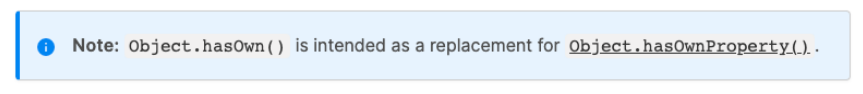

## ES7 

### Array Includes


- 在ES7之前，如果我们想判断一个数组中是否包含某个元素，需要通过 indexOf 获取结果，并且判断是否为 -1。
- 在ES7中，我们可以通过includes来判断一个数组中是否包含一个指定的元素，根据情况，如果包含则返回 true，否则返回false。


```js
if (names.includes("mjjh")) {
	console.log("包含mjjh")
}

if (names.includes("mjjh", 4)) {
  console.log("包含mjjh")
}

console.log(names.indexOf(NaN)) // -1
console.log(names.includes(NaN)) // true
```

### 指数exponentiation运算符


- 在ES7之前，计算数字的乘方需要通过 Math.pow 方法来完成。

- 在ES7中，增加了 ** 运算符，可以对数字来计算乘方。

  ```js
  const result1 = Math.pow(3, 3)
  const result2 = 3 ** 3
  console.log(result1, result2)
  ```

## ES8

### Object values


- 之前我们可以通过 Object.keys 获取一个对象所有的key
- 在ES8中提供了 Object.values 来获取所有的value值：

```js
const obj = {
	name: "mjjh",
	age: 18,
	height: 1.88
}

console.log(Object.values(obj)) // [ 'mjjh', 18, 1.88 ]

// 如果传入一个字符串
console.log(Object.value("abc")) // [ 'a', 'b', 'c' ]
```

### Object entries


- 通过 Object.entries 可以获取到一个数组，数组中会存放可枚举属性的键值对数组。

  - 可以针对对象、数组、字符串进行操作；

    ```js
    const obj = {
    	name: "mjjh",
    	age: 18,
    	height: 1.88
    }
    
    console.log(Object.entries(obj)) // [ [ 'name', 'mjjh' ], [ 'age', 18 ], [ 'height', 1.88 ] ]
    for (const entry of Object.entries(obj)) {
    	const [key, value] = entry
    	console.log(key, value)
    }
    
    // 如果是一个数组
    console.log(Object.entries(["abc", "cba", "nba"])) // [ [ '0', 'abc' ], [ '1', 'cba' ], [ '2', 'nba'] ]
    
    // 如果是一个字符串
    console.log(Obejct.entries("abc")) // [ [ '0', 'a' ], [ '1', 'b' ], [ '3', 'c' ] ]
    
    ```

### String Padding


- 某些字符串我们需要对其进行前后的填充，来实现某种格式化效果，ES8中增加了 padStart 和 padEnd 方法，分别是对字符串的首尾进行填充的。

- 第一个参数 需要生成的长度

- 第二个参数替换的内容

  ```js
  const message = "Hello World"
  
  console.log(message.padStart(15, "a")) // aaaaHello World
  console.log(message.padEnd(15, "b")) // Hello Worlddbbb
  ```

- 我们简单具一个应用场景：比如需要对身份证、银行卡的前面位数进行隐藏：

  ```js
  const cardNumber = "3242523524256245223879"
  const lastFourNumber = cardNumber.slice(-4)
  const finalCardNumber = lastFourNumber.padStart(cardNumber.length, "*")
  console.log(lastFourNumber) //3870
  console.log(finalCardNumber) //******************3870
  ```

### Trailing Commas


- 在ES8中，我们允许在函数定义和调用时多加一个逗号：

  ```js
  function foo(a, b,) {
  	console.log(a, b)
  }
  
  foo(10, 20,)
  ```

### Object Descriptors


- Object.getOwnPropertyDescriptors ：

  - 获取对象属性描述符

- Async Function：async、await
  - 后续讲完Promise讲解

## ES9


- Async iterators：后续迭代器讲解
- Object spread operators：前面讲过了
- Promise finally：后续讲Promise讲解

## ES10

### flat flatMap


- flat() 方法会按照一个可指定的深度递归遍历数组，并将所有元素与遍历到的子数组中的元素合并为一个新数组返回。

  ```js
  const nums = [ 10, 20, [5, 8], [[2, 3], [9, 22]], 100 ]
  
  const newNUms1 = nums.flat(1)
  const newNUms2 = nums.flat(2)
  
  // [ 10, 20, 5, 8, [ 2, 3 ], [ 9, 22 ], 100 ]
  console.log(newNums1)
  // [ 10, 20, 5, 8,  2, 3, 9, 22, 100 ]
  console.log(newNums1)
  ```

- flatMap() 方法首先使用映射函数映射每个元素，然后将结果压缩成一个新数组。

  - 注意一：flatMap是先进行map操作，再做flat的操作；

  - 注意二：flatMap中的flat相当于深度为1；

    ```js
    const messages = ["Hello World", "你好啊 mjjh", "my name is mjjh"]
    
    const newMessages = messages.flatMap(item => {
      return item.split(" ")
    })
    
    console.log(newMessages)
    ```

### Object fromEntries

- 在前面，我们可以通过 Object.entries 将一个对象转换成 entries(数组类型)


- 那么如果我们有一个entries了，如何将其转换成对象呢？
  - ES10提供了 Object.formEntries来完成转换：
- 那么这个方法有什么应用场景呢？

```js
const obj = {
  name: "mjjh",
  age: 18,
  height: 1.88
}

const entries = Object.entries(obj)
console.log(entries)
console.log(Object.prototype.toString.call(entries))

const info = Object.fromEntries(entries)
console.log(info)
```

```js
const paramsString = 'name=mjjh&age=18&height=1.88'
const searchParams = new URLSearchParams(paramsSring)
for (const param of searchParams) {
  console.log(param)
}
const searchObj = Object.fromEntries(searchParams)
console.log(searchObj)
```

### trimStart trimEnd


- 去除一个字符串首尾的空格，我们可以通过trim方法，如果单独去除前面或者后面呢？

  - ES10中给我们提供了trimStart和trimEnd；

    ```js
    const message = "  Hello World     "
    console.log(message.trim())
    console.log(message.trimStart())
    console.log(message.trimEnd())
    ```

### 其他知识点


- Symbol 类型
- Optional catch binding：后面讲解try cach讲解

## ES11

### BigInt


- 在早期的JavaScript中，我们不能正确的表示过大的数字：

  - 大于MAX_SAFE_INTEGER的数值，表示的可能是不正确的。

    ```js
    const maxInt = Number.MAX_SAFE_INTEGER
    console.log(maxInt)
    
    // 大于MAX_SAFE_INTEGER值的一些数值,无法正确表示
    console.log(maxInt + 1) // 9007199254740992
    console.log(maxInt + 2) // 9007199254740992
    ```

- 那么ES11中，引入了新的数据类型BigInt，用于表示大的整数：

  - BitInt的表示方法是在数值的后面加上n

    ```js
    const bigInt = 9007199254740991n
    console.log(bigInt + 1n)
    console.log(bigInt + 2n)
    ```

### Nullish Coalescing Operator


- ES11，Nullish Coalescing Operator增加了空值合并操作符：

  ```js
  const foo = ""
  
  const result1 = foo || "默认值"
  const result1 = foo ?? "默认值"
  console.log(result1) // 默认值
  console.log(result2) // ""
  ```


### Optional Chaining


- 可选链也是ES11中新增一个特性，主要作用是让我们的代码在进行null和undefined判断时更加清晰和简洁：

  ```js
  const obj = {
  	friend: {
  		girlFriend: {
  			name: "lucy"
  		}
  	}
  }
  if (obj.friend && obj.friend.girlFriend) {
    console.log(obj.friend.girlFriend.name)
  }
  
  // 可选链的方式
  console.log(obj.friend?.girlFriend?.name)
  ```

### Global This


- 在之前我们希望获取JavaScript环境的全局对象，不同的环境获取的方式是不一样的

  - 比如在浏览器中可以通过this、window来获取；
  - 比如在Node中我们需要通过global来获取；

- 在ES11中对获取全局对象进行了统一的规范：globalThis

  ```js
  console.log(globalThis)
  console.log(this)
  console.log(global)
  ```

### for..in标准化


- 在ES11之前，虽然很多浏览器支持for...in来遍历对象类型，但是并没有被ECMA标准化。

- 在ES11中，对其进行了标准化，for...in是用于遍历对象的key的：

  ```js
  const obj = {
  	name: "mjjh",
  	age: 18,
  	height: 1.88
  }
  
  for (const key in obj) {
  	console.log(key)
  }
  ```

### 其他知识点


- Dynamic Import：后续ES Module模块化中讲解。
- Promise.allSettled：后续讲Promise的时候讲解。
- import meta：后续ES Module模块化中讲解。

## ES12

### FinalizationRegistry


- FinalizationRegistry 对象可以让你在对象被垃圾回收时请求一个回调。

  - FinalizationRegistry 提供了这样的一种方法：当一个在注册表中注册的对象被回收时，请求在某个时间点上调用一个清理回
    调。（清理回调有时被称为 finalizer ）;
  - 你可以通过调用register方法，注册任何你想要清理回调的对象，传入该对象和所含的值;

  ```js
  let obj = { name: 'mjjh' }
  
  const registry = new FinalizationRegistry(value => {
  	console.log("对象被销毁了", value)
  })
  
  registry.register(obj, "obj")
  
  obj = null
  ```

### WeakRefs


- 如果我们默认将一个对象赋值给另外一个引用，那么这个引用是一个强引用：

  - 如果我们希望是一个弱引用的话，可以使用WeakRef；

    ```js
    let obj = { name: "mjjh" }
    let info = new WeakRef(obj)
    ```

### 逻辑赋值运算符

- logical assignment operators

  ```js
  // 赋值运算符
  // const foo = "foo"
  let counter = 100
  counter = counter + 100
  counter += 50
  
  // 逻辑赋值运算符
  function foo(message) {
    // 1.||逻辑赋值运算符
    // message = message || "默认值"
    // message ||= "默认值"
  
    // 2.??逻辑赋值运算符
    // message = message ?? "默认值"
    message ??= "默认值"
  
    console.log(message)
  }
  
  foo("abc")
  foo()
  
  // 3.&&逻辑赋值运算符
  let obj = {
    name: "mjjh",
    running: function() {
      console.log("running~")
    }
  }
  
  // 3.1.&&一般的应用场景
  // obj && obj.running && obj.running()
  // obj = obj && obj.name
  obj &&= obj.name
  console.log(obj)
  ```

### 其他知识点


- Numeric Separator：讲过了；
- String.replaceAll：字符串替换；

## ES13

### method.at()


- 前面我们有学过字符串、数组的at方法，它们是作为ES13中的新特性加入的：

  ```js
  // 1 数组
  var names = ["abc", "cba", "nba"]
  console.log(names.at(1))
  console.log(names.at(-1))
  
  // 2 字符串
  var str = "Hello Mjjh"
  console.log(str.at(1))
  console.log(str.at(-1))
  ```

### Object.hasOwn(obj, propKey)


- Object中新增了一个静态方法（类方法）： hasOwn(obj, propKey)

  - 该方法用于判断一个对象中是否有某个自己的属性；

    

- 那么和之前学习的Object.prototype.hasOwnProperty有什么区别呢？

  - 区别一：防止对象内部有重写hasOwnProperty
  - 区别二：对于隐式原型指向null的对象， hasOwnProperty无法进行判断

  ```js
  var obj = {
  	name: 'mjjh',
  	age: 18,
  	hasOwnProperty: function() {
  		return false
  	}
  }
  
  var info = Object.create(null)
  info.name = "mjjh"
  console.log(info.hasOwnProperty("name")) // 报错
  console.log(info.hsaOwn(info, "name")) // 可以判断
  ```

### New members of classes


- 在ES13中，新增了定义class类中成员字段（field）的其他方式：

  - Instance public fields
  - Static public fields
  - Instance private fields
  - static private fields
  - static block

  ```js
  class Person {
    // 1.实例属性
    // 对象属性: public 公共 -> public instance fields
    height = 1.88
  
    // 对象属性: private 私有: 程序员之间的约定
    // _intro = "name is mjjh"
  
    // ES13对象属性: private 私有: 程序员之间的约定
    #intro = "name is mjjh"
  
  
    // 2.类属性(static)
    // 类属性: public
    static totalCount = "70亿"
  
    // 类属性: private
    static #maleTotalCount = "20亿"
  
  constructor(name, age) {
    // 对象中的属性: 在constructor通过this设置
    this.name = name
    this.age = age
    this.address = "广州市"
  }
  
  // 3.静态代码块
  static {
    console.log("Hello World")
    console.log("Hello Person")
  }
  }
  
  const p = new Person("mjjh", 18)
  console.log(p)
  // console.log(p.name, p.age, p.height, p.address, p.#intro)
  
  // console.log(Person.#maleTotalCount)
  ```
