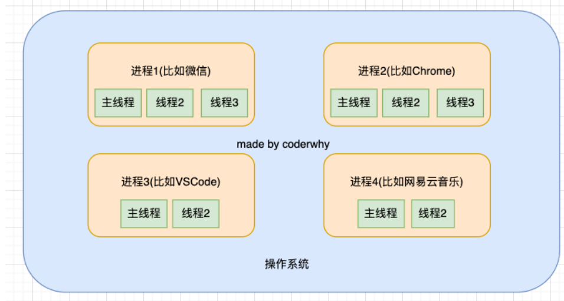
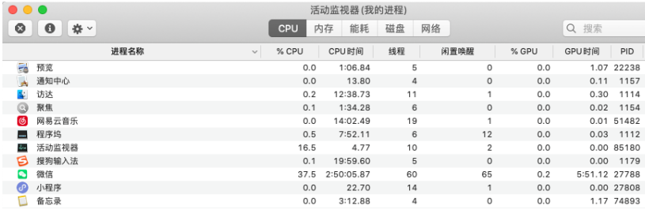
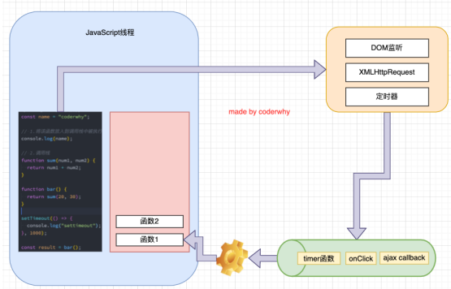
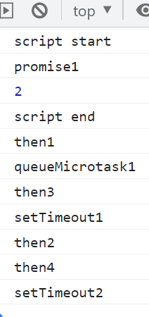
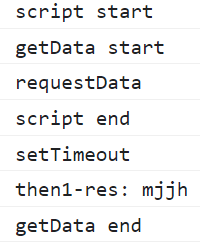
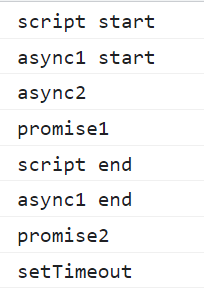
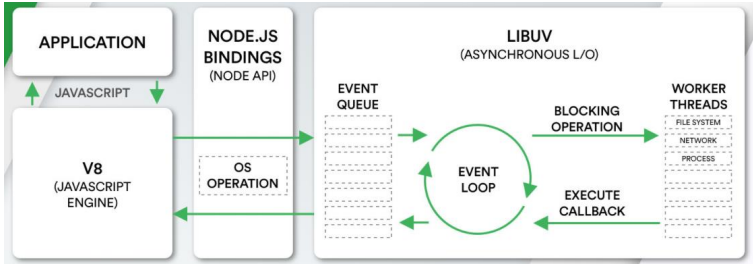
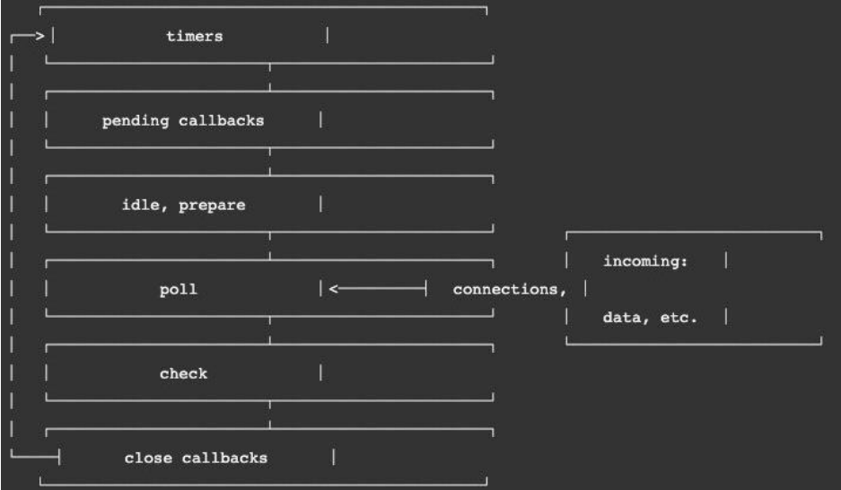
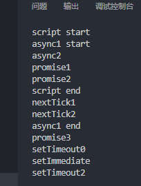

## 进程和线程

### 进程和线程

- 线程和进程是操作系统中的两个概念：
  - 进程（process）：计算机已经运行的程序，是操作系统管理程序的一种方式；
  - 线程（thread）：操作系统能够运行运算调度的最小单位，通常情况下它被包含在进程中；
- 听起来很抽象，这里还是给出我的解释：
  - 进程：我们可以认为，启动一个应用程序，就会默认启动一个进程（也可能是多个进程）；
  - 线程：每一个进程中，都会启动至少一个线程用来执行程序中的代码，这个线程被称之为主线程；
  - 所以我们也可以说进程是线程的容器；
- 再用一个形象的例子解释：
  - 操作系统类似于一个大工厂；
  - 工厂中里有很多车间，这个车间就是进程；
  - 每个车间可能有一个以上的工人在工厂，这个工人就是线程；

### 操作系统 – 进程 – 线程



### 操作系统的工作方式

- 操作系统是如何做到同时让多个进程（边听歌、边写代码、边查阅资料）同时工作呢？

  - 这是因为 CPU 的运算速度非常快，它可以快速的在多个进程之间迅速的切换；
  - 当我们进程中的线程获取到时间片时，就可以快速执行我们编写的代码；
  - 对于用户来说是感受不到这种快速的切换的；

- 你可以在 Mac 的活动监视器或者 Windows 的资源管理器中查看到很多进程：

  

### 浏览器中的 JavaScript 线程

- 我们经常会说 JavaScript 是单线程（可以开启 workers）的，但是 JavaScript 的线程应该有自己的容器进程：浏览器或者 Node。
- 浏览器是一个进程吗，它里面只有一个线程吗？
  - 目前多数的浏览器其实都是多进程的，当我们打开一个 tab 页面时就会开启一个新的进程，这是为了防止一个页面卡死而造成
    所有页面无法响应，整个浏览器需要强制退出；
  - 每个进程中又有很多的线程，其中包括执行 JavaScript 代码的线程；
- JavaScript 的代码执行是在一个单独的线程中执行的：
  - 这就意味着 JavaScript 的代码，在同一个时刻只能做一件事；
  - 如果这件事是非常耗时的，就意味着当前的线程就会被阻塞；
- 所以真正耗时的操作，实际上并不是由 JavaScript 线程在执行的：
  - 浏览器的每个进程是多线程的，那么其他线程可以来完成这个耗时的操作；
  - 比如网络请求、定时器，我们只需要在特性的时候执行应该有的回调即可；

### 浏览器的事件循环

- 如果在执行 JavaScript 代码的过程中，有异步操作呢？

  - 中间我们插入了一个 setTimeout 的函数调用；
  - 这个函数被放到入调用栈中，执行会立即结束，并不会阻塞后续代码的执行；

  ```js
  function sum(num1, num2) {
    return num1 + num2;
  }

  function bar() {
    return sum(20, 30);
  }

  setTimeout(() => {
    console.log("settimeout");
  }, 1000);

  const result = bar();

  console.log(result);
  ```

  

### 宏任务和微任务

- 但是事件循环中并非只维护着一个队列，事实上是有两个队列：

  - 宏任务队列（macrotask queue）：ajax、setTimeout、setInterval、DOM 监听、UI Rendering 等
  - 微任务队列（microtask queue）：Promise 的 then 回调、 Mutation Observer API、queueMicrotask()等

- 那么事件循环对于两个队列的优先级是怎么样的呢？

  1. main script 中的代码优先执行（编写的顶层 script 代码）；
  2. 在执行任何一个宏任务之前（不是队列，是一个宏任务），都会先查看微任务队列中是否有任务需要执行

  - 也就是宏任务执行之前，必须保证微任务队列是空的；
  - 如果不为空，那么就优先执行微任务队列中的任务（回调）；

- 下面我们通过几到面试题来练习一下。

  - 要点 先执行全局再执行微任务,再执行宏任务

  - Promise 面试题

    ```js
    console.log("script start");

    setTimeout(function () {
      console.log("setTimeout1");
      new Promise(function (resolve) {
        resolve();
      }).then(function () {
        new Promise(function (resolve) {
          resolve();
        }).then(function () {
          console.log("then4");
        });
        console.log("then2");
      });
    });

    new Promise(function (resolve) {
      console.log("promise1");
      resolve();
    }).then(function () {
      console.log("then1");
    });

    setTimeout(function () {
      console.log("setTimeout2");
    });

    console.log(2);

    queueMicrotask(() => {
      console.log("queueMicrotask1");
    });

    new Promise(function (resolve) {
      resolve();
    }).then(function () {
      console.log("then3");
    });

    console.log("script end");
    ```

    

  - promise async await 面试题

    ```js
    console.log("script start");

    function requestData(url) {
      console.log("requestData");
      return new Promise((resolve) => {
        setTimeout(() => {
          console.log("setTimeout");
          resolve(url);
        }, 2000);
      });
    }

    // 2.await/async
    async function getData() {
      console.log("getData start");
      const res = await requestData("mjjh");

      console.log("then1-res:", res);
      console.log("getData end");
    }

    getData();

    console.log("script end");
    ```

    

  ```js
  async function async1() {
    console.log("async1 start");
    await async2();
    console.log("async1 end");
  }
  ```

async function async2 () {
console.log('async2')
}

console.log('script start')

setTimeout(function () {
console.log('setTimeout')
}, 0)

async1();

new Promise (function (resolve) {
console.log('promise1')
resolve();
}).then (function () {
console.log('promise2')
})

console.log('script end')

````



### Node的事件循环


- 浏览器中的EventLoop是根据HTML5定义的规范来实现的，不同的浏览器可能会有不同的实现，而Node中是由libuv实现的。

- 这里我们来给出一个Node的架构图：

- 我们会发现libuv中主要维护了一个EventLoop和worker threads（线程池）；
- EventLoop负责调用系统的一些其他操作：文件的IO、Network、child-processes等

- libuv是一个多平台的专注于异步IO的库，它最初是为Node开发的，但是现在也被使用到Luvit、Julia、pyuv等其他地方；



### Node事件循环的阶段


- 我们最前面就强调过，事件循环像是一个桥梁，是连接着应用程序的JavaScript和系统调用之间的通道：
- 无论是我们的文件IO、数据库、网络IO、定时器、子进程，在完成对应的操作后，都会将对应的结果和回调函数放到事件循环（任务队列）中；
- 事件循环会不断的从任务队列中取出对应的事件（回调函数）来执行；
- 但是一次完整的事件循环Tick分成很多个阶段：
- 定时器（Timers）：本阶段执行已经被 setTimeout() 和 setInterval() 的调度回调函数。
- 待定回调（Pending Callback）：对某些系统操作（如TCP错误类型）执行回调，比如TCP连接时接收到ECONNREFUSED。
- idle, prepare：仅系统内部使用。
- 轮询（Poll）：检索新的 I/O 事件；执行与 I/O 相关的回调；
- 检测（check）：setImmediate() 回调函数在这里执行。
- 关闭的回调函数：一些关闭的回调函数，如：socket.on('close', ...)。


###  Node事件循环的阶段图解



### Node的宏任务和微任务


- 我们会发现从一次事件循环的Tick来说，Node的事件循环更复杂，它也分为微任务和宏任务：
- 宏任务（macrotask）：setTimeout、setInterval、IO事件、setImmediate、close事件；
- 微任务（microtask）：Promise的then回调、process.nextTick、queueMicrotask；
- 但是，Node中的事件循环不只是 微任务队列和 宏任务队列：
- 微任务队列：
  - next tick queue：process.nextTick；
  - other queue：Promise的then回调、queueMicrotask；
- 宏任务队列：
  - timer queue：setTimeout、setInterval；
  - poll queue：IO事件；
  - check queue：setImmediate；
  - close queue：close事件；

### Node事件循环的顺序

- 所以，在每一次事件循环的tick中，会按照如下顺序来执行代码：

- next tick microtask queue；

- other microtask queue；

- timer queue；

- poll queue；

- check queue；

- close queue；


###  Node执行面试题

```js
async function async1() {
console.log('async1 start')
await async2()
console.log('async1 end')
}

async function async2() {
console.log('async2')
}

console.log('script start')

setTimeout(function() {
console.log('setTimeout0')
}, 0)

setTimeout(function() {
console.log('setTimeout2')
}, 300)

setImmediate(() => console.log("setImmediate"))

process.nextTick(() => console.log('nextTick1'))

async1()

process.nextTick(() => console.log('nextTick2'))

new Promise(function(resolve) {
console.log('promise1')
resolve()
console.log('promise2')
}).then(function() {
console.log('promise3')
})

console.log('script end')
````


