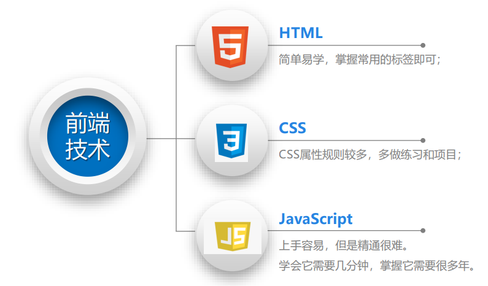
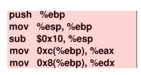
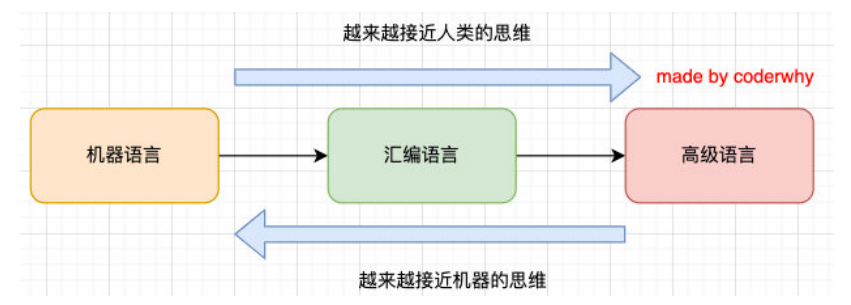
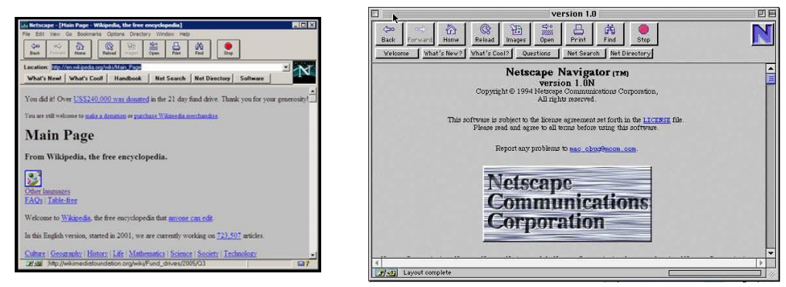
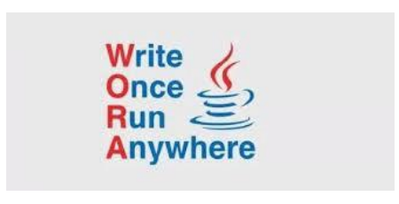
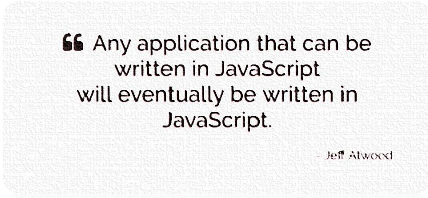
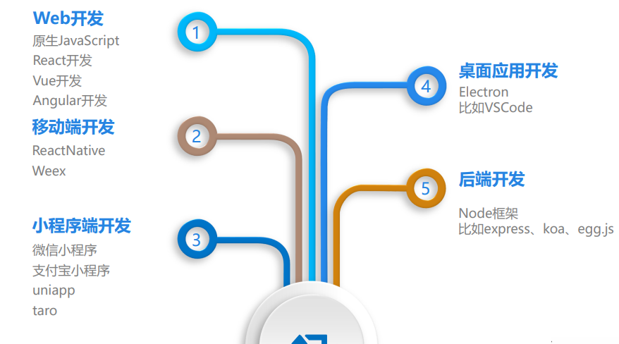

## 前端的三大核心

前端开发最主要需要掌握的是三个知识点：HTML、CSS、JavaScript

## 计算机语言

- 前面我们已经学习了HTML和CSS很多相关的知识:
  - 在之前我们提到过, HTML是一种标记语言, CSS也是一种样式语言;
- 他们本身都是属于计算机语言, 因为都在和计算机沟通交流；
  - 在生活中两个人想要沟通, 必然是通过某一种语言(中文/英语/粤语/东北话)
  - 计算机语言就是我们人和计算机进行交流要学习的语言;
- 网页的三大组成部分的另外一个核心就是JavaScript：JavaScript必然也是一种计算机语言;

## 编程语言

- 事实上, JavaScript我们可以对其有更加精准的说法：一种编程语言.
- 我们先搞清楚计算机语言和编程语言的关系和区别:
  - 计算机语言：计算机语言（computer language）指用于人与计算机之间通讯的语言，是人与计算机之间传递信息的介质。但是其概念比通用的编程语言要更广泛。例如，HTML是标记语言，也是计算机语言，但并不是编程语言。
- 编程语言：编程语言（英语：programming language），是用来定义计算机程序的形式语言。它是一种被标准化的交流技巧，用来向计算机发出指令，一种能够让程序员准确地定义计算机所需要使用数据的计算机语言，并精确地定义在不同情况下所应当采取的行动。
- 很抽象, 我们来说明一下编程语言的特点：
  - 数据和数据结构
  - 指令及流程控制
  - 引用机制和重用机制
  - 设计哲学
- 这样的区分是否有意义呢？我们这里不讨论，我这里只把最专业的定义来告诉大家。

###  常见的编程语言

### 编程语言的发展历史 – 机器语言

- 阶段一: 机器语言

  - 计算机的存储单元只有0和1两种状态，因此一串代码要让计算机“读懂”，这串代码只能由数字0和1组成。

  - 像这种由数字0和1按照一定的规律组成的代码就叫机器码，也叫二进制编码。

  - 一定长度的机器码组成了机器指令，用这些机器指令所编写的程序就称为机器语言。

    

- 优点:

  - 代码能被计算机直接识别，不需要经过编译解析；
  - 直接对硬件产生作用，程序的执行效率非常高；

- 缺点: 

  - 程序全是些0和1的指令代码，可读性差，还容易出错；
  - 不易编写(目前没有人这样开发)；

### 编程语言的发展历史 – 汇编语言

- 阶段二: 汇编语言

  - 为了解决机器语言的缺陷，人们发明了另外一种语言——汇编语言。
  - 这种语言用符号来代替冗长的、难以记忆的0、1代码。(mov/push指令，经过汇编器，汇编代码再进一步转成0101)

- 优点: 

  - 像机器语言一样，可以直接访问、控制计算机的各种硬件设备；

  - 占用内存少，执行速度快；

    

- 缺点: 

  - 第一，不同的机器有不同的汇编语言语法和编译器，代码缺乏可移植性
  - 也就是说，一个程序只能在一种机器上运行，换到其他机器上可能就不能运行；
  - 第二，符号非常多、难记
  - 即使是完成简单的功能也需要大量的汇编语言代码，很容易产生BUG，难于调试；

- 应用场景

  - 操作系统内核、驱动程序、单片机程序；

### 编程语言的发展历史 – 高级语言 

- 阶段三: 高级语言

  - 最好的编程语言应该是什么? 自然语言；

  - 而高级语言, 就是接近自然语言, 更符合人类的思维方式

  - 跟和人交流的方式很相似, 但是大多数编程语言都是国外发明的, 因为都是接近于英文的交流方式

    

- 优点: 

  - 简单、易用、易于理解，语法和结构类似于普通英文；
  - 远离对硬件的直接操作，使得一般人经过学习之后都可以编程，而不用熟悉硬件知识；
  - 一个程序还可以在不同的机器上运行，具有可移植性；

- 缺点: 

  - 程序不能直接被计算机识别，需要经编译器翻译成二进制指令后，才能运行到计算机上；
  - 种类繁多：JavaScript 、 C语言、C++、C#、Java、Objective-C 、Python等；

### 机器语言和高级语言

在前端，我们需要学好的只有一门高级语言：JavaScript。

## 认识JavaScript

- 维基百科对JavaScript的定义:
  - JavaScript（通常缩写为JS）是一种高级的、解释型的编程语言；
  - JavaScript是一门基于原型、头等函数的语言，是一门多范式的语言，它支持面向对象程序设计，指令式编程，以及函数式编程；
- 从上面的定义中, 我们会发现很多关键词：
  - 解释型语言? 原型? 头等函数? 多范式? 面向对象程序设计? 指令式编程? 函数式编程?
  - 这些改变往往会让人不知所云，需要我们完全掌握JavaScript再来回头看，每一个词语描述的都非常准确；
- 现在只需要知道，通俗的说法:
  - JavaScript是一门高级编程语言, 是前端开发的重要组成部分!
  - HTML和CSS也是前端开发的重要组成部分, 而JavaScript是前端开发的灵魂;

## JavaScript的起源

- 1994年，网景公司（Netscape）发布了Navigator浏览器0.9版。

  - 这是历史上第一个比较成熟的网络浏览器，轰动一时。

  - 但是，这个版本的浏览器只能用来浏览，不具备与访问者互动的能力。

  - 网景公司急需一种网页脚本语言，使得浏览器可以与网页互动。

    

- 网景公司当时想要选择一种语言来嵌入到浏览器中：

  - 采用现有的语言，比如Perl、Python、Tcl、Scheme等等, 允许它们直接嵌入网页;
  - 1995年网景公司招募了程序员Brendan Eich，希望将Scheme语言作为网页脚本语言的可能性；

- 就在这时，发生了另外一件大事：1995年Sun公司将Oak语言改名为Java，正式向市场推出；

  - Java推出之后立马在市场上引起了轰动，Java当初有一个口号：“write once run anywhere”；

  - 网景公司动了心，决定与Sun公司结成联盟，希望将Java嵌入到网页中来运行；

  - Brendan Eich本人非常热衷于Scheme，但是管理层那个时候有点倾向于Java，希望可以简化Java来适应网页脚本的需求；

    

- 但是Brendan Eich对此并不感兴趣，他用10天时间设计出来了JavaScript；

  - 最初这门语言的名字是Mocha（摩卡）；
  - 在Navigator2.0 beta版本更名为LiveScript；
  - 在Navigator2.0 beta 3版本正式重命名为JavaScript，当时是为了给这门语言搭上Java这个热词；

- 当然10天设计出来语言足够说明Brendan Eich是天才，但是这门语言当时更像是一个多种语言的大杂烩;

  - 借鉴C语言的基本语法；
  - 借鉴Java语言的数据类型和内存管理；
  - 借鉴Scheme语言，将函数提升到"第一等公民"（first class）的地位；
  - 借鉴Self语言，使用基于原型（prototype）的继承机制。

- Brendan Eich曾经这样描述过JavaScript：

  - 与其说我爱Javascript，不如说我恨它，它是C语言和Self语言一夜情的产物；
  - 十八世纪英国文学家约翰逊博士说得好：'它的优秀之处并非原创，它的原创之处并不优秀。’
  - （the part that is good is not original, and the part that is original is not good.）

- 微软公司于1995年首次推出Internet Explorer，从而引发了与Netscape的浏览器大战。

  - 微软对Netscape Navigator解释器进行了逆向工程，创建了JScript，以与处于市场领导地位的网景产品同台竞争；
  - 这个时候对于开发者来说是一场噩耗，因为需要针对不同的浏览器进行不同的适配；

- 1996年11月，网景正式向ECMA（欧洲计算机制造商协会）提交语言标准。

  - 1997年6月，ECMA以JavaScript语言为基础制定了ECMAScript标准规范ECMA-262;
  - ECMA-262是一份标准，定义了ECMAScript;
  - JavaScript成为了ECMAScript最著名的实现之一;
  - 除此之外，ActionScript和JScript也都是ECMAScript规范的实现语言；

- 所以说，ECMAScript是一种规范，而JavaScript是这种规范的一种实现。

## JavaScript的组成

- ECMAScript是JavaScript的标准，描述了该语言的语法和基本对象。
  - JavaScript是ECMAScript的语言层面的实现;
  - 因为除了语言规范之外，JavaScript还需要对页面和浏览器进行各种操作;
  - 除了基本实现之外，还包括DOM操作和BOM操作;
- 目前我们会针对性的学习ECMAScript，也就是语言层面的内容，特别是ES5之前的语法。

## JavaScript由谁来运行？

- 我们经常会说：不同的浏览器有不同的内核组成
  - Gecko：早期被Netscape和Mozilla Firefox浏览器浏览器使用；
  - Trident：微软开发，被IE4~IE11浏览器使用，但是Edge浏览器已经转向Blink；
  - Webkit：苹果基于KHTML开发、开源的，用于Safari，Google Chrome之前也在使用；
  - Blink：是Webkit的一个分支，Google开发，目前应用于Google Chrome、Edge、Opera等；
  - 等等...
- 事实上，我们经常说的浏览器内核指的是浏览器的排版引擎：
  - 排版引擎（layout engine），也称为浏览器引擎（browser engine）、页面渲染引擎（rendering engine）或样版引擎。
- 那么，JavaScript代码由谁来执行呢？
  - JavaScript引擎

## 认识JavaScript引擎

- 为什么需要JavaScript引擎呢？
  - 我们前面说过，高级的编程语言都是需要转成最终的机器指令来执行的；
  - 事实上我们编写的JavaScript无论你交给浏览器或者Node执行，最后都是需要被CPU执行的；
  - 但是CPU只认识自己的指令集，实际上是机器语言，才能被CPU所执行；
  - 所以我们需要JavaScript引擎帮助我们将JavaScript代码翻译成CPU指令来执行；
- 比较常见的JavaScript引擎有哪些呢？
  - SpiderMonkey：第一款JavaScript引擎，由Brendan Eich开发（也就是JavaScript作者）；
  - Chakra：微软开发，用于IT浏览器；
  - JavaScriptCore：WebKit中的JavaScript引擎，Apple公司开发；
  - V8：Google开发的强大JavaScript引擎，也帮助Chrome从众多浏览器中脱颖而出；
  - 等等…

## 浏览器内核和JS引擎的关系

- 这里我们先以WebKit为例，WebKit事实上由两部分组成的：
  - WebCore：负责HTML解析、布局、渲染等等相关的工作；
  - JavaScriptCore：解析、执行JavaScript代码；
- 小程序中也是这样的划分：
  - 在小程序中编写的JavaScript代码就是被JSCore执行的；

##  著名的Atwood定律

- Stack Overflow的创立者之一的 Jeff Atwood 在2007年提出了著名的 Atwood定律：

  - Any application that can be written in JavaScript, will eventually be written in JavaScript.

  - 任何可以使用JavaScript来实现的应用都最终都会使用JavaScript实现。

    

JavaScript应用越来越广泛

