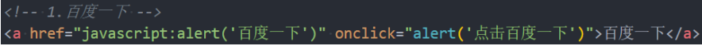
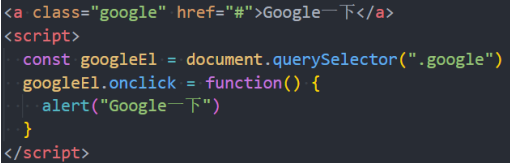
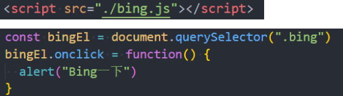
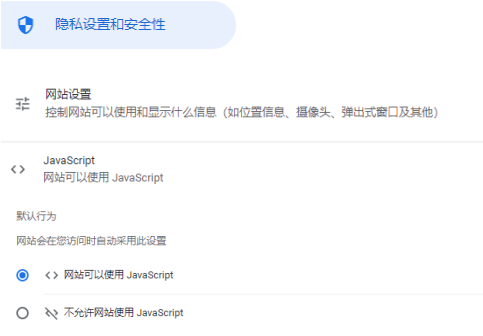

## JavaScript 的编写方式

- 位置一：HTML 代码行内（不推荐）

  

- 位置二：script 标签中

  

- 位置三：外部的 script 文件

  - 需要通过 script 元素的 src 属性来引入 JavaScript 文件

  

## JavaScript 编写的注意事项

- 注意一: script 元素不能写成单标签
  - 在外联式引用 js 文件时，script 标签中不可以写 JavaScript 代码，并且 script 标签不能写成单标签；
- 注意二: 省略 type 属性
  - 在以前的代码中，script 标签中会使用 type=“text/javascript”；
  - 现在可不写这个代码了，因为 JavaScript 是所有现代浏览器以及 HTML5 中的默认脚本语言；
- 注意三: 加载顺序
  - 作为 HTML 文档内容的一部分，JavaScript 默认遵循 HTML 文档的加载顺序，即自上而下的加载顺序；
  - 推荐将 JavaScript 代码和编写位置放在 body 子元素的最后一行；
- 注意四: JavaScript 代码严格区分大小写
  - HTML 元素和 CSS 属性不区分大小写，但是在 JavaScript 中严格区分大小写；
- 后续补充：script 元素还有 defer、async 属性，我们后续再详细讲解。

### noscript 元素

- 如果运行的浏览器不支持 JavaScript, 那么我们如何给用户更好的提示呢?

  - 针对早期浏览器不支持 JavaScript 的问题，需要一个页面优雅降级的处理方案;
  - 最终，noscript 元素出现，被用于给不支持 JavaScript 的浏览器提供替代内容;

- 下面的情况下, 浏览器将显示包含在 noscript 中的内容:

  - 浏览器不支持脚本;

  - 浏览器对脚本的支持被关闭。

    ```html
    <body>
      <noscript>
        <p>您的浏览器不支持或者关闭运行JavaScript</p>
      </noscript>
    </body>
    ```

    

## JavaScript 的交互方式

- JavaScript 有如下和用户交互的手段：
  - 最常见的是通过 console.log, 目前大家掌握这个即可;

| 交互方法       | 方法说明       | 效果查看             |
| -------------- | -------------- | -------------------- |
| alert          | 接受一个参数   | 弹窗查看             |
| console.log    | 接受多个参数   | 在浏览器控制台查看   |
| document.write | 接受多个字符串 | 在浏览器页面查看     |
| prompt         | 接受一个参数   | 在浏览器接受用户输入 |

## JavaScript 语句和分号

- 语句是向浏览器发出的指令，通常表达一个操作或者行为（Action）。

  - 语句英文是 Statements；

  - 比如我们前面编写的每一行代码都是一个语句，用于告知浏览器一条执行的命令；

    ```js
    alert("Hello World");
    alert("Hello Mjjh");
    ```

- 通常每条语句的后面我们会添加一个分号，表示语句的结束：

  - 分号的英文是 semicolon
  - 当存在换行符（line break）时，在大多数情况下可以省略分号；
  - JavaScript 将换行符理解成“隐式”的分号；
  - 这也被称之为自动插入分号（an automatic semicolon）；

- 推荐：

  - 前期在对 JavaScript 语法不熟悉的情况推荐添加分号；
  - 后期对 JavaScript 语法熟练的情况下，任意！

## JavaScript 的注释

- 在 HTML、CSS 中我们都添加过注释，JavaScript 也可以添加注释。
- JavaScript 的注释主要分为三种：
  - 单行注释
  - 多行注释
  - 文档注释（VSCode 中需要在单独的 JavaScript 文件中编写才有效）
- 注意：JavaScript 也不支持注释的嵌套

## VSCode 插件和配置

- 推荐一个 VSCode 的插件：（个人经常使用的）

  - ES7+ React/Redux/React-Native snippets
  - 这个插件是在 react 开发中会使用到的，但是我经常用到它里面的打印语句；

- 另外再推荐一个插件：

  - Bracket Pair Colorizer 2，但是该插件已经不再推荐使用了；

  - 因为 VSCode 已经内置了该功能，我们可以直接通过 VSCode 的配置来达到插件的效果；

  - 如何配置呢？

    ```js
    "editor.bracketPairColorization.enabled": true,

    "editor.guides.bracketPairs":"active"
    ```
