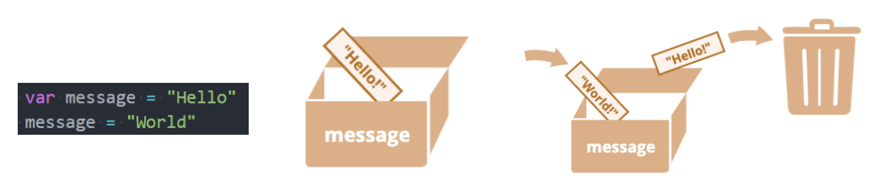
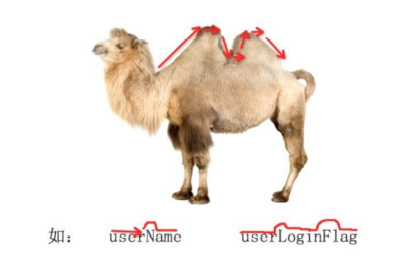
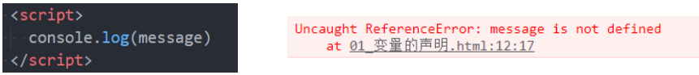
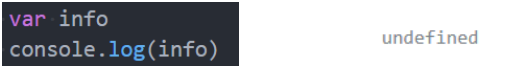
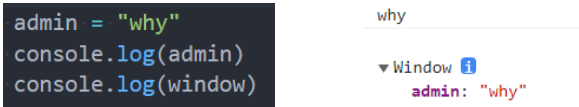
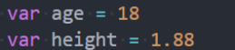
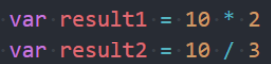
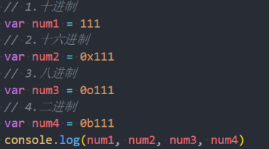

## 程序中变量的数据

- 在我们平时开发中，使用最多的并不是固定的数据, 而是会变换的数据：

  - 比如购物车商品的数量、价格的计算等等；

  - 比如一首歌曲播放的时间、进度条、歌词的展示等等；

  - 比如微信聊天中消息条数、时间、语音的长度、头像、名称等等；

  - 比如游戏中技能的冷却时间、血量、蓝量、buff 时间、金币的数量等等；

    

## 变化数据的记录 – 变量

- 如果我们希望记录某一个之后会变量的数据，在 JavaScript 中我们可以定义一个 变量：

  - 一个变量，就是一个用于存放数值的容器；
  - 这个数值可能是一个用于计算的数字，或者是一个句子中的字符串，或者其他任意的数据；
  - 变量的独特之处在于它存放的数值是可以改变的；

- 我们可以把变量想象成一个盒子，盒子里面装着我们的数据，我们需要给盒子进行一个特性的名称。

  - 例如，变量 message 可以被想象成一个标有 “message” 的盒子，盒子里面的值为 “Hello!”；

  - 并且，这个盒子的值，我们想改变多少次，就可以改变多少次；

    

## 变量的命名格式

- 在 JavaScript 中如何命名一个变量呢？包含两部分：

  - 变量的声明：在 JavaScript 中声明一个变量使用 var 关键字（variable 单词的缩写）（后续学习 ES6 还有 let、const 声明方式）

  - 变量的赋值：使用 = 给变量进行赋值；

    ```js
    var name = "mjjh";
    ```

- 这个过程也可以分开操作：

  ```js
  var name;
  name = "mjjh";
  ```

- 同时声明多个变量：

  ```js
  var name, age, height;
  name = "mjjh";
  age = 18;
  height = 1.88;
  console.log(name, age, height);
  ```

## 变量的命名规范

- 变量命名规则：必须遵守

  - 第一个字符必须是一个字母、下划线（ \_ ）或一个美元符号（ $ ）
  - 其他字符可以是字母、下划线、美元符号或数字
  - 不能使用关键字和保留字命名：
    - 什么是关键字，什么是保留字？
    - https://developer.mozilla.org/zh-CN/docs/web/javascript/reference/lexical_grammar
  - 变量严格区分大小写

- 变量命名规范：建议遵守

  - 多个单词使用驼峰标识；

  - 赋值 = 两边都加上一个空格；

  - 一条语句结束后加上分号; 也有很多人的习惯是不加；

  - 变量应该做到见名知意；

    

### 变量的练习

- 练习一：定义一些变量，保存自己的个人信息：
  - 比如姓名、年龄、身高、体重、爱好等等
- 练习二：定义一个变量 name，赋值成。定义一个变量 admin，将 name 赋值给 admin
- 练习三：定义变量，保存两个数字，并且对两个变量的数字进行交换
  - 方式一：使用临时变量
  - 方式二：不使用临时变量（了解即可）
- 练习四：让用户在浏览器中输入一个变量，在 JavaScript 程序中接收
  - 作业：你平时在使用一些应用程序时，哪些内容可以定义成变量？
  - 比如玩游戏、听歌、购物的应用程序中；

### 变量的使用注意

- 注意一：如果一个变量未声明（declaration）就直接使用，那么会报错；

  

- 注意二：如果一个变量有声明，但是没有赋值，那么默认值是 undefined

  

- 注意三：如果没有使用 var 声明变量也可以，但是不推荐（事实上会被添加到 window 对象上）

  

## JavaScript 的数据类型

- JavaScript 中的值都具有特定的类型。
  - 例如，字符串或数字。
  - 我们可以将值赋值给一个变量，那么这个变量就具备了特定的类型；
  - 一个变量可以在前一刻是个字符串，下一刻就存储一个数字；
  - 允许这种操作的编程语言，例如 JavaScript，被称为“动态类型”（dynamically typed）的编程语言；
- 在 JavaScript 中有 8 种基本的数据类型（7 种原始类型和 1 种复杂类型）
  - Number
  - String
  - Boolean
  - Undefined
  - Null
  - Object
  - BigInt（后续了解）
  - Symbol（后续了解）

## typeof 操作符

- 因为 ECMAScript 的类型系统是松散的，所以需要一种手段来确定任意变量的数据类型。
  - typeof 操作符就是为此而生的。
- 对一个值使用 typeof 操作符会返回下列字符串之一:
  - "undefined"表示值未定义;
  - "boolean"表示值为布尔值;
  - "string"表示值为字符串;
  - "number"表示值为数值;
  - "object"表示值为对象(而不是函数)或 null;
  - "function"表示值为函数;
  - “symbol”表示值为符号；
- typeof()的用法：
  - 你可能还会遇到另一种语法：typeof(x)，它与 typeof x 相同；
  - typeof 是一个操作符，并非是一个函数，()只是将后续的内容当做一个整体而已；

## Number 类型

- number 类型代表整数和浮点数。

  

- 数字 number 可以有很多操作，比如，乘法 \*、除法 /、加法 +、减法 - 等等。

  - 常见的运算符后续会专门讲解

    

- 除了常规的数字，还包括所谓的“特殊数值（“special numeric values”）”也属于 Number 类型（了解）

  - Infinity：代表数学概念中的 无穷大 ∞，也可以表示-Infinity；
    - 比如 1/0 得到的就是无穷大；
  - NaN：NaN 代表一个计算错误，它是一个错误的操作所得到的结果；
    - 比如 字符串和一个数字相乘；

- 在之前我们学习过进制的概念，数字类型也有其他的进制表示方法：

  - 十进制（掌握）、十六进制、二进制、八进制（了解）

    

- 数字表示的范围：

  - 最小正数值：Number.MIN_VALUE，这个值为： 5e-324，小于这个的数字会被转化为 0
  - 最大正数值：Number.MAX_VALUE，这个值为： 1.7976931348623157e+308

- isNaN

  - 用于判断是否不是一个数字。不是数字返回 true，是数字返回 false。

- 后续我们会对 Number 类型进行更加详细的学习；

## String 类型

- 在开发中我们经常会有一些文本需要表示，这个时候我们会使用字符串 String：

  - 比如人的姓名：。地址：广州市。简介：认真是一种可怕的力量；

- JavaScript 中的字符串必须被括在引号里，有三种包含字符串的方式。

  - 双引号："Hello"

  - 单引号：'Hello’

  - 反引号：`Hello`（ES6 之后学习）

    ```js
    var name = "mjjh";
    var address = "广州市";
    var description = "了解真相你才能获得真正的自由";
    ```

- 前后的引号类型必须一致：

  - 如果在字符串里面本身包括单引号，可以使用双引号；

  - 如果在字符串里面本身包括双引号，可以使用单引号；

    ```js
    var message = "'我是mjjh'";
    ```

### 字符串中的转义字符

- 除了普通的可打印字符以外，一些有特殊功能的字符可以通过转义字符的形式放入字符串中：

  | 转义字符 | 表示符号 |
  | -------- | -------- |
  | \ '      | 单引号   |
  | \ "      | 双引号   |
  | \ \      | 反斜杠   |
  | \ n      | 换行符   |
  | \ r      | 回车符   |
  | \ t      | 制表符   |
  | \ b      | 退格符   |

- 转义字符串开发中只有特殊场景才会用到，暂时掌握 \’\” \t \n 四个的用法即可。

### 字符串的属性和方法

- 字符串还有很多细节和操作方法，在后续学习了面向对象后，我们再详细学习；

- 这里我们先掌握几个基本的字符串使用操作：

- 操作一：字符串拼接，通过+运算符

  ```js
  var str1 = "Hellow";
  var str2 = "World";
  var newStr = str1 + str2;
  ```

- 操作二：获取字符串长度

  ```js
  console.log(newStr.lenght);
  ```

## Boolean 类型

- Boolean（布尔）类型用于表示真假：

  - 比如是否毕业. 是否有身份证. 是否购买车票. 是否成年人；
  - 比如开发中，我们会判断一个账号是否登录、是否是管理员、是否具备某个权限、是否拥有某个英雄、皮肤等；

- 布尔（英语：Boolean）是计算机科学中的逻辑数据类型，以发明布尔代数的数学家乔治·布尔为名。

- Boolean 类型仅包含两个值：true 和 false。

  ```js
  var isLogin = false;
  var flag = true;
  var result = 1 == 1;
  ```

- 在后续 逻辑运算符 中我们还会详细学习和使用 Boolean 类型；

## Undefined 类型

- Undefined 类型只有一个值，就是特殊值 undefined。

  - 如果我们声明一个变量，但是没有对其进行初始化时，它默认就是 undefined；

    ```js
    var message;
    console.log(message);
    console.log(message === undefined);
    ```

- 下面的代码是一样的

  ```js
  var info;
  var info = undefined;
  ```

- 这里有两个注意事项：

  - 注意一：最好在变量定义的时候进行初始化，而不只是声明一个变量；
  - 注意二：不要显示的将一个变量赋值为 undefined
    - 如果变量刚开始什么都没有，我们可以初始化为 0、空字符串、null 等值；

## Object 类型

- Object 类型是一个特殊的类型，我们通常把它称为引用类型或者复杂类型；

  - 其他的数据类型我们通常称之为 “原始类型”，因为它们的值质保函一个单独的内容（字符串、数字或者其他）；

  - Object 往往可以表示一组数据，是其他数据的一个集合；

  - 在 JavaScript 中我们可以使用 花括号{} 的方式来表示一个对象；

    ```js
    var info = {
    	name: "why"
    	age: 18
    	height: 1.88
    }
    ```

- Object 是对象的意思，后续我们会专门讲解面向对象的概念等；

- Object 相关的内容我们会在后续详细讲解。

## Null 类型

- Null 类型同样只有一个值，即特殊值 null。

  - null 类型通常用来表示一个对象为空，所以通常我们在给一个对象进行初始化时，会赋值为 null；

    ```js
    console.log(typeof null)
    var obj = null
    obj = {
    	name: "mjjh"
    	age: 18
    }
    ```

- null 和 undefined 的关系：

  - undefined 通常只有在一个变量声明但是未初始化时，它的默认值是 undefined 才会用到；
  - 并且我们不推荐直接给一个变量赋值为 undefined，所以很少主动来使用；
  - null 值非常常用，当一个变量准备保存一个对象，但是这个对象不确定时，我们可以先赋值为 null；

## 数据类型总结

- JavaScript 中有八种基本的数据类型（前七种为基本数据类型，也称为原始类型，而 object 为复杂数据类型，也称为引用类
- 型）。
  - number 用于任何类型的数字：整数或浮点数。
  - string 用于字符串：一个字符串可以包含 0 个或多个字符，所以没有单独的单字符类型。
  - boolean 用于 true 和 false。
  - undefined 用于未初始化的值 —— 只有一个 undefined 值的独立类型。
  - object 用于更复杂的数据结构。
  - null 用于未知的值 —— 只有一个 null 值的独立类型。
- 后续学习的类型：
  - symbol 用于唯一的标识符。
  - bigint 用于任意长度的整数。

## 数据类型的转换

- 在开发中，我们可能会在不同的数据类型之间进行某些操作
  - 比如把一个 String 类型的数字和另外一个 Number 类型的数字进行运算；
  - 比如把一个 String 类型的文本和另外一个 Number 类型的数字进行相加；
  - 比如把一个 String 类型或者 Number 类型的内容，当做一个 Boolean 类型来进行判断；
  - 等等
- 也就是在开发中，我们会经常需要对数据类型进行转换：
  - 大多数情况下，运算符和函数会自动将赋予它们的值转换为正确的类型，这是一种隐式转换；
  - 我们也可以，通过显示的方式来对数据类型进行转换；
- 接下来我们来看一下数据类型之间的转换：
  - String、Number、Boolean 类型；

## 字符串 String 的转换

- 其他类型经常需要转换成字符串类型，比如和字符串拼接在一起或者使用字符串中的方法。
- 转换方式一：隐式转换
  - 一个字符串和其他类型进行+操作；
    - 如果+运算符左右两边有一个是字符串，那么另一边会自动转换成字符串类型进行拼接；
  - 某些函数的执行也会自动将参数转为字符串类型；
  - 比如 console.log 函数；
- 转换方式二：显式转换
  - 调用 String()函数；
  - 调用 toString()方法（后续面向对象再学习）；
- 方法和函数的区别，我们后续在讲解面向对象时会讲到；

## 数字类型 Number 的转换

- 其他类型也可能会转成数字类型。
- 转换方式一：隐式转换
  - 在算数运算中，通常会将其他类型转换成数字类型来进行运算；
    - 比如 "6" / "2"；
    - 但是如果是+运算，并且其中一边有字符串，那么还是按照字符串来连接的；
- 转换方式二：显式转换
- 我们也可以使用 Number()函数来进行显式的转换；
- 其他类型转换数字的规则：

| 值            | 转换后的值                                                                                                                                          |
| ------------- | --------------------------------------------------------------------------------------------------------------------------------------------------- |
| undefined     | NaN                                                                                                                                                 |
| null          | 0                                                                                                                                                   |
| true 和 false | 1 and 0                                                                                                                                             |
| string        | 去掉首尾空格后的纯数字字符串中含有的数字。如果剩余字符串为空，则转换结果为 0。否则，将会从剩余字符串中“读取”数字。当类型转换出现 error 时返回 NaN。 |

## 布尔类型 Boolean 的转换

- 布尔（boolean）类型转换是最简单的。

- 它发生在逻辑运算中，但是也可以通过调用 Boolean(value) 显式地进行转换。

- 转换规则如下：

  - 直观上为“空”的值（如 0、空字符串、null、undefined 和 NaN）将变为 false。

  - 其他值变成 true。

    | 值                          | 转化后 |
    | --------------------------- | ------ |
    | 0, null, undefined, NaN, "" | false  |
    | 其他值                      | true   |

- 注意：包含 0 的字符串 "0" 是 true

  - 一些编程语言（比如 PHP）视 "0" 为 false。但在 JavaScript 中，非空的字符串总是 true。
