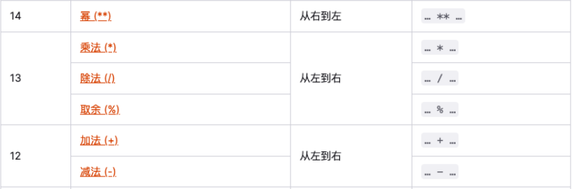

## 认识运算符

- 在小学的时候我们就学习了各种运算符，比如加号 +、乘号 \*、减号 - 、除号/

- 几乎所有的编程语言都有各种各样的运算符(也被称之为操作符，operators)

  - 初次接触这些运算符, 你会感觉种类繁多, 难以记忆.

  - 但是并不需要特别担心, 因为很多的运算符我们在以后的开发中, 每天都会使用；

  - 多练习, 不需要刻意去记忆；

  - 而且常见的高级语言运算符都是相似的，学了 JavaScript 运算符很容易掌握 C/C++/OC/Python 等语言的运算符；

- 计算机最基本的操作就是执行运算，执行运算时就需要使用运算符来操作：

  - 比如 console.log(20 + 30); `+`号就是一个运算符.

  - 比如 console.log(20 _ 30); `_`号也是一个运算符.

- JavaScript 按照使用场景的不同将运算符分成了很多种类型：

  - 算术运算符/赋值运算符/关系(比较)运算符/逻辑运算符

## 认识运算元

- 在正式开始运算之前，我们先学习一下常见的术语：

  - 运算元 —— 运算符应用的对象。

    - 比如说乘法运算 5 \* 2，有两个运算元；

    - 左运算元 5 和右运算元 2；

    - 有时候人们也称其为“参数”；

  - 如果一个运算符对应的只有一个运算元，那么它是 一元运算符。

    - 比如说一元负号运算符（unary negation）-，它的作用是对数字进行正负转换；

  - 如果一个运算符拥有两个运算元，那么它是 二元运算符。

    - 比如 2 + 3

- 一元运算符通常我们是使用 – 和 +，-号使用的会较多一些；

## JavaScript 中的运算

- 算术运算符

  - 算术运算符用在数学表达式中, 它的使用方式和数学中也是一直的；

  - 算术运算符是对数据进行计算的符号；

| 运算符 | 运算规则   | 范例       | 结果   |
| ------ | ---------- | ---------- | ------ |
| +      | 加法       | 2 + 3      | 5      |
| +      | 连接字符串 | ‘中’+ ‘国’ | ‘中国’ |
| -      | 减法       | 2 - 3      | -1     |
| \*     | 乘法       | 2 \* 3     | 6      |
| /      | 除法       | 5 / 2      | 2.5    |
| %      | 取余数     | 5 % 2      | 1      |
| \*\*   | 幂（ES7）  | 2 \*\* 3   | 8      |

### 取余 % 和 求幂

- 取余运算符是 %，尽管它看起来很像百分数，但实际并无关联

  - a % b 的结果是 a 整除 b 的 余数

    ```js
    console.log(10 % 3); //1
    ```

- 求幂运算 a \*\* b 将 a 提升至 a 的 b 次幂。（ES7 中的语法，也叫做 ES2016）

  - 在数学中我们将其表示为 a 的 b 次方。

    ```js
    console.log(2 ** 3); //8
    console.log(2 ** 4); //16
    ```

## 赋值运算符

- 前面我们使用的 = 其实也是一个运算符，被称之为 赋值（ assignments ）运算符。

- = 是一个运算符，而不是一个有着“魔法”作用的语言结构。

  - 语句 x = value 将值 value 写入 x 然后返回 x。

- 链式赋值（Chaining assignments）

  ```js
  let a, b, c;
  a = b = c = 2 + 2;
  console.log(a, b, c);
  ```

  - 链式赋值从右到左进行计算；

  - 首先，对最右边的表达式 2 + 2 求值，然后将其赋给左边的变量：c、b 和 a。

  - 最后，所有的变量共享一个值。

- 但是从代码的可读性的角度来说，不推荐这种写法。

## 原地修改（Modify-in-place）

- 什么是原地修改呢？

  - 我们经常需要对一个变量做运算，并将新的结果存储在同一个变量中。

    ```js
    // 原地修改
    var n = 10;
    n = n + 5;
    n = n * 5;
    ```

- 可以使用运算符 += 和 \*= 来缩写这种表示。

  ```js
  // 原地修改
  var n = 10;
  n += 5;
  n *= 5;
  ```

- 所有算术和位运算符都有简短的“修改并赋值”运算符：/= 和 -= 等。

| 运算符 | 运算规则          | 范例             | 结果 |
| ------ | ----------------- | ---------------- | ---- |
| =      | 赋值              | a = 5            | 5    |
| +=     | 加后赋值          | a = 5, a += 2    | 7    |
| -=     | 减后赋值          | a = 5, a -= 2    | 3    |
| \*=    | 乘后赋值          | a = 5; a \*= 2   | 10   |
| /=     | 除后赋值          | a = 5; a /= 2    | 2.5  |
| %=     | 取模 (余数)后赋值 | a = 5; a %= 2    | 1    |
| \*\*=  | 幂后赋值          | a = 5; a \*\*= 2 | 25   |

## 自增、自减

- 对一个数进行加一、减一是最常见的数学运算符之一。

- 所以，对此有一些专门的运算符：

  - 自增 ++ 将变量加 1；

  - 自减 -- 将变量减 1；

- 自增/自减只能应用于变量。

  - 将其应用于数值（比如 5++）则会报错。

### ++和—的位置

- 运算符 ++ 和 -- 可以置于变量前，也可以置于变量后。

  - 当运算符置于变量后，被称为“后置形式”（postfix form）：counter++。

  - 当运算符置于变量前，被称为“前置形式”（prefix form）：++counter。

  - 两者都做同一件事：将变量 counter 与 1 相加。

- 他们有什么区别吗？

  - 有，但只有当我们使用 ++/-- 的返回值时才能看到区别；

  - 如果自增/自减的值不会被使用，那么两者形式没有区别；

  - 如果我们想要对变量进行自增操作，并且 需要立刻使用自增后的值，那么我们需要使用前置形式；

  - 前置形式返回一个新的值，但后置返回原来的值；

## 运算符的优先级

- 运算符放到一起使用时会有一定的优先级：

- 在 MDN 上给出了所有运算符的优先级（不用去记）

  - https://developer.mozilla.org/zh-CN/docs/Web/JavaScript/Reference/Operators/Operator_Precedence

    

## 比较运算符

- 我们知道，在数学中有很多用于比较大小的运算符，在 JavaScript 中也有相似的比较：

  - 大于 / 小于：a > b，a < b。

  - 大于等于 / 小于等于：a >= b，a <= b。

  - 检查两个值的相等：a == b，请注意双等号 == 表示相等性检查，而单等号 a = b 表示赋值。

  - 检查两个值不相等：不相等在数学中的符号是 ≠，但在 JavaScript 中写成 a != b。

- 比较运算符的结果都是 Boolean 类型的

| 运算符 | 运算规则 | 范例   | 结果  |
| ------ | -------- | ------ | ----- |
| ==     | 相等     | 4 == 3 | false |
| !=     | 不等于   | 4 != 3 | true  |
| >      | 小于     | 4 > 3  | true  |
| <      | 大于     | 4 < 3  | false |
| >=     | 小于等于 | 4 <=3  | false |
| <=     | 大于等于 | 4 >= 3 | true  |

## === 和 == 的区别

- 普通的相等性检查 == 存在一个问题，它不能区分出 0 和 false，或者空字符串和 false 这类运算：

  - 这是因为在比较不同类型的值时，处于判断符号 == 两侧的值会先被转化为数字；

  - 空字符串和 false 也是如此，转化后它们都为数字 0；

- 如果我们需要区分 0 和 false，该怎么办？

  - 严格相等运算符 === 在进行比较时不会做任何的类型转换；

  - 换句话说，如果 a 和 b 属于不同的数据类型，那么 a === b 不会做任何的类型转换而立刻返回 false；

- 同样的，“不相等”符号 != 类似，“严格不相等”表示为 !==。

- 严格相等的运算符虽然写起来稍微长一些，但是它能够很清楚地显示代码意图，降低你犯错的可能性。
