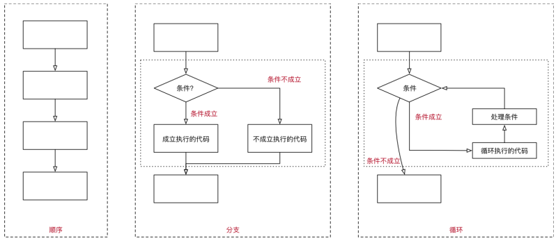
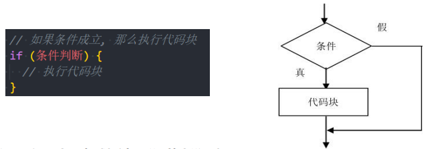
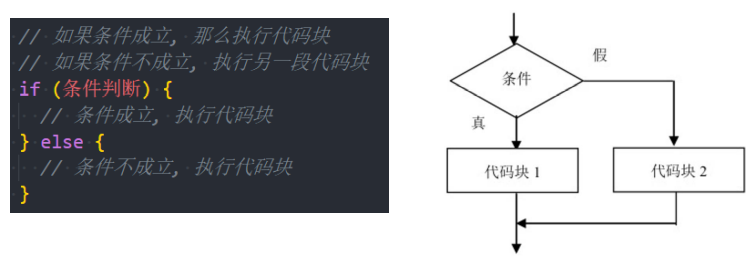
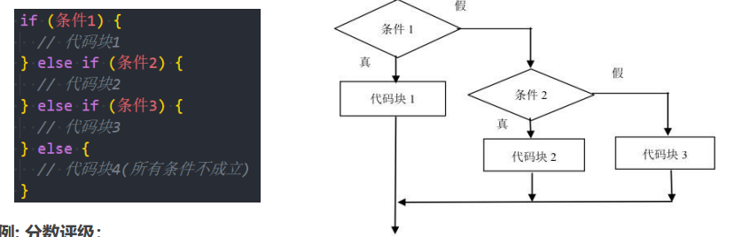
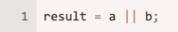
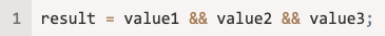

## 程序的执行顺序

- 在程序开发中，程序有三种不同的执行方式：
  - 顺序 —— 从上向下，顺序执行代码
  - 分支 —— 根据条件判断，决定执行代码的 分支
  - 循环 —— 让 特定代码 重复 执行



##  代码块的理解

- 代码块是多行执行代码的集合，通过一个花括号{}放到了一起。

  - 在开发中，一行代码很难完成某一个特定的功能，我们就会将这些代码放到一个代码块中

    ```js
    {
    	var name = "mjjh"
    	var message = "my name is " + name
    	console.log(message)
    }
    ```

- 在JavaScript中，我们可以通过流程控制语句来决定如何执行一个代码块：

  - 通常会通过一些关键字来告知js引擎代码要如何被执行；
  - 比如分支语句、循环语句对应的关键字等；

## 生活中的条件判断

- 现实生活中有很多情况, 我们要根据条件来做一些决定:

  - 小明妈妈说: 如果小明考试了100分, 就去游乐场（判断分数等于100分）

  - 网吧禁止未成年人入内（判断年龄大于等于18岁，是否带身份证，是否带钱）

  - 开发中，登录成功：账号和密码正确 或 扫描二维码成功

    

## 什么是分支结构？

- 程序是生活的一种抽象, 只是我们用代码表示了出来
  - 在开发中, 我们经常需要根据一定的条件, 来决定代码的执行方向
  - 如果 条件满足，才能做某件事情
  - 如果 条件不满足，就做另外一件事情
- 分支结构
  - 分支结构的代码就是让我们根据条件来决定代码的执行
  - 分支结构的语句被称为判断结构或者选择结构.
  - 几乎所有的编程语言都有分支结构（C、C++、OC、JavaScript等等）
- JavaScript中常见的分支结构有：
  - if分支结构
  - switch分支结构

## if分支语句

- if分支结构有三种：
- 单分支结构
  - if..
- 多分支结构
  - if..else..
  - if..else if..else..

## 单分支结构

- 单分支语句：if

  - if(...) 语句计算括号里的条件表达式，如果计算结果是 true，就会执行对应的代码块。

    

- 案例一: 如果小明考试超过90分, 就去游乐场

  - “如果”相当于JavaScript中的关键字if
  - 分数超过90分是一个条件(可以使用 > 符号)

- 案例二：单位5元/斤的苹果，如果购买超过5斤，那么立减8元

  - 注意：这里我们让用户输入购买的重量，计算出最后的价格并且弹出结果

## if语句的细节补充

- 补充一：如果代码块中只有一行代码，那么{}可以省略：
- 补充二：if (…) 语句会计算圆括号内的表达式，并将计算结果转换为布尔型（Boolean）。
  - 转换规则和Boolean函数的规则一致；
  - 数字 0、空字符串 “”、null、undefined 和 NaN 都会被转换成 false。
  - 因为它们被称为“假值（falsy）”；
  - 其他值被转换为 true，所以它们被称为“真值（truthy）”；

## 多分支语句：if.. else..

- 多分支语句一： if.. else..

  - if 语句有时会包含一个可选的 “else” 块。

  - 如果判断条件不成立，就会执行它内部的代码。

    

- 案例一：如果分数超过90分去游乐场，否则去上补习班

  - 满足条件时，做某些事情
  - 不满足（else），去做另外一些事情

- 案例二：m=20，n=30，比较两个数字的大小，获取较大的那个数字

## 多分支结构： if.. else if.. else..

- 多分支结构： if.. else if.. else..

  - 有时我们需要判断多个条件；

  - 我们可以通过使用 else if 子句实现；

    

- 案例: 分数评级：

  - 考试分数大于90：优秀
  - 大于80小于等于90：良好
  - 大于60小于等于80：合格
  - 小于60分：不及格

## 三元运算符

- 有时我们需要根据一个条件去赋值一个变量。

  - 比如比较数字大小的时候，获取较大的数字；
  - 这个时候if else语句就会显得过于臃肿，有没有更加简介的方法呢？

- 条件运算符：’?’

  - 这个运算符通过问号 ? 表示；
  - 有时它被称为三元运算符，被称为“三元”是因为该运算符中有三个操作数（运算元）；
  - 实际上它是 JavaScript 中唯一一个有这么多操作数的运算符；

- 使用格式如下:

  ```js
  var result = condition ? value1 : value2;
  ```

  - 计算条件结果，如果结果为真，则返回 value1，否则返回 value2。

- 案例一： m=20，n=30，比较两个数字的大小，获取较大的那个数字

- 案例二：判断一个人是否是成年人了

## 认识逻辑运算符

- 逻辑运算符，主要是由三个：
- ||（或），&&（与），!（非）
- 它可以将多个表达式或者值放到一起来获取到一个最终的结果；
- 有了逻辑运算符，我们就可以在判断语句中编写多个条件。

| 运算符 | 运算规则                   | 范例   | 结果 |
| ------ | -------------------------- | ------ | ---- |
| &&     | 与: 同时为真 false && True | false  |      |
| \|\|   | 或: 一个为真 false or frue | true   |      |
| !      | 非: 取反                   | !false | true |

## 逻辑或的本质

- ||（或）两个竖线符号表示“或”运算符（也称为短路或）：

  

  - 从左到右依次计算操作数。
  - 处理每一个操作数时，都将其转化为布尔值（Boolean）；
  - 如果结果是 true，就停止计算，返回这个操作数的初始值。
  - 如果所有的操作数都被计算过（也就是，转换结果都是 false），则返回最后一个操作数。

- 注意：返回的值是操作数的初始形式，不会转换为Boolean类型。

- 换句话说，一个或运算 || 的链，将返回第一个真值，如果不存在真值，就返回该链的最后一个值。

  ```js
  var showName = name || nickName || defaultName
  ```

## 逻辑与的本质

- &&（或）两个竖线符号表示“与”运算符（也称为短路与）：

  

  - 从左到右依次计算操作数。
  - 在处理每一个操作数时，都将其转化为布尔值（Boolean）；
  - 如果结果是 false，就停止计算，并返回这个操作数的初始值（一般不需要获取到初始值）；
  - 如果所有的操作数都被计算过（例如都是真值），则返回最后一个操作数。

- 换句话说，与运算 返回第一个假值，如果没有假值就返回最后一个值。

  ```js
  info.friend.running()
  ```

## !（非）

- 逻辑非运算符接受一个参数，并按如下运算：
  - 步骤一：将操作数转化为布尔类型：true/false；
  - 步骤二：返回相反的值；
- 两个非运算 !! 有时候用来将某个值转化为布尔类型：
  - 也就是，第一个非运算将该值转化为布尔类型并取反，第二个非运算再次取反。
  - 最后我们就得到了一个任意值到布尔值的转化。

## switch语句

- switch是分支结构的一种语句：

  - 它是通过判断表达式的结果（或者变量）是否等于case语句的常量，来执行相应的分支体的；

- 与if语句不同的是，switch语句只能做值的相等判断（使用全等运算符 ===），而if语句可以做值的范围判断；

- switch的语法：

  - switch 语句有至少一个 case 代码块和一个可选的 default 代码块。

    ```js
    switch(变量) {
    	case 常量1:
    	  // 语句一
    	  break
      case 常量2:
      	// 语句二
      	break
      default:
      	// 语句三
    }
    ```

### switch语句的补充

- case穿透问题：
  - 一条case语句结束后，会自动执行下一个case的语句；
  - 这种现象被称之为case穿透；
- break关键字
  - 通过在每个case的代码块后添加break关键字来解决这个问题；
- 注意事项：这里的相等是严格相等。
  - 被比较的值必须是相同的类型才能进行匹配。
- 案例练习：播放模式（单曲循环、循环播放、随机播放）

