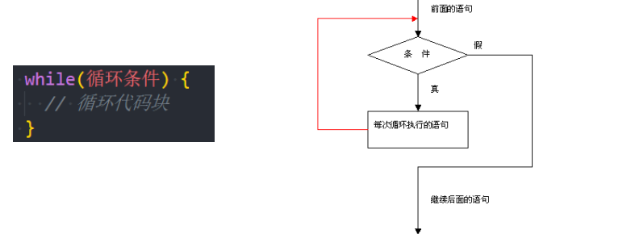
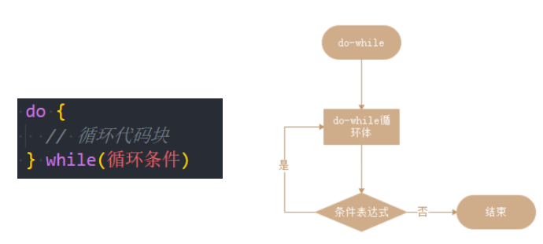
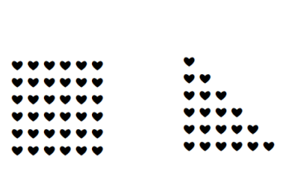
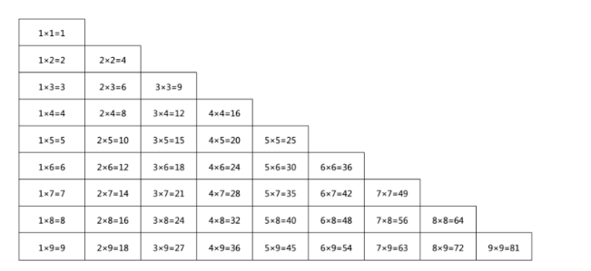

## 认识循环

- 在开发中我们经常需要做各种各样的循环操作：
  - 比如把一个列表中的商品、歌曲、视频依次输出进行展示；
  - 比如对一个列表进行累加计算；
  - 比如运行相同的代码将数字 1 到 10 逐个输出；
- 循环 是一种重复运行同一代码的方法。
  - 如果是对某一个列表进行循环操作，我们通常也会称之为 遍历（traversal）或者迭代（iteration）；
- 在 JavaScript 中支持三种循环方式：
  - while 循环；
  - do..while 循环；
  - for 循环；

## while 循环

- while 循环的语法如下：

  - 当条件成立时，执行代码块；

  - 当条件不成立时，跳出代码块；

    

- 如果条件一直成立（为 true），那么会产生死循环。

  - 这个时候必须通过关闭页面来停止死循环；
  - 开发中一定要避免死循环的产生；

### while 循环的练习

- while 循环的练习题目：
  - 练习一：打印 10 次 Hello World
  - 练习二：打印 0~99 的数字
  - 练习三：计算 0~99 的数字和
  - 练习四：计算 0~99 所有奇数的和
  - 练习五：计算 0~99 所有偶数的和

## do..while 循环

- do..while 循环和 while 循环非常像，二者经常可以相互替代(不常用)

  - 但是 do..while 的特点是不管条件成不成立，do 循环体都会先执行一次；

    

- 通常我们更倾向于使用 while 循环。

## for 循环

- for 循环更加复杂，但它是最常使用的循环形式。

- begin 执行一次，然后进行迭代：每次检查 condition 后，执行 body 和 step

| 语句段         | 例子      | 执行过程                                         |
| -------------- | --------- | ------------------------------------------------ |
| begin          | let i = 0 | 进入循环时执行一次。                             |
| condition      | i < 3     | 在每次循环迭代之前检查，如果为 false，停止循环。 |
| body（循环体） | alert(i)  | 条件为真时，重复运行。                           |
| step           | i++       | 在每次循环体迭代后执行。                         |

### for 循环的练习

- 利用 for 循环实现之前的案例：
  - 练习一：打印 10 次 Hello World
  - 练习二：打印 0~99 的数字
  - 练习三：计算 0~99 的数字和
  - 练习四：计算 0~99 所有奇数的和
  - 练习五：计算 0~99 所有偶数的和

### for 循环的嵌套

- 什么是循环的嵌套呢？（日常开发使用不算多，在一些算法中比较常见）

  - 在开发中，某些情况下一次循环是无法达到目的的，我们需要循环中嵌套循环；

- 我们通过 for 循环的嵌套来完成一些案例：

  - 案例一：在屏幕上显示包含很多 ❤ 的矩形

  - 案例二：在屏幕上显示一个三角的 ❤ 图像

  - 案例三：在屏幕上显示一个九九乘法表

    

## 循环控制

- 循环的跳转（控制）：
  - 在执行循环过程中, 遇到某一个条件时, 我们可能想要做一些事情；
  - 比如循环体不再执行(即使没有执行完), 跳出循环；
  - 比如本次循环体不再执行, 执行下一次的循环体；
- 循环的跳转控制
- break: 直接跳出循环, 循环结束
  - break 某一条件满足时，退出循环，不再执行后续重复的代码
- continue: 跳过本次循环次, 执行下一次循环体
  - continue 指令是 break 的“轻量版”。
  - continue 某一条件满足时，不执行后续重复的代码

## 猜数字游戏

- 猜数字游戏规则：(折半查找)
  - 电脑随机生成一个 0~99 之间的数字；
  - 玩家有 7 次猜测的机会；
  - 玩家猜测一个数字, 输入到程序中；
  - 电脑根据输入的数字打印: 猜大了/猜小了/猜对了的情况；
  - 猜对了, 那么游戏结束，显示恭喜您；
  - 7 次机会用完打印: 您的次数用完了, 您失败了；

## 循环的总结

- 我们学习了三种循环：
  - while —— 每次迭代之前都要检查条件；
  - do..while —— 每次迭代后都要检查条件；
  - for (变量;修改;条件) —— 每次迭代之前都要检查条件，可以使用其他设置；
  - break/continue 可以对循环进行控制。
