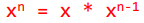
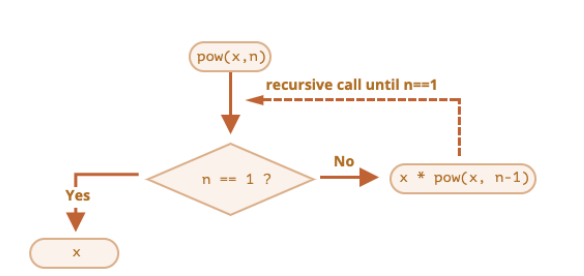

## 程序中的foo、bar、baz

- 在学习编程的过程中，你可能会经常看到foo、bar、baz这些名词：
  - 它们通常被用来作为函数、变量、文件的名词；
  - 目前已经编程了计算机编程的术语一部分；
  - 但是它们本身并没有特别的用途和意义；
  - 常被称之为 “伪变量”（metasyntactic variable）
- 那么它们有什么由来吗？
  - 事实上，foo、bar这些名词最早从什么时候、地方流行起来的一直是由争论的；
  - 一种说法是通过Digital（迪吉多，数字设备公司，成立于1957年的美国电脑公司）的手册说明流行起来的；
  - 一种说法是说源自于电子学中的反转foo信号；
  - 也有一种说法是foo因为出现在了一个漫画中，漫画中foo代表“好运”，与中文的福读音类似；
- 总之，foo、bar、baz已经是编程领域非常常用的名词。
  - 我个人也比较习惯在写一些变量、函数名词时使用这些词汇，大家做一个了解；

## 认识函数

- 什么是函数呢?
- 目前, 我们已经接触过几个函数了
  - alert函数:
    - 浏览器弹出一个弹窗
  - prompt函数:
    - 在浏览器弹窗中接收用户的输入
  - console.log函数:
    - 在控制台输入内容
  - String/Number/Boolean函数等
- 当我们在谈函数时, 到底在谈些什么?
  - 函数其实就是某段代码的封装，这段代码帮助我们完成某一个功能；
  - 默认情况下JavaScript引擎或者浏览器会给我们提供一些已经实现好的函数；
  - 我们也可以编写属于自己的函数；

### 函数使用的步骤

- 函数的使用包含两个步骤：
  - 声明函数 —— 封装 独立的功能
  - 调用函数 —— 享受 封装 的成果
- 声明函数，在JavaScript中也可以称为定义函数：
  - 声明函数的过程是对某些功能的封装过程；
  - 在之后的开发中，我们会根据自己的需求定义很多自己的函数；
- 调用函数，也可以称为函数调用：
  - 调用函数是让已存在的函数为我们所用；
  - 这些函数可以是刚刚自己封装好的某个功能函数；
  - 当然, 我们也可以去使用默认提供的或者其他三方库定义好的函数；
- 函数的作用：
  - 在开发程序时，使用函数可以提高编写的效率以及代码的重用；

### 声明和调用函数

- 声明函数使用function关键字：这种写法称之为函数的定义

  ```js
  function 函数名(){
    函数封装的代码
    ……
  }
  ```

- 注意：

  - 函数名的命名规则和前面变量名的命名规则是相同的；
  - 函数要尽量做到见名知意（并且函数通常是一些行为（action），所以使用动词会更多一些）；
  - 函数定义完后里面的代码是不会执行的，函数必须调用才会执行；

- 调用函数通过函数名()即可：比如test()

- 函数的练习：

  - 练习一：定义一个函数，打印一个人的个人信息

    ```js
    function logMessage(){
      var name = "mjjh"
    	console.log(name)
    }
    ```

  - 练习二：定义一个函数，函数中计算10和20数字的和，并且打印出结果

    ```js
    function add(){
      var num = 10 + 20
    	console.log(num)
    }
    ```

## 函数的参数

- 函数的参数:

  - 函数，把 具有独立功能的代码块 组织为一个小模块，在需要的时候 调用

  - 函数的参数，增加函数的 通用性，针对 相同的数据处理逻辑，能够 适应更多的数据

    - 在函数 内部，把参数当做 变量 使用，进行需要的数据处理

    - 函数调用时，按照函数定义的参数顺序，把 希望在函数内部处理的数据，通过参数传递

      

- 形参和实参

  - 形参（参数 parameter）：定义 函数时，小括号中的参数，是用来接收参数用的，在函数内部 作为变量使用
  - 实参（参数 argument）：调用 函数时，小括号中的参数，是用来把数据传递到 函数内部 用的

### 有参数的函数练习

- 一个参数的函数练习：

  - 练习一：传入一个名字，对这个人say Hello

    ```js
    function sayHello(name){
    	console.log(name + "Hello")
    }
    ```

  - 练习二：为某个朋友唱生日快乐歌

    ```js
    function sayHappyBirthday(name){
    	console.log(name + "Hello")
    }
    ```

- 两个参数的函数练习：

  - 练习三：传入两个数字，计算两个数字的和，并且打印结果

    ```js
    function add(num1, num2){
      var num = num1 + mum2
    	console.log(num)
    }
    ```

### 函数的返回值

- 回想我们之前使用的prompt函数，函数需要接受参数，并且会返回用户的输入：

- 所以说, 函数不仅仅可以有参数, 也可以有返回值：

  - 使用return关键字来返回结果；

  - 一旦在函数中执行return操作，那么当前函数会终止；

  - 如果函数中没有使用 return语句 ，那么函数有默认的返回值：undefined；

  - 如果函数使用 return语句，但是return后面没有任何值，那么函数的返回值也是：undefined；

    

### 函数的练习

- 练习一：实现一个加法计算器

  ```js
  function add(num1 ,num2){
    var num = num1 + num2
  	console.log(num)
  }
  ```

- 练习二：定义一个函数，传入宽高，计算矩形区域的面积

  ```js
  function rectangle(h,w){
    var area = h * 2
  	console.log(area)
  }
  ```

- 练习三：定义一个函数，传入半径，计算圆形的面积

  ```js
  function round(r){
    var pai = 3.14
    var area = pai * (r ** 2)
  	console.log(area)
  }
  ```

- 练习四：定义一个函数，传入n（n为正整数），计算1~n数字的和

  ```js
  function sum(n){
    var nums = 0
    for(let i = n; i > 0; i--){
    	nums += i
    }
  }
  ```

- 实战函数练习：

  - 传入一个数字，可以根据数字转化成显示为 亿、万文字显示的文本；

    ```js
    function change(num){
      if(num < 1_0000_0000){
      	num = num/1_000
      	return num + "万"
    	}else{
      	num = num/1_0000_0000
      	return num + "亿"
    	}
    }
    ```

## arguments参数

- 事实上在函数有一个特别的对象：arguments对象
  - 默认情况下，arguments对象是所有（非箭头）函数中都可用的局部变量；
  - 该对象中存放着所有的调用者传入的参数，从0位置开始，依次存放；
  - arguments变量的类型是一个object类型（ array-like ），不是一个数组，但是和数组的用法看起来很相似；
  - 如果调用者传入的参数多余函数接收的参数，可以通过arguments去获取所有的参数；
- 因为这里涉及到数组、对象等概念，目前大家了解有这么一个参数即可。
  - 后续我们会对其专门进行学习，包括和数组之间的转化；

## 递归

### 函数中调用函数

- 在开发中，函数内部是可以调用另外一个函数的。

  ```js
  function foo(){
  	console.log("foo函数被调用")
  }
  
  function bar(){
  	foo()
  }
  bar()
  ```

- 既然函数中可以调用另外一个函数，那么函数是否可以调用自己呢？

  - 当然是可以的；

  - 但是函数调用自己必须有结束条件，否则会产生无限调用，造成报错；

    ```js
    var count = 0
    function bar() {
    	console.log(count++)
    	bar()
    }
    bar()
    ```

    

### 函数的递归

- 事实上，函数调用自己还有一个专业的名词，叫做递归（Recursion）

- 在语言学方面，我们也可以描述为递归：

  - 从前有座山，山里有座庙，庙里有个老和尚，正在给小和尚讲故事呢！故事是什么呢？
  - 递归读取上面的话；

- 递归是一种重要的编程思想：

  - 将一个复杂的任务，转化成可以重复执行的相同任务；

- 案例：实现一个自己的幂函数pow（pow单词可以表示指数的意思）

  - 我们可以先用for循环来实现；

    ```js
    function pow(a, n) {
    	var result = 1
    	for (var i = 0; i < n; i++){
    		result *= a
    	}
    	return result
    }
    ```

### 递归的实现思路

- 另一种实现思路是递归实现：

  - 这是因为在数学上：

    ```js
    function pow(x, n) {
    	return x * pow (x, n-1)
    }
    ```

  - 那么对于函数的调用，我们也可以进行划分：

  - 这里需要有一个结束的条件，就是当n已经等于1的时候就不需要拆分了；

- 所以最终的代码如下：

  ```js
  function pow(x, n) {
    if (n === 1) return x
  	return x * pow (x, n-1)
  }
  ```

  

- 递归的代码第一次接触会有点绕，对于初次接触函数的同学，可以先跳过去。

  - 后续我们讲解数据结构与算法时，会使用递归来解决一些算法问题；

## 局部变量和外部变量

- 在JavaScript（ES5之前）中没有块级作用域的概念，但是函数可以定义自己的作用域。
  - 作用域（Scope）表示一些标识符的作用有效范围（所以也有被翻译为有效范围的）；
  - 函数的作用域表示在函数内部定义的变量，只有在函数内部可以被访问到；
- 外部变量和局部变量的概念：
  - 定义在函数内部的变量，被称之为局部变量（Local Variables）。
  - 定义在函数外部的变量，被称之为外部变量（Outer Variables）。
- 什么是全局变量？
  - 在函数之外声明的变量（在script中声明的），称之为全局变量。
  - 全局变量在任何函数中都是可见的。
  - 通过var声明的全局变量会在window对象上添加一个属性（了解）；
- 在函数中，访问变量的顺序是什么呢？
  - 优先访问自己函数中的变量，没有找到时，在外部中访问。
- 关于块级作用域、作用域链、变量提升、AO、VO、GO等概念我们后续将进行学习。

## 函数表达式（Function Expressions）

- 在JavaScript中，函数并不是一种神奇的语法结构，而是一种特殊的值。

  - 前面定义函数的方式，我们称之为函数的声明（Function Declaration）；

- 还有另外一种写法是函数表达式（Function Expressions）：

  ```js
  var foo = function() {
  	console.log("foo函数")
  }
  ```

- 注意，function 关键字后面没有函数名

  - 函数表达式允许省略函数名。

- 无论函数是如何创建的，函数都是一个值（这个值的类型是一个对象，对象的概念后面会讲到）。

- 在JavaScript开发中，我们可以将函数作为头等公民。

## 函数声明 vs 函数表达式

- 在开发中，函数的声明和函数表达式有什么区别，以及如何选择呢？
- 首先，语法不同：
  - 函数声明：在主代码流中声明为单独的语句的函数。
  - 函数表达式：在一个表达式中或另一个语法结构中创建的函数。
- 其次，JavaScript创建函数的时机是不同的：
  - 函数表达式是在代码执行到达时被创建，并且仅从那一刻起可用。
  - 在函数声明被定义之前，它就可以被调用。
    - 这是内部算法的原故；
    - 当 JavaScript 准备 运行脚本时，首先会在脚本中寻找全局函数声明，并创建这些函数；
- 开发中如何选择呢？
  - 当我们需要声明一个函数时，首先考虑函数声明语法。
  - 它能够为组织代码提供更多的灵活性，因为我们可以在声明这些函数之前调用这些函数。

## JavaScript头等函数

- 头等函数（first-class function；第一级函数）是指在程序设计语言中，函数被当作头等公民。

  - 这意味着，函数可以作为别的函数的参数、函数的返回值，赋值给变量或存储在数据结构中；
  - 有人主张也应包括支持匿名函数（待会儿会讲到）；

- 通常我们对作为头等公民的编程方式，称之为函数式编程

  - JavaScript就是符合函数式编程的语言，这个也是JavaScript的一大特点；

- 比如：函数可以在变量和变量之间相互进行赋值；

  ```js
  function foo() {
  	console.log("foo函数执行")
  }
  
  var bar = foo
  bar()
  ```

## 回调函数（Callback Function）

- 既然函数可以作为一个值相互赋值，那么也可以传递给另外一个函数。

  ```js
  function foo(fn) {
  	fn()
  }
  function bar() {
  	console.log("我是bar函数被调用")
  }
  foo(bar)
  ```

- foo这种函数我们也可以称之为高阶函数（Higher-order function）；

- 高阶函数必须至少满足两个条件之一：

  - 接受一个或多个函数作为输入；
  - 输出一个函数；

- 匿名（anonymous）函数的理解：

  - 如果在传入一个函数时，我们没有指定这个函数的名词或者通过函数表达式指定函数对应的变量，那么这个函数称之为匿名函数。

## 立即执行函数

- 什么是立即执行函数?

  - 专业名字：Immediately-Invoked Function Expression（IIFE 立即调用函数表达式）

  - 表达的含义是一个函数定义完后被立即执行；

    - 第一部分是定义了一个匿名函数，这个函数有自己独立的作用域。

    - 第二部分是后面的（），表示这个函数被执行了

      ```js
      (function() {
      	console.log("立即执行函数")
      })()
      ```

- 这个东西有什么用？

  - 会创建一个独立的执行上下文环境，可以避免外界访问或修改内部的变量，也避免了对内部变量的修改

    ```js
    var btns = document.querySelectorAll(".btn")
    for (var i = 0; i < btn.length; i++) {
    	(function(m) {
    		btns[m].onclick = function() {
    		  console.log(`第${m}个按钮被点击了`)
    		}
    	})()
    }
    ```

## 立即执行函数的其他写法

- 立即执行函数必须是一个表达式（整体），不能是函数声明（了解即可）：

  - 下面的这种写法会报错，因为是一个函数声明，不是一个函数表达式；

  - 当圆括号出现在匿名函数的末尾想要调用函数时，它会默认将函数当成是函数声明。

    ```js
    function() {
    	console.log("立即执行函数")
    }()
    ```

- 当圆括号包裹函数时，它会默认将函数作为表达式去解析，而不是函数声明。

  ```js
  (function() {
  	console.log("立即执行函数")
  })()
  ```

- 下面是一个函数表达式，所以可以执行

  ```js
  +function() {
  	console.log("立即执行函数")
  }()
  
  (function() {
  	console.log("立即执行函数")
  }()
  ```