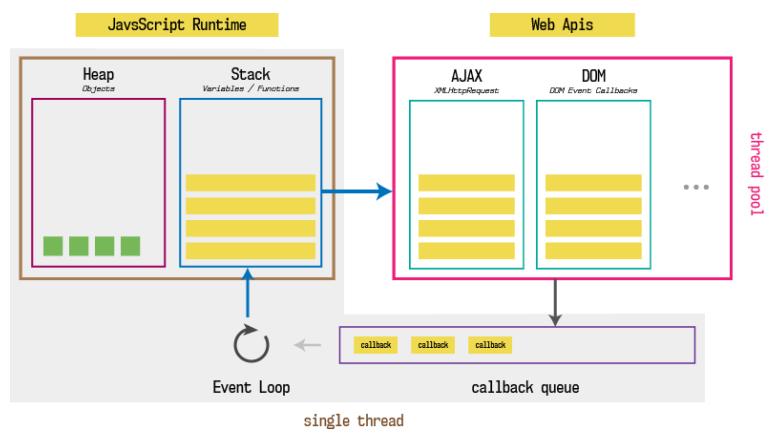
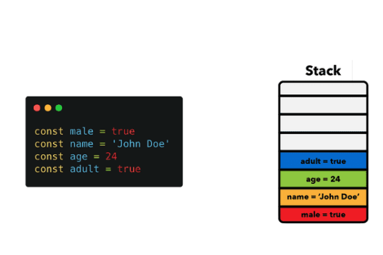
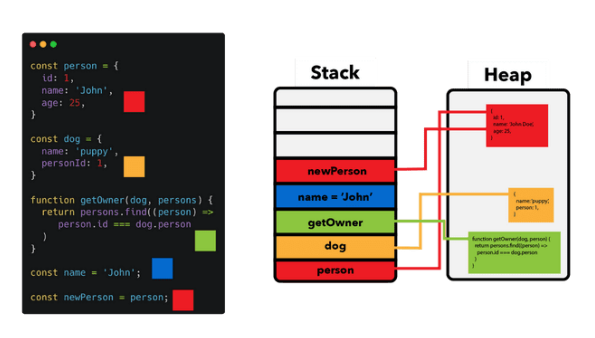
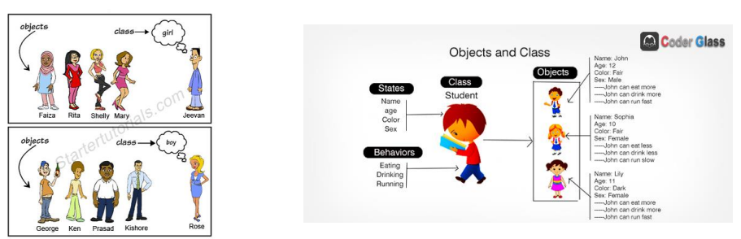
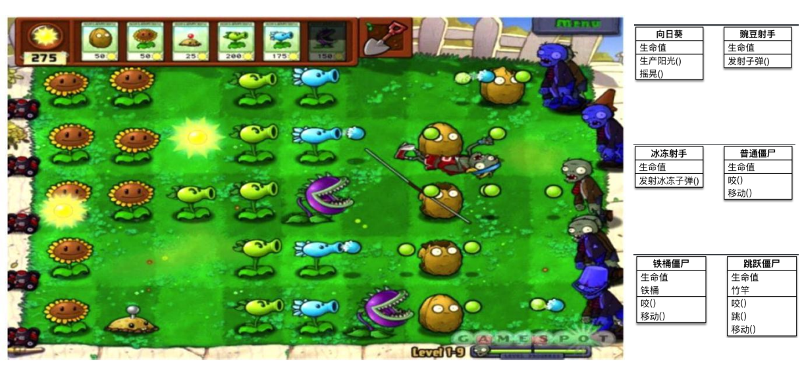

## 认识对象类型

- 在数据类型中我们提到还有一种特别的类型：对象类型。

  - 对象类型涉及到JavaScript的各个方面，所以掌握对象类型非常重要；
  - 对象类型是一种存储键值对（key-value）的更复杂的数据类型；

- 为什么需要对象类型呢？

  - 基本数据类型可以存储一些简单的值，但是现实世界的事物抽象成程序时，往往比较复杂；
  - 比如一个人，有自己的特性（比如姓名、年龄、身高），有一些行为（比如跑步、学习、工作）；
  - 比如一辆车，有自己的特性（比如颜色、重量、速度），有一些行为（比如行驶）；

- 这个时候，我们需要一种新的类型将这些特性和行为组织在一起，这种类型就是对象类型。

  - 对象类型可以使用{…}来创建的复杂类型，里面包含的是键值对（“key: value”）；

  - 键值对可以是属性和方法（在对象中的函数称之为方法）；

  - 其中key是字符串（也叫做属性名property name ，ES6之后也可以是Symbol类型，后续学习）；

  - 其中value可以是任意类型，包括基本数据类型、函数类型、对象类型等；

    

## 创建对象和使用对象

- 对象的创建方法有很多，包括三种：
  - 对象字面量（Object Literal）：通过{}
  - new Object+动态添加属性；
  - new 其他类；
- 目前我们主要掌握对象字面量的方式，后续我们学习其他两种方式。
  - 属性之间是以逗号（ comma ）分割的；
- 对象的使用过程包括如下操作：
  - 访问对象的属性；
  - 修改对象的属性；
  - 添加对象的属性；
  - 删除对象的属性；

## 对象的常见操作

- 访问对象的属性；

  ```js
  console.log(info.name)
  var age = info.age
  ```

- 修改对象的属性；

  ```js
  info.name = "kobe"
  info.age = 30
  ```

- 添加对象的属性；

  ```js
  info.height = 1.98
  info.address = "洛杉矶"
  ```

- 删除对象的属性：delete操作符

  ```js
  delete info.age
  ```

## 方括号和引用的使用

- 为什么需要使用方括号呢？

  - 对于空格来说，JavaScript是无法理解的。

    ```js
    info.good frined = "why"
    ```

- 这是因为点符号要求 key 是有效的变量标识符

  - 不包含空格，不以数字开头，也不包含特殊字符（允许使用 $ 和 _）；

- 这个时候我们可以使用方括号：

  - 方括号运行我们在定义或者操作属性时更加的灵活；

    ```js
    var message = "Hellow Worlld"
    var obj = {
    	"good friend": "why",
    	[message]: "你好,世界"
    }
    console.log(obj["good friend"])
    console.log(obj[message])
    ```

## 对象的练习

- 练习一：商品对象
- 练习二：手机对象
- 练习三：用户对象
- 作业：思考日常生活或者开发中都会有哪些对象？

## 对象的遍历

- 对象的遍历（迭代）：表示获取对象中所有的属性和方法。

  - Object.keys() 方法会返回一个由一个给定对象的自身可枚举属性组成的数组；

- 遍历方式一：普通for循环

  ```js
  var infoKeys = Object.keys(info)
  for (var i = 0; i < infoKey.length; i++) {
  	var key = infoKey[i]
  	var value = info[key]
  	console.log(`key: ${key},value: ${value}`)
  }
  ```

- 遍历方式二：for in 遍历方法

  ```js
  for (var key in info) {
  	var value = info[key]
  	console.log(`key: ${key},value: ${value}`)
  }
  ```

## 栈内存和堆内存

- 我们知道程序是需要加载到内存中来执行的，我们可以将内存划分为两个区域：栈内存和堆内存。

  - 原始类型占据的空间是在栈内存中分配的；

  - 对象类型占据的空间是在堆内存中分配的；

    

  - 后续我们会学习图中的其他知识

  - 目前我们先掌握堆和栈的概念即可

## 值类型和引用类型

- 原始类型的保存方式：在变量中保存的是值本身

  - 所以原始类型也被称之为值类型；

- 对象类型的保存方式：在变量中保存的是对象的“引用”

  - 所以对象类型也被称之为引用类型；

    

    

### 思考下面的现象 

- 现象一：两个对象的比较

  ```js
  var a = 123
  var b = 123
  console.log(a === b) // true
  
  var m = {}
  var n = {}
  console.log(m === n) // false
  ```

- 现象二：引用传递和值传递的内存区别

  ```js
  function foo(info) {
    info.name = "mjjh"
  }
  
  var obj = {
    name: "kobe"
  }
  foo(obj)
  console.log(obj.name) // mjjh
  ```

## this

### 为什么需要this？

- 在常见的编程语言中，几乎都有this这个关键字（Objective-C中使用的是self），但是JavaScript中的this和常见的面向对象语言中的this不太一样：

  - 常见面向对象的编程语言中，比如Java、C++、Swift、Dart等等一系列语言中，this通常只会出现在类的方法中。
  - 也就是你需要有一个类，类中的方法（特别是实例方法）中，this代表的是当前调用对象；

- 但是JavaScript中的this更加灵活，无论是它出现的位置还是它代表的含义；

- 我们来看一下编写一个obj的对象，有this和没有this的区别：

  ```js
  var obj = {
    name: "mjjh",
    running: function() {
      console.log(obj.name + "running");
    },
    eating: function() {
      console.log(obj.name + "eating");
    },
    studying: function() {
      console.log(obj.name + "studying");
    }
  }
  ```

  ```js
  var obj = {
    name: "mjjh",
    running: function() {
      console.log(this.name + "running");
    },
    eating: function() {
      console.log(this.name + "eating");
    },
    studying: function() {
      console.log(this.name + "studying");
    }
  }
  ```

### this指向什么？

- 目前掌握两个this的判断方法：

  - 以默认的方式调用一个函数，this指向window；

    ```js
    function foo() {
    	console.log(this) // window
    }
    foo()
    ```

  - 通过对象调用，this指向调用的对象；

    ```javascript
    var obj = {
    	bar: function() {
    		console.log(this) // obj
    	}
    }
    obj.bar()
    ```

- 后续我们还会学习其他，也会给大家总结this的规律；

## 类和对象的思维方式

- 我们来思考一个问题：如果需要在开发中创建一系列的相似的对象，我们应该如何操作呢？

- 比如下面的例子：

  - 游戏中创建一系列的英雄（英雄具备的特性是相似的，比如都有名字、技能、价格，但是具体的值又不相同）
  - 学生系统中创建一系列的学生（学生都有学号、姓名、年龄等，但是具体的值又不相同）

- 当然，一种办法是我们创建一系列的对象：

  ```js
  var p1 = {
  	name: "张三",
  	age: 18,
  	height: 1.77,
  	address: "北京市"
  }
  
  var p2 = {
  	name: "李四",
  	age: 28,
  	height: 1.88,
  	address: "上海市"
  }
  
  var p1 = {
  	name: "张三",
  	age: 12,
  	height: 1.57,
  	address: "杭州市"
  }
  ```

- 这种方式有一个很大的弊端：创建同样的对象时，需要编写重复的代码；

  - 我们是否有可以批量创建对象，但是又让它们的属性不一样呢？

### 创建对象的方案 – 工厂函数

- 我们可以想到的一种创建对象的方式：工厂函数

  - 我们可以封装一个函数，这个函数用于帮助我们创建一个对象，我们只需要重复调用这个函数即可；
  - 工厂模式其实是一种常见的设计模式；

  ```js
  function createPerson(name, age, height, adress) {
    var p = new Object()
    p.name = name
    p.age = age
    p.height = height
    p.adress = adress
  
    p.eating = function() {
      console.log(this.name + "在吃东西");
    }
    p.runing = function() {
      console.log(this.name + "在跑步");
    }
  }
  
  var p1 = createPerson("张三", 18, 1.88, "北京市")
  var p2 = createPerson("李四", 18, 1.88, "上海市")
  var p3 = createPerson("王五", 18, 1.88, "杭州市")
  ```

## 认识构造函数

- 工厂方法创建对象有一个比较大的问题：我们在打印对象时，对象的类型都是Object类型
  - 但是从某些角度来说，这些对象应该有一个他们共同的类型；
  - 下面我们来看一下另外一种模式：构造函数的方式；
- 我们先理解什么是构造函数？
  - 构造函数也称之为构造器（constructor），通常是我们在创建对象时会调用的函数；
  - 在其他面向的编程语言里面，构造函数是存在于类中的一个方法，称之为构造方法；
  - 但是JavaScript中的构造函数有点不太一样，构造函数扮演了其他语言中类的角色；
- 也就是在JavaScript中，构造函数其实就是类的扮演者：
  - 比如系统默认给我们提供的Date就是一个构造函数，也可以看成是一个类；
  - 在ES5之前，我们都是通过function来声明一个构造函数（类）的，之后通过new关键字来对其进行调用；
  - 在ES6之后，JavaScript可以像别的语言一样，通过class来声明一个类；
- 那么类和对象到底是什么关系呢？

## 类和对象的关系

- 那么什么是类（构造函数）呢？
  - 现实生活中往往是根据一份描述/一个模板来创建一个实体对象的.
  - 编程语言也是一样, 也必须先有一份描述, 在这份描述中说明将来创建出来的对象有哪些属性(成员变量)和行为(成员方法)
- 比如现实生活中，我们会如此来描述一些事物：
  - 比如水果fruits是一类事物的统称，苹果、橘子、葡萄等是具体的对象；
  - 比如人person是一类事物的统称，而Jim、Lucy、Lily、李雷、韩梅梅是具体的对象；



###  比如植物大战僵尸游戏

 

## JavaScript中的类（ES5）

- 我们前面说过，在JavaScript中类的表示形式就是构造函数。
- JavaScript中的构造函数是怎么样的？
  - 构造函数也是一个普通的函数，从表现形式来说，和千千万万个普通的函数没有任何区别；
  - 那么如果这么一个普通的函数被使用new操作符来调用了，那么这个函数就称之为是一个构造函数；
- 如果一个函数被使用new操作符调用了，那么它会执行如下操作：
  1. 在内存中创建一个新的对象（空对象）；
  2. 这个对象内部的[[prototype]]属性会被赋值为该构造函数的prototype属性；（后面详细讲）；
  3. 构造函数内部的this，会指向创建出来的新对象；
  4. 执行函数的内部代码（函数体代码）；
  5. 如果构造函数没有返回非空对象，则返回创建出来的新对象；
- 接下来，我们可以用构造函数的方式来实现一下批量创建学生。

## 创建对象的方案 – 构造函数（类）

- 我们来通过构造函数实现一下：

  ```js
  function Person(name, age, height, adress) {
    this.name = name
    this.age = age
    this.height = height
    this.adress = adress
  
    this.eating = function() {
      console.log(this.name + "在吃东西");
    }
    this.runing = function() {
      console.log(this.name + "在跑步");
    }
  }
  ```

- 这个构造函数可以确保我们的对象是有Person的类型的（实际是constructor的属性，这个我们后续再探讨）；

- 事实上构造函数还有很多其他的特性：

  - 比如原型、原型链、实现继承的方案
  - 比如ES6中类、继承的实现；

