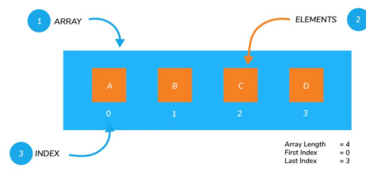
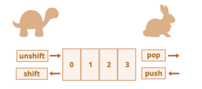
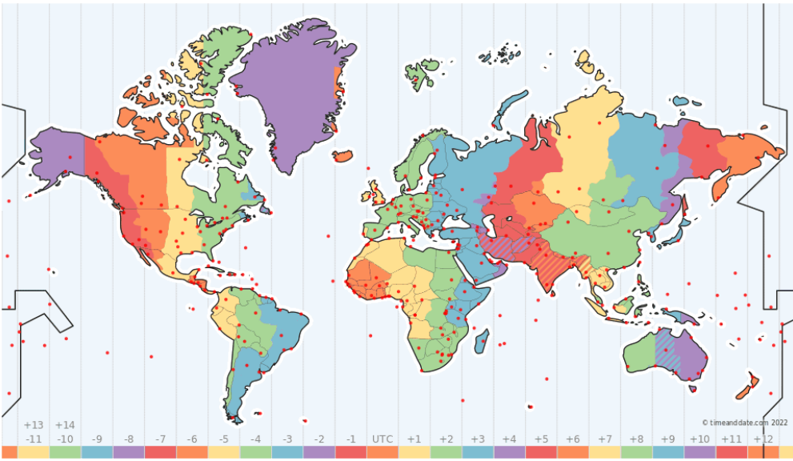
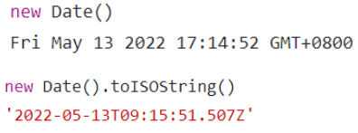

## 包装类

### 原始类型的包装类

- JavaScript的原始类型并非对象类型，所以从理论上来说，它们是没有办法获取属性或者调用方法的。

- 但是，在开发中会看到，我们会经常这样操作：

  ```js
  var message = "hellow World"
  var words = message.split(" ")
  var length = message.length
  
  var num = 2.54432
  num = num.toFixed(2)
  ```

- 那么，为什么会出现这样奇怪的现象呢？（悖论）

  - 原始类型是简单的值，默认并不能调用属性和方法；
  - 这是因为JavaScript为了可以使其可以获取属性和调用方法，对其封装了对应的包装类型；

- 常见的包装类型有：String、Number、Boolean、Symbol、BigInt类型

### 包装类型的使用过程

- 默认情况，当我们调用一个原始类型的属性或者方法时，会进行如下操作：

  - 根据原始值，创建一个原始类型对应的包装类型对象；
  - 调用对应的属性或者方法，返回一个新的值；
  - 创建的包装类对象被销毁；
  - 通常JavaScript引擎会进行很多的优化，它可以跳过创建包装类的过程在内部直接完成属性的获取或者方法的调用。

- 我们也可以自己来创建一个包装类的对象：

  - name1是字面量（literal）的创建方式，name2是new创建对象的方式；

    ```js
    var name1 = "mjjh"
    var name2 = new String("mjjh")
    console.log(typeof name1) // string
    console.log(typeof name2) // object
    console.log(name === name2) // false
    ```

- 注意事项：null、undefined没有任何的方法，也没有对应的“对象包装类”；


## 基本类型的补充

### Number类的补充

- 前面我们已经学习了Number类型，它有一个对应的数字包装类型Number，我们来对它的方法做一些补充。

- Number属性补充：
  - Number.MAX_SAFE_INTEGER：JavaScript 中最大的安全整数 (2^53 - 1)；

  - Number.MIN_SAFE_INTEGER：JavaScript 中最小的安全整数 -(2^53 - 1)

- Number实例方法补充：
  - 方法一：toString(base)，将数字转成字符串，并且按照base进制进行转化
    - base 的范围可以从 2 到 36，默认情况下是 10；

    - 注意：如果是直接对一个数字操作，需要使用..运算符；

  - 方法二：toFixed(digits)，格式化一个数字，保留digits位的小数；
    - digits的范围是0到20（包含）之间；

- Number类方法补充：
  - 方法一：Number.parseInt(string[, radix])，将字符串解析成整数，也有对应的全局方法parseInt；

  - 方法二：Number. parseFloat(string)，将字符串解析成浮点数，也有对应的全局方法parseFloat；

- 更多Number的知识，可以查看MDN文档：
  - https://developer.mozilla.org/zh-CN/docs/Web/JavaScript/Reference/Global_Objects/Number


### Math对象

- 在除了Number类可以对数字进行处理之外，JavaScript还提供了一个Math对象。
  - Math是一个内置对象（不是一个构造函数），它拥有一些数学常数属性和数学函数方法；
- Math常见的属性：
  - Math.PI：圆周率，约等于 3.14159；
- Math常见的方法：
  - Math.floor：向下舍入取整
  - Math.ceil：向上舍入取整
  - Math.round：四舍五入取整
  - Math.random：生成0~1的随机数（包含0，不包含1）
  - Math.pow(x, y)：返回x的y次幂
- Math中还有很多其他数学相关的方法，可以查看MDN文档：
  - https://developer.mozilla.org/zh-CN/docs/Web/JavaScript/Reference/Global_Objects/Math

### String类的补充

#### 基本使用

- 在开发中，我们经常需要对字符串进行各种各样的操作，String类提供给了我们对应的属性和方法。
- String常见的属性：
  - length：获取字符串的长度；

- String也有很多常见的方法和操作，我们来进行学习。
- 操作一：访问字符串的字符
  - 使用方法一：通过字符串的索引 str[0]

  - 使用方法二：通过str.charAt(pos)方法

  - 它们的区别是索引的方式没有找到会返回undefined，而charAt没有找到会返回空字符串；

- 练习：字符串的遍历
  - 方式一：普通for循环

  - 方式二：for..of遍历


#### 修改字符串

- 字符串的不可变性：

  - 字符串在定义后是不可以修改的，所以下面的操作是没有任何意义的；

    ```js
    var message = "hellow World"
    message[1] = "A"
    console.log(message)
    ```

- 所以，在我们改变很多字符串的操作中，都是生成了一个新的字符串；

  - 比如改变字符串大小的两个方法
  - toLowerCase()：将所有的字符转成小写；
  - toUpperCase() ：将所有的字符转成大写；

#### 查找字符串

- 在开发中我们经常会在一个字符串中查找或者获取另外一个字符串，String提供了如下方法：

- 方法一：查找字符串位置

  

  - 从fromIndex开始，查找searchValue的索引；

  - 如果没有找到，那么返回-1；

  - 有一个相似的方法，叫lastIndexOf，从最后开始查找（用的较少）

    ```js
    console.log(message.indexOf("name", 18))
    ```

- 方法二：是否包含字符串

  

  - 从position位置开始查找searchString， 根据情况返回 true 或 false

  - 这是ES6新增的方法；

    ```js
    console.log(message.includes("mjjh"))
    ```

- 方法三：以xxx开头

  

  - 从position位置开始，判断字符串是否以searchString开头；

  - 这是ES6新增的方法，下面的方法也一样；

- 方法四：以xxx结尾

  

  - 在length长度内，判断字符串是否以searchString结尾；

    ```js
    console.log(message.startsWith("mjjh"))
    console.log(message.endsWith("mjjh"))
    ```

- 方法五：替换字符串

  

  - 查找到对应的字符串，并且使用新的字符串进行替代；

  - 这里也可以传入一个正则表达式来查找，也可以传入一个函数来替换；

    ```js
    console.log(message.replace("mjjh","why"))
    ```

- 方法八：获取子字符串

  - 开发中推荐使用slice方法。

    | 方法                  | 选择方式……                            | 负值参数          |
    | --------------------- | ------------------------------------- | ----------------- |
    | slice(start, end)     | 从 start 到 end（不含 end）           | 允许              |
    | substring(start, end) | 从 start 到 end（不含 end）           | 负值代表 0        |
    | substr(start, length) | 从 start 开始获取长为 length 的字符串 | 允许 start 为负数 |

- 方法六：拼接字符串

  

  ```js
  console.log("hello".concat("World"))
  ```

- 方法七：删除首位空格

  

  ```js
  console.log("      mjjh      ".trim())
  ```

- 方法九：字符串分割

  

  - separator：以什么字符串进行分割，也可以是一个正则表达式；

  - limit：限制返回片段的数量；

    ```js
    var message = "my name is mjjh"
    console.log(message.split(" ", 3)) // ['my', 'name', 'is', 'mjjh']
    ```

- 更多的字符串的补充内容，可以查看MDN的文档：

  - https://developer.mozilla.org/zh-CN/docs/Web/JavaScript/Reference/Global_Objects/String

## 数组Array

- 什么是数组（Array）呢？

  - 对象允许存储键值集合，但是在某些情况下使用键值对来访问并不方便；
  - 比如说一系列的商品、用户、英雄，包括HTML元素，我们如何将它们存储在一起呢？
  - 这个时候我们需要一种有序的集合，里面的元素是按照某一个顺序来排列的；
  - 这个有序的集合，我们可以通过索引来获取到它；
  - 这个结构就是数组（Array）；

- 数组和对象都是一种保存多个数据的数据结构，在后续的数据结构中我们还会学习其他结构；

- 我们可以通过[ ]来创建一个数组：

  - 数组是一种特殊的对象类型；

    ```js
    var letters = ['a', 'b', 'c']
    ```

    

### 数组的创建方式

- 创建一个数组有两种语法：

  ```js
  var arr1 = []
  var arr2 = new Array()
  var arr3 = ['mjjh', 'bob', 'james']
  var arr4 = new Array('abc', 'cba', 'nba')
  ```

- 下面的方法是在创建一个数组时，设置数组的长度（很少用）

  ```js
  var arr5 = new Array(8)
  console.log(arr5)
  ```

- 数组元素从 0 开始编号（索引index）。

  - 一些编程语言允许我们使用负数索引来实现这一点，例如 fruits[-1]

  - JavaScript并不支持这种写法；

- 我们先来学习一下数组的基本操作：

  - 访问数组中的元素；

  - 修改数组中的元素；

  - 增加数组中的元素；

  - 删除数组中的元素；


### 数组的基本操作


- 访问数组中的元素：

  - 通过中括号[]访问

  - arr.at(i)：

    - 如果 i >= 0，则与 arr[i] 完全相同。

    - 对于 i 为负数的情况，它则从数组的尾部向前数。

      ```js
      console.log(arr[0])
      console.log(arr.at(-1))
      ```

- 修改数组中的元素

  ```js
  arr[0] = "mjjh"
  ```

- 删除和添加元素虽然也可以通过索引来直接操作，但是开发中很少这样操作。

### 数组的添加、删除方法

- 在数组的尾端添加或删除元素：

  - push 在末端添加元素.

  - pop 从末端取出一个元素.

    ```js
    arr.push("abc", "cba")
    arr.pop
    ```

- 在数组的首端添加或删除元素

  - shift 取出队列首端的一个元素，整个数组元素向前前移动；

  - unshift 在首端添加元素，整个其他数组元素向后移动；

    ```js
    arr.unshift("curry")
    arr.shift()
    ```

- push/pop 方法运行的比较快，而 shift/unshift 比较慢。

  - 因为后者方法需要移动整个数组

    

- 如果我们希望在中间某个位置添加或者删除元素应该如何操作呢？

- arr.splice 方法可以说是处理数组的利器，它可以做所有事情：添加，删除和替换元素。

- arr.splice的语法结构如下：

  

  - 从start位置开始，处理数组中的元素；

  - deleteCount：要删除元素的个数，如果为0或者负数表示不删除；

  - item1, item2, ...：在添加元素时，需要添加的元素；

    ```js
    // 1. 删除一个元素
    arr.splice(1, 1)
    // 2. 新增两个元素
    arr.splice(1, 0, 'abc', 'cba')
    // 3. 替换两个元素
    arr.splice(1, 2, 'koby', 'curry')
    ```

- 注意：这个方法会修改原数组

### length属性

- length属性用于获取数组的长度：

  - 当我们修改数组的时候，length 属性会自动更新。

- length 属性的另一个有意思的点是它是可写的。

  - 如果我们手动增加一个大于默认length的数值，那么会增加数组的长度。

  - 但是如果我们减少它，数组就会被截断。

    

- 所以，清空数组最简单的方法就是：arr.length = 0;。

### 数组的遍历

- 普通for循环遍历：

  ```js
  for (var i = 0; i < arr.lenth; i++){
  	console.log(arr[i])
  }
  ```

- for..in 遍历，获取到索引值：

  ```js
  for (var index in arr){
  	console.log(arr[index])
  }
  ```

- for..of 遍历，获取到每一个元素：

  ```js
  for (var item of arr){
  	console.log(item)
  }
  ```

### 数组方法 – slice、cancat、 join

- arr.slice 方法：用于对数组进行截取（类似于字符串的slice方法）。

  

  - 包含bigin元素，但是不包含end元素；

    ```js
    console.log(arr.slice(2, 3))
    ```

- arr.concat方法：创建一个新数组，其中包含来自于其他数组和其他项的值。

  

  ```js
  var newArr = arr.concat(["abc", "cba"], "nba")
  console.log(newArr)
  ```

- arr.join方法： 将一个数组的所有元素连接成一个字符串并返回这个字符串。

  

  ```js
  console.log(arr,join("-"))
  ```

### 数组方法 – 查找元素

- arr.indexOf方法： 查找某个元素的索引

  

  - 从fromIndex开始查找，如果找到返回对应的索引，没有找到返回-1；

  - 也有对应的从最后位置开始查找的 lastIndexOf 方法

- arr.includes方法：判断数组是否包含某个元素

  

  - 从索引 from 开始搜索 item，如果找到则返回 true（如果没找到，则返回 false）。

- find 和 findIndex 直接查找元素或者元素的索引（ES6之后新增的语法）

  ```js
  var stu = students.find(function(item, index, arr){
  	return item.id === 100
  })
  console.log(stu)
  ```

### 数组的排序 – sort/reverse

- sort方法也是一个高阶函数，用于对数组进行排序，并且生成一个排序后的新数组：

  

  - 如果 compareFunction(a, b) 小于 0 ，那么 a 会被排列到 b 前面；

  - 如果 compareFunction(a, b) 等于 0 ， a 和 b 的相对位置不变；

  - 如果 compareFunction(a, b) 大于 0 ， b 会被排列到 a 前面；

  - 也就是说，谁小谁排在前面；

    ```js
    var stu = students.sort(function(item1, item2){
    	// return item1.age - item2.age //升序
    	return item2.age - item1.age //降序
    })
    console.log(stu)
    ```

- 等到后续讲解数据结构与算法时，我们会编写自己的排序算法：

  - 冒泡排序、插入排序、选择排序、堆排序、希尔排序、快速排序等；

- reverse() 方法将数组中元素的位置颠倒，并返回该数组。

### 数组的其他高阶方法

- arr.forEach
  - 遍历数组，并且让数组中每一个元素都执行一次对应的方法；

- arr.map
  - map() 方法创建一个新数组；

  - 这个新数组由原数组中的每个元素都调用一次提供的函数后的返回值组成；

- arr.filter
  - filter() 方法创建一个新数组；

  - 新数组中只包含每个元素调用函数返回为true的元素；

- arr.reduce
  - 用于计算数组中所有元素的总和；

  - 对数组中的每个元素按序执行一个由您提供的 reducer 函数；

  - 每一次运行 reducer 会将先前元素的计算结果作为参数传入，最后将其结果汇总为单个返回值；


## 时间

### 时间的表示方式

- 关于《时间》，有很多话题可以讨论：
  - 比如物理学有《时间简史：从大爆炸到黑洞》，讲述的是关于宇宙的起源、命运；

  - 比如文学上有《记念刘和珍君》：时间永是流驶，街市依旧太平；

  - 比如音乐上有《时间都去哪儿了》：时间都去哪儿了，还没好好感受年轻就老了；

- 我们先来了解一下时间表示的基本概念：
- 最初，人们是通过观察太阳的位置来决定时间的，但是这种方式有一个最大的弊端就是不同区域位置大家使用的时间是不一致的。
  - 相互之间没有办法通过一个统一的时间来沟通、交流。

- 之后，人们开始制定的标准时间是英国伦敦的皇家格林威治（ Greenwich ）天文台的标准时间（刚好在本初子午线经过的地方），这个时间也称之为GMT（Greenwich Mean Time）。
  - 其他时区根据标准时间来确定自己的时间，往东的时区（GMT+hh:mm），往西的时区（GMT+hh:mm）；
- 但是，根据公转有一定的误差，也会造成GMT的时间会造成一定的误差，于是就提出了根据原子钟计算的标准时间UTC（Coordinated Universal Time）
  - 目前GMT依然在使用，主要表示的是某个时区中的时间，而UTC是标准的时间。

### 时区对比图



### 创建Date对象

- 在JavaScript中我们使用Date来表示和处理时间。

  - Date的构造函数有如下用法：

    

    ```js
    // 创建的Data对象
    var data1 = new Data() // 当前时间 Fri May 13 2022 15:22:53 GMT+0800(伊尔库兹克标准时间)
    var data2 = new Data(1000)// 传入的是毫秒数, 表示从 1970-01-01 00:00:00 UTC经过的毫秒数
    var data3 = new Data("2020-08-08") // 传入的是dataString, 日期的字符串值
    var data4 = new Data(2022, 08, 09, 09, 08, 07, 08) 
    // new Data(year, monthIndex [, day [, hours [, minutes [. seconds [, milliseconds]]]]])
    ```

- 日期的表示方式有两种：RFC 2822 标准 或者 ISO 8601 标准。

- 默认打印的时间格式是RFC 2822标准的：

  

- 我们也可以将其转化成ISO 8601标准的：

  - YYYY：年份，0000 ~ 9999
  - MM：月份，01 ~ 12
  - DD：日，01 ~ 31
  - T：分隔日期和时间，没有特殊含义，可以省略
  - HH：小时，00 ~ 24
  - mm：分钟，00 ~ 59
  - ss：秒，00 ~ 59
  - .sss：毫秒
  - Z：时区

### Date获取信息的方法

- 我们可以从Date对象中获取各种详细的信息：
  - getFullYear()：获取年份（4 位数）；
  - getMonth()：获取月份，从 0 到 11；
  - getDate()：获取当月的具体日期，从 1 到 31（方法名字有点迷）；
  - getHours()：获取小时；
  - getMinutes()：获取分钟；
  - getSeconds()：获取秒钟；
  - getMilliseconds()：获取毫秒；
- 获取某周中的星期几：
  - getDay()：获取一周中的第几天，从 0（星期日）到 6（星期六）；

### Date设置信息的方法

- Date也有对应的设置方法：
  - setFullYear(year, [month], [date])

  - setMonth(month, [date])

- setDate(date)
  - setHours(hour, [min], [sec], [ms])

  - setMinutes(min, [sec], [ms])

  - setSeconds(sec, [ms])

  - setMilliseconds(ms)

  - setTime(milliseconds)

- 了解：我们可以设置超范围的数值，它会自动校准。

### Date获取Unix时间戳

- Unix 时间戳：它是一个整数值，表示自1970年1月1日00:00:00 UTC以来的毫秒数。

- 在JavaScript中，我们有多种方法可以获取这个时间戳：

  - 方式一：new Date().getTime()

  - 方式二：new Date().valueOf()

  - 方式三：+new Date()

  - 方式四：Date.now()

- 获取到Unix时间戳之后，我们可以利用它来测试代码的性能：

  ```js
  var startTime = Data.now()
  for(var i = 0; i < 10000; i++){
  	console.log(i)
  }
  var endTime = Data.now()
  console.log(endTime - startTime)
  ```

### Date.parse方法

- Date.parse(str) 方法可以从一个字符串中读取日期，并且输出对应的Unix时间戳。

- Date.parse(str) ：

  - 作用等同于 new Date(dateString).getTime() 操作；

  - 需要符合 RFC2822 或 ISO 8601 日期格式的字符串；
    - 比如YYYY-MM-DDTHH:mm:ss.sssZ

  - 其他格式也许也支持，但结果不能保证一定正常；

  - 如果输入的格式不能被解析，那么会返回NaN；


  ```js
var time = Data.parse("2022-08-08T08:08:08.666Z")
console.log(time)
  ```

### 时间格式化的方法（JS高级讲解）

```js
function formatDate(time, fmt) {
  let date = new Date(time);
  if (/(y+)/.test(fmt)) {
    fmt = fmt.replace(RegExp.$1, (date.getFullYear() + '').substr(4 - RegExp.$1.length));
  }
  let o = {
    'M+': date.getMonth() + 1,
    'd+': date.getDate(),
    'h+': date.getHours(),
    'm+': date.getMinutes(),
    's+': date.getSeconds()
  };
  for (let k in o) {
    if (new RegExp(`(${k})`).test(fmt)) {
      let str = o[k] + '';
      fmt = fmt.replace(RegExp.$1, (RegExp.$1.length === 1) ? str : padLeftZero(str));
    }
  }
  return fmt;
};
function padLeftZero(str) {
  return ('00' + str).substr(str.lengr)
}
```

