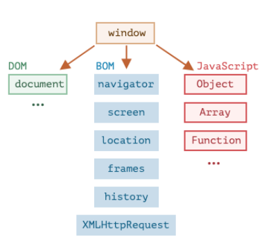
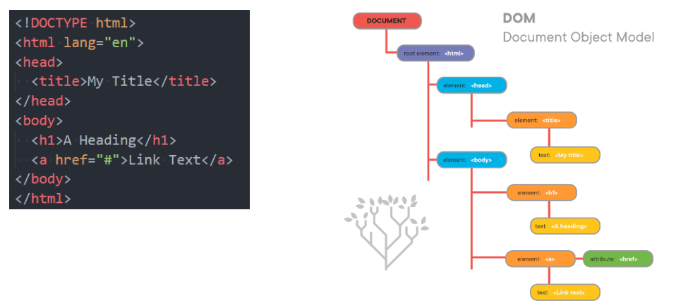
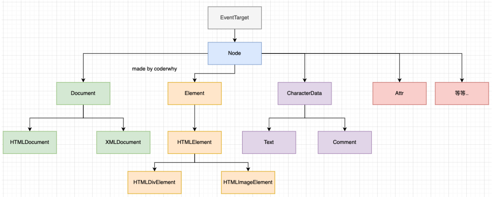
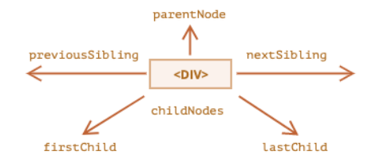
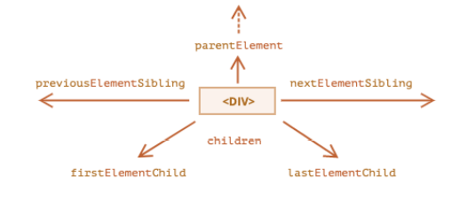
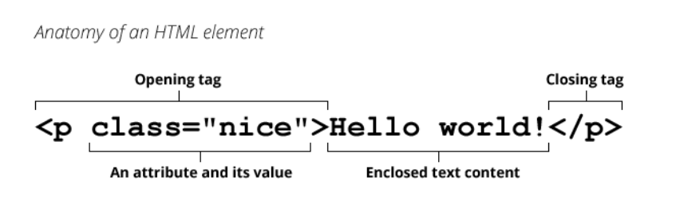
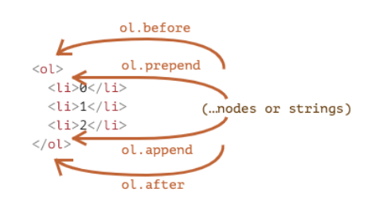
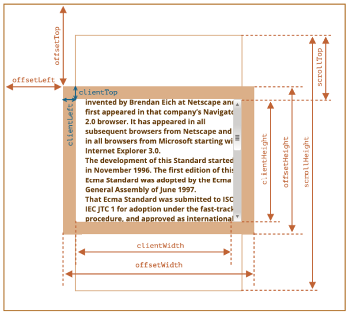

## DOM 和 BOM

### 认识 DOM 和 BOM

- 前面我们花了很多时间学习 JavaScript 的基本语法，但是这些基本语法，但是这些语法好像和做网页没有什么关系，和前面学习的 HTML、CSS 也没有什么关系呢？

  - 这是因为我们前面学习的部分属于 ECMAScript，也就是 JavaScript 本身的语法部分；
  - 除了语法部分之外，我们还需要学习浏览器提供给我们开发者的 DOM、BOM 相关的 API 才能对页面、浏览器进行操作；

- 前面我们学习了一个 window 的全局对象，window 上事实上就包含了这些内容：

  - 我们已经学习了 JavaScript 语法部分的 Object、Array、Date 等；
  - 另外还有 DOM、BOM 部分；

- DOM：文档对象模型（Document Object Model）

  - 简称 DOM，将页面所有的内容表示为可以修改的对象；

- BOM：浏览器对象模型（Browser Object Model）

  - 简称 BOM，由浏览器提供的用于处理文档（document）之外的所有内容的其他对象；

  - 比如 navigator、location、history 等对象；

    

### 深入理解 DOM

- 浏览器会对我们编写的 HTML、CSS 进行渲染，同时它又要考虑我们可能会通过 JavaScript 来对其进行操作：

  - 于是浏览器将我们编写在 HTML 中的每一个元素（Element）都抽象成了一个个对象；
  - 所有这些对象都可以通过 JavaScript 来对其进行访问，那么我们就可以通过 JavaScript 来操作页面；
  - 所以，我们将这个抽象过程称之为 文档对象模型（Document Object Model）；

- 整个文档被抽象到 document 对象中：

  - 比如 document.documentElement 对应的是 html 元素；
  - 比如 document.body 对应的是 body 元素；
  - 比如 document.head 对应的是 head 元素；

- 下面的一行代码可以让整个页面变成红色：

  ```js
  document.body.style.backgroundColor = "red";
  ```

- 所以我们学习 DOM，就是在学习如何通过 JavaScript 对文档进行操作的；

### DOM Tree 的理解

- 一个页面不只是有 html、head、body 元素，也包括很多的子元素：

  - 在 html 结构中，最终会形成一个树结构；

  - 在抽象成 DOM 对象的时候，它们也会形成一个树结构，我们称之为 DOM Tree；

    

### DOM 的学习顺序

- DOM 相关的 API 非常多，我们会通过如下顺序来学习：
  - 1.DOM 元素之间的关系
  - 2.获取 DOM 元素
  - 3.DOM 节点的 type、tag、content
  - 4.DOM 节点的 attributes、properies
  - 5.DOM 节点的创建、插入、克隆、删除
  - 6.DOM 节点的样式、类
  - 7.DOM 元素/window 的大小、滚动、坐标
- 整体会按照这个顺序来学习，也会额外补充其他的知识。

## DOM 元素之间的关系

### DOM 的继承关系图

- DOM 相当于是 JavaScript 和 HTML、CSS 之间的桥梁
  - 通过浏览器提供给我们的 DOM API，我们可以对元素以及其中的内容做任何事情；
- 类型之间有如下的继承关系：
  

### document 对象

- Document 节点表示的整个载入的网页，它的实例是全局的 document 对象：

  - 对 DOM 的所有操作都是从 document 对象开始的；
  - 它是 DOM 的 入口点，可以从 document 开始去访问任何节点元素；

- 对于最顶层的 html、head、body 元素，我们可以直接在 document 对象中获取到：

  - html 元素：html = document.documentElement

  - body 元素 body = document.body

  - head 元素：head = document.head

  - 文档声明：<!DOCTYPE html> = document.doctype

    ```js
    console.log(document.doctype);
    console.log(document.documentElement);
    console.log(document.head);
    console.log(document.body);
    ```

### 节点（Node）之间的导航（navigator）

- 如果我们获取到一个节点（Node）后，可以根据这个节点去获取其他的节点，我们称之为节点之间的导航。

- 节点之间存在如下的关系：

  - 父节点：parentNode

  - 前兄弟节点：previousSibling

  - 后兄弟节点：nextSibling

  - 子节点：childNodes

  - 第一个子节点：firstChild

  - 第二个子节点：lastChild

  - **回车也算一个子元素**

    

- 尝试获取下面结构的节点：

  ```html
  <div class="box">
    <!-- 我是注释 -->
    <h1 class="title">我是标题</h1>
    <div class="container">我是div元素</div>
    <div class="desc">我是一个段落</div>
  </div>

  console.log(document.body.childNodes[1])
  //第一个子节点获取不到,回车也算一个子元素
  console.log(document.body.childNodes[1].firstChild)
  console.log(document.body.childNodes[1].childNodes[3])
  console.log(document.body.childNodes[1].childNodes[5])
  console.log(document.body.childNodes[1].childNodes[7])
  ```

### 元素（Element）之间的导航（navigator）

- 如果我们获取到一个元素（Element）后，可以根据这个元素去获取其他的元素，我们称之为元素之间的导航。

- 节点之间存在如下的关系：

  - 父元素：parentElement

  - 前兄弟节点：previousElementSibling

  - 后兄弟节点：nextElementSibling

  - 子节点：children

  - 第一个子节点：firstElementChild

  - 第二个子节点：lastElementChild

  - **无法获取到文字**

    

- 尝试获取下面结构的元素：

  ```html
  <div class="box">
    <!-- 我是注释 -->
    <h1 class="title">我是标题</h1>
    <div class="container">我是div元素</div>
    <div class="desc">我是一个段落</div>
  </div>

  console.log(document.body.children) console.log(document.body.children[0])
  console.log(document.body.children[0].firstElementChild)
  console.log(document.body.children[0].children[1])
  console.log(document.body.children[0].lastElementChild)
  ```

### 表格（table）元素的导航（navigator）

- **table **元素支持 (除了上面给出的，之外) 以下这些属性：
  - table.rows — tr 元素的集合；
  - table.caption/tHead/tFoot — 引用元素 caption，thead，tfoot；
  - table.tBodies — tbody 元素的集合；
- thead，tfoot，tbody 元素提供了 rows 属性：
  - tbody.rows — 表格内部 tr 元素的集合；
- tr：
  - tr.cells — 在给定 tr 中的 td 和 th 单元格的集合；
  - tr.sectionRowIndex — 给定的 tr 在封闭的 thead/tbody/tfoot 中的位置（索引）；
  - tr.rowIndex — 在整个表格中 tr 的编号（包括表格的所有行）；
- td 和 th：
  - td.cellIndex — 在封闭的 tr 中单元格的编号。

### 获取元素的方法

- 当元素彼此靠近或者相邻时，DOM 导航属性（navigation property）非常有用。

  - 但是，在实际开发中，我们希望可以任意的获取到某一个元素应该如何操作呢？

- DOM 为我们提供了获取元素的方法：

- 开发中如何选择呢？

  - 目前最常用的是 querySelector 和 querySelectAll；

  - getElementById 偶尔也会使用或者在适配一些低版本浏览器时；

    | 方法名                 | 搜索方式     | 可以在元素上调用？ | 实时的？ |
    | ---------------------- | ------------ | ------------------ | -------- |
    | querySelector          | CSS-selector | ✔                  | -        |
    | querySelectorAll       | CSS-selector | ✔                  | -        |
    | getElementById         | id           | -                  | -        |
    | getElementsByName      | name         | -                  | ✔        |
    | getElementsByTagName   | tag or '\*'  | ✔                  | ✔        |
    | getElementsByClassName | class        | ✔                  | ✔        |

- 目前，我们已经可以获取到节点了，接下来我们来看一下节点中有哪些常见的属性：

  - 当然，不同的节点类型有可能有不同的属性；
  - 这里我们主要讨论节点共有的属性；

## 节点 node

### nodeType

- nodeType 属性：

  - nodeType 属性提供了一种获取节点类型的方法；
  - 它有一个数值型值（numeric value）；

- 常见的节点类型有如下：

  | 常量                    | 值  | 描述                                                               |
  | ----------------------- | --- | ------------------------------------------------------------------ |
  | Node.ELEMENT_NODE       | 1   | 一个 元素 节点，例如 p 和 div                                      |
  | Node.TEXT_NODE          | 3   | Element 或者 Attr 中实际的文字                                     |
  | Node.COMMENT_NODE       | 8   | 一个 Comment 节点                                                  |
  | Node.DOCUMENT_NODE      | 9   | 一个 Document 节点                                                 |
  | Node.DOCUMENT_TYPE_NODE | 10  | 描述文档类型的 DocumentType 节点。例如 <!DOCTYPE>就是用于 HTML5 的 |

- 其他类型可以查看 MDN 文档： https://developer.mozilla.org/zh-CN/docs/Web/API/Node/nodeType

### nodeName、tagName

- nodeName：获取 node 节点的名字；

- tagName：获取元素的标签名词；

  ```js
  var textNode = document.body.firstChild;
  var itemNode = document.body.childNodes[3];
  console.log(textNode.nodeName);
  console.log(itemNode.nodeName);
  ```

- tagName 和 nodeName 之间有什么不同呢？

  - tagName 属性仅适用于 Element 节点；
  - nodeName 是为任意 Node 定义的：
    - 对于元素，它的意义与 tagName 相同，所以使用哪一个都是可以的；
    - 对于其他节点类型（text，comment 等），它拥有一个对应节点类型的字符串；

### unnerHTML、textContent

- innerHTML 属性
  - 将元素中的 HTML 获取为字符串形式；
  - 设置元素中的内容；
- outerHTML 属性
  - 包含了元素的完整 HTML
  - innerHTML 加上元素本身一样；
- textContent 属性
  - 仅仅获取元素中的文本内容；
- innerHTML 和 textContent 的区别：
  - 使用 innerHTML，我们将其“作为 HTML”插入，带有所有 HTML 标签。
  - 使用 textContent，我们将其“作为文本”插入，所有符号（symbol）均按字面意义处理。

### nodeValue

- nodeValue/data

  - 用于获取非元素节点的文本内容

    ```js
    var text = document.body.firstChild;
    console.log(text.nodeValue);

    var comment = text.nextSibling;
    console.log(comment.nodeValue);
    ```

### 节点的其他属性

- hidden 属性：也是一个全局属性，可以用于设置元素隐藏。

  ```html
  <div class="box">哈哈哈</div>

  <script>
    var box = document.querySelector('./box')\
     box.hidden = ture
  </script>
  ```

- DOM 元素还有其他属性：

  - value
    - input，select 和 textarea（HTMLInputElement，HTMLSelectElement……）的 value。
  - href
    - a href="..."（HTMLAnchorElement）的 href。
  - id
    - 所有元素（HTMLElement）的 “id” 特性（attribute）的值。

- class 和 style 我们会在后续专门讲解的。

## 元素 Element

### 元素的属性和特性

- 前面我们已经学习了如何获取节点，以及节点通常所包含的属性，接下来我们来仔细研究元素 Element。

  

- 我们知道，一个元素除了有开始标签、结束标签、内容之外，还有很多的属性（attribute）

- 浏览器在解析 HTML 元素时，会将对应的 attribute 也创建出来放到对应的元素对象上。

  - 比如 id、class 就是全局的 attribute，会有对应的 id、class 属性；
  - 比如 href 属性是针对 a 元素的，type、value 属性是针对 input 元素的；

- 接下来我们学习一下如何获取和设置这些属性。

### 属性 attribute

#### 属性 attribute 的分类

- 属性 attribute 的分类：

  - 标准的 attribute：某些 attribute 属性是标准的，比如 id、class、href、type、value 等；

  - 非标准的 attribute：某些 attribute 属性是自定义的，比如 abc、age、height 等；

    ```html
    <div class="box" id="mian" name="mjjh" abc="abc" age="18" height="1.88">
      哈哈哈
    </div>
    ```

#### 属性 attribute 的操作

- 对于所有的 attribute 访问都支持如下的方法：

  - elem.hasAttribute(name) — 检查特性是否存在。

  - elem.getAttribute(name) — 获取这个特性值。

  - elem.setAttribute(name, value) — 设置这个特性值。

  - elem.removeAttribute(name) — 移除这个特性。

  - attributes：attr 对象的集合，具有 name、value 属性；

    ```js
    for (var attr of boxEl.attributes) {
      console.log(attr.name, attr.value);
    }
    console.log(boxEl.hasAttribute("age"));
    console.log(boxEl.hasAttribute("name"));
    boxEl.setAttribute("name", "mjjh");
    boxEl.removeAttribute("abc");
    ```

- attribute 具备以下特征：

  - 它们的名字是大小写不敏感的（id 与 ID 相同）。
  - 它们的值总是字符串类型的。

### 元素的属性（property）

- 对于标准的 attribute，会在 DOM 对象上创建与其对应的 property 属性：

  ```js
  console.log(boxEl.id, boxEl.className) // box main
  console.log(boxEl.abcm boxEl.age, boxEl.height) // undefined...
  ```

- 在大多数情况下，它们是相互作用的

  - 改变 property，通过 attribute 获取的值，会随着改变；
  - 通过 attribute 操作修改，property 的值会随着改变；
    - 但是 input 的 value 修改只能通过 attribute 的方法；

- 除非特别情况，大多数情况下，设置、获取 attribute，推荐使用 property 的方式：

  - 这是因为它默认情况下是有类型的；

### data-\*自定义属性

- 前面我们有学习 HTML5 的 data-\*自定义属性，那么它们也是可以在 dataset 属性中获取到的：
  HTML5 的

  ```html
  <div class="box" data-name="mjjh" data-age="18"></div>

  <script>
    var boxEl = document.querySelector(".box");
    console.log(boxEl.dataset.name);
    console.log(boxEl.dataset.age);
  </script>
  ```

## JavaScript 动态修改样式

- 有时候我们会通过 JavaScript 来动态修改样式，这个时候我们有两个选择：
  - 选择一：在 CSS 中编写好对应的样式，动态的添加 class；
  - 选择二：动态的修改 style 属性；
- 开发中如何选择呢？
  - 在大多数情况下，如果可以动态修改 class 完成某个功能，更推荐使用动态 class；
  - 如果对于某些情况，无法通过动态修改 class（比如精准修改某个 css 属性的值），那么就可以修改 style 属性；
- 接下来，我们对于两种方式分别来进行学习。

### 元素的 className 和 classList

- 元素的 class attribute，对应的 property 并非叫 class，而是 className：

  - 这是因为 JavaScript 早期是不允许使用 class 这种关键字来作为对象的属性，所以 DOM 规范使用了 className；
  - 虽然现在 JavaScript 已经没有这样的限制，但是并不推荐，并且依然在使用 className 这个名称；

- 我们可以对 className 进行赋值，它会替换整个类中的字符串。

  ```js
  var boxEl = document.querySelector(".box");
  boxEl.className = "why abc";
  ```

- 如果我们需要添加或者移除单个的 class，那么可以使用 classList 属性。

- elem.classList 是一个特殊的对象：

  - elem.classList.add (class) ：添加一个类
  - elem.classList.remove(class)：添加/移除类。
  - elem.classList.toggle(class) ：如果类不存在就添加类，存在就移除它。
  - elem.classList.contains(class)：检查给定类，返回 true/false。

- classList 是可迭代对象，可以通过 for of 进行遍历。

### 元素的 style 属性

- 如果需要单独修改某一个 CSS 属性，那么可以通过 style 来操作：

  - 对于多词（multi-word）属性，使用驼峰式 camelCase

    ```js
    boxEl.style.width = "100px";
    boxEl.style.height = "50px";
    boxEl.style.backgroundColor = "red";
    ```

- 如果我们将值设置为空字符串，那么会使用 CSS 的默认样式：

```js
boxEl.style.display = "";
```

- 多个样式的写法，我们需要使用 cssText 属性：

  - 不推荐这种用法，因为它会替换整个字符串；

    ```js
    boxEl.style.cssText = `
    		width: 100px;
    		height: 100px;
    		background-color: red;`;
    ```

### 元素 style 的读取 - getComputedStyle

- 如果我们需要读取样式：

  - 对于内联样式，是可以通过 style.\*的方式读取到的;
  - 对于 style、css 文件中的样式，是读取不到的；

- 这个时候，我们可以通过 getComputedStyle 的全局函数来实现：

  ```js
  console.log(getComputedStyle(boxEl).width);
  console.log(getComputedStyle(boxEl).height);
  console.log(getComputedStyle(boxEl).backgorund);
  ```

## 元素的操作

### 创建元素

- 前面我们使用过 document.write 方法写入一个元素：

  - 这种方式写起来非常便捷，但是对于复杂的内容、元素关系拼接并不方便；
  - 它是在早期没有 DOM 的时候使用的方案，目前依然被保留了下来；

- 那么目前我们想要插入一个元素，通常会按照如下步骤：

  - 步骤一：创建一个元素；
  - 步骤二：插入元素到 DOM 的某一个位置；

- 创建元素： document.createElement(tag)

  ```js
  var boxEl = document.querySelector(".box");
  var h2El = document.querySelector("h2");
  h2El.innerHTML = "我是标题";
  h2El.classList.add("title");
  boxEl.append(h2El);
  ```

### 插入元素

- 插入元素的方式如下：

  - node.append(...nodes or strings) —— 在 node 末尾 插入节点或字符串，

  - node.prepend(...nodes or strings) —— 在 node 开头 插入节点或字符串，

  - node.before(...nodes or strings) —— 在 node 前面 插入节点或字符串，

  - node.after(...nodes or strings) —— 在 node 后面 插入节点或字符串，

  - node.replaceWith(...nodes or strings) —— 将 node 替换为给定的节点或字符串。

    

### 移除和克隆元素

- 移除元素我们可以调用元素本身的 remove 方法：

  ```js
  setTimeout(() => {
    h2El.remove();
  }, 2000);
  ```

- 如果我们想要复制一个现有的元素，可以通过 cloneNode 方法：

  - 可以传入一个 Boolean 类型的值，来决定是否是深度克隆；

  - 深度克隆会克隆对应元素的子元素，否则不会；

    ```js
    var cloneBoxEl = boxEl.cloneNode(true);
    document.body.append(cloneBoxEl);
    ```

### 旧的元素操作方法

- 在很多地方我们也会看到一些旧的操作方法：
  - parentElem.appendChild(node)：
    ✓ 在 parentElem 的父元素最后位置添加一个子元素
  - parentElem.insertBefore(node, nextSibling)：
    ✓ 在 parentElem 的 nextSibling 前面插入一个子元素；
  - parentElem.replaceChild(node, oldChild)：
    ✓ 在 parentElem 中，新元素替换之前的 oldChild 元素；
  - parentElem.removeChild(node)：
    ✓ 在 parentElem 中，移除某一个元素；

## 大小与滚动

### 元素的大小、滚动

```js
// 格式
元素.clientHeight;
```

- clientWidth：contentWith+padding（不包含滚动条）

- clientHeight：contentHeight+padding

- clientTop：border-top 的宽度

- clientLeft：border-left 的宽度

- offsetWidth：元素完整的宽度

- offsetHeight：元素完整的高度

- offsetLeft：距离父元素的 x

- offsetHeight：距离父元素的 y

- scrollHeight：整个可滚动的区域高度

- scrollTop：滚动部分的高度

  

### window 的大小、滚动

```js
// 格式
window.innerWidth;
```

- window 的 width 和 height
  - innerWidth、innerHeight：获取 window 窗口的宽度和高度（包含滚动条）
  - outerWidth、outerHeight：获取 window 窗口的整个宽度和高度（包括调试工具、工具栏）
  - documentElement.clientHeight、documentElement.clientWidth：获取 html 的宽度和高度（不包含滚动条）
- window 的滚动位置：
  - scrollX：X 轴滚动的位置（别名 pageXOffset）
  - scrollY：Y 轴滚动的位置（别名 pageYOffset）
- 也有提供对应的滚动方法：
  - 方法 scrollBy(x,y) ：将页面滚动至 相对于当前位置的 (x, y) 位置；
  - 方法 scrollTo(pageX,pageY) 将页面滚动至 绝对坐标；
