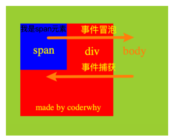
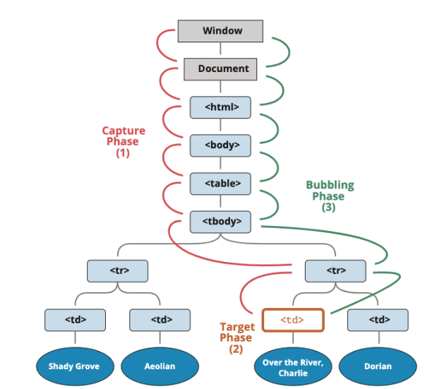

## 认识事件 Event

- Web 页面需要经常和用户之间进行交互，而交互的过程中我们可能想要捕捉这个交互的过程：
  - 比如用户点击了某个按钮、用户在输入框里面输入了某个文本、用户鼠标经过了某个位置；
  - 浏览器需要搭建一条 JavaScript 代码和事件之间的桥梁；
  - 当某个事件发生时，让 JavaScript 可以相应（执行某个函数），所以我们需要针对事件编写处理程序（handler）；
- 如何进行事件监听呢？
  - 事件监听方式一：在 script 中直接监听（很少使用）；
  - 事件监听方式二：DOM 属性，通过元素的 on 来监听事件；
  - 事件监听方式三：通过 EventTarget 中的 addEventListener 来监听；

```html
<div id="box" onclick="alert('box点击')">我是box</div>
<script>
  box.onclick = function () {
    alert("box点击2");
  };
  box.addEventListener("click", function () {
    console.log("box点击3");
  });
</script>
```

## 常见的事件

- 鼠标事件：
  - click —— 当鼠标点击一个元素时（触摸屏设备会在点击时生成）。
  - mouseover / mouseout —— 当鼠标指针移入/离开一个元素时。
  - mousedown / mouseup —— 当在元素上按下/释放鼠标按钮时。
  - mousemove —— 当鼠标移动时。
- 键盘事件：
  - keydown 和 keyup —— 当按下和松开一个按键时。
- 表单（form）元素事件：
  - submit —— 当访问者提交了一个 form 时。
  - focus —— 当访问者聚焦于一个元素时，例如聚焦于一个 input。
- Document 事件：
  - DOMContentLoaded —— 当 HTML 的加载和处理均完成，DOM 被完全构建完成时。
- CSS 事件：
  - transitionend —— 当一个 CSS 动画完成时。

## 认识事件流

- 事实上对于事件有一个概念叫做事件流，为什么会产生事件流呢？
  - 我们可以想到一个问题：当我们在浏览器上对着一个元素点击时，你点击的不仅仅是这个元素本身；
  - 这是因为我们的 HTML 元素是存在父子元素叠加层级的；
  - 比如一个 span 元素是放在 div 元素上的，div 元素是放在 body 元素上的，body 元素是放在 html 元素上的；

```html
<div class="box"><span class="word">hhhh</span></div>
<script>
  // 1.获取元素
  var spanEl = document.querySelector(".word");
  var divEl = document.querySelector(".box");
  var bodyEl = document.body;

  // 添加监听
  spanEl.addEventListener("click", function () {
    console.log("span被点击~");
  });
  divEl.addEventListener("click", function () {
    console.log("div被点击~");
  });
  bodyEl.addEventListener("click", function () {
    console.log("body被点击~");
  });
</script>
```

### 事件冒泡和事件捕获

- 我们会发现默认情况下事件是从最内层的 span 向外依次传递的顺序，这个顺序我们称之为事件冒泡（Event Bubble）;
- 事实上，还有另外一种监听事件流的方式就是从外层到内层（body -> span），这种称之为事件捕获（Event Capture）；
- 为什么会产生两种不同的处理流呢？
  - 这是因为早期浏览器开发时，不管是 IE 还是 Netscape 公司都发现了这个问题;
  - 但是他们采用了完全相反的事件流来对事件进行了传递；
  - IE 采用了事件冒泡的方式，Netscape 采用了事件捕获的方式；
- 那么我们如何去监听事件捕获的过程呢？



```html
<div class="box"><span class="word">hhhh</span></div>
<script>
  // 1.获取元素
  var spanEl = document.querySelector(".word");
  var divEl = document.querySelector(".box");
  var bodyEl = document.body;

  // 添加监听
  spanEl.addEventListener(
    "click",
    function () {
      console.log("span被点击~");
    }.true
  );
  divEl.addEventListener(
    "click",
    function () {
      console.log("div被点击~");
    }.true
  );
  bodyEl.addEventListener(
    "click",
    function () {
      console.log("body被点击~");
    }.true
  );
</script>
```

### 事件捕获和冒泡的过程

- 如果我们都监听，那么会按照如下顺序来执行：

- 捕获阶段（Capturing phase）：

  - 事件（从 Window）向下走近元素。

- 目标阶段（Target phase）：

  - 事件到达目标元素。

- 冒泡阶段（Bubbling phase）：

  - 事件从元素上开始冒泡。

- 事实上，我们可以通过 event 对象来获取当前的阶段：

  - eventPhase

- 开发中通常会使用事件冒泡，所以事件捕获了解即可。

  

## 事件对象 Event

- 当一个事件发生时，就会有和这个事件相关的很多信息：

  - 比如事件的类型是什么，你点击的是哪一个元素，点击的位置是哪里等等相关的信息；
  - 那么这些信息会被封装到一个 Event 对象中，这个对象由浏览器创建，称之为 event 对象；
  - 该对象给我们提供了想要的一些属性，以及可以通过该对象进行某些操作；

- 如何获取这个 event 对象呢？

  - event 对象会在传入的事件处理（event handler）函数回调时，被系统传入；

  - 我们可以在回调函数中拿到这个 event 对象；

    ```js
    spanEl.onclick = function (event) {
      console.log("事件对象:", event);
    };
    spanEl.addEventListener("click", function (event) {
      console.log("事件对象:", event);
    });
    ```

- 这个对象中都有哪些常见的属性和操作呢？

### event 常见的属性和方法

- 常见的属性：
  - type：事件的类型；
  - target：当前事件发生的元素；
  - currentTarget：当前处理事件的元素；
  - eventPhase：事件所处的阶段；
  - offsetX、offsetY：事件发生在元素内的位置；
  - clientX、clientY：事件发生在客户端内的位置；
  - pageX、pageY：事件发生在客户端相对于 document 的位置；
  - screenX、screenY：事件发生相对于屏幕的位置；
- 常见的方法：
  - preventDefault：取消事件的默认行为；
  - stopPropagation：阻止事件的进一步传递（冒泡或者捕获都可以阻止）；

### 事件处理中的 this

- 在函数中，我们也可以通过 this 来获取当前的发生元素：

  ```js
  spanEl.addEventListener("click", function (event) {
    console.log(this === event.target);
  });
  ```

- 这是因为在浏览器内部，调用 event handler 是绑定到当前的 target 上的

## EventTarget 类

- 我们会发现，所有的节点、元素都继承自 EventTarget
  - 事实上 Window 也继承自 EventTarget；
- 那么这个 EventTarget 是什么呢？
  - EventTarget 是一个 DOM 接口，主要用于添加、删除、派发 Event 事件；
- EventTarget 常见的方法：
  - addEventListener：注册某个事件类型以及事件处理函数；
  - removeEventListener：移除某个事件类型以及事件处理函数；
  - dispatchEvent：派发某个事件类型到 EventTarget 上；

```js
spanEl.addEventListener("click", function (event) {
  console.log("点击了span");
});

box.addEventListener("click", function (event) {
  window.dispatckEvent(new Event("mjjh"));
});
window.addEventListener("mjjh", function (event) {
  console.log("监听到mjjh事件:", event);
});
```

## 事件委托（event delegation）

- 事件冒泡在某种情况下可以帮助我们实现强大的事件处理模式 – 事件委托模式（也是一种设计模式）

- 那么这个模式是怎么样的呢？

  - 因为当子元素被点击时，父元素可以通过冒泡可以监听到子元素的点击；
  - 并且可以通过 event.target 获取到当前监听的元素；

- 案例：一个 ul 中存放多个 li，点击某一个 li 会变成红色

  - 方案一：监听每一个 li 的点击，并且做出相应；

  - 方案二：在 ul 中监听点击，并且通过 event.target 拿到对应的 li 进行处理；

    - 因为这种方案并不需要遍历后给每一个 li 上添加事件监听，所以它更加高效；

      ```html
      <ul class="list">
        <li>li</li>
        <li>li</li>
        <li>li</li>
        <li>li</li>
        <li>li</li>
      </ul>
      <script>
        var listEl = document.querySelector(".list");
        var currentActive = null;
        listEl.addEventListener("click", function (event) {
          if (currentActive) currentActive.classList.remove("active");
          event.target.classList.add("active");
          currentActive = event.target;
        });
      </script>
      ```

### 事件委托的标记

- 某些事件委托可能需要对具体的子组件进行区分，这个时候我们可以使用 data-\*对其进行标记：

- 比如多个按钮的点击，区分点击了哪一个按钮：

  ```html
  <div class="btn-list">
    <button data-action="new">新建</button>
    <button data-action="search">搜索</button>
    <button data-action="delete">删除</button>
  </div>
  <script>
    var btnLsit = document.querySelector(".btn-list");
    btnLsit.addEventListener("click", function (event) {
      console.log(event.target.innerText);
    });
  </script>
  ```

## 常见的鼠标事件

- 接下来我们来看一下常见的鼠标事件（不仅仅是鼠标设备，也包括模拟鼠标的设备，比如手机、平板电脑）

- 常见的鼠标事件：

  | 属性        | 描述                                         |
  | ----------- | -------------------------------------------- |
  | click       | 当用户点击某个对象时调用的事件句柄。         |
  | contextmenu | 在用户点击鼠标右键打开上下文菜单时触发       |
  | dblclick    | 当用户双击某个对象时调用的事件句柄。         |
  | mousedown   | 鼠标按钮被按下。                             |
  | mouseup     | 鼠标按键被松开。                             |
  | mouseover   | 鼠标移到某元素之上。（支持冒泡）             |
  | mouseout    | 鼠标从某元素移开。（支持冒泡）               |
  | mouseenter  | 当鼠标指针移动到元素上时触发。（不支持冒泡） |
  | mouseleave  | 当鼠标指针移出元素时触发。（不支持冒泡）     |
  | mousemove   | 鼠标被移动。                                 |

### mouseover 和 mouseenter 的区别

- mouseenter 和 mouseleave

  - 不支持冒泡
  - 进入子元素依然属于在该元素内，没有任何反应

- mouseover 和 mouseout

  - 支持冒泡

  - 进入元素的子元素时

    - 先调用父元素的 mouseout

    - 再调用子元素的 mouseover

    - 因为支持冒泡，所以会将 mouseover 传递到父元素中；

      

## 常见的键盘事件

- 常见的键盘事件：

  | 属性       | 描述                 |
  | ---------- | -------------------- |
  | onkeydown  | 某个键盘按键被按下。 |
  | onkeypress | 某个键盘按键被按下。 |
  | onkeyup    | 某个键盘按键被松开。 |

- 事件的执行顺序是 onkeydown、onkeypress、onkeyup

  - down 事件先发生；
  - press 发生在文本被输入；
  - up 发生在文本输入完成；

- 我们可以通过 key 和 code 来区分按下的键：

  - code：“按键代码”（"KeyA"，"ArrowLeft" 等），特定于键盘上按键的物理位置。
  - key：字符（"A"，"a" 等），对于非字符（non-character）的按键，通常具有与 code 相同的值。）

## 常见的表单事件

- 针对表单也有常见的事件：

  | 属性     | 描述                                                                  |
  | -------- | --------------------------------------------------------------------- |
  | onchange | 该事件在表单元素的内容改变时触发( input, keygen, select, 和 textarea) |
  | oninput  | 元素获取用户输入时触发                                                |
  | onfocus  | 元素获取焦点时触发                                                    |
  | onblur   | 元素失去焦点时触发                                                    |
  | onreset  | 表单重置时触发                                                        |
  | onsubmit | 表单提交时触发                                                        |

## 文档加载事件

- DOMContentLoaded：浏览器已完全加载 HTML，并构建了 DOM 树，但像 img 和样式表之类的外部资源可能尚未加载完成。

- load：浏览器不仅加载完成了 HTML，还加载完成了所有外部资源：图片，样式等。

  ```html
  <div>哈哈哈</div>
  
  <script>
    window.addEventListener("DOMContentLoaded", function () {
      var imgEl = document.querySelector("img");
      console.log("页面加载完毕 ", imgEl.offsetWidth, imgEl.offsetHeight);
    });
    window.addEventListener("load", function () {
      var imgEl = document.querySelector("img");
      console.log(
        "页面所有内容加载完毕 ",
        imgEl.offsetWidth,
        imgEl.offsetHeight
      );
    });
    window.onload = function () {
      console.log("文档中所有资源都加载完毕");
      // var imgEl = document.querySelector("img")
      // console.log("图片的宽度和高度:", imgEl.offsetWidth, imgEl.offsetHeight)
    };
  </script>
  ```

- 事件类型：https://developer.mozilla.org/zh-CN/docs/Web/Events

## window 定时器

### window 定时器方法

- 有时我们并不像立即执行一个函数,而是等待特定一段时间之后再执行,我们称之为"计划调用( scheduling a call )"
- 目前有两种方式可以实现
  - setTimeout 允许我们将函数推迟一段时间间隔之后再执行
  - setInterval 允许我们重复运行一个函数,从一段时间间隔之后开始运行,之后该时间间隔连续重复运行该函数
- 并且通常情况霞有提供队友的取消方法
  - clearTimeout: 取消 setTimeout 的定时器
  - clearInterval: 取消 setInterval 的定时器
- 大多数运行环境都有内置的调度程序,并且提供了这些方法
  - 目前来讲,所有浏览器以及 Node.js 都支持这两个方法

### setTimeout 的使用

- setTimeout 的语法如下：

  ```js
  let timerId = setTimeout(func|code, [delay], [arg1], [arg2], ...)
  ```

- func|code：想要执行的函数或代码字符串。

  - 一般传入的都是函数，由于某些历史原因，支持传入代码字符串，但是不建议这样做；

- delay：执行前的延时，以毫秒为单位（1000 毫秒 = 1 秒），默认值是 0；

- arg1，arg2…：要传入被执行函数（或代码字符串）的参数列表；

- clearTimeout 方法：

  - setTimeout 在调用时会返回一个“定时器标识符（timer identifier）”，我们可以使用它来取消执行。

    ```js
    var timerID = setTimeout(
      function (name, age) {
        console.log("定时器", name, age);
      },
      2000,
      "mjjh",
      18
    );

    clearTimeout(timerID);
    ```

### setInterval 的使用

- setInterval 方法和 setTimeout 的语法相同：

  ```js
  1 1let timerId = setInterval(func|code, [delay], [arg1], [arg2], ...)
  ```

  - 所有参数的意义也是相同的；
  - 不过与 setTimeout 只执行一次不同，setInterval 是每间隔给定的时间周期性执行；

- clearInterval 方法：

  - setInterval 也会返回一个“定时器标识符（timer identifier）”，我们可以通过 clearInterval 来取消这个定时器。

    ```js
    var timerID = setInterval(
      function (name, age) {
        console.log("定时器", name, age);
      },
      10,
      "mjjh",
      18
    );

    clearTimeout(timerID);
    ```
