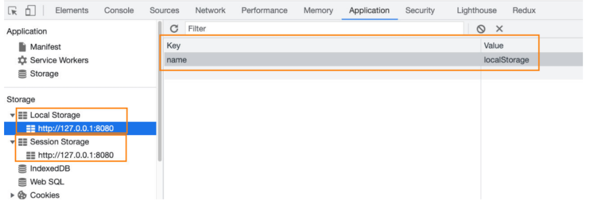

## 认识 Bom

- BOM：浏览器对象模型（Browser Object Model）

  - 简称 BOM，由浏览器提供的用于处理文档（document）之外的所有内容的其他对象；
  - 比如 navigator、location、history 等对象；

- JavaScript 有一个非常重要的运行环境就是浏览器

  - 而且浏览器本身又作为一个应用程序需要对其本身进行操作；
  - 所以通常浏览器会有对应的对象模型（BOM，Browser Object Model）；
  - 我们可以将 BOM 看成是连接 JavaScript 脚本与浏览器窗口的桥梁；

- BOM 主要包括一下的对象模型：

  - window：包括全局属性、方法，控制浏览器窗口相关的属性、方法；

  - location：浏览器连接到的对象的位置（URL）；

  - history：操作浏览器的历史；

  - navigator：用户代理（浏览器）的状态和标识（很少用到）；

  - screen：屏幕窗口信息（很少用到）；

    

## Window

### 认识 window 对象

- window 对象在浏览器中可以从两个视角来看待：
  - 视角一：全局对象。
    - 我们知道 ECMAScript 其实是有一个全局对象的，这个全局对象在 Node 中是 global；
    - 在浏览器中就是 window 对象；
  - 视角二：浏览器窗口对象。
    - 作为浏览器窗口时，提供了对浏览器操作的相关的 API；
- 当然，这两个视角存在大量重叠的地方，所以不需要刻意去区分它们：
  - 事实上对于浏览器和 Node 中全局对象名称不一样的情况，目前已经指定了对应的标准，称之为 globalThis，并且大多数现代
    浏览器都支持它；
  - 放在 window 对象上的所有属性都可以被访问；
  - 使用 var 定义的变量会被添加到 window 对象中；
  - window 默认给我们提供了全局的函数和类：setTimeout、Math、Date、Object 等；
    window 对象

### window 对象的作用

- 事实上 window 对象上肩负的重担是非常大的：
  - 第一：包含大量的属性，localStorage、console、location、history、screenX、scrollX 等等（大概 60+个属性）；
  - 第二：包含大量的方法，alert、close、scrollTo、open 等等（大概 40+个方法）；
  - 第三：包含大量的事件，focus、blur、load、hashchange 等等（大概 30+个事件）；
  - 第四：包含从 EventTarget 继承过来的方法，addEventListener、removeEventListener、dispatchEvent 方法；
- 那么这些大量的属性、方法、事件在哪里查看呢？
  - MDN 文档：https://developer.mozilla.org/zh-CN/docs/Web/API/Window
- 查看 MDN 文档时，我们会发现有很多不同的符号，这里我解释一下是什么意思：
  - 删除符号：表示这个 API 已经废弃，不推荐继续使用了；
  - 点踩符号：表示这个 API 不属于 W3C 规范，某些浏览器有实现（所以兼容性的问题）；
  - 实验符号：该 API 是实验性特性，以后可能会修改，并且存在兼容性问题；

### window 对象内容

#### window 对象常见属性

- 我们来看一下常见的 window 属性：

```JS
// 浏览器高度
console.log(window.outerHeight)
console.log(window.innerHeight)

console.log("screenX:", window.screenX)
console.log("screenX:", window.screenY)

// 监听
window.addEventListener("scroll", (event) => {
  console.log("screenX:", window.screenX)
  console.log("screenX:", window.screenY)
})
```

#### window 对象常见的方法

- 我们来看一下常见的 window 方法：

```js
// close方法
const closeBtn = document.querySelector("#close");
closeBtn.onclick = function () {
  closer();
};

// scrollTo
const scrollBtn = document.querySelector("#scroll");
scrollBtn.onclick = function () {
  scrollTo({ top: 1000 });
};

// 打开新创建
const openBtn = document.querySelector("#open");
openBtn.onclick = function () {
  open("./about.html", "_self");
};
```

#### window 对象常见事件

- 我们来看一下常见的 window 事件：

```JS
window.onfocus = function() {
  console.log("窗口获取到焦点")
}

window.onblur = function() {
  console.log("窗口失去了焦点")
}

// 整个页面以及所有的资源加载完成
window.onload = function() {
  console.log("页面加载完成")
}

// hash改变
const hashBtn = document.querySelector("#hash")
hashBtn.onclick = function() {
  location.hash = "aaa"
}
window.onhashchange = function() {
  console.log("hash被修改了")
}
```

## location

### location 对象常见的属性

- location 对象用于表示 window 上当前链接到的 URL 信息。
- 常见的属性有哪些呢？
  - href: 当前 window 对应的超链接 URL, 整个 URL；
  - protocol: 当前的协议；
  - host: 主机地址；
  - hostname: 主机地址(不带端口)；
  - port: 端口；
  - pathname: 路径；
  - search: 查询字符串；
  - hash: 哈希值；
  - username：URL 中的 username（很多浏览器已经禁用）；
  - password：URL 中的 password（很多浏览器已经禁用）；

### Location 对象常见的方法

- 我们会发现 location 其实是 URL 的一个抽象实现：

  

- location 有如下常用的方法：

  - assign：赋值一个新的 URL，并且跳转到该 URL 中；

  - replace：打开一个新的 URL，并且跳转到该 URL 中（不同的是不会在浏览记录中留下之前的记录）；

  - reload：重新加载页面，可以传入一个 Boolean 类型；

    ```js
    const locationBtn = document.querySelector("#location");
    loactionBtn.onclick = function () {
      location.assign("http://www.baidu.com");
      location.replace("http://www.baidu.com");
      location.reload();
    };
    ```

### URLSearchParams

- URLSearchParams 定义了一些实用的方法来处理 URL 的查询字符串。

  - 可以将一个字符串转化成 URLSearchParams 类型；

  - 也可以将一个 URLSearchParams 类型转成字符串；

    ```js
    var urlsearch = new URLSearchParams("name=mjjh&age=18&height=1.88");
    console.log(urlsearch.get("name")); // mjjh
    console.log(urlsearch.toString()); // name=mjjh&age=18&height=1.88
    ```

- URLSearchParams 常见的方法有如下：

  - get：获取搜索参数的值；
  - set：设置一个搜索参数和值；
  - append：追加一个搜索参数和值；
  - has：判断是否有某个搜索参数；
  - https://developer.mozilla.org/zh-CN/docs/Web/API/URLSearchParams

- 中文会使用 encodeURIComponent 和 decodeURIComponent 进行编码和解码

## history

### history 对象常见属性和方法

- history 对象允许我们访问浏览器曾经的会话历史记录。

- 有两个属性：

  - length：会话中的记录条数；
  - state：当前保留的状态值；

- 有五个方法：

  - back()：返回上一页，等价于 history.go(-1)；
  - forward()：前进下一页，等价于 history.go(1)；
  - go()：加载历史中的某一页；
  - pushState()：打开一个指定的地址；
  - replaceState()：打开一个新的地址，并且使用 replace；

- history 和 hash 目前是 vue、react 等框架实现路由的底层原理，具体的实现方式我会在后续讲解。

  ```js
  console.log(history.lenght);
  console.log(history.state);

  const jumpBtn = document.querySelector("#jump");
  const backBtn = document.querySelector("#back");

  jumpBtn.onclick = function () {
    history.pushState({ name: "mjjh" }, "11", "aaa");
    console.log(history.length, history.state);
  };

  backBtn.onclick = function () {
    history.back;
    console.log(history.length, history.state);
  };
  ```

## 不常见对象

### navigator 对象（很少使用）

- navigator 对象表示用户代理的状态和标识等信息。
  

### screen 对象（很少使用）

- screen 主要记录的是浏览器窗口外面的客户端显示器的信息：
  - 比如屏幕的逻辑像素 screen.width、screen.height；
    

## JSON

### JSON 的历史

- 在目前的开发中，JSON 是一种非常重要的数据格式，它并不是编程语言，而是一种可以在服务器和客户端之间传输的数据格式。
- JSON 的全称是 JavaScript Object Notation（JavaScript 对象符号）：
  - JSON 是由 Douglas Crockford 构想和设计的一种轻量级资料交换格式，算是 JavaScript 的一个子集；
  - 但是虽然 JSON 被提出来的时候是主要应用 JavaScript 中，但是目前已经独立于编程语言，可以在各个编程语言中使用；
  - 很多编程语言都实现了将 JSON 转成对应模型的方式；
- 其他的传输格式：
  - XML：在早期的网络传输中主要是使用 XML 来进行数据交换的，但是这种格式在解析、传输等各方面都弱于 JSON，所以目前已经很
    少在被使用了；
  - Protobuf：另外一个在网络传输中目前已经越来越多使用的传输格式是 protobuf，但是直到 2021 年的 3.x 版本才支持 JavaScript，所以目前在前端使用的较少；
- 目前 JSON 被使用的场景也越来越多：
  - 网络数据的传输 JSON 数据；
  - 项目的某些配置文件；
  - 非关系型数据库（NoSQL）将 json 作为存储格式；

### JSON 的基本语法

- JSON 的顶层支持三种类型的值：

  - 简单值：数字（Number）、字符串（String，不支持单引号）、布尔类型（Boolean）、null 类型；

  - 对象值：由 key、value 组成，key 是字符串类型，并且必须添加双引号，值可以是简单值、对象值、数组值；

  - 数组值：数组的值可以是简单值、对象值、数组值；

    ```json
    // 简单值
    123

    // 对象值
    {
      "name": "mjjh",
      "age" : 18,
      "friend": {
        "name": kobe
      }
    }

    // 数组值
    [
      123,
      "abc",
      {
        "name": "mjjh"
      }
    ]

    ```

### JSON 序列化

- 某些情况下我们希望将 JavaScript 中的复杂类型转化成 JSON 格式的字符串，这样方便对其进行处理：

  - 比如我们希望将一个对象保存到 localStorage 中；

  - 但是如果我们直接存放一个对象，这个对象会被转化成 [object Object] 格式的字符串，并不是我们想要的结果；

    ```js
    const obj = {
      name: "mjjh",
      age: 18,
      friend: {
        name: kobe,
      },
      hobbies: ["篮球", "足球", "乒乓球"],
    };
    ```


### JSON 序列化方法

- 在 ES5 中引用了 JSON 全局对象，该对象有两个常用的方法：
  - stringify 方法：将 JavaScript 类型转成对应的 JSON 字符串；
  - parse 方法：解析 JSON 字符串，转回对应的 JavaScript 类型；
- 那么上面的代码我们可以通过如下的方法来使用：

```js
// 转成字符串保存
const objString = JSON.stringify(obj);
localStorage.setItem("info", objString);

// 获取字符串转回对象
const itemString = localStorage.getItem("info");
const info = JSON.parse(itemString);
console.log(info);
```

### JSON.stringify 的参数 replace

- JSON.stringify() 方法将一个 JavaScript 对象或值转换为 JSON 字符串：
  - 如果指定了一个 replacer 函数，则可以选择性地替换值；
  - 如果指定的 replacer 是数组，则可选择性地仅包含数组指定的属性；
    Stringify 的参数 replace

```js
// 转成字符串
const objString1 = JSON.stringify(obj)
console.log(objString1)
// {"name":"mjjh","age":"18","friend":{"name":"kobe"},"habbies":["篮球","足球","乒乓球"]}

// replace参数是一个数组
const objString2 = JSON.stringify(obj,["name"],"age")
console.log(objString2)
// {"name":"mjjh","age":"18"}

// replace参数是一个函数
const objString3 = JSON.stringify(obj, {key, value} => {
	console.log(key, value)
	if (key === "name"){
		return "mjr"
	}
	return value
})
// {"name":"mjr","age":"18","friend":{"name":"mjr"},"habbies":["篮球","足球","乒乓球"]}
```

### JSON.stringify 的参数 space

- 如果对象本身包含 toJSON 方法，那么会直接使用 toJSON 方法的结果：

  ```js
  const obj = {
    name: "mjjh",
    age: 18,
    friend: {
      name: kobe,
    },
    hobbies: ["篮球", "足球", "乒乓球"],
    toJSON: function () {
      return "mjjh";
    },
  };

  const objString5 = JSON.stringify(obj);
  console.log(objString5);
  ```

### JSON.parse 方法

- JSON.parse() 方法用来解析 JSON 字符串，构造由字符串描述的 JavaScript 值或对象。

  - 提供可选的 reviver 函数用以在返回之前对所得到的对象执行变换(操作)。

    ```js
    // 转回对象, 并且转换某些值
    const info2 = JSON.parse(objString, (key, value) => {
      if (key === "time") {
        return new Date(value);
      }
      return value;
    });
    console.log(info2);
    ```

- JSON 的方法可以帮我们实现对象的深拷贝：

  - 但是目前我们还没有了解什么是对象的拷贝、浅拷贝、深拷贝的概念；
  - 我们会在 JavaScript 高级中学习；

## Storage

### 认识 Storage

- WebStorage 主要提供了一种机制，可以让浏览器提供一种比 cookie 更直观的 key、value 存储方式：
  - localStorage：本地存储，提供的是一种永久性的存储方法，在关闭掉网页重新打开时，存储的内容依然保留；
  - sessionStorage：会话存储，提供的是本次会话的存储，在关闭掉会话时，存储的内容会被清除；

```js
loackStorage.setTtem("name", "localStorage");
sessionStorage.setTtem("name", "sessionStorage");
```



### localStorage 和 sessionStorage 的区别

- 们会发现 localStorage 和 sessionStorage 看起来非常的相似。
- 那么它们有什么区别呢？
  - 验证一：关闭网页后重新打开，localStorage 会保留，而 sessionStorage 会被删除；
  - 验证二：在页面内实现跳转，localStorage 会保留，sessionStorage 也会保留；
  - 验证三：在页面外实现跳转（打开新的网页），localStorage 会保留，sessionStorage 不会被保留；

### Storage 常见的方法和属性

- Storage 有如下的属性和方法：
- 属性：
  - Storage.length：只读属性
    - 返回一个整数，表示存储在 Storage 对象中的数据项数量；
- 方法：
  - Storage.key()：该方法接受一个数值 n 作为参数，返回存储中的第 n 个 key 名称；
  - Storage.getItem()：该方法接受一个 key 作为参数，并且返回 key 对应的 value；
  - Storage.setItem()：该方法接受一个 key 和 value，并且将会把 key 和 value 添加到存储中。
    - 如果 key 存储，则更新其对应的值；
  - Storage.removeItem()：该方法接受一个 key 作为参数，并把该 key 从存储中删除；
  - Storage.clear()：该方法的作用是清空存储中的所有 key；
