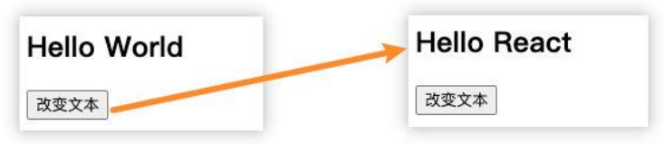

# 邂逅 React 开发

## React 的介绍和特点

### React 介绍 (技术角度)

- React 是什么？
  - React：用于构建用户界面的 JavaScript 库；
  - React 的官网文档：https://zh-hans.reactjs.org/
    

### React 的特点 – 声明式编程

- 声明式编程：
  - 声明式编程是目前整个大前端开发的模式：Vue、React、Flutter、SwiftUI；
  - 它允许我们只需要维护自己的状态，当状态改变时，React 可以根据最新的状态去渲染我们的 UI 界面；
  - UI = 函数(状态)


### React 特点 – 组件化开发

- 组件化开发：
  - 组件化开发页面目前前端的流行趋势，我们会将复杂的界面拆分成一个个小的组件；
  - 如何合理的进行组件的划分和设计也是后面我会讲到的一个重点；
    

### React 的特点 – 多平台适配

- 多平台适配：

  - 2013 年，React 发布之初主要是开发 Web 页面；
  - 2015 年，Facebook 推出了 ReactNative，用于开发移动端跨平台；（虽然目前 Flutter 非常火爆，但是还是有很多公司在使用
    ReactNative）；
  - 2017 年，Facebook 推出 ReactVR，用于开发虚拟现实 Web 应用程序；（VR 也会是一个火爆的应用场景）；

  

### Hello React 案例说明

- 为了演练 React，我们可以提出一个小的需求：
  - 在界面显示一个文本：Hello World
  - 点击下方的一个按钮，点击后文本改变为 Hello React
- 当然，你也可以使用 jQuery 和 Vue 来实现，甚至是原生方式来实现，对它们分别进行对比学习
  

## React 的开发依赖分析

### React 的开发依赖

- 开发 React 必须依赖三个库：
  - react：包含 react 所必须的核心代码
  - react-dom：react 渲染在不同平台所需要的核心代码
  - babel：将 jsx 转换成 React 代码的工具
- 第一次接触 React 会被它繁琐的依赖搞蒙，居然依赖这么多东西： （直接放弃？）
  - 对于 Vue 来说，我们只是依赖一个 vue.js 文件即可，但是 react 居然要依赖三个包。
  - 其实呢，这三个库是各司其职的，目的就是让每一个库只单纯做自己的事情;
  - 在 React 的 0.14 版本之前是没有 react-dom 这个概念的，所有功能都包含在 react 里；
- 为什么要进行拆分呢？原因就是 react-native。
  - react 包中包含了 react web 和 react-native 所共同拥有的核心代码。
  - react-dom 针对 web 和 native 所完成的事情不同：
    - web 端：react-dom 会将 jsx 最终渲染成真实的 DOM，显示在浏览器中
    - native 端：react-dom 会将 jsx 最终渲染成原生的控件（比如 Android 中的 Button，iOS 中的 UIButton）。

### Babel 和 React 的关系

- babel 是什么呢？
  - Babel ，又名 Babel.js。
  - 是目前前端使用非常广泛的编译器、转移器。
  - 比如当下很多浏览器并不支持 ES6 的语法，但是确实 ES6 的语法非常的简洁和方便，我们开发时希望使用它。
  - 那么编写源码时我们就可以使用 ES6 来编写，之后通过 Babel 工具，将 ES6 转成大多数浏览器都支持的 ES5 的语法。
- React 和 Babel 的关系：
  - 默认情况下开发 React 其实可以不使用 babel。
  - 但是前提是我们自己使用 React.createElement 来编写源代码，它编写的代码非常的繁琐和可读性差。
  - 那么我们就可以直接编写 jsx（JavaScript XML）的语法，并且让 babel 帮助我们转换成 React.createElement。

### React 的依赖引入

- 所以，我们在编写 React 代码时，这三个依赖都是必不可少的。

- 那么，如何添加这三个依赖：

  - 方式一：直接 CDN 引入
  - 方式二：下载后，添加本地依赖
  - 方式三：通过 npm 管理（后续脚手架再使用）

- 暂时我们直接通过 CDN 引入，来演练下面的示例程序：

  - 这里有一个 crossorigin 的属性，这个属性的目的是为了拿到跨域脚本的错误信息

    ```html
    <script src="https://unpkg.com/react@18/umd/react.development.js" crossorigin></script>
    <script src="https://unpkg.com/react-dom@18/umd/react-dom.development.js" crossorigin></script>
    <script src="https://unpkg.com/babel-standalone@6/babel.min.js"></script>
    ```

## Hello World

- 第一步：在界面上通过 React 显示一个 Hello World

  - 注意：这里我们编写 React 的 script 代码中，必须添加 type="text/babel"，作用是可以让 babel 解析 jsx 的语法

    ```jsx
    <!DOCTYPE html>
    <html lang="en">
      <head>
        <meta charset="UTF-8" />
        <meta http-equiv="X-UA-Compatible" content="IE=edge" />
        <meta name="viewport" content="width=device-width, initial-scale=1.0" />
        <title>Document</title>
      </head>
      <body>
        <div id="app"></div>
        <script src="https://unpkg.com/react@18/umd/react.development.js"></script>
        <script src="https://unpkg.com/react-dom@18/umd/react-dom.development.js"></script>
        <script src="https://unpkg.com/babel-standalone@6/babel.min.js"></script>
        <script type="text/babel">
          // 1 定义文章
          const message = "Hello World";
          // 2 渲染内容
          const root = ReactDOM.createRoot(document.querySelector("#app"));
          root.render(<h2>{message}</h2>);
        </script>
      </body>
    </html>
    ```

- ReactDOM. createRoot 函数：用于创建一个 React 根，之后渲染的内容会包含在这个根中
  - 参数：将渲染的内容，挂载到哪一个 HTML 元素上
    - 这里我们已经提定义一个 id 为 app 的 div
- root.render 函数:
  - 参数：要渲染的根组件
- 我们可以通过{ }语法来引入外部的变量或者表达式

### Hello React – 错误做法

```jsx
<!DOCTYPE html>
<html lang="en">
  <head>
    <meta charset="UTF-8" />
    <meta http-equiv="X-UA-Compatible" content="IE=edge" />
    <meta name="viewport" content="width=device-width, initial-scale=1.0" />
    <title>Document</title>
  </head>
  <body>
    <div id="app">
      <!-- <button class="btn">按钮</button> -->
    </div>
    <!-- 不能将按钮写扎起对应的根元素中 react会对其中内容进行替换 -->
    <button class="btn">按钮</button>
    <script src="https://unpkg.com/react@18/umd/react.development.js"></script>
    <script src="https://unpkg.com/react-dom@18/umd/react-dom.development.js"></script>
    <script src="https://unpkg.com/babel-standalone@6/babel.min.js"></script>
    <script type="text/babel">
      // 1 定义文章
      const message = "Hello World";
      // 2 渲染内容
      const root = ReactDOM.createRoot(document.querySelector("#app"));
      root.render(<h2>{message}</h2>);
      // 3 监听按钮的点击
      const btnEl = document.querySelector(".btn");
      btnEl.onclick = function () {
        root.render(<h2>Hello React</h2>);
      };
    </script>
  </body>
</html>
```

### Hello React – 正确做法

```jsx
<!DOCTYPE html>
<html lang="en">
  <head>
    <meta charset="UTF-8" />
    <meta http-equiv="X-UA-Compatible" content="IE=edge" />
    <meta name="viewport" content="width=device-width, initial-scale=1.0" />
    <title>Document</title>
  </head>
  <body>
    <div id="app"></div>
    <script src="https://unpkg.com/react@18/umd/react.development.js"></script>
    <script src="https://unpkg.com/react-dom@18/umd/react-dom.development.js"></script>
    <script src="https://unpkg.com/babel-standalone@6/babel.min.js"></script>
    <script type="text/babel">
      // 1 定义文章
      let message = "Hello World";
      const btnClick = () => {
        message = "Hello React";
        rootRender();
      };
      // 2 渲染内容
      const root = ReactDOM.createRoot(document.querySelector("#app"));

      function rootRender() {
        root.render(
          <div>
            <h2>{message}</h2>
            // onClick
            <button onClick={btnClick}>修改文本</button>
          </div>
        );
      }
      rootRender();
    </script>
  </body>
</html>
```

## Hello React – 组件化开发

- 整个逻辑其实可以看做一个整体，那么我们就可以将其封装成一个组件：
  - 我们说过 root.render 参数是一个 HTML 元素或者一个组件；
  - 所以我们可以先将之前的业务逻辑封装到一个组件中，然后传入到 ReactDOM.render 函数中的第一个参数；

- 在 React 中，如何封装一个组件呢？这里我们暂时使用类的方式封装组件：
  1. 定义一个类（类名大写，组件的名称是必须大写的，小写会被认为是 HTML 元素），继承自 React.Component
  2. 实现当前组件的 render 函数
  - render 当中返回的 jsx 内容，就是之后 React 会帮助我们渲染的内容

  ```jsx
  <!DOCTYPE html>
  <html lang="en">
    <head>
      <meta charset="UTF-8" />
      <meta http-equiv="X-UA-Compatible" content="IE=edge" />
      <meta name="viewport" content="width=device-width, initial-scale=1.0" />
      <title>Document</title>
    </head>
    <body>
      <div id="app"></div>
      <script src="https://unpkg.com/react@18/umd/react.development.js"></script>
      <script src="https://unpkg.com/react-dom@18/umd/react-dom.development.js"></script>
      <script src="https://unpkg.com/babel-standalone@6/babel.min.js"></script>
      <script type="text/babel">
        // 1 定义根组件
        class App extends React.Component {
          render() {
            return <h2>Hello World</h2>;
          }
        }
        // 2 渲染根组件
        const root = ReactDOM.createRoot(document.querySelector("#app"));
        root.render(<App />);
      </script>
    </body>
  </html>
  ```

### 组件化 - 数据依赖

组件化问题一：数据在哪里定义？

- 在组件中的数据，我们可以分成两类：
  - 参与界面更新的数据：当数据变量时，需要更新组件渲染的内容；
  - 不参与界面更新的数据：当数据变量时，不需要更新将组建渲染的内容；
- 参与界面更新的数据我们也可以称之为是参与数据流，这个数据是定义在当前对象的 state 中
  - 我们可以通过在构造函数中 this.state = {定义的数据}
  - 当我们的数据发生变化时，我们可以调用 this.setState 来更新数据，并且通知 React 进行 update 操作；
    - 在进行 update 操作时，就会重新调用 render 函数，并且使用最新的数据，来渲染界面

```jsx
<!DOCTYPE html>
<html lang="en">
  <head>
    <meta charset="UTF-8" />
    <meta http-equiv="X-UA-Compatible" content="IE=edge" />
    <meta name="viewport" content="width=device-width, initial-scale=1.0" />
    <title>Document</title>
  </head>
  <body>
    <div id="app"></div>
    <script src="https://unpkg.com/react@18/umd/react.development.js"></script>
    <script src="https://unpkg.com/react-dom@18/umd/react-dom.development.js"></script>
    <script src="https://unpkg.com/babel-standalone@6/babel.min.js"></script>
    <script type="text/babel">
      // 1 定义根组件
      class App extends React.Component {
        render() {
          return (
            <div>
              <h2>message:{this.state.message}</h2>
            </div>
          );
        }
        constructor() {
          super();
          this.state = {
            message: "Hello World",
          };
        }
      }
      // 2 渲染根组件
      const root = ReactDOM.createRoot(document.querySelector("#app"));
      root.render(<App />);
    </script>
  </body>
</html>

```

### 组件化 – 事件绑定

- 组件化问题二：事件绑定中的 this

  - 在类中直接定义一个函数，并且将这个函数绑定到元素的 onClick 事件上，当前这个函数的 this 指向的是谁呢？

- 默认情况下是 undefined
  - 很奇怪，居然是 undefined；
  - 因为在正常的 DOM 操作中，监听点击，监听函数中的 this 其实是节点对象（比如说是 button 对象）；
  - 这次因为 React 并不是直接渲染成真实的 DOM，我们所编写的 button 只是一个语法糖，它的本质 React 的 Element 对象；
  - 那么在这里发生监听的时候，react 在执行函数时并没有绑定 this，默认情况下就是一个 undefined；

- 我们在绑定的函数中，可能想要使用当前对象，比如执行 this.setState 函数，就必须拿到当前对象的 this
  - 我们就需要在传入函数时，给这个函数直接绑定 this

  - 类似于下面的写法： 
    
    ```html
    // html
    <div>
      <h2>{this.state.message}</h2>
      <button onClick={this.changeText.bind(this)}>改变文本</button>
    </div>
    
    // js
    changeText() {
    	console.log(this)
    }
    ```

### 电影列表展示

```jsx
<!DOCTYPE html>
<html lang="en">
  <head>
    <meta charset="UTF-8" />
    <meta http-equiv="X-UA-Compatible" content="IE=edge" />
    <meta name="viewport" content="width=device-width, initial-scale=1.0" />
    <title>Document</title>
  </head>
  <body>
    <div id="app"></div>
    <script src="https://unpkg.com/react@18/umd/react.development.js"></script>
    <script src="https://unpkg.com/react-dom@18/umd/react-dom.development.js"></script>
    <script src="https://unpkg.com/babel-standalone@6/babel.min.js"></script>
    <script type="text/babel">
      // 1 定义根组件
      class App extends React.Component {
        constructor() {
          super();
          this.state = {
            message: "Hello World",
            movies: ["大话西游", "树先生", "让子弹飞", "哈利波特"],
          };
        }
        render() {
          return (
            <ul>
              {this.state.movies.map((item) => {
                return <li key={item}>{item}</li>;
              })}
            </ul>
          );
        }
      }
      // 2 渲染根组件
      const root = ReactDOM.createRoot(document.querySelector("#app"));
      root.render(<App />);
    </script>
  </body>
</html>

```

### 计数器案例

```jsx
<!DOCTYPE html>
<html lang="en">
  <head>
    <meta charset="UTF-8" />
    <meta http-equiv="X-UA-Compatible" content="IE=edge" />
    <meta name="viewport" content="width=device-width, initial-scale=1.0" />
    <title>Document</title>
  </head>
  <body>
    <div id="app"></div>
    <script src="https://unpkg.com/react@18/umd/react.development.js"></script>
    <script src="https://unpkg.com/react-dom@18/umd/react-dom.development.js"></script>
    <script src="https://unpkg.com/babel-standalone@6/babel.min.js"></script>
    <script type="text/babel">
      // 1 定义根组件
      class App extends React.Component {
        constructor() {
          super();
          this.state = {
            counter: 0,
          };
        }
        render() {
          const { counter } = this.state;
          return (
            <div>
              <h2>当前计数: {counter}</h2>
              <button onClick={this.increment.bind(this)}>+1</button>
              <button onClick={this.decrement.bind(this)}>-1</button>
            </div>
          );
        }
        increment() {
          this.setState({
            counter: this.state.counter + 1,
          });
        }
        decrement() {
          this.setState({
            counter: this.state.counter - 1,
          });
        }
      }

      // 2 渲染根组件
      const root = ReactDOM.createRoot(document.querySelector("#app"));
      root.render(<App />);
    </script>
  </body>
</html>
```

## VSCode 代码片段

- 我们在前面练习 React 的过程中，有些代码片段是需要经常写的，我们在 VSCode 中我们可以生成一个代码片段，方便我们快速生成。
- VSCode 中的代码片段有固定的格式，所以我们一般会借助于一个在线工具来完成。
- 具体的步骤如下：
  - 第一步，复制自己需要生成代码片段的代码；
  - 第二步，https://snippet-generator.app/在该网站中生成代码片段；
  - 第三步，在 VSCode 中配置代码片段；
    

### 代码片段过程


- 选择对应的文件,例如现在就是HTML文件
- 将网站生成的代码粘贴到对应的HTML文件中
