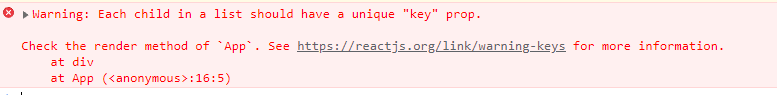
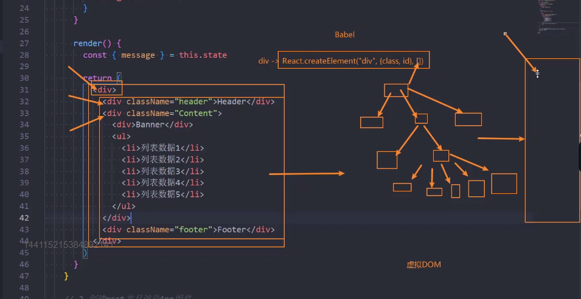
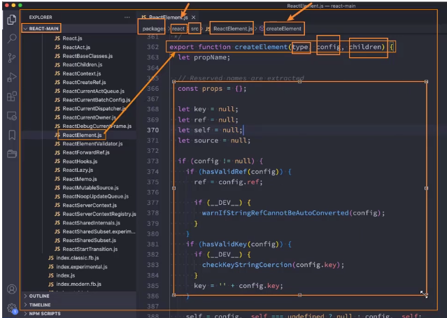
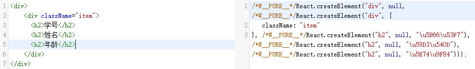
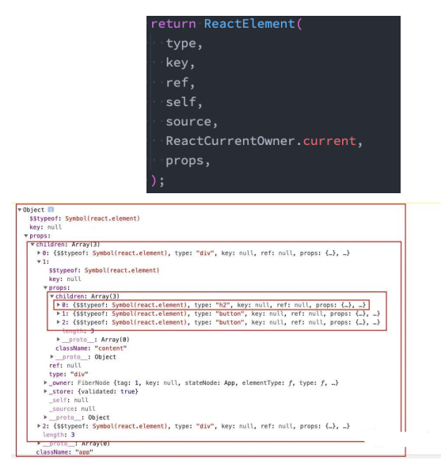
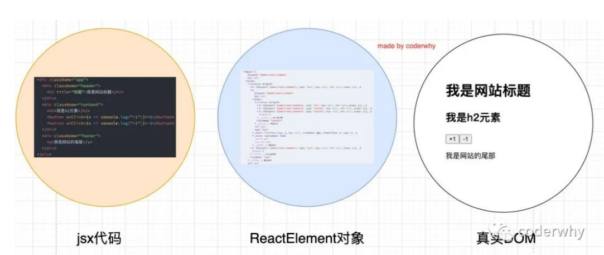
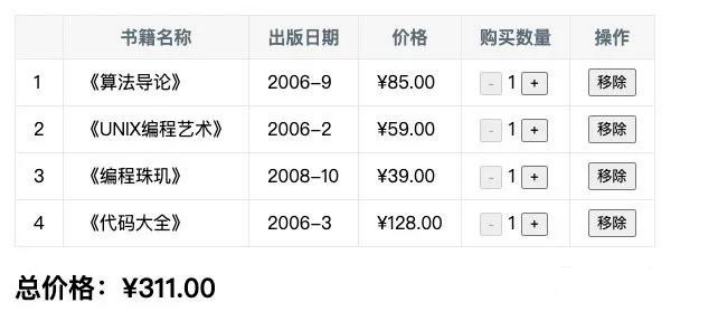

# JSX语法

## 认识JSX语法

### 认识JSX

```jsx
// 1.定义根组件
const element = <div>Hello World</div>
// 2.动态渲染根组件
const root = ReactDOM.createRoot(document.querySelector('#root'))
root.render(element)
```

- 这段 element 变量的声明右侧赋值的标签语法是什么呢？
  - 它不是一段字符串（因为没有使用引号包裹）；
  - 它看起来是一段HTML元素，但是我们能在js中直接给一个变量赋值html吗？
  - 其实是不可以的，如果我们将 type="text/babel" 去除掉，那么就会出现语法错误；
  - 它到底是什么呢？其实它是一段jsx的语法；
- JSX是什么？
  - JSX是一种JavaScript的语法扩展（eXtension），也在很多地方称之为JavaScript XML，因为看起就是一段XML语法；
  - 它用于描述我们的UI界面，并且其完成可以和JavaScript融合在一起使用；
  - 它不同于Vue中的模块语法，你不需要专门学习模块语法中的一些指令（比如v-for、v-if、v-else、v-bind）；


### 为什么React选择了JSX

- React认为渲染逻辑本质上与其他UI逻辑存在内在耦合
  - 比如UI需要绑定事件（button、a原生等等）；
  - 比如UI中需要展示数据状态；
  - 比如在某些状态发生改变时，又需要改变UI；
- 他们之间是密不可分，所以React没有将标记分离到不同的文件中，而是将它们组合到了一起，这个地方就是组件（Component）；
  - 当然，后面我们还是会继续学习更多组件相关的东西；
- 在这里，我们只需要知道，JSX其实是嵌入到JavaScript中的一种结构语法；

### JSX的书写规范

- JSX的顶层只能有一个根元素，所以我们很多时候会在外层包裹一个div元素（或者使用后面我们学习的Fragment）；
- 为了方便阅读，我们通常在jsx的外层包裹一个小括号()，这样可以方便阅读，并且jsx可以进行换行书写；
- JSX中的标签可以是单标签，也可以是双标签；
  - 注意：如果是单标签，必须以/>结尾；

## JSX的基本使用


### jsx中的注释

```jsx
<!DOCTYPE html>
<html lang="en">
  <head>
    <meta charset="UTF-8" />
    <meta http-equiv="X-UA-Compatible" content="IE=edge" />
    <meta name="viewport" content="width=device-width, initial-scale=1.0" />
    <title>Document</title>
  </head>
  <body>
    <div id="app"></div>
    <script src="https://unpkg.com/react@18/umd/react.development.js"></script>
    <script src="https://unpkg.com/react-dom@18/umd/react-dom.development.js"></script>
    <script src="https://unpkg.com/babel-standalone@6/babel.min.js"></script>
    <script type="text/babel">
      // 1 定义根组件
      class App extends React.Component {
        constructor() {
          super();
          this.state = {
            message: "Hello World",
          };
        }
        render() {
          return (
            <div>
              { /*JSX的注释写法*/ }
              <h2>message:{this.state.message}</h2>
            </div>
          );
        }
      }
      // 2 渲染根组件
      const root = ReactDOM.createRoot(document.querySelector("#app"));
      root.render(<App />);
    </script>
  </body>
</html>
```

### JSX嵌入变量作为子元素

- 情况一：当变量是Number、String、Array类型时，可以直接显示
- 情况二：当变量是null、undefined、Boolean类型时，内容为空；
  - 如果希望可以显示null、undefined、Boolean，那么需要转成字符串；
  - 转换的方式有很多，比如toString方法、和空字符串拼接，String(变量)等方式；
- 情况三：Object对象类型不能作为子元素（not valid as a React child）

```jsx
<!DOCTYPE html>
<html lang="en">
  <head>
    <meta charset="UTF-8" />
    <meta http-equiv="X-UA-Compatible" content="IE=edge" />
    <meta name="viewport" content="width=device-width, initial-scale=1.0" />
    <title>Document</title>
  </head>
  <body>
    <div id="app"></div>
    <script src="https://unpkg.com/react@18/umd/react.development.js"></script>
    <script src="https://unpkg.com/react-dom@18/umd/react-dom.development.js"></script>
    <script src="https://unpkg.com/babel-standalone@6/babel.min.js"></script>
    <script type="text/babel">
      // 1 定义根组件
      class App extends React.Component {
        constructor() {
          super();
          this.state = {
            message: "Hello World",
            name: ["abc", "cba", "bac"],
            a: undefined,
            b: null,
            c: true,
            friend: { name: "mjr", age: "28" },
          };
        }
        render() {
          const { message, name } = this.state;
          const { a, b, c, friend } = this.state;

          return (
            <div>
              {/* 1.Number/String/Array 直接显示出来 */}
              <h2>message:{message}</h2>
              <h2>name:{name}</h2>

              {/* 2.undefined/null/Boolean 不会直接显示出来 */}
              <h2>a:{a}</h2>
              <h2>b:{b}</h2>
              <h2>c:{c}</h2>

              {/* 3.undefined/null/Boolean 需要转换成string显示出来 */}
              <h2>a:{a + ""}</h2>
              <h2>b:{String(b)}</h2>
              <h2>c:{c.toString()}</h2>
              {/* 4.Object类型不能作为子元素镜像显示 */}
              {/* <h2>friend:{friend}</h2> */}
              <h2>friend:{friend.name}</h2>
              <h2>friend:{Object.keys(friend)[1]}</h2>
            </div>
          );
        }
      }
      // 2 渲染根组件
      const root = ReactDOM.createRoot(document.querySelector("#app"));
      root.render(<App />);
    </script>
  </body>
</html>
```

### JSX嵌入表达式

- 运算表达式
- 三元运算符
- 执行一个函数

```jsx
<!DOCTYPE html>
<html lang="en">
  <head>
    <meta charset="UTF-8" />
    <meta http-equiv="X-UA-Compatible" content="IE=edge" />
    <meta name="viewport" content="width=device-width, initial-scale=1.0" />
    <title>Document</title>
  </head>
  <body>
    <div id="app"></div>
    <script src="https://unpkg.com/react@18/umd/react.development.js"></script>
    <script src="https://unpkg.com/react-dom@18/umd/react-dom.development.js"></script>
    <script src="https://unpkg.com/babel-standalone@6/babel.min.js"></script>
    <script type="text/babel">
      // 1 定义根组件
      class App extends React.Component {
        constructor() {
          super();
          this.state = {
            message: "Hello World",
            name: "mjjh",
            age: 20,
            movies: ["大话西游", "树先生", "让子弹飞", "哈利波特"],
          };
        }
        render() {
          const { message, name, age, movies } = this.state;
          const liEls = this.state.movies.map((movie) => <li>{movie}</li>);

          return (
            <div>
              {/* 插入对应的表达式 */}
              <h2>add:{10 + 20}</h2>
              <h2>name:{message + name}</h2>
              {/* 插入三元运算符 */}
              <h2>age:{age >= 18 ? "成年人" : "未成年人"}</h2>
              {/* 插入方法 */}
              <ul>movies:{liEls}</ul>
              <ul>
                movies:
                {this.state.movies.map((movie) => (
                  <li>{movie}</li>
                ))}
              </ul>
              <ul>movies:{this.getMovieEls()}</ul>
            </div>
          );
        }
        getMovieEls() {
          const liEls = this.state.movies.map((movie) => <li>{movie}</li>);
          return liEls;
        }
      }
      // 2 渲染根组件
      const root = ReactDOM.createRoot(document.querySelector("#app"));
      root.render(<App />);
    </script>
  </body>
</html>
```

### jsx绑定属性

- 比如元素都会有title属性
- 比如img元素会有src属性
- 比如a元素会有href属性
- 比如元素可能需要绑定class
- 比如原生使用内联样式style

```jsx
<!DOCTYPE html>
<html lang="en">
  <head>
    <meta charset="UTF-8" />
    <meta http-equiv="X-UA-Compatible" content="IE=edge" />
    <meta name="viewport" content="width=device-width, initial-scale=1.0" />
    <title>Document</title>
  </head>
  <body>
    <div id="app"></div>
    <script src="https://unpkg.com/react@18/umd/react.development.js"></script>
    <script src="https://unpkg.com/react-dom@18/umd/react-dom.development.js"></script>
    <script src="https://unpkg.com/babel-standalone@6/babel.min.js"></script>
    <script type="text/babel">
      // 1 定义根组件
      class App extends React.Component {
        constructor() {
          super();
          this.state = {
            message: "aaaaa",
            imgUrl:
              "https://www.codermjjh.cn/usr/themes/Akina/images/akina.png",
            href: "https://www.codermjjh.cn",
            isActive: true,
          };
        }
        render() {
          const { message, imgUrl, href, isActive } = this.state;
          const className = `abc cba ${isActive ? "active" : ""}`;
          const classList = ["abc", "cba"];
          if (isActive) classList.push("active");

          return (
            <div>
              {/* 1.基本绑定 */}
              <h2 title="hhhh">h2</h2>
              <h2 title={message}>h2</h2>
              
              <a href={href}>codermjjh</a>

              {/* 2.绑定class属性,最好使用className */}
              <h2 class="abc cba">h2</h2>
              {/* 可以识别但是会报错,因为此处代码本质上还是jsx代码 */}
              <h2 className="abc cba">h2</h2>
              <h2 className={`abc cba ${isActive ? "active" : ""}`}>h2</h2>
              <h2 className={className}>h2</h2>
              <h2 className={classList.join(" ")}>h2</h2>
              {/* 3.绑定style属性,不能直接使用属性 */}
              <h2 style={{ color: "red", fontSize: "19px" }}>h2</h2>
            </div>
          );
        }
      }

      // 2 渲染根组件
      const root = ReactDOM.createRoot(document.querySelector("#app"));
      root.render(<App />);
    </script>
  </body>
</html>

```

## JSX的事件绑定

### React事件绑定

- 如果原生DOM原生有一个监听事件，我们可以如何操作呢？
  - 方式一：获取DOM原生，添加监听事件；
  - 方式二：在HTML原生中，直接绑定onclick；
- 在React中是如何操作呢？我们来实现一下React中的事件监听，这里主要有两点不同
  - React 事件的命名采用小驼峰式（camelCase），而不是纯小写；
  - 我们需要通过{}传入一个事件处理函数，这个函数会在事件发生时被执行；


### this的绑定问题

- 在事件执行后，我们可能需要获取当前类的对象中相关的属性，这个时候需要用到this
  - 如果我们这里直接打印this，也会发现它是一个undefined
- 为什么是undefined呢？
  - 原因是btnClick函数并不是我们主动调用的，而且当button发生改变时，React内部调用了btnClick函数；
  - 而它内部调用时，并不知道要如何绑定正确的this；
- 如何解决this的问题呢？
  - 方案一：bind给btnClick显示绑定this
  - 方案二：使用 ES6 class fields 语法
  - 方案三：事件监听时传入箭头函数（个人推荐）

```jsx
<!DOCTYPE html>
<html lang="en">
  <head>
    <meta charset="UTF-8" />
    <meta http-equiv="X-UA-Compatible" content="IE=edge" />
    <meta name="viewport" content="width=device-width, initial-scale=1.0" />
    <title>Document</title>
  </head>
  <body>
    <div id="app"></div>
    <script src="https://unpkg.com/react@18/umd/react.development.js"></script>
    <script src="https://unpkg.com/react-dom@18/umd/react-dom.development.js"></script>
    <script src="https://unpkg.com/babel-standalone@6/babel.min.js"></script>
    <script type="text/babel">
      // 1 定义根组件
      class App extends React.Component {
        constructor() {
          super();
          this.state = {
            counter: 100,
          };
        }
        btnClick1() {
          this.setState({
            counter: this.state.counter + 1,
          });
        }
        btnClick2 = () => {
          this.setState({
            counter: this.state.counter + 1,
          });
        };
        btnClick3() {
          this.setState({
            counter: this.state.counter + 1,
          });
        }
        render() {
          const { counter } = this.state;
          return (
            <div>
              <h2>当前计数: {counter}</h2>
              {/* 使用bind绑定 */}
              <button onClick={this.btnClick1.bind(this)}>按钮1</button>
              {/* 使用箭头函数,由于箭头函数本身没有绑定this,所以回去其上层作用域寻找,上层作用域就是当前的App对象 */}
              <button onClick={this.btnClick2}>按钮2</button>
              {/* 直接再代码中使用箭头函数,被调用的函数中的this会隐身绑定到当前箭头函数的this上 */}
              <button onClick={() => this.btnClick3()}>按钮3</button>
            </div>
          );
        }
      }

      // 2 渲染根组件
      const root = ReactDOM.createRoot(document.querySelector("#app"));
      root.render(<App />);
    </script>
  </body>
</html>
```

### 事件参数传递

- 在执行事件函数时，有可能我们需要获取一些参数信息：比如event对象、其他参数

- 情况一：获取event对象
  - 很多时候我们需要拿到event对象来做一些事情（比如阻止默认行为）
  - 那么默认情况下，event对象有被直接传入，函数就可以获取到event对象；

- 情况二：获取更多参数
  - 有更多参数时，我们最好的方式就是传入一个箭头函数，主动执行的事件函数，并且传入相关的其他参数；

    ```jsx
    <!DOCTYPE html>
    <html lang="en">
      <head>
        <meta charset="UTF-8" />
        <meta http-equiv="X-UA-Compatible" content="IE=edge" />
        <meta name="viewport" content="width=device-width, initial-scale=1.0" />
        <title>Document</title>
      </head>
      <body>
        <div id="app"></div>
        <script src="https://unpkg.com/react@18/umd/react.development.js"></script>
        <script src="https://unpkg.com/react-dom@18/umd/react-dom.development.js"></script>
        <script src="https://unpkg.com/babel-standalone@6/babel.min.js"></script>
        <script type="text/babel">
          // 1 定义根组件
          class App extends React.Component {
            constructor() {
              super();
              this.state = {
                counter: 0,
              };
            }
            render() {
              const { counter } = this.state;
              return (
                <div>
                  <h2>当前计数: {counter}</h2>
                  {/* event参数的传递 */}
                  <button onClick={this.btnClick}>btn1</button>
                  <button onClick={this.btnClick.bind(this)}>btn1</button>
                  {/* 此种写法需要手动传递event */}
                  <button onClick={() => this.btnClick(event)}>btn2</button>
                  {/* 如果需要传递更多的参数,推荐使用箭头函数的形式 */}
                  {/* 因为使用bind的形式,传递的event的位置会放到最后一位 */}
                  <button onClick={this.btnClick.bind(this, "mjjh", 30)}>
                    btn3
                  </button>
                  <button onClick={() => this.btnClick(event, "mjjh", 18)}>
                    btn3
                  </button>
                </div>
              );
            }
            btnClick(event, name, age) {
              console.log("event", event);
              console.log("this", this);
              console.log(name);
              console.log(age);
            }
          }
    
          // 2 渲染根组件
          const root = ReactDOM.createRoot(document.querySelector("#app"));
          root.render(<App />);
        </script>
      </body>
    </html>
    
    ```

## JSX的条件渲染

### React条件渲染

- 某些情况下，界面的内容会根据不同的情况显示不同的内容，或者决定是否渲染某部分内容：
  - 在vue中，我们会通过指令来控制：比如v-if、v-show；
  - 在React中，所有的条件判断都和普通的JavaScript代码一致；
- 常见的条件渲染的方式有哪些呢？
- 方式一：条件判断语句
  - 适合逻辑较多的情况
- 方式二：三元运算符
  - 适合逻辑比较简单
- 方式三：与运算符&&
  - 适合如果条件成立，渲染某一个组件；如果条件不成立，什么内容也不渲染；
- v-show的效果
  - 主要是控制display属性是否为none

```jsx
<!DOCTYPE html>
<html lang="en">
  <head>
    <meta charset="UTF-8" />
    <meta http-equiv="X-UA-Compatible" content="IE=edge" />
    <meta name="viewport" content="width=device-width, initial-scale=1.0" />
    <title>Document</title>
  </head>
  <body>
    <div id="app"></div>
    <script src="https://unpkg.com/react@18/umd/react.development.js"></script>
    <script src="https://unpkg.com/react-dom@18/umd/react-dom.development.js"></script>
    <script src="https://unpkg.com/babel-standalone@6/babel.min.js"></script>
    <script type="text/babel">
      // 1 定义根组件
      class App extends React.Component {
        constructor() {
          super();
          this.state = {
            isShow: true,
            friend: {
              name: "mjjh",
              age: 18,
            },
          };
        }
        render() {
          const { isShow, friend } = this.state;
          let showElement = null;
          if (isShow) {
            showElement = <h2>true</h2>;
          } else {
            showElement = <h2>false</h2>;
          }

          return (
            <div>
              {/* 使用if判断 */}
              <div>{showElement}</div>
              {/* 使用三元运算符判断 */}
              <div>{isShow ? <h2>true</h2> : <h2>false</h2>}</div>
              {/* 使用&&逻辑与运算判断 */}
              {/* 场景,当某一个值,可能是undefined时,使用&&进行判断 */}
              <div>{friend && <h2>{friend.name}</h2>}</div>
            </div>
          );
        }
      }

      // 2 渲染根组件
      const root = ReactDOM.createRoot(document.querySelector("#app"));
      root.render(<App />);
    </script>
  </body>
</html>
```


## JSX的列表渲染

### React列表渲染

- 真实开发中我们会从服务器请求到大量的数据，数据会以列表的形式存储：
  - 比如歌曲、歌手、排行榜列表的数据；
  - 比如商品、购物车、评论列表的数据；
  - 比如好友消息、动态、联系人列表的数据；
- 在React中并没有像Vue模块语法中的v-for指令，而且需要我们通过JavaScript代码的方式组织数据，转成JSX：
  - 很多从Vue转型到React的同学非常不习惯，认为Vue的方式更加的简洁明了；
  - 但是React中的JSX正是因为和JavaScript无缝的衔接，让它可以更加的灵活；
  - 另外我经常会提到React是真正可以提高我们编写代码能力的一种方式；
- 如何展示列表呢？
  - 在React中，展示列表最多的方式就是使用数组的map高阶函数；
- 很多时候我们在展示一个数组中的数据之前，需要先对它进行一些处理：
  - 比如过滤掉一些内容：filter函数
  - 比如截取数组中的一部分内容：slice函数

```jsx
<!DOCTYPE html>
<html lang="en">
  <head>
    <meta charset="UTF-8" />
    <meta http-equiv="X-UA-Compatible" content="IE=edge" />
    <meta name="viewport" content="width=device-width, initial-scale=1.0" />
    <title>Document</title>
  </head>
  <body>
    <div id="app"></div>
    <script src="https://unpkg.com/react@18/umd/react.development.js"></script>
    <script src="https://unpkg.com/react-dom@18/umd/react-dom.development.js"></script>
    <script src="https://unpkg.com/babel-standalone@6/babel.min.js"></script>
    <script type="text/babel">
      // 1 定义根组件
      class App extends React.Component {
        constructor() {
          super();
          this.state = {
            stus: [
              { id: 1, name: "mjjh", age: 18 },
              { id: 2, name: "mjr", age: 19 },
              { id: 3, name: "jyg", age: 20 },
            ],
          };
        }
        render() {
          const { stus } = this.state;
          const filterstus = stus.filter((item) => {
            return item.age <= 19;
          });
          const slicestus = stus.slice(0, 2);
          return (
            <div>
              <h2>stus</h2>
              <div className="list">
                {stus.map((stu) => {
                  return (
                    <div className="item" key={stu.id}>
                      <h2>学号:{stu.id}</h2>
                      <h2>姓名:{stu.name}</h2>
                      <h2>年龄:{stu.age}</h2>
                    </div>
                  );
                })}
              </div>
              <hr />
              <h2>filterstus</h2>
              <div className="list">
                {filterstus.map((stu) => {
                  return (
                    <div className="item" key={stu.id}>
                      <h2>学号:{stu.id}</h2>
                      <h2>姓名:{stu.name}</h2>
                      <h2>年龄:{stu.age}</h2>
                    </div>
                  );
                })}
              </div>
              <hr />
              <h2>slicestus</h2>
              <div className="list">
                {slicestus.map((stu) => {
                  return (
                    <div className="item" key={stu.id}>
                      <h2>学号:{stu.id}</h2>
                      <h2>姓名:{stu.name}</h2>
                      <h2>年龄:{stu.age}</h2>
                    </div>
                  );
                })}
              </div>
            </div>
          );
        }
      }

      // 2 渲染根组件
      const root = ReactDOM.createRoot(document.querySelector("#app"));
      root.render(<App />);
    </script>
  </body>
</html>
```

### 列表中的key

- 我们会发现在前面的代码中只要展示列表都会报一个警告：

  

- 这个警告是告诉我们需要在列表展示的jsx中添加一个key。
  - key主要的作用是为了提高diff算法时的效率；
  - 这个我们在后续内容中再进行讲解；

## JSX的原理和本质

### JSX的本质

- 实际上，jsx 仅仅只是 React.createElement(component, props, ...children) 函数的语法糖。
  - 所有的jsx最终都会被转换成React.createElement的函数调用。
- createElement需要传递三个参数：



- 参数一：type
  - 当前ReactElement的类型；
  - 如果是标签元素，那么就使用字符串表示 “div”；
  - 如果是组件元素，那么就直接使用组件的名称；
- 参数二：config
  - 所有jsx中的属性都在config中以对象的属性和值的形式存储；
  - 比如传入className作为元素的class；
- 参数三：children
  - 存放在标签中的内容，以children数组的方式进行存储；
  - 当然，如果是多个元素呢？React内部有对它们进行处理，处理的源码在下方


### createElement源码



### Babel官网查看

- 我们知道默认jsx是通过babel帮我们进行语法转换的，所以我们之前写的jsx代码都需要依赖babel。

- 可以在babel的官网中快速查看转换的过程：https://babeljs.io/repl/#?presets=react

  

### 直接编写jsx代码

- 我们自己来编写React.createElement代码：
  - 我们就没有通过jsx来书写了，界面依然是可以正常的渲染。
  - 另外，在这样的情况下，你还需要babel相关的内容吗？不需要了
    - 所以，type="text/babel"可以被我们删除掉了；
    - 所以，`<script src="../react/babel.min.js"></script>`可以被我们删除掉了；

### 虚拟DOM的创建过程

- 我们通过 React.createElement 最终创建出来一个 ReactElement对象：
- 这个ReactElement对象是什么作用呢？React为什么要创建它呢？
  - 原因是React利用ReactElement对象组成了一个JavaScript的对象树；
  - JavaScript的对象树就是虚拟DOM（Virtual DOM）；
- 如何查看ReactElement的树结构呢？
  - 我们可以将之前的jsx返回结果进行打印；
  - 注意下面代码中我打jsx的打印；
- 而ReactElement最终形成的树结构就是Virtual DOM；



### jsx – 虚拟DOM – 真实DOM



### 声明式编程

- 虚拟DOM帮助我们从命令式编程转到了声明式编程的模式
- React官方的说法：Virtual DOM 是一种编程理念。
  - 在这个理念中，UI以一种理想化或者说虚拟化的方式保存在内存中，并且它是一个相对简单的JavaScript对象
  - 我们可以通过ReactDOM.render让 虚拟DOM 和 真实DOM 同步起来，这个过程中叫做协调（Reconciliation）；
- 这种编程的方式赋予了React声明式的API：
  - 你只需要告诉React希望让UI是什么状态；
  - React来确保DOM和这些状态是匹配的；
  - 你不需要直接进行DOM操作，就可以从手动更改DOM、属性操作、事件处理中解放出来；
- 关于虚拟DOM的一些其他内容，在后续的学习中还会再次讲到；


### 阶段案例练习

- 1.在界面上以表格的形式，显示一些书籍的数据；
- 2.在底部显示书籍的总价格；
- 3.点击+或者-可以增加或减少书籍数量（如果为1，那么不能继续-）；
- 4.点击移除按钮，可以将书籍移除（当所有的书籍移除完毕时，显示：购物车为空~）；



